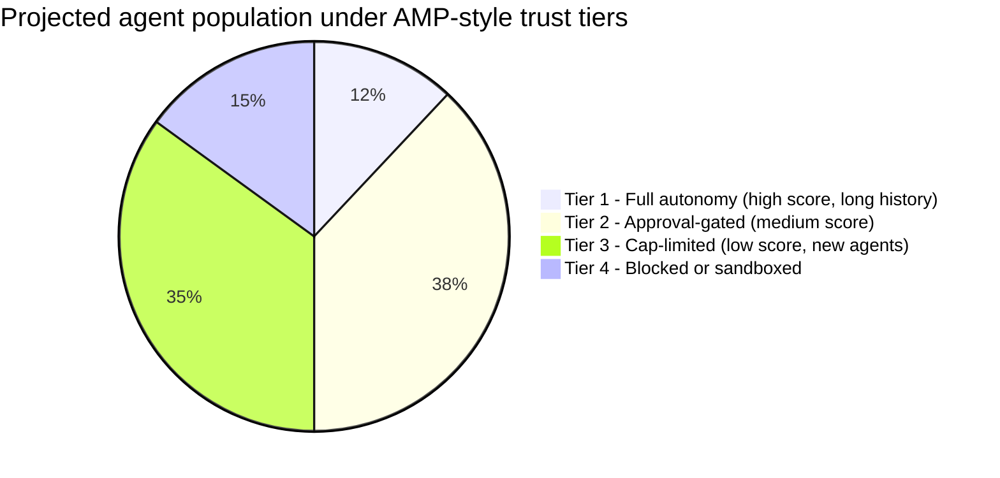
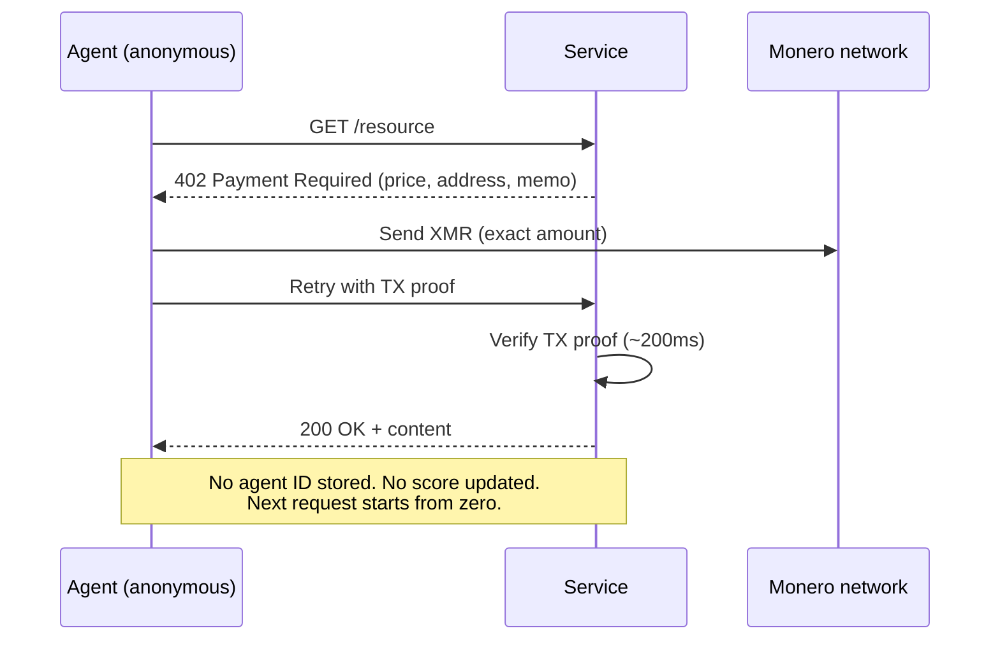
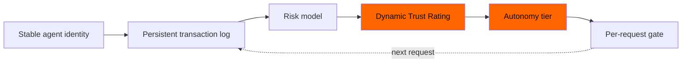

# The Agent Credit Score: How Ant's AMP Turns Every AI Agent Into a Tier — and Why XMR402 Refuses to Rank

> Ant International's new Agentic Mobile Protocol (AMP) ships with an Agent Trust Rating — a dynamic score that decides how much autonomy each AI agent gets. We unpack why it's a credit score for machines, and why XMR402's stateless design is structurally incapable of producing one.

- **Author:** @xbtoshi
- **Date:** 2026-05-29
- **Tags:** xmr402, monero, amp, ant-international, agent-trust-rating, kya, credit-score, stateless, agentic-payments, reputation, x402, alipay
- **Canonical:** https://xmr402.org/blog/agent-trust-rating-credit-score-xmr402

---

## The Agent Credit Score: How Ant's AMP Turns Every AI Agent Into a Tier — and Why XMR402 Refuses to Rank

On April 27, 2026, Ant International announced the Agentic Mobile Protocol (AMP) at its MoMents 2026 forum in Kuala Lumpur — pitched as the world's first agentic payment framework built for mobile wallets, super apps, and wearables. The headline number is staggering: AMP is being rolled into the Alipay+ network, which already touches **1.8 billion user accounts and 150 million merchants** across 40+ wallet partners. The pitch is open-source, mobile-first, and globally connected.

The pitch is also, quietly, the largest reputation-binding system ever proposed for autonomous software.

AMP ships with two interlocking components. The first is **Know Your Agent (KYA)**: a digital-identity layer that certifies each agent's authorized capabilities. The second — and the one that deserves its own scrutiny — is the proprietary **Agent Trust Rating**: a dynamic risk-management score that decides whether an agent is "trustworthy" and, crucially, *how much autonomy it is granted*. Two days of news cycles described it as a safety feature. We think it's a credit score for machines, and it inherits every pathology that credit scoring brought to humans: opacity, monopoly, drift, and gatekeeping disguised as risk management.

XMR402 — the Monero-native implementation of the open X402 standard — was designed before any of these systems existed, and its stateless architecture is structurally incapable of producing a trust rating in the first place. That is the feature, not a limitation.

### What a Dynamic Trust Rating Actually Does

A trust rating is not a one-time check. It is a moving score recomputed across every transaction, every device binding, every counterparty interaction, every dispute. To produce a stable score, the system must:

1. **Persistently identify the agent** across sessions, devices, and merchants.
2. **Log every transaction** with attributable inputs (agent ID, principal, merchant, amount, time, outcome).
3. **Re-evaluate the score** against a model the agent and its principal cannot see.
4. **Gate the next transaction** on a tier — high-trust agents can act autonomously, low-trust agents need human approval or are simply blocked.

Each of these is independently reasonable. Stack them together and you have built a permanent, opaque, centrally-administered authority that decides which of your agents are allowed to act in the economy this morning. The AMP press materials note a 50% reduction in agent-to-wallet binding steps and a money-back guarantee against account takeovers — both of which require exactly this persistent agent-identity ledger to function at all.

### The Credit Score Analogy Is Not Rhetoric

The structure is identical. The table below maps consumer-credit pathologies onto the Agent Trust Rating.

| Consumer credit score | Agent Trust Rating | Effect on the agent economy |
|---|---|---|
| FICO/equivalent is a single private model | AMP's rating model is proprietary | Agents cannot audit why they are throttled |
| Score persists across institutions | KYA pins agent identity across wallets, merchants, devices | One bad merchant interaction follows the agent everywhere |
| Score is improved by behavior the bureau prefers | Score is improved by behavior the rating model prefers | Agents converge on whatever the model rewards |
| New entrants have thin files and pay more | New agents start untrusted and need human approval | High capital cost to bootstrap an autonomous agent |
| Bureaus monetize the dataset | Rating issuer monetizes the dataset | Agent behavioral data becomes a new commodity |
| Disputes are slow and opaque | Disputes against an agent's rating will be slow and opaque | Reputation damage compounds before it can be appealed |

None of these are speculative. They are the well-documented externalities of every reputation system humans have built — only now applied to software that operates on millions of micro-decisions per day.

### The Distribution Problem

Once an autonomy gate exists, autonomy itself becomes a stratified resource. The exact thresholds aren't published, but the shape is predictable: a small share of long-established agents will be allowed to act fully autonomously, a large middle band will face approval prompts for non-trivial actions, and a tail of new or marginal agents will be functionally blocked from anything meaningful.

These shares are illustrative, but the principle is not. Any dynamic-risk system that adjusts autonomy by score produces this stratification by construction. The platforms that issue the score sit at the top of the stack; their preferred agents — those built with their SDKs, paying their fees, observing their telemetry — earn higher tiers faster. Independent agents and open-source frameworks start at the bottom and pay rent to climb.

### What Stateless Actually Means in This Context

XMR402 does not have, and structurally cannot have, an Agent Trust Rating. Each request follows the same flow: the server returns HTTP 402, the agent pays the exact amount in Monero, the server verifies the transaction proof in roughly 200ms, and the request is fulfilled. There is no persistent agent identity, no cross-session linkage, no merchant-reported behavior log, and no scoring model to update.

There is no tier to lose, no reputation to repair, and no rating issuer collecting a behavioral dataset. Privacy is not bolted on; it is the absence of the storage layer that other protocols rely on.

This has a second-order consequence that is rarely stated plainly: **stateless settlement is the only design that gives a new agent the same economic standing as an established one**. Under AMP, a brand-new open-source agent must accumulate a history before it can transact autonomously at any meaningful cap. Under XMR402, it pays the same amount as a year-old agent, in the same time window, with the same probability of success. The protocol does not know how old it is and does not need to.

### What AMP Gets Right, and Where It Becomes a Trap

It is worth being precise. AMP solves real problems that x402 has visibly stumbled on. The 50% reduction in binding steps is meaningful. A money-back guarantee against account takeovers is a legitimate product feature for human-principal wallets. Mobile-first form factors — smartwatches, AR glasses, in-car systems — are where a lot of agent activity will actually originate.

The trap is that all three of those features were achieved by adding state, and the state had to be tied to a stable agent identity, and once that identity exists somebody scores it. The Agent Trust Rating is not a separate decision Ant happened to make; it is what the rest of the design forces into existence.

Once you are inside that loop, every transaction is also an input to the score that gates the next transaction. There is no exit from the loop other than not entering it.

### The Practical Takeaway

If you are building autonomous agents in 2026, the protocol you choose is also the governance model you accept. AMP gives you mobile reach and recourse, at the cost of a reputation score you do not control. x402 gives you stablecoin rails and ecosystem support, at the cost of public on-chain identity. XMR402 gives you stateless, private micropayments, at the cost of recourse mechanisms that don't fit inside the protocol — they have to live in the application layer where you can design them yourself.

The honest version of this debate is not "which protocol is best." It is "what kind of agent economy do you want to be standing in five years from now." One in which a handful of rating issuers decide which agents are allowed to act, or one in which any agent that can afford the fee can transact, on equal terms, without leaving a permanent record. XMR402 is built for the second.

