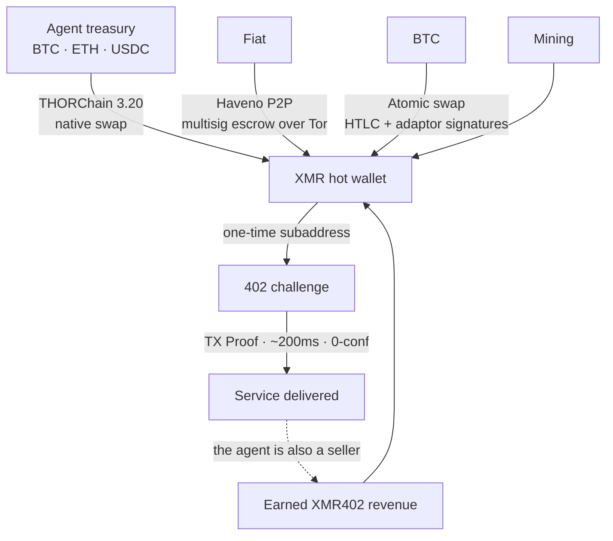
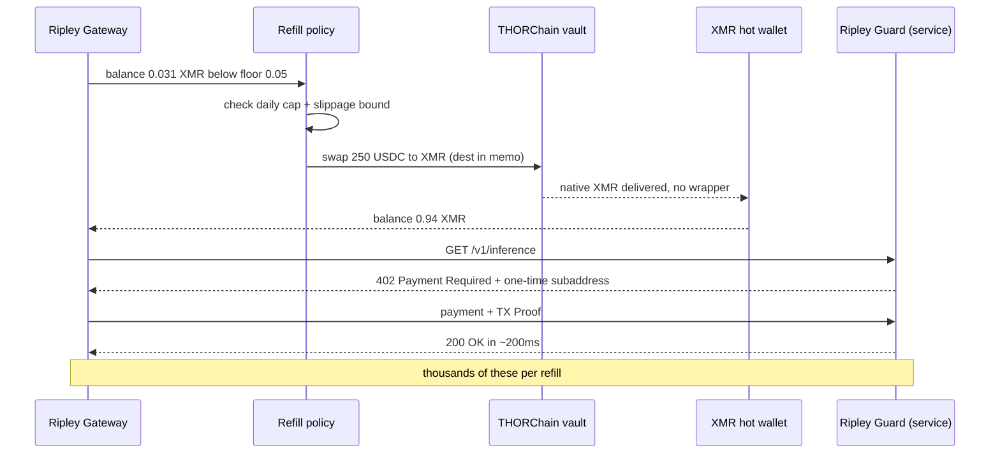

# The Refill Problem: How XMR402 Agents Fund Themselves When No Exchange Will List Their Money

> The strongest objection to XMR402 was never cryptographic — it was “where does the agent get the XMR?” Delistings hit the exchange, but an exchange is not in the payment loop. THORChain 3.20’s native XMR swaps, shipped 25 August 2026, turned the last human-shaped step into a programmable call.

- **Author:** @xbtoshi
- **Date:** 2026-09-08
- **Tags:** xmr402, monero, x402, thorchain, thorchain-3-20, native-swaps, delisting, mica, amlr, fatf-travel-rule, kraken, agent-treasury, wallet-funding, refill-policy, atomic-swaps, haveno, no-kyc, non-custodial, ripley-gateway, ripley-guard, tx-proof, fcmp, stateless, agentic-payments, 0-conf, circular-economy
- **Canonical:** https://xmr402.org/blog/agent-wallet-refill-thorchain-delistings-xmr402

---

# The Refill Problem: How XMR402 Agents Fund Themselves When No Exchange Will List Their Money

Every technical objection to XMR402 eventually collapses into the same one. Not the cryptography — Monero's RingCT and stealth addresses have held for a decade. Not the latency — TX Proof verification lands a 0-conf payment in about 200 milliseconds, faster than the Base block that a stablecoin agent has to wait for. Not the fees, which are zero at the protocol layer.

The objection is logistical: **where does the agent get the XMR?**

It is a fair question, and it got sharper through 2026. Kraken pulled Monero from the European Economic Area under MiCA and AMLR pressure, then removed it in Canada and India in April 2026. OKX, Binance and Exodus had already gone. By mid-2026 the list of significant venues still quoting XMR had thinned to KuCoin, MEXC, Gate.io, Kraken outside the EEA, and a handful of no-KYC exchanges. The EU's Anti-Money Laundering Regulation makes anonymity-enhancing assets structurally incompatible with a licensed CASP's obligations, and the FATF Travel Rule finishes the argument.

So the critique writes itself: you have built a payment rail on an asset that regulated exchanges are actively shedding. Elegant protocol, no on-ramp.

That critique contains a category error, and on **25 August 2026** the last part of it stopped being true.

## The category error: an exchange is not a payment rail

Notice what a centralized exchange actually does in an agentic payment flow.

Nothing.

It is not in the loop. When an autonomous agent pays a service $0.004 for an inference call, no exchange is consulted, no order book is touched, no listing is required. The exchange's only role — for XMR402 or for any other rail — is *acquisition*: converting some other asset into the one the rail settles in. It sits upstream of the protocol, once, at treasury-funding time. It is not part of the transaction.

This is easy to miss because we import the assumption from human retail crypto, where the exchange is the interface and delisting means the asset effectively disappears from view. For a machine that already holds a crypto-denominated balance, "is it listed on Kraken" is roughly as relevant as "is it available at an airport bureau de change."

The honest version of the objection is therefore narrower and better: *can an agent, autonomously and without a human opening a KYC account, convert what it has into what it needs to spend?*

Until recently the answer was "yes, but awkwardly." Now it is just yes.

## What THORChain 3.20 changed

THORChain 3.20 shipped on 25 August 2026 with native Monero and Zcash support. The word doing the work is **native**. There is no wrapped XMR, no bridge token, no custodian holding the real coin against an IOU. An agent sends BTC, ETH or a stablecoin into a THORChain vault and receives actual Monero at an address it controls. No account. No sign-up. No custody transfer. The swap is a transaction, not a relationship.

XMR rose roughly 9% on the news and put in its strongest month in more than five years, which is the market's way of noticing that the delisting thesis had a hole in it. The interesting part is not the price. It is that the last human-shaped step in an XMR402 agent's lifecycle — go to an exchange, prove who you are, buy the asset — became a programmable call.

## The refill routes, compared

An agent operator picks a funding path the way they pick a hosting region: on operational properties, not ideology.

| Route | Custody | Account / KYC | Agent-automatable | Typical latency | Censorship surface |
|---|---|---|---|---|---|
| Centralized exchange | Custodial until withdrawal | Yes, human-bound | Partially (API keys) | Minutes to days | High — listing, jurisdiction, account freeze |
| THORChain 3.20 native swap | Non-custodial | None | Yes | Minutes | Low — permissionless vaults |
| BTC↔XMR atomic swap | Non-custodial | None | Yes, with a maker | Minutes to an hour | Very low — no shared venue |
| Haveno P2P (fiat) | Multisig escrow | None | No — human counterparty | Hours | Low, but slow |
| Mining | Self-custodial by construction | None | Yes | Continuous | Effectively none |
| Earned XMR402 revenue | Self-custodial | None | Yes | Instant | None — no acquisition event |

Read the last row again, because it is the one that actually settles the argument.

## The best refill is not a refill

In a genuine machine economy, the same agent is on both sides of the 402. A research agent pays a data provider for a corpus; that data provider is itself an agent that pays an inference endpoint; that endpoint pays for GPU time and for the crawl budget that keeps its index warm. Value circulates *inside* the denomination. An agent that sells anything at all is topping up continuously, in the settlement asset, with no acquisition event to censor, delist, or surveil.

Acquisition pressure is therefore a **bootstrap** cost, not a running cost. It is highest for a brand-new pure-consumer agent and falls toward zero for any agent with revenue. Delisting policy attacks a one-time step. It does not attack the loop.

## The honest objections

**The swap is visible.** THORChain settles on transparent chains. A refill leaves a public record: this address converted 250 USDC to XMR at this time. That is real, and it is worth stating plainly rather than waving away.

But look at what it does and does not reveal. It reveals *acquisition*. It does not reveal a single thing the agent subsequently bought, from whom, at what price, how often, or in what pattern — which is precisely the dossier that a transparent stablecoin rail publishes for free on every payment. One visible event amortizes across thousands of invisible ones. On a USDC rail the ratio is one visible event per payment, forever. The asymmetry is not close.

**Timing correlation.** A refill of 250 USDC followed by spending that totals close to 250 XMR-equivalent is a heuristic link. Mitigations are ordinary operational hygiene: over-fund and let the balance age, refill on a schedule rather than on demand, split across subaddresses, and let FCMP++'s vastly larger anonymity set absorb the rest as it lands.

**Liquidity depth.** THORChain's XMR pools are weeks old. A treasury moving six figures will feel slippage that a treasury moving four figures will not. This is a real constraint today and a shrinking one, but an operator sizing refills should bound slippage in policy rather than assume depth.

**Fiat is still the hard edge.** Converting bank money to XMR without a human remains genuinely difficult; Haveno is excellent and irreducibly human-paced. Note, though, that this is a fiat problem, not an XMR402 problem — an agent paying in USDC also needs a human somewhere upstream to have minted or bought that USDC. Nobody counts it against Coinbase's x402.

## What this means for the stack

Ripley Gateway treats refill as policy, not as an emergency. A balance floor, a daily conversion cap, a slippage bound, and a preferred route ordering are configuration, the same way a retry budget is. Hot spend wallets stay small and disposable; the treasury stays cold and rarely touched. View-key accounting lets an operator audit their own spend without exposing it to anyone else.

And the strategic point for anyone comparing rails: the agentic economy is the first serious use case for a cryptocurrency that does not need an exchange to be in the loop. Human retail needs price discovery, custody and fiat rails. A machine buying 40,000 inference calls a day needs a balance and a destination address. Delisting removes XMR from the shop window. It does not remove it from the wire — and as of 25 August 2026, it does not remove the shop, either.

The question was never whether exchanges would keep listing Monero. It was whether an autonomous agent could get some without asking permission. That question now has a boring, mechanical answer, which is the best kind.
