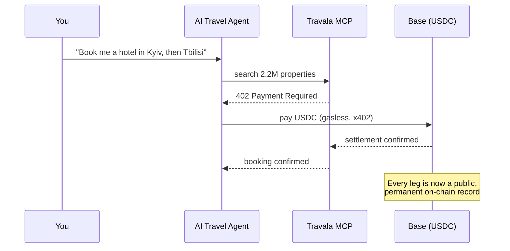
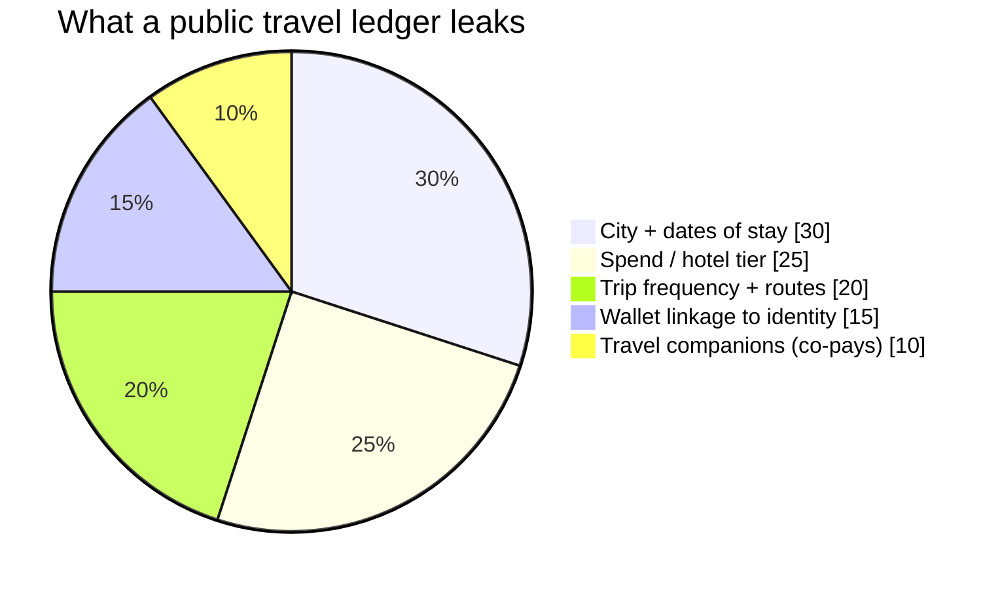
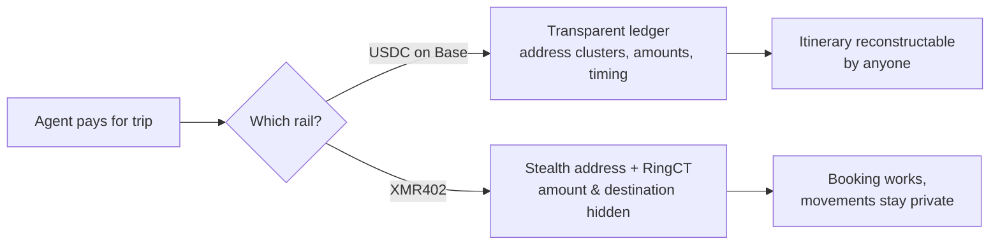

# The Itinerary on the Ledger: Why Your AI Travel Agent's Stablecoin Trail Maps Every Place You Sleep — and How XMR402 Books Privately

> Travala's new agentic travel protocol lets an AI book 2.2M hotels in one chat — settling in USDC on Base. But a public-chain travel agent writes your physical movements onto a permanent ledger. Here's how XMR402 books the same trip without leaving the trail.

- **Author:** @xbtoshi
- **Date:** 2026-06-05
- **Tags:** xmr402, monero, x402, travala, agentic-travel, travel-mcp, location-privacy, usdc, base, erc-7715, session-keys, stealth-address, ringct, agentic-payments, privacy, 0-conf
- **Canonical:** https://xmr402.org/blog/agentic-travel-booking-location-trail-xmr402

---

# The Itinerary on the Ledger: Why Your AI Travel Agent's Stablecoin Trail Maps Every Place You Sleep — and How XMR402 Books Privately

On June 4, 2026, Travala unveiled **Travala Travel MCP**, an end-to-end agentic protocol that lets an AI concierge search, reserve, and pay for over 2.2 million hotels — all inside a single chat thread. It runs on Base, settles in gasless USDC over the **x402** standard, and uses ERC-7715 session keys so the agent proposes payments while final signing stays in your wallet. It is, by any measure, a beautiful piece of engineering. It is also a privacy disaster waiting to be indexed.

Here is the part nobody put on the launch slide: when your agent books a hotel with USDC on Base, it writes the most intimate data you own — *where your body will physically be, and when* — onto a permanent, public ledger that anyone on Earth can read forever.

## The trip that books itself — and tells everyone

The pitch is irresistible. You tell an agent "plan a two-week trip through the Caucasus," and it handles searches, reservations, payments, and cancellations without you touching a checkout flow. The friction of travel collapses to a sentence.

But every one of those settlements is a transaction on a transparent chain.

Card rails are private by default — Visa doesn't publish your hotel history. A public-chain travel agent inverts that. Each booking is a timestamped, amount-bearing, address-linked event. String a few together and you don't have payments; you have an **itinerary**.

## A ledger is a location history

Chain analysis firms already cluster addresses, label merchants, and de-anonymize wallets at scale. Travala settlements are merchant-identifiable by design — that's how a hotel gets paid. So the on-chain record doesn't just say "someone spent $240 in USDC." Combined with known merchant addresses and timing, it says: *this wallet stayed at this property class, in this city, on these nights, and is now paying a property in the next city 600 km away.*

That's not metadata. That's a map of a human being moving through the world.

For most people that's a creepy abstraction. For a journalist meeting a source, an executive scouting an acquisition target, a dissident crossing a border, or anyone with an abusive ex, it is a direct physical-safety threat. And unlike a leaked database, a public ledger cannot be recalled, patched, or deleted. The trail is permanent.

## Why "session keys" don't fix the leak

Travala's ERC-7715 session keys are a genuine UX win: the agent can't drain your wallet, because final authority stays with you. But session keys solve *authorization*, not *confidentiality*. They control who can spend. They do nothing about who can *watch*. The payment, once signed, still lands on a transparent ledger with the amount and the counterparty in the clear.

This is the recurring blind spot of the stablecoin agentic stack: it treats privacy as someone else's problem, to be bolted on later. But for travel, location *is* the payload. You cannot separate "the agent paid a hotel" from "the human will sleep there."

## The same trip, booked privately

XMR402 is the Monero-native implementation of the x402 standard. It speaks the same HTTP 402 handshake, returns the same 200ms 0-conf verification via Monero TX Proof, charges zero protocol fees — but settles on a chain where privacy is the base layer, not an add-on. Stealth addresses mean the destination is unlinkable. RingCT means the amount is hidden. There is no merchant address to cluster and no public graph to walk.

| Property | USDC on Base (Travala MCP) | XMR402 (Monero) |
| --- | --- | --- |
| Booking works agentically | Yes | Yes |
| Amount visible on-chain | Yes | No (RingCT) |
| Destination/merchant linkable | Yes | No (stealth address) |
| Itinerary reconstructable | Trivially | No |
| Record is permanent & public | Yes | Encrypted by default |
| Protocol fees | Gasless, but Base fees apply | Zero |
| Settlement latency | Near-instant | ~200ms 0-conf |

The agent experience is identical. The difference is what's left behind.

## Privacy is not a premium tier of travel

The agentic travel race is on — Travala, Browserbase, AWS AgentCore, and a dozen others are wiring autonomous booking onto transparent rails because that's what's available and liquid today. The convenience is real and it's coming whether or not the privacy question gets answered.

That's exactly why the question matters now. A world where the cheapest way to let an agent book your travel is also the way that publishes your movements is a world that has quietly priced privacy out of existence. XMR402 exists to keep that from being the default. Your agent should be able to book the whole trip in one sentence. No one else should be able to read where you went.

*XMR402 — the privacy layer for the agentic economy. Same 402 handshake, same agent UX, none of the trail.*

