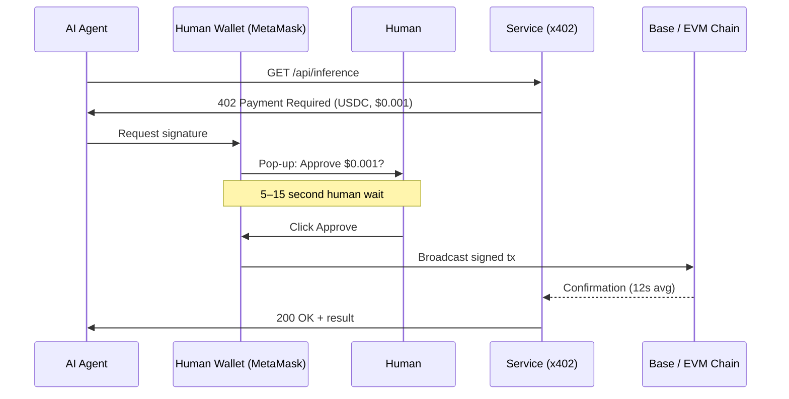
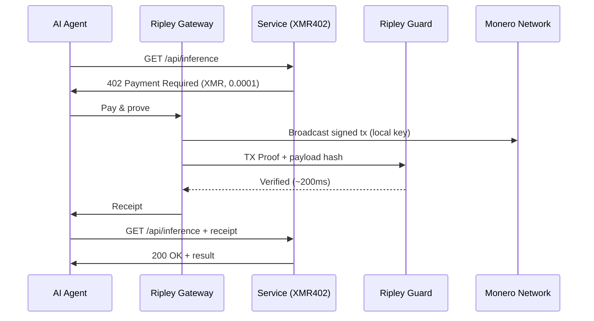
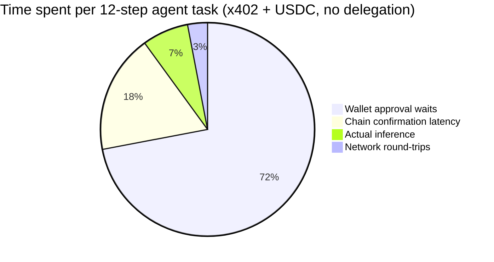
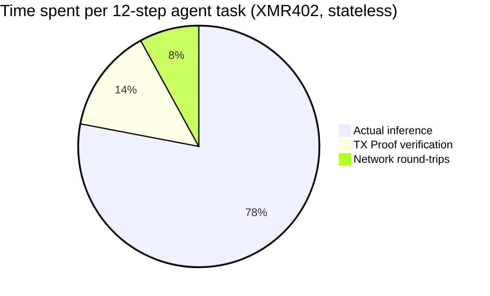

# The Approval Friction Wall: Why x402's Volume Collapsed 77% — and Why XMR402's Stateless Design Was Built to Avoid It

> Artemis data shows x402 adjusted volume collapsed 77% from its November 2025 peak. The culprit isn't demand — it's wallet pop-ups. Every sub-cent agent payment now carries $0.03–$0.10 in human-time approval cost. We break down the approval friction problem and explain why XMR402's stateless TX-Proof verification makes the bottleneck disappear entirely.

- **Author:** @xbtoshi
- **Date:** 2026-05-28
- **Tags:** xmr402, x402, monero, approval-friction, wallet-confirmation, micropayments, stateless, agentic-payments, delegation, ap2, agentcore, fireblocks
- **Canonical:** https://xmr402.org/blog/approval-friction-wall-stateless-xmr402

---

# The Approval Friction Wall: Why x402's Volume Collapsed 77% — and Why XMR402's Stateless Design Was Built to Avoid It

May 2026 brought the agentic payment industry its first genuinely sobering data point. According to Artemis on-chain analytics, x402's adjusted volume has fallen approximately **77% from its November 2025 peak of $5.15M to just $1.19M**, even as monthly transaction counts rebounded to 2.89M with an average size of $0.52. The dollar volume isn't shrinking because agents stopped paying. It's shrinking because every payment now requires a human to click *approve*.

The industry has a name for this now: **approval friction**. And it's exposing a flaw that no amount of wallet UX polish can fix.

## The Numbers Nobody Wants to Print

A conservative confirmation cadence of 5 to 15 seconds per wallet pop-up — across the millions of x402 calls happening monthly — generates between **4,000 and 12,000 user-hours of approval work per month**. At a $25/hour blended human time value, each pop-up effectively costs $0.03 to $0.10 in attention tax. For a sub-cent inference call or a $0.001 metered API request, the human-time tax is **10× to 100× the value of the actual payment**.

This is not a bug. It is the *direct consequence* of bolting a stablecoin protocol onto a wallet model that was designed for human-initiated trades, not machine-initiated micropayments.

## Why x402-USDC Cannot Escape the Pop-Up

Every x402 stablecoin flow today inherits the same authorization assumption: a wallet (MetaMask, Trust Wallet, Coinbase Wallet, Phantom) holds a key, and that key signs an EVM transaction. Whether the wallet lives in a browser extension, a hardware device, or a custodial service like Fireblocks, the signing event is **an explicit user-attributable action**. Regulators want it that way. Compliance teams want it that way. Wallet vendors built their entire UX around that assumption.

This is fine for trading. It is *catastrophic* for an autonomous agent that needs to make 40 sub-cent API calls during a single research workflow.

The industry's proposed fix is **delegation frameworks**: Google's AP2 mandates donated to the FIDO Alliance, AWS Bedrock AgentCore Payments' policy-based spending controls (launched May 7, 2026), Fireblocks' new Agentic Payments Suite (May 20, 2026), and Solana Pay.sh's pre-funded session vouchers (May 5, 2026). Each tries to *pre-approve* a budget so the wallet stops asking. None of them eliminate the wallet — they just hide it behind a signed mandate, a policy engine, or a custodian.

## What Delegation Frameworks Don't Solve

The pop-up disappears. The surveillance does not. The custodian does not. The identity-binding does not. And critically, the **failure modes don't disappear either**: a mandate can be revoked, a policy can be misconfigured, a custodian can freeze funds, and every payment still appears as a traceable on-chain event tied to a permissioned wallet.

This is the architectural irony of the 2026 agent payment race. Big-tech-backed protocols are now building elaborate scaffolding to *simulate* what stateless protocols deliver natively.

## Why XMR402 Has No Approval Friction To Solve

XMR402 was designed before approval friction had a name. The Monero-native implementation of X402 treats the agent's payment subsystem — the **Ripley Gateway** — as a first-class autonomous actor. The Gateway holds its own Monero wallet, signs locally, and emits a **TX Proof** (a cryptographic statement that proves a specific payment was made to a specific subaddress without revealing the wallet's balance or history).

The receiving service runs **Ripley Guard**, which verifies the TX Proof in approximately **200ms** — without needing a confirmed block, without querying a custodian, and without consulting an external policy engine. The verification is stateless: no session, no account, no enrollment, no callback to a wallet UI.

There is no pop-up because there is no human in the loop. There is no mandate because the agent's authority is bounded by the wallet's balance, not by an external authorization document. There is no surveillance trail because Monero ring signatures, stealth addresses, and RingCT obscure both the sender set and the amount.

## Apples-to-Apples: The Approval Friction Audit

| Protocol | Approval model | Per-payment human time | 0-conf verification | Privacy of payer | Custodial dependency |
|---|---|---|---|---|---|
| x402 (USDC on Base) | Wallet signature per tx | 5–15 sec ($0.03–$0.10) | No (12s avg) | Public on Base | Optional (Fireblocks, Coinbase) |
| AWS AgentCore Payments | Pre-signed policy mandates | ~0 within budget, manual reauth | Depends on chain | Public + AWS audit log | Yes (AWS) |
| Solana Pay.sh | Pre-funded session | ~0 within session | Yes (Solana 400ms) | Public on Solana | Optional |
| Google AP2 mandates | FIDO-bound mandate | ~0 within mandate scope | Depends on chain | Public + Google attestation | Yes (Google identity) |
| **XMR402** | **None — agent-native** | **0** | **Yes (~200ms TX Proof)** | **Private (RingCT)** | **None** |

The table looks like a spec-sheet, but the implication is structural. Every delegation framework above accepts the wallet pop-up as a fixed cost and tries to amortize it. XMR402 deletes the cost.

## Where the Human-Time Tax Actually Lands

For a 12-step agent workflow making 12 paid API calls, the breakdown of where time goes is brutal on stablecoin rails and trivial on XMR402.

This is why x402 dollar volume is collapsing while transaction counts rise: agents are batching, retrying, and giving up on sub-cent calls because the human-time math no longer closes. The protocol that *would* be used for a million tiny calls per day is being throttled by the protocol that *requires* a human for each one.

## The Architectural Choice the Industry Keeps Avoiding

The approval friction wall is not a UX problem. It is a **protocol design choice** baked in the moment a payment standard assumes the signer is a human. Every delegation framework being built in 2026 — AP2 mandates, AgentCore policies, Fireblocks orchestration, Pay.sh vouchers — is a layer designed to fake autonomy on top of a fundamentally non-autonomous primitive.

XMR402 took the other branch. It assumed the signer is the agent, the verifier is the service, and the network is private by default. That decision is what makes 200ms verification possible, what makes zero protocol fees possible, and what makes the wall around sub-cent payments simply not exist.

May 2026's data is a forecast. The protocols that survive the agentic decade will be the ones that never asked a human to click *approve*.
