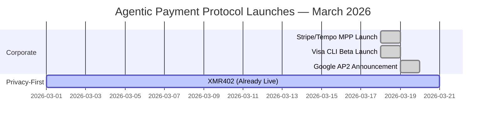
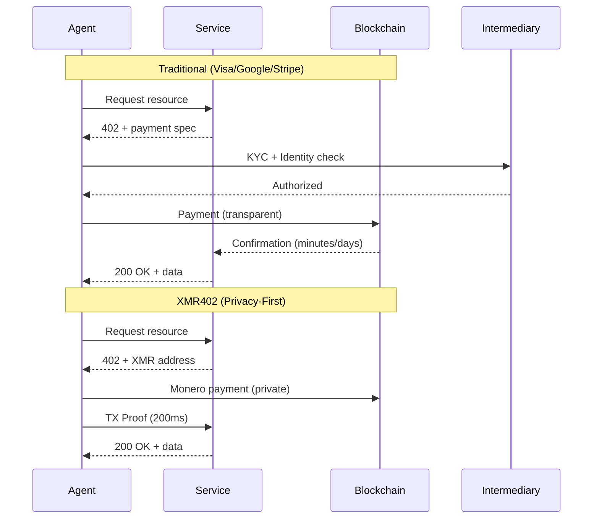

# The Week Big Tech Bet on Agent Payments — And Why They All Got Privacy Wrong

> In March 2026, Visa, Google, and Stripe launched competing agentic payment solutions within days. Yet all three sacrifice privacy for convenience. Only XMR402 offers a truly privacy-preserving, stateless, permissionless alternative.

- **Author:** @xbtoshi
- **Date:** 2026-03-20
- **Tags:** agentic-payments, privacy, xmr402, monero, payment-protocols, fintech, cryptocurrency, agent-economy, x402, visa, google, stripe
- **Canonical:** https://xmr402.org/blog/big-tech-agentic-payment-land-grab

---

# The Week Big Tech Bet on Agent Payments — And Why They All Got Privacy Wrong

March 18-19, 2026 will be remembered as the moment the agentic economy went mainstream. In a stunning convergence of corporate momentum, three of the world's largest payment and technology players announced competing solutions for machine-to-machine (M2M) payments within 24 hours:

- **Visa CLI** (March 18) — Experimental CLI tool for programmatic card payments from Cuy Sheffield's Visa Crypto Labs
- **Google AP2** (March 2026) — Announced with 60+ partners including Adyen, American Express, Mastercard, and PayPal, featuring an x402 crypto extension
- **Stripe/Tempo Machine Payments Protocol** (March 18) — Open standard co-authored by Stripe and Paradigm-backed Tempo

This unprecedented corporate alignment validates a thesis that seemed fringe just 18 months ago: McKinsey's $3-5 trillion agentic commerce market by 2030 is not hype—it's inevitable. But in their rush to capture this emerging market, every single one of these solutions made the same fundamental mistake.

## They All Chose Convenience Over Privacy

Each protocol requires some form of identity verification, creates surveillance trails, or depends on centralized intermediaries that become honeypots for transaction data.

**Visa CLI** demands traditional identity proofing and KYC compliance. It's a card payment system at its core, which means Visa sees every transaction, every merchant, every agent interaction. The "experimental" label barely masks what this really is: a play to capture agent-to-service payments before anyone builds a privacy-first alternative.

**Google AP2** operates across 60+ partners but remains fundamentally centralized. Google knows who pays whom and for what. The x402 crypto extension, powered by Coinbase and MetaMask, adds a privacy veneer, but only for the blockchain portion—and even then, on transparent chains like Base and Ethereum. Your agent's payment history is ledger-readable for anyone with patience.

**Stripe/Tempo's MPP** follows the same playbook: open standard, but with Stripe as the default settlement layer. Stripe gets the data. The protocol itself is transport-agnostic, which is good architecture, but the incentive structure points payments through a centralized intermediary that profits from transaction volume.

All three solve a real problem—how do we enable fast, reliable payments between AI agents and services?—but none of them answer the harder question: *at what cost to privacy?*

## The XMR402 Difference: Privacy by Protocol, Not by Policy

XMR402 is the Monero-native implementation of the X402 open payment standard. It enables stateless, permissionless, privacy-preserving micropayments between AI agents and services using HTTP 402 Payment Required.

Here's what makes it fundamentally different:

**No Identity Required.** An agent can initiate payment without KYC, without account creation, without enrollment in any system. The protocol itself is the permission layer.

**Zero Fees at the Protocol Level.** Visa, Google, and Stripe all extract value. XMR402 has zero protocol fees—only Monero network fees (~0.0001 XMR), orders of magnitude smaller than traditional payment network cuts.

**200ms 0-Conf Verification.** Using Monero's TX Proof technology, service providers can cryptographically verify payment receipt in 200 milliseconds—fast enough for real-time agent interactions without waiting for blockchain confirmation.

**Fully Stateless.** The protocol requires no database, no API state, no user accounts. Every transaction is self-contained and cryptographically verifiable. Scale without infrastructure debt.

**Transport-Agnostic.** Works over HTTP, WebSocket, or any TCP-based protocol. The standard doesn't prescribe the network layer.

## The Comparison Table: How They Stack Up

| Feature | Visa CLI | Google AP2 | Stripe MPP | x402 | XMR402 |
|---------|----------|-----------|-----------|------|--------|
| **Privacy** | Low (KYC required) | Low (centralized ledger) | Low (Stripe intermediary) | Medium (transparent chains) | High (Monero privacy) |
| **Identity Required** | Yes | Yes (optional for crypto) | Yes | Optional | No |
| **Protocol Fees** | 2-3% | 0.5-1.5% | 0.5% + settlement | Variable | 0 |
| **Settlement Speed** | 1-3 days | 1-2 days | Minutes | 10-15 min | 200ms (0-conf) |
| **Permissionless** | No | No | No (onboarding required) | Yes (for x402) | Yes |
| **Stateless Architecture** | No | No | Partial | No | Yes |
| **Crypto Native** | No | Partial (x402 extension) | No | Yes | Yes |
| **Centralization** | High | High (60+ partners, Google hub) | High (Stripe default) | Medium | None |

## Market Context: Who's Winning and Why

x402, the Coinbase-led standard, has already processed over 100 million payments but trades in thin margins—only ~$28K daily volume according to CoinDesk, despite a $7B ecosystem valuation. It's technically elegant and permissionless, but it operates on transparent blockchains (Base, Ethereum) that defeat privacy.

Visa and Google's moves signal something important: the incumbents see this market and are moving to own it before alternative rails mature. They're not launching these products because they believe in decentralization or privacy—they're launching because they're afraid of being disintermediated.

Stripe's partnership with Tempo is more interesting. Tempo is backed by Paradigm, which signals serious capitalization behind M2M payments infrastructure. But the incentive alignment still points toward centralized settlement.

## The Privacy Paradox

Here's the uncomfortable truth: every protocol we've seen launched this week will face the same regulatory pressure to collect data, flag suspicious patterns, and enable freezing of accounts. Identity creates legal liability. Surveillance becomes compliance theater.

XMR402, built on Monero's privacy guarantees, doesn't solve regulatory uncertainty—but it structurally prevents compliance theater. If you can't see the transaction, you can't be sued for enabling it. The protocol itself becomes the permission layer: if the cryptography verifies, the payment was valid. No human judgment. No appeal to authority.

## What Happens Next

Three possible futures:

1. **Consolidation.** One of the big three (likely Google or Visa) buys or integrates with the others, creating a de facto monopoly on agent payments.

2. **Fragmentation.** All four coexist, with use-case specialization. Visa for legacy enterprise agent payments, Google for consumer-facing agents, Stripe for startups, x402 for crypto-native workflows.

3. **Privacy-First Dominance.** XMR402 and similar privacy-native protocols capture use cases where agents handle sensitive data—healthcare agents, financial analysis agents, intelligence agents. The cost of surveillance becomes too high.

The third future isn't inevitable, but it's becoming clearer why it matters. When agents outnumber humans by orders of magnitude and every payment creates a data point in someone's database, privacy stops being a preference. It becomes infrastructure.

## The Bottom Line

The agentic economy is real. March 2026 proved it. But the protocols being launched this week—Visa CLI, Google AP2, Stripe MPP—are optimized for the wrong thing. They optimize for the incumbent's ability to extract data, not for the agent economy's ability to scale trustlessly.

XMR402 offers an alternative: fast, permissionless, privacy-preserving payments with zero protocol fees. It's not perfect—Monero's privacy comes with some UX tradeoffs, and regulatory uncertainty is real. But it's the only protocol in this cohort that doesn't bet against the future of privacy.

As the agentic economy scales from millions of daily transactions to billions, the question won't be *whether* privacy matters. It's whether the infrastructure layer will be designed to preserve it.
