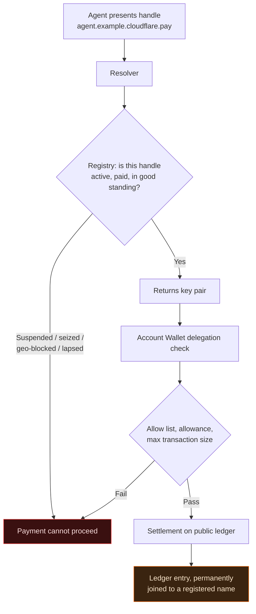
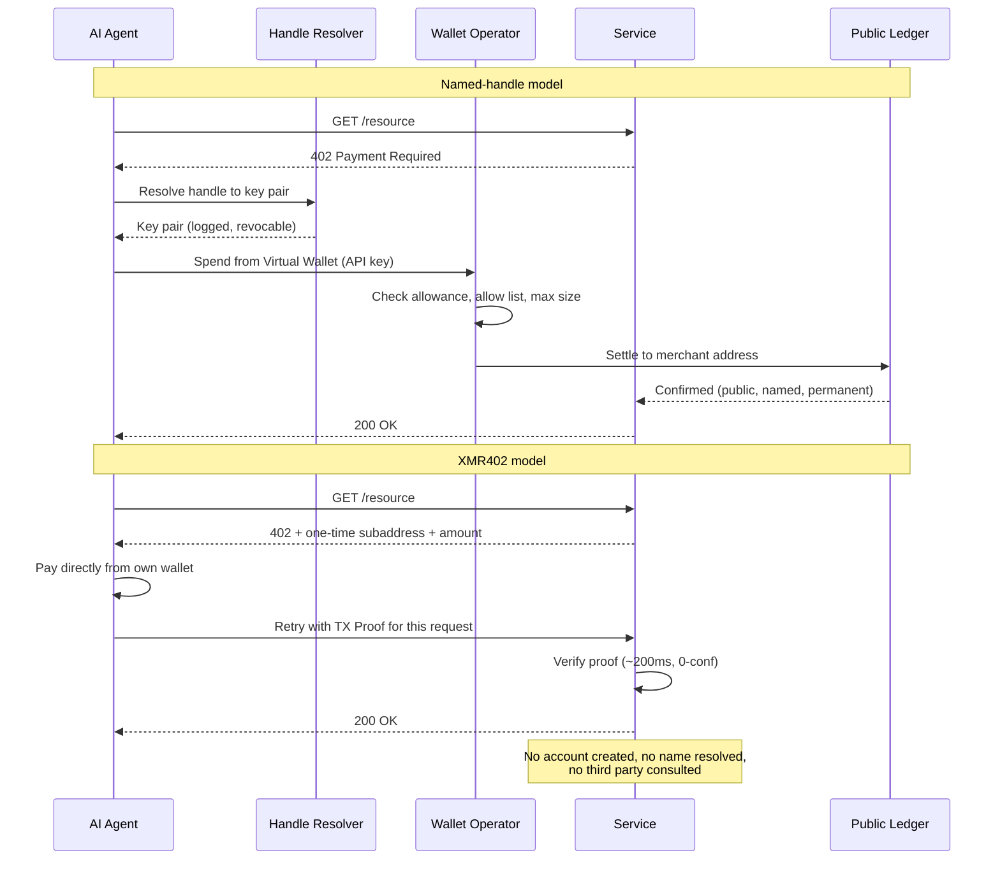

# The Name Is the Chokepoint: Why cloudflare.pay Gives Every Agent a Permanent Payment Address — and Why XMR402 Agents Stay Nameless

> Cloudflare's Wallets and cloudflare.pay gave AI agents spending caps — and something more consequential: names. A resolvable payment handle is the join key that turns a transparent ledger into a named behavioural record. XMR402 mints a one-time address instead, so there is nothing to resolve and nothing to revoke.

- **Author:** @xbtoshi
- **Date:** 2026-09-05
- **Tags:** xmr402, monero, x402, cloudflare, cloudflare-wallets, cloudflare-pay, agent-identity, naming-layer, dns, handles, virtual-wallets, delegated-spend, stateless, tx-proof, fcmp, anonymity-set, agentic-payments, privacy, 0-conf, ripley-guard, censorship-resistance
- **Canonical:** https://xmr402.org/blog/cloudflare-pay-handles-agent-naming-layer-xmr402

---

# The Name Is the Chokepoint: Why cloudflare.pay Gives Every Agent a Permanent Payment Address — and Why XMR402 Agents Stay Nameless

On August 4, 2026, during its Agents Week, Cloudflare announced Wallets and `cloudflare.pay`. Most coverage led with the obvious headline: AI agents can now hold money and spend it under caps. That is the less interesting half.

The more consequential half is that agents were given **names**.

A wallet is a container. A name is an index. And in every networked system humans have ever built, the naming layer — not the storage layer, not the transport layer — is where control accumulates. Cloudflare knows this better than almost anyone, which is why its own framing for `cloudflare.pay` is the DNS analogy: human-readable identifiers that map to cryptographic key pairs, the way domain names map to IP addresses.

That analogy is exactly right. It is also the problem.

## What Actually Shipped

Strip the announcement to its mechanics and three things are real, one thing is proposed, and several things are conspicuously unnamed.

Real: an **Account Wallet**, which belongs to a human and holds the funds. It delegates capped spend to **Virtual Wallets**, which agents operate through API keys. The delegation carries an allowance, an allow list of approved merchants, and a maximum transaction size.

Proposed: `cloudflare.pay` handles — a human-readable identity layer for agents, offered as a stopgap while agent identity standards remain unsettled, and pitched as compatible with whatever standard eventually wins.

Unnamed: the custodian holding wallet balances, the supported stablecoins, and the settlement networks. Handle reservation opened on announcement day; funding, spending, and merchant support are written in future tense in Cloudflare's own copy.

Credit where it is due. Bounded delegation is a genuine improvement over the pattern it replaces — a single hot wallet with an unbounded balance and an API key taped to an agent's environment variables. Allowances, allow lists, and per-transaction ceilings shrink the damage a confused or hijacked agent can do. Nothing below disputes that.

The argument is narrower and, I think, more durable: the spend controls are the part that gets the press release, and the naming layer is the part that changes the internet.

## DNS Was Never a Neutral Layer

Take Cloudflare's analogy seriously and follow it all the way down.

DNS gave the internet usability. It also gave the internet a registry, a registrar, a resolver, a renewal cycle, a TTL, an abuse policy, a suspension procedure, and — eventually — court-ordered seizures and jurisdictional blocklists. None of that was in the design document. All of it followed inevitably from a single property: somewhere, one party answers the question "what does this name point to?" and can therefore answer "nothing."

A payment naming layer inherits the entire structure. If `research-agent.example.cloudflare.pay` resolves to a key pair, then something resolves it. That something has a policy. That policy has exceptions. Those exceptions have a legal process attached, and the legal process has a jurisdiction.

Every box in that diagram is a place where a payment can be stopped by someone who is not the payer or the payee. That is not a criticism of Cloudflare's intentions — it is a description of what a resolvable namespace *is*.

## What a Name Adds to a Transparent Ledger

Pseudonymity on a public chain was already weak. Address clustering, timing correlation, round-number amounts, and reused counterparties let analysts collapse "anonymous" addresses into entities with unnerving reliability. What has been missing, usually, is the **join key**: the one durable identifier that binds a cluster of addresses to a real registrant.

A payment handle is that join key, delivered voluntarily and by design.

It works in both directions. Prospectively, every future payment made under the handle is attributable to whoever registered it. Retroactively, once the mapping is known, previously ambiguous history linked to the same key material resolves too. And rotating keys behind a stable handle does not defeat this — the resolver holds the mapping by construction. That is its entire job.

| Layer | What it knows | Persists after the payment? |
|---|---|---|
| Public ledger | Amounts, timing, counterparties, address graph | Forever, publicly |
| Payment handle registry | Handle to key mapping, registrant, renewal history | Yes, with the operator |
| Account Wallet | Which human funds which agent, and how much | Yes, with the operator |
| Allow list | Every merchant the agent was ever permitted to pay | Yes, with the operator |
| Reverse proxy in front of the merchant | The request itself, headers, timing, origin | Per operator retention policy |

Read that table as a single system rather than five, and the picture is a complete behavioural record of an autonomous agent: who funded it, what it was allowed to buy, what it actually bought, when, for how much, and from where — with a human name at the root.

## The Chokepoint Stack

The uncomfortable part is concentration, not intent.

A large share of the web already sits behind one reverse proxy. Add per-request metering for AI crawlers. Add an identity layer for agents. Add a wallet and a settlement path. Now a single operator can, in principle, observe the request, resolve the identity, and clear the payment — three layers that were historically held by three unrelated parties, folded into one.

Compare the message flow directly.

The second flow has fewer participants because it has fewer questions to ask. There is no handle to look up, so there is no registry to consult, so there is nobody positioned to say no.

## XMR402: Nothing to Resolve, Nothing to Revoke

XMR402 implements HTTP 402 over Monero, and its design decisions land almost point-for-point against the naming problem.

**The identifier is disposable.** A payment target is a one-time address minted for a single challenge. It is not reserved, not renewed, not registered, and not reusable. There is no namespace because there is no name.

**Authorization is per-request, not per-account.** The agent presents a Monero TX Proof that this specific payment was made for this specific request. There is no bearer API key that a compromised environment leaks and an attacker replays. The proof authorizes one thing, once.

**The server is stateless.** No account is created, so there is no account to name, suspend, subpoena, or migrate. Ripley Guard verifies a proof in roughly 200ms at zero confirmations and forgets the payer immediately. A subpoena against a stateless verifier returns what the verifier stored: nothing.

**The ledger holds no join key.** Monero's FCMP++ upgrade, activated through 2026, lets a spender prove ownership against an anonymity set spanning over 150 million outputs — and it applies retroactively to historical outputs. The address-clustering techniques that make handles so valuable to analysts have no purchase here. There is no cluster to attach a name to.

**Spending limits are structural, not administrative.** In the named model, a cap is a policy record held by an operator who can change it, log against it, and be compelled to report on it. In XMR402, the cap is the amount in the request. An agent that pays $0.0004 for one API call cannot overspend, because there is no standing balance to drain and no delegation to abuse.

| Property | cloudflare.pay + stablecoin rails | XMR402 |
|---|---|---|
| Payment identifier | Human-readable handle, persistent | One-time address, single use |
| Who can revoke it | Registry / wallet operator | Nobody — nothing is granted |
| Registrant identity | Human account holder | None required |
| Custody of funds | Operator-held Account Wallet | Agent's own wallet |
| Protocol fees | Operator and network dependent | Zero |
| Ledger linkability | Public amounts, addresses, graph | Shielded; 150M+ anonymity set |
| Spend control mechanism | Allowance and allow list, as policy | Per-request amount, as structure |
| Server-side state | Accounts, balances, audit logs | None (stateless verification) |
| Works self-hosted, no third party | No | Yes |
| Settlement latency | Network and operator dependent | ~200ms, 0-conf via TX Proof |

## The Trade, Stated Fairly

Named agent payments are not a scam or a trap. They are a trade, and for some buyers it is the right one.

If a company is paying its own vendors, it wants invoices, reconciliation, dispute handling, and an audit trail with a human name at the end of it. A handle delivers all of that. Enterprise procurement is *supposed* to be attributable. Nobody should want an anonymous rail for their accounts payable.

The objection is to attribution as the **default** — the thing every agent gets whether or not the use case needs it. An agent reading a paywalled paper, querying a price feed, buying 200 tokens of inference, or crawling a public dataset has no business generating a permanent, named, publicly-joined record. Those payments are the machine equivalent of dropping a coin in a slot. Nobody demanded a passport at the newsstand.

The healthy end state is two rails, chosen per transaction: named and auditable where accountability is the product, nameless and disposable where it is not. What is unhealthy is the second rail failing to exist, so that every micropayment inherits enterprise-grade attribution because that is the only thing on offer.

## Names Are How Systems Learn to Say No

The 2026 agentic payment stack has converged on a shared belief: that an agent must be *someone* before it can pay for *something*. Identity first, settlement second. Every major protocol this year — identity passports, trust ratings, permissioned ledgers, and now payment handles — is a variation on that theme.

XMR402 inverts the order. Prove the payment, not the payer. The service gets exactly what it needs — verified funds for this request — and learns nothing it does not need, because there is nothing else to learn.

Names made the web navigable. They also made it seizable. As agents start paying for the internet at machine speed and machine volume, it is worth asking whether every one of those billions of tiny transactions really needs a registrant of record — or whether some of them should simply be paid, verified, and forgotten.
