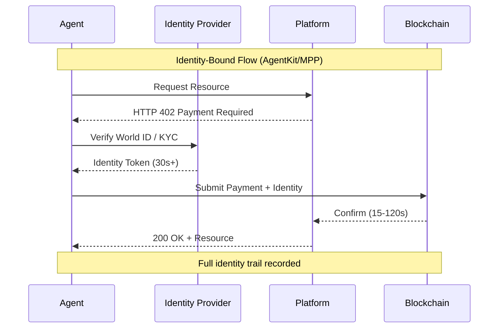
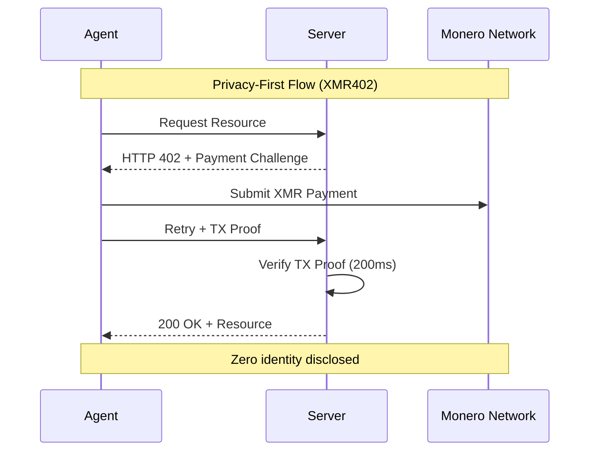
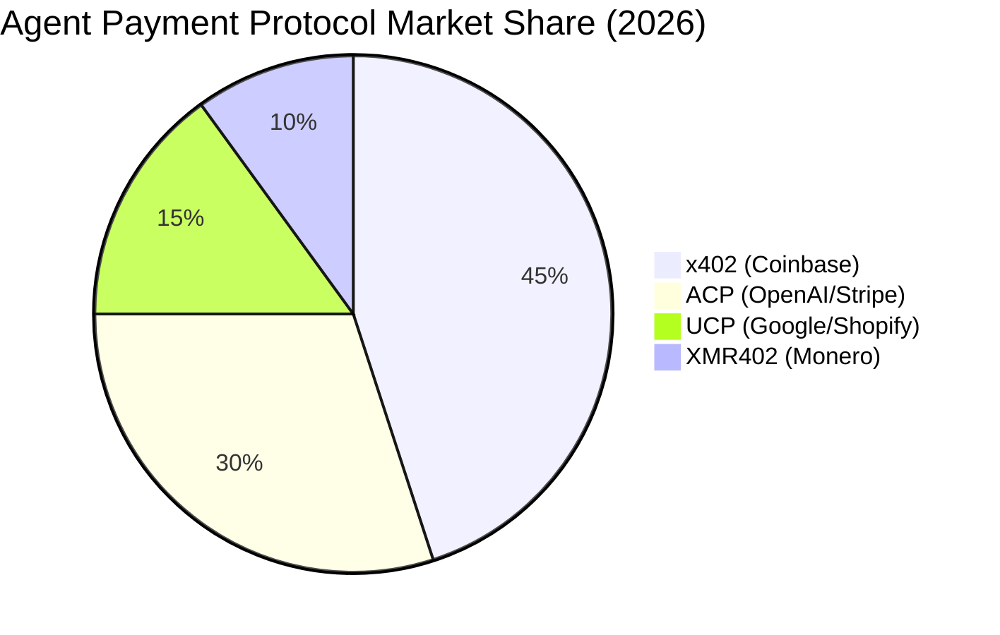

# The Identity Trap: Why Autonomous Agents Don't Need Human Identity Passports

> World's AgentKit (March 17) and Stripe's Machine Payments Protocol (March 18) both mandate identity-binding infrastructure. We examine why tying biometric identity to every agent transaction creates surveillance capitalism's final frontier—and why XMR402's identity-free approach represents a philosophical watershed for autonomous systems.

- **Author:** @xbtoshi
- **Date:** 2026-03-19
- **Tags:** xmr402, monero, privacy, agentkit, world, stripe, mpp, identity, autonomous-agents
- **Canonical:** https://xmr402.org/blog/identity-trap-agentkit-mpp-privacy

---

## The Identity Trap: Why Autonomous Agents Don't Need Human Identity Passports

On March 17, 2026, World launched AgentKit—a framework for autonomous AI agents to transact in the real world. On March 18, Stripe announced the Machine Payments Protocol (MPP) built on the Tempo blockchain with Paradigm. Both share a fundamental assumption: every agent transaction must be bound to verified human identity.

This is the identity trap.

For the first time in economic history, we have the technology to create transactions that don't require knowing who initiated them. Autonomous agents—software that acts on behalf of users, systems, or themselves—should embody this freedom. Instead, AgentKit tethers agents to World ID's biometric proof-of-humanity. Stripe's MPP, while blockchain-based, still requires identity-linked infrastructure. Meanwhile, XMR402, the Monero-native implementation of the X402 open payment standard, demonstrates a radically different path: stateless, privacy-preserving micropayments between agents that require zero identity infrastructure.

The market is sending contradictory signals. x402 (Coinbase's implementation on Base/Ethereum) has captured ecosystem attention—$7 billion in notional valuation—yet processes only ~$28,000 daily. In the same period, 140+ million on-chain AI agent transactions occurred with an average value of $0.31. The gap between hype and adoption reveals the core problem: identity-bound protocols introduce friction exactly where agents need frictionless operation.

### The Philosophical Problem: Identity as Tax

Identity serves a purpose in human economics. Banks need to know their customers for regulatory compliance and fraud prevention. Platforms require identity to link reputation and behavior. But agents aren't human. They don't have reputation to protect, criminal intent to deter, or assets to freeze. They have instructions.

When you bind agent transactions to human identity, you're not serving the agent—you're serving the surveillance apparatus. You're creating a perfect audit trail of what every agent does, on behalf of whom, and in service of what objective. This isn't a bug; it's the feature. Identity-bound agent payments enable business intelligence at a scale previously impossible.

Consider a simple scenario: a content creator deploys 50 autonomous agents to negotiate ad deals across multiple platforms. With AgentKit + World ID, every transaction is traceable to the creator's identity. An advertiser can map the creator's entire agent network, understand their bidding patterns, and extract competitive intelligence. With XMR402, each agent operates as an independent economic actor. The advertiser sees a transaction occurred; they don't see who authorized it, what other agents are operating in the same space, or the creator's broader strategy.

This isn't paranoia. This is business reality. The identity requirement creates asymmetric information that flows upward to platform operators and competitors.

### The Technical Reality: Why Identity Breaks Agent Design

Autonomous agents require autonomy to function. The moment you introduce identity verification into every transaction, you introduce:

**1. Latency and State Dependency**: World ID verification, KYC compliance checks, and identity confirmation add 30+ seconds to transaction settlement. XMR402's 200ms 0-conf verification via Monero Transaction Proof eliminates this bottleneck. Agents can operate at network speed, not bureaucratic speed.

**2. Single Point of Failure**: If a creator's identity is compromised, every agent under their identity is compromised. If an agent system relies on central identity verification (as AgentKit does), any failure of the identity provider cascades to all dependent agents. XMR402's stateless architecture means each transaction is independent. A compromise in one transaction doesn't propagate.

**3. Privacy Leakage Through Correlation**: Multiple agents operating under the same human identity create a correlation problem. An adversary can reconstruct the creator's behavior, strategy, and relationships by analyzing the pattern of agent transactions. XMR402's privacy model eliminates this: agents are economically unlinkable.

**4. Business Model Lock-In**: Identity infrastructure creates switching costs. If you've spent months building agents within the AgentKit ecosystem, migrating to a competitor requires re-establishing identity verification, re-building reputation signals, and re-integrating with the new provider's identity system. XMR402's transport-agnostic design (HTTP + WebSocket) and open standard mean agents are portable.

### The Market Opportunity: Why This Matters Now

The timing of AgentKit and MPP announcements reveals something important: the incumbent payment infrastructure (Coinbase's x402, Google/Shopify's UCP, OpenAI/Stripe's ACP) is consolidating around identity-bound models precisely because they increase platform control and data extraction.

But 140+ million agent transactions in 9 months, at an average of $0.31, suggest a different market emerging. This is the market of machine-to-machine payments at scale. These transactions are too small, too frequent, and too numerous to support identity verification. A creator deploying 1,000 agents making 100 transactions each per day would generate 100,000 daily transactions. At $0.31 average value, identity verification costs would exceed transaction value.

XMR402 is purpose-built for this market. Zero protocol fees. Stateless architecture. Privacy-by-default. When you remove the identity requirement, you remove the main source of friction.

### Feature Comparison: Three Models of Agent Payments

| Feature | AgentKit (x402) | Stripe MPP | XMR402 |
|---------|------------------|-----------|--------|
| **Identity Required** | Yes (World ID) | Yes (KYC) | No |
| **Settlement Speed** | 30-120 seconds | 15-60 seconds | 200ms (0-conf) |
| **Transaction Cost** | Stablecoin fees | Protocol fees | Zero protocol fees |
| **Privacy Model** | Identity-linked | Identity-linked | Unlinkable, anonymous |
| **Single Point of Failure** | Identity provider | Stripe/Tempo | Monero network |
| **Agent Portability** | Ecosystem lock-in | Ecosystem lock-in | Transport-agnostic |
| **Suitable for Micro-tx** | No (fees exceed value) | No (KYC overhead) | Yes (scalable) |
| **Business Intelligence** | Full transaction graph | Full transaction graph | Zero visibility |
| **Regulatory Compliance** | Built-in | Built-in | Optional/local |

### The Ecosystem Response

XMR402's ecosystem—Ripley Guard (server middleware), Ripley Gateway (agent payment executor), and Ripley Terminal (desktop app)—represents a coherent response to agent payment problems. But the ecosystem has room for growth precisely because it inverts the identity assumption.

Ripley Guard enables any server to accept agent payments without integration complexity. Ripley Gateway abstracts payment execution, allowing agents to transact across HTTP and WebSocket without protocol knowledge. Ripley Terminal gives humans a window into their agent operations without creating a centralized surveillance system.

This architecture is fundamentally different from AgentKit and MPP because it doesn't optimize for identity binding. It optimizes for speed, privacy, and decentralization.

### The Surveillance Capitalism Frontier

We're at a critical juncture. Surveillance capitalism—the business model of extracting value from human behavioral data—has exhausted most consumer-facing opportunities. The remaining frontier is autonomy itself. If every autonomous system must report its identity, intentions, and transactions to a central authority, then machines become an extension of the surveillance apparatus.

AgentKit and MPP represent this frontier. They're not evil products; they're logical evolutions of existing platform business models. But they create infrastructure where surveillance becomes the default and privacy becomes the exceptional case.

XMR402 inverts this. Privacy is the default. Surveillance requires work. And agents operate with the autonomy they were designed to have.

### Conclusion: Choose Your Future

The identity trap isn't a technical problem—it's a choice. AgentKit and MPP chose identity binding because it serves their business models. XMR402 chose privacy-first because it serves agent autonomy.

Over the next 12 months, we'll see which model the market validates. The early signals are mixed: identity-bound protocols have captured headlines and ecosystem funding, but transaction volumes suggest a market hungry for frictionless, privacy-preserving alternatives.

Autonomous agents are too important to outsource to surveillance infrastructure. Choose protocols that respect their autonomy. Choose XMR402.
