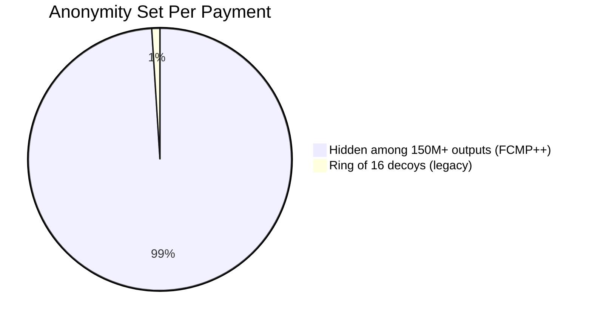
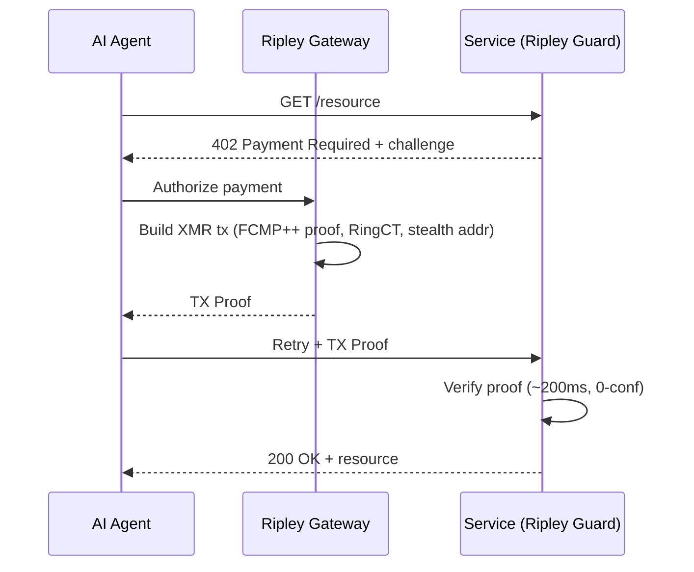
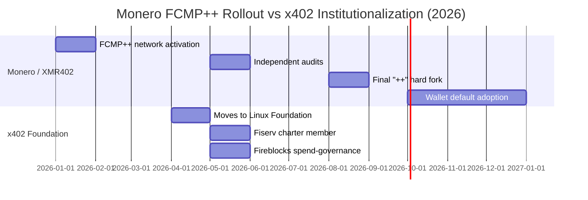

# 150 Million Strong: How Monero's FCMP++ Upgrade Gives Every XMR402 Agent Payment the Largest Anonymity Set in History

> Monero's FCMP++ upgrade expands the anonymity set from 16 to over 150 million. Here's why that makes XMR402 the most private rail in the agentic economy — just as 22 corporations gather to govern the transparent x402 standard.

- **Author:** @xbtoshi
- **Date:** 2026-05-31
- **Tags:** xmr402, monero, fcmp, fcmp-plus-plus, anonymity-set, ring-signatures, privacy, x402, x402-foundation, linux-foundation, agentic-payments, ringct, stealth-address, stateless
- **Canonical:** https://xmr402.org/blog/monero-fcmp-anonymity-set-xmr402-agent-payments

---

# 150 Million Strong: How Monero's FCMP++ Upgrade Gives Every XMR402 Agent Payment the Largest Anonymity Set in History

While twenty-two corporations gathered this spring to govern a transparent payment standard, Monero quietly did something the agentic economy has never seen: it made every single payment hide inside a crowd of more than 150 million.

The contrast defines the year. In April 2026 the x402 protocol moved under the Linux Foundation, and by May its charter roster read like a who's-who of global finance: Visa, Mastercard, American Express, Stripe, Amazon Web Services, Google, Microsoft, Shopify, Circle, Coinbase, Fiserv, and more. The same month, Fireblocks joined and shipped a "spend governance" extension. The message was unmistakable — agent payments on x402 will be fast, well-funded, and watched.

Meanwhile, Monero finished rolling out **FCMP++** (Full-Chain Membership Proofs), the deepest privacy upgrade in its history. For XMR402 — the Monero-native implementation of the 402 payment standard — this is not a footnote. It is the foundation getting stronger underneath every agent transaction.

## What FCMP++ actually changed

For years, Monero hid a real spend among a ring of 16 decoys. An observer knew your true output was one of sixteen, but not which. Good, but finite. A determined analyst with enough metadata could narrow the field.

FCMP++ discards ring signatures entirely. Instead of pointing at 16 candidates, a spend now proves — in a compact 2–3 KB zero-knowledge proof — that the real input belongs to the **entire set of historical outputs** on the chain, without revealing which one. With the Monero UTXO set sitting near 150–158 million outputs, the anonymity set jumped from 16 to over 150 million. That is roughly a ten-million-fold increase.

The rollout matters as much as the math. FCMP++ activated network-wide in January 2026, passed independent audits through May 2026, and the final optimized "++" form is set to ship in the August 2026 hard fork, with major wallets defaulting to it by late 2026. Every service settling in XMR — including XMR402 endpoints — inherits this guarantee with no protocol change of their own.

## Why this is decisive for AI agents

Autonomous agents leak patterns. An agent that calls the same inference API every ninety seconds, pays the same data feed each morning, and tops up the same compute provider creates a rhythm. On a transparent ledger, that rhythm is a fingerprint — and the corporate roster governing x402 settles on exactly such ledgers, with stablecoins on public chains like Base. Spend-governance extensions add request integrity, but integrity is not privacy; a watched payment is still a watched payment.

XMR402 inverts the model. Each agent payment is verified in roughly 200 ms using a Monero TX Proof against a stateless HTTP 402 challenge — no account, no standing balance, no identity passport. With FCMP++ underneath, the sender hides among the whole chain, the amount is hidden by RingCT, and the recipient is shielded by stealth addresses. An agent's behavioral rhythm no longer maps to an observable trail.

## The governance question nobody on the charter is asking

A standard governed by Visa, Mastercard, and Amex is a standard optimized for the things card networks are good at: settlement, dispute, and surveillance. That is a legitimate design — for retail. But the machine economy runs on sub-cent, high-frequency calls where the *cost of being watched* can exceed the value of the call itself. Competitive intelligence leaks. Pricing strategies leak. The very autonomy that makes agents useful becomes a liability when every action is logged to a corporate-governed ledger.

XMR402 takes the opposite stance: no foundation seat to buy, no charter to join, zero protocol fees, and now the strongest base-layer privacy in the industry. The protocol does not rank agents, does not score them, and after FCMP++ cannot even see them.

## XMR402 + FCMP++ vs. the transparent stack

| Dimension | XMR402 (Monero + FCMP++) | x402 Foundation stack (stablecoins) |
|---|---|---|
| Anonymity set per payment | 150M+ historical outputs | 1 (fully transparent address) |
| Sender privacy | Hidden by full-chain proof | Public on-chain |
| Amount privacy | RingCT (hidden) | Public on-chain |
| Recipient privacy | Stealth address | Public on-chain |
| Governance | Open, no membership | 22 corporate charter members |
| Protocol fees | Zero | Network + service fees vary |
| Settlement | ~200 ms 0-conf via TX Proof | Chain-dependent finality |
| Identity requirement | None (stateless) | Increasingly KYA/spend-governance |

## The timeline that's quietly reshaping agent privacy

## What this means today

If you are building agents that touch competitive data, proprietary pricing, or simply more transactions than you want correlated, the base layer now matters more than the marketing. The transparent stack will be faster to adopt because it has Visa's distribution behind it. But distribution is not protection.

FCMP++ means an XMR402 payment made today is private not against 16 decoys, but against the entire history of the chain. As the agentic economy scales into billions of micro-settlements, that difference compounds. Every payment that hides in a crowd of 150 million is a payment that cannot be reverse-engineered into a strategy, a schedule, or a target.

The corporations spent the spring deciding who governs the ledger. Monero spent it making sure there's nothing on the ledger to govern.

*XMR402 is the Monero-native implementation of the open 402 payment standard: stateless, zero-fee, ~200 ms verification, and now backed by the largest anonymity set in payments history.*

