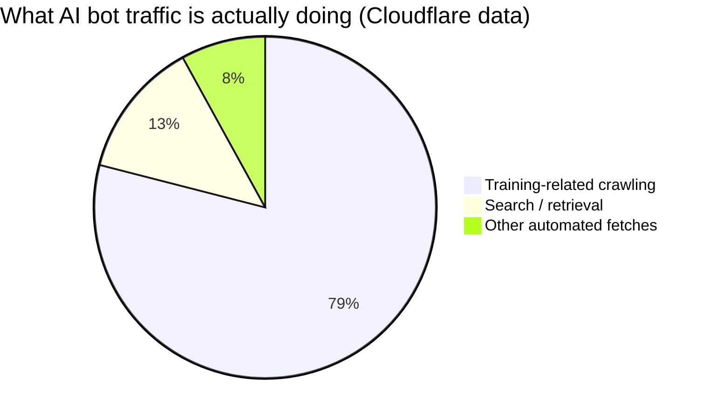
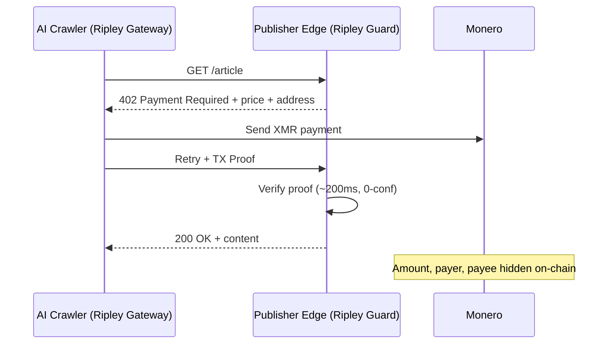

# The Crawl Trail: How Pay-Per-Crawl Turns Every AI Lab's Training Strategy Into a Public Map — and Why XMR402 Closes the Ledger

> Pay-per-crawl lets publishers charge AI crawlers — but on a transparent ledger, every crawl payment leaks a lab's training corpus. XMR402's private, stateless Monero settlement pays the publisher without broadcasting the strategy.

- **Author:** @xbtoshi
- **Date:** 2026-06-01
- **Tags:** xmr402, monero, x402, pay-per-crawl, cloudflare, ai-crawlers, training-data, gptbot, claudebot, common-crawl, privacy, publishers, content-monetization, agentic-payments, stateless, 0-conf
- **Canonical:** https://xmr402.org/blog/pay-per-crawl-training-data-trail-xmr402

---

# The Crawl Trail: How Pay-Per-Crawl Turns Every AI Lab's Training Strategy Into a Public Map — and Why XMR402 Closes the Ledger

In 2025, Cloudflare flipped a default that quietly rewired the economics of the web: AI crawlers are now blocked unless they pay. The company's **pay-per-crawl** marketplace lets publishers charge a fee every time a bot like GPTBot, ClaudeBot, or CCBot fetches a page, and in January 2026 it shipped an updated open-source x402 proxy template so any site can gate content per download, per API call, or per crawl. Sam Altman has publicly described the future of publishing as micropayments — "to be clear, payments made by AI agents, not readers directly."

It is the cleanest articulation yet of the agentic economy's supply side. For two years the conversation has been about agents *buying* services. Pay-per-crawl is about agents buying the raw material of intelligence itself: text, images, data, the corpus. And it arrives with a problem nobody is pricing in. When an AI lab pays for every page it crawls, **the payment trail becomes a real-time map of what that lab is training on.** On a transparent ledger, the most guarded secret in the industry — what's in the training set — leaks one micropayment at a time.

## The corpus is the moat, and the rail is the leak

Crawling is not browsing. Cloudflare's own data shows training-related traffic now accounts for **79% of AI bot activity**, and that some crawlers fetch on the order of tens of thousands of pages per referred visit. A lab acquiring training data at that intensity, paying per crawl on a public chain like USDC-on-Base, is publishing a structured feed of its R&D priorities: which domains it values, when it started ingesting a new vertical, how aggressively it is scaling a data category, and which competitor's content it considers worth licensing.

Consider what a transparent crawl trail hands to an observer. Every settled payment carries a payer address, a payee (the publisher), an amount, and a timestamp. Cluster the payee domains and you have reconstructed a rival lab's data acquisition strategy without breaching anything — the chain published it. A surge of payments to medical journals signals a healthcare model in training. A sudden contract with a legal-database publisher signals a vertical launch weeks before any announcement. This is the same surveillance tax that haunts agent *purchases*, but inverted onto the *inputs* — and the inputs are where the competitive value lives.

## XMR402: pay the publisher, not the surveillance ledger

XMR402 is the Monero-native implementation of the open X402 standard. It uses HTTP 402 Payment Required to negotiate a payment, settles in Monero, and confirms in roughly 200ms via a Monero TX Proof at zero-confirmation — fast enough to gate a crawler that fetches thousands of pages a minute. Critically, Monero's protocol-level privacy means amounts, sender, and recipient are hidden by default. The publisher is paid and can cryptographically verify the payment; the world cannot read the ledger to reconstruct who paid whom for what.

The stateless design matters as much as the privacy. There are no accounts to provision, no spending-limit dashboards, no per-call wallet confirmations — the failure mode that helped collapse transparent-rail x402 volume roughly 77% from its late-2025 peak. A crawler carries a budget, pays inline on each 402, and proves it. Nothing about the transaction is retained except the publisher's revenue.

## Transparent pay-per-crawl vs. XMR402

| Dimension | Transparent rail (USDC/Base) | XMR402 (Monero) |
|---|---|---|
| Publisher gets paid | Yes | Yes |
| Crawl amounts public | Yes — visible to all | No — hidden on-chain |
| Payer/payee linkable | Yes — addresses cluster | No — stealth addresses |
| Training-corpus leakage | High — strategy reconstructable | None — no readable trail |
| Per-call confirmation | Often required | Stateless, inline 402 |
| Settlement speed | Block-time + conf | ~200ms, 0-conf TX Proof |
| Protocol fees | Varies | Zero |

## Why this is the next battleground

The pay-per-crawl model is being built right now, and it is being built on transparent rails by default. That is a strategic mistake for the labs adopting it. A company will happily pay publishers to train on their content; it will not happily broadcast its entire training roadmap to competitors as a side effect of paying. The first lab to realize this will route its crawl budget through a private rail — and once one does, the rest cannot afford the asymmetry of training in public while a rival trains in the dark.

Publishers benefit too. A private settlement rail removes the chilling effect that stops some labs from licensing rather than scraping through laundered intermediaries like Common Crawl. If a lab can pay a publisher directly without revealing its hand, the honest path becomes the cheap path. Pay-per-crawl was supposed to fix the web's broken bargain between creators and machines. It only works if paying doesn't cost the payer its strategy. XMR402 closes the ledger — the publisher gets paid, and the corpus stays a secret.

