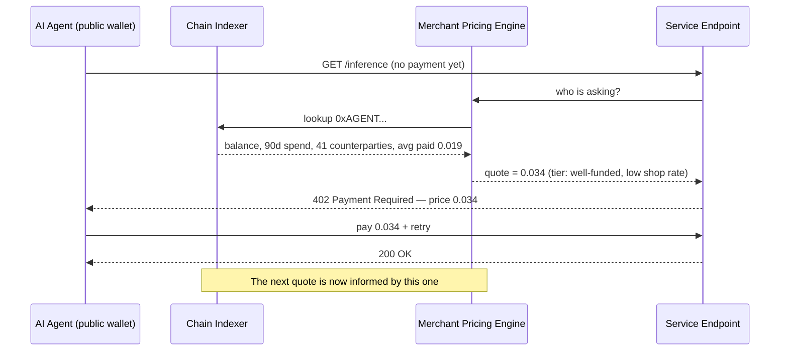
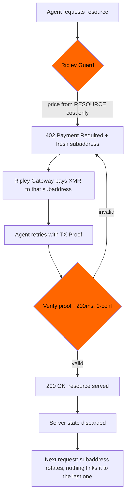

# The Willingness-to-Pay Oracle: How Public Agent Wallets Price You Before You Ask — and Why XMR402 Quotes Blind

> The FTC's August 19, 2026 personalized-pricing policy assumes merchants must go collect the data. On transparent rails, an agent's wallet publishes balance, spend rate, counterparty graph and accepted prices for free — a willingness-to-pay dossier no disclosure rule can reach. XMR402 prices from the resource, settles to a single-use subaddress, and leaves nothing to score.

- **Author:** @xbtoshi
- **Date:** 2026-09-07
- **Tags:** xmr402, monero, x402, personalized-pricing, surveillance-pricing, ftc, section-5, willingness-to-pay, price-discrimination, agent-wallets, wallet-scoring, dynamic-pricing, subaddress-rotation, tx-proof, stateless, ripley-guard, ripley-gateway, acp, ucp, usdc, base, selective-disclosure, vouchers, agentic-payments, 0-conf
- **Canonical:** https://xmr402.org/blog/personalized-pricing-agent-wallet-willingness-to-pay-xmr402

---

# The Willingness-to-Pay Oracle: How Public Agent Wallets Price You Before You Ask — and Why XMR402 Quotes Blind

On August 19, 2026, the Federal Trade Commission issued a proposed enforcement policy statement on **personalized pricing** and opened it for a 30-day public comment period. The statement defines the practice precisely: using consumer data — browsing history, location data, demographic information, loyalty records, purchasing patterns — to set individualized prices based on an estimate of a shopper's *willingness to pay* or their *likelihood of comparison shopping*. Inadequate disclosure of that practice, the Commission argues, is likely deceptive or unfair under Section 5 of the FTC Act.

It is a coherent framework for a human on a retail website. It is close to useless for an autonomous agent paying over a transparent ledger, and the reason is not that regulators missed something obvious. The reason is that agentic commerce inverted the data-collection problem the rule was written to solve.

## The Signal That Isn't on the FTC's List

Every data type the Commission enumerates has one thing in common: the merchant has to *acquire* it. Browsing history comes from a tracker. Location comes from a permission prompt or an IP lookup. Loyalty data comes from a program the shopper joined. Demographics come from a broker. Each acquisition is a practice, and a practice can be disclosed, audited, and enjoined.

Now put an AI agent on the other side of the counter, paying with an x402-style flow over USDC on Base, or any of the transparent-ledger rails now in production. The agent's wallet address arrives attached to the payment — it has to, that is how the settlement works. And that address is not a pseudonym. It is a fully published financial dossier that the merchant acquires by doing nothing at all:

- **Current balance** — the hard ceiling on what this agent can spend today
- **Historical spend rate** — burn per hour, per day, per task type
- **Counterparty graph** — every service this agent has ever paid, and how often
- **Realized price history** — exactly what it paid, to whom, for what class of resource
- **Retry and shop behavior** — whether it accepted the first quote or bounced across three providers first
- **Funding cadence** — which treasury refills it, how large the top-ups are, how long they last
- **Idle slack** — how much runway remains before it must refill or stop

The FTC's definition speaks of an *estimate* of willingness to pay. A funded, reused, on-chain agent wallet does not require an estimate. It is closer to a direct measurement, published in advance, free to read, and permanently retained by a system nobody involved in the transaction operates.

## Why a Disclosure Remedy Doesn't Reach It

The Commission's proposed remedy is transparency: tell the shopper that the price in front of them was computed from data about them. Four structural problems appear the moment the shopper is software.

**There is no collection practice to disclose.** The merchant did not track the agent, buy a segment, or set a cookie. It read a public database that the payment rail itself maintains as a design goal. A disclosure regime regulates the act of gathering; here nothing was gathered.

**There is no consumer in the loop at quote time.** Disclosure presumes a person who can read a notice and walk away. The agent receives an HTTP 402 header with a price in it, at machine speed, inside a task it was told to complete. A notice line in a JSON body is not a decision point for anything that isn't reading it.

**The price is personalized upstream of the interaction.** In the human case, personalization happens after the shopper arrives and is observed. On a transparent ledger it can happen before the first request, because the dossier is standing inventory. The merchant can have a price schedule for your agent before your agent has ever heard of the merchant.

**The pricer need not be the merchant.** Wallet-scoring is trivially resellable. Once willingness-to-pay inference is a subscription API sitting between indexers and storefronts, the merchant genuinely is not performing the practice — a vendor is, and the merchant just consumes a number. Enforcement against the party with the customer relationship gets progressively further from the party doing the inference.

## What Each Rail Actually Leaks at Quote Time

| Signal available to the merchant | x402 / USDC on transparent L2 | ACP (OpenAI + Stripe) | UCP (Google + Shopify) | XMR402 (Monero-native) |
|---|---|---|---|---|
| Payer balance | Public, exact | Held by PSP, inferable via limits | Held by platform | **Not observable** |
| Historical spend total | Public, exact | Platform-visible | Platform-visible | **Not observable** |
| Counterparty / merchant graph | Public, complete | Platform-visible | Platform-visible | **Not observable** |
| Prices previously accepted | Public, exact | Platform-visible | Platform-visible | **Not observable** |
| Persistent payer identifier | Address, reused by default | Account + mandate | Account + linked identity | Fresh subaddress per request |
| Comparison-shopping behavior | Inferable from failed/rotated txs | Partially | Partially | **Not observable** |
| Proof the request was paid for | Yes | Yes | Yes | Yes — Monero TX Proof, ~200ms |
| Third party can resell scoring | Yes, permissionlessly | Contractual | Contractual | Nothing to score |

The last row is the one that matters. On the platform rails (ACP, UCP), the dossier exists but sits behind a contract, so the FTC's disclosure lever has something to grip. On transparent chains the dossier is a public good for anyone who wants to price against it, and there is no contract, no counterparty, and no notice to give. XMR402's column is not better because Monero is stricter about who may read the ledger. It is different because the facts the pricer wants were never written down.

## What Arrives With an XMR402 Payment

XMR402 is the Monero-native implementation of the open X402 standard. The flow is deliberately ordered so that pricing happens before the payer is visible, and the payer never becomes visible:

The 402 challenge is generated from the cost of serving the request — model, tokens, bandwidth, compute class — because at the moment it is generated the server has nothing else. There is no address to look up, no account to load, no history to join against. The payment then settles to a subaddress used once, verified by a Monero TX Proof in roughly 200 milliseconds at zero confirmations. The merchant learns one fact: *this specific request was paid for, in this amount, provably*. The balance behind the payment, the agent's other suppliers, and the prices it accepted yesterday are not withheld by policy. They were never in the message.

Statelessness does the rest. Because Ripley Guard holds no session and no ledger of payers, there is no accumulating record for a future pricing model to train on — including the merchant's own. A protocol that cannot build a payer profile cannot be subpoenaed for one, breached for one, or quietly monetize one.

## The Honest Objection

Removing the individual axis from pricing removes some things merchants legitimately want. Volume discounts, loyalty rates, and risk-based pricing against abusive callers all depend on knowing something about who is asking. A rail that reveals nothing about the payer cannot offer a returning customer a better price, and that is a real cost, not a rhetorical one.

XMR402's position is narrower than "never differentiate." It is that differentiation should be **asserted by the payer, not inferred by the observer**. An agent that wants a volume tier can present a merchant-issued voucher or a signed capability alongside its payment, revealing exactly the fact required — *this bearer is entitled to tier B* — and nothing adjacent to it. The agent chooses, per transaction, which claims to make. Blind is the default; disclosure is a deliberate act with a scope.

That is also, read carefully, what the FTC statement is reaching for. The Commission draws a line between **dynamic pricing**, which responds to market conditions like inventory, congestion, and demand, and **personalized pricing**, which responds to the individual. XMR402 leaves dynamic pricing completely intact — a Ripley Guard endpoint can and should charge more when GPUs are scarce or the requested model is expensive. It removes only the axis the Commission is worried about, and it removes it at the protocol layer, where no comment period is required.

## Practical Notes for Builders

- **Rotate subaddresses per request.** Ripley Gateway does this by default. An agent that reuses one receiving identity across a thousand calls has rebuilt the dossier by hand.
- **Price from the resource, not the requester.** If your quote function takes the payer as an argument, you have built a personalized pricing system whether or not you meant to.
- **Do not attach a persistent agent ID to requests that do not need one.** Naming layers, agent registries, and trust tiers all re-link what subaddress rotation just unlinked.
- **Make loyalty payer-presented.** Vouchers and signed entitlements give returning customers their discount without handing every observer a spend history.
- **Audit what your logs retain.** Statelessness at the protocol layer is undone by an access log that stores a payer key for ninety days.

## The Shape of the Problem

Regulation of personalized pricing assumes the merchant must go and get the data. That assumption is what makes disclosure a workable remedy: interrupt the collection, inform the collected. Agentic commerce on transparent rails does not collect. It publishes, permanently, by default, as a condition of settlement — and then invites anyone to price against what was published.

Disclosure regulates the collector. XMR402 removes the collection. When both sides of the counter are machines transacting thousands of times a day, only one of those still functions.

