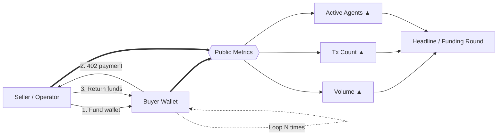
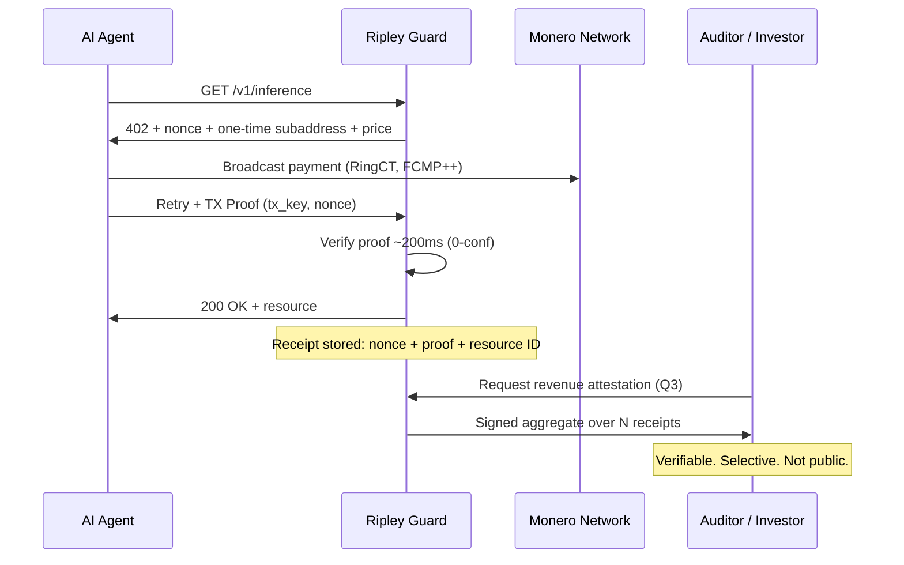

# The Mirage Metric: Why Half of Agentic Payment "Volume" Is Wash Trading — and What XMR402 Counts Instead

> x402's raw counters read 165M transactions, but an Artemis wash-trading filter cut 30-day volume to $1.6M against ~$28k/day of real demand. A ledger entry proves money moved, not that a service was delivered. XMR402 replaces the public volume counter with merchant-held Monero TX Proof receipts: unforgeable, selectively disclosable, and worthless to fake.

- **Author:** @xbtoshi
- **Date:** 2026-09-06
- **Tags:** xmr402, monero, x402, wash-trading, artemis, on-chain-metrics, phantom-volume, agentcore-payments, aws, bedrock, mastercard-agent-pay, xrpl, t54, chainalysis, tx-proof, proof-of-delivery, revenue-privacy, selective-disclosure, fcmp, thorchain, stateless, 0-conf, agentic-payments, ripley-guard
- **Canonical:** https://xmr402.org/blog/phantom-volume-wash-trading-agent-metrics-xmr402

---

# The Mirage Metric: Why Half of Agentic Payment "Volume" Is Wash Trading — and What XMR402 Counts Instead

September 2026 has been a banner month for agentic payment headlines. The XRP Ledger crossed **3,992,146 agent-initiated transactions** on September 5, up roughly 890,000 in four days. AWS shipped **Amazon Bedrock AgentCore Payments to general availability on August 18**, letting agents discover and pay for APIs and MCP servers with a few lines of code. Mastercard's *Agent Pay for Machines* launched in June. Chainalysis counted **100 million agentic payments on Base**.

And then there is the number nobody puts on a slide: **roughly $28,000 in average daily volume**, with about half of it flowing between wallets that are paying themselves.

An analyst at Artemis Analytics built a wash-trading filter for x402 — flagging wallets that repeatedly transacted with themselves or cycled funds between a small ring of addresses — and the adjusted 30-day figure came out to **$1.6 million**, against a raw number many times larger. Their verdict was blunt: the agent payments boom is still mostly a mirage.

This post is not a victory lap. It is an argument that the entire industry, XMR402 included, is measuring the wrong thing — and that the metric we reach for is a direct artifact of building on transparent ledgers.

## How You Manufacture an Agent Economy

The mechanics are trivial and cost almost nothing. On a low-fee chain, a seller funds a buyer wallet, the buyer "pays" for a resource, and the funds cycle back. Repeat a few hundred thousand times. Each loop mints a transaction count, a dollar of volume, and an "active agent" — none of which correspond to a service anyone wanted.

The February 2026 spike — 3.8 million transactions and roughly $2 million of volume in a single day — was later attributed largely to infrastructure testing. By April, the raw counters read 165 million transactions across 69,000 active agents, of which analysts estimated about half was testing rather than commerce.

None of this requires bad faith. Load tests, demos, testnet bleed-through, and integration suites all produce identical on-chain artifacts to real commerce. That is the problem.

## Transparency Detects Forgery. It Does Not Prevent It.

The obvious rejoinder is that we *know* about the wash trading precisely because the ledger is public. True — and worth acknowledging. A transparent chain gave Artemis the forensic surface to build the filter.

But look at what transparency actually bought:

- It gave analysts **post-hoc detection**, not prevention. The wash trades still settled, still counted, still made headlines for months.
- It gave every competitor a permanent view of **genuine** merchants' revenue. The same query that unmasks a fake economy also reveals a real API's per-endpoint income, customer concentration, and growth curve.
- It did nothing to close the gap that makes forgery possible in the first place: **a ledger entry proves that money moved. It does not prove that a service was delivered.**

That last line is the whole argument. Chain-side volume is a proxy for demand that has been fully decoupled from demand. Any metric that can be minted by moving your own money in a circle will eventually be minted by someone with an incentive to do so — and in a sector where roughly $7 billion of capital is chasing a $28,000-a-day market, the incentive is enormous.

## What XMR402 Counts: Delivery, Not Movement

XMR402 does not publish a volume counter, and it structurally cannot. The Monero base layer hides amounts (RingCT), recipients (stealth addresses), and — since the **August 2026 FCMP++ hard fork** — origin, inside an anonymity set of over 100 million outputs, with proofs under 2.8 KB verifying in roughly 18 ms.

So what replaces the number? The **receipt**.

Every XMR402 request is a challenge-response. Ripley Guard issues a 402 with a nonce, an amount, and a one-time subaddress bound to that specific resource request. The agent pays, then presents a **Monero TX Proof** — a signature demonstrating knowledge of the transaction key for a payment to *that* subaddress. Verification is ~200 ms at zero confirmations, and the merchant ends up holding a cryptographic object that binds four things together at once:

1. A real, fee-bearing Monero payment
2. To a one-time subaddress no one else controls
3. Against a server-issued nonce that cannot be replayed
4. For a named resource that was actually served

To forge this, an operator would have to spend real XMR against its own nonces — paying genuine network fees to inflate a figure that **no third party can see anyway**. The economics invert: on a transparent chain, faking volume is cheap and the payoff is a public number. On XMR402, faking volume is costly and the payoff is nothing, because the number was never public to begin with.

Revenue becomes **disclosable by choice**: a merchant proves its numbers to an auditor, an investor, or a tax authority by signing an aggregate over receipts it holds. The counterparty verifies against Monero's chain. The competitor down the street learns nothing.

## Comparing What a "Transaction" Actually Proves

| | x402 / USDC on Base | ACP (OpenAI + Stripe) | MPP / Tempo | AgentCore Payments | **XMR402** |
|---|---|---|---|---|---|
| What one record proves | Funds moved between addresses | Order placed via processor | Funds moved on permissioned chain | Payment orchestrated across rails | **Challenge answered + resource served** |
| Cost to manufacture fake volume | Near zero (sub-cent gas) | Card fees + processor scrutiny | Near zero within permissioned set | Inherits the underlying rail | **Full XMR amount + real fees, for zero visible gain** |
| Who can audit the raw data | Anyone, forever | Processor + merchant | Chain validators (permissioned) | AWS + wallet providers | **Merchant, plus whoever the merchant chooses** |
| Genuine merchant revenue is | Public | Processor-visible | Validator-visible | Provider-visible | **Private by default** |
| Delivery bound to payment | No | Partially (order object) | No | Policy layer, off-chain | **Yes — nonce binds both** |
| Verification latency | ~2–12 s confirmation | Seconds to days | Sub-second, permissioned | Depends on rail | **~200 ms, 0-conf** |
| Protocol fee | Facilitator-dependent | Processor fee | Chain fee | AWS + rail fees | **Zero** |

## Why This Should Worry Everyone, Not Just Privacy People

The agentic payment sector is currently allocating capital against a metric that costs less than a rounding error to fabricate. That is not a moral failing of any one protocol — it is a design consequence. If the only thing your rail can measure is money moving, then money moving in a circle is indistinguishable from a market.

The fix is not better analytics. It is a stronger unit of account: **a receipt that a service was rendered**, signed by both sides, verifiable on demand, and worthless to fabricate.

Monero's August 2026 upgrade — and THORChain's native XMR integration on August 24, which restored a decentralized liquidity rail after exchange delistings — mean the base layer is finally in shape to carry that model at machine scale. XMR402's job is to make the receipt, not the counter, the thing worth reporting.

When agents outnumber humans on the network, the question that will matter is not *how many payments happened*. It is *how many of them bought something real*. Only one of those questions has a cryptographic answer.

---

*XMR402 is the Monero-native implementation of the X402 open payment standard. Zero protocol fees, ~200 ms 0-conf verification via Monero TX Proof, stateless and transport-agnostic. Learn more at [xmr402.org](https://xmr402.org).*
