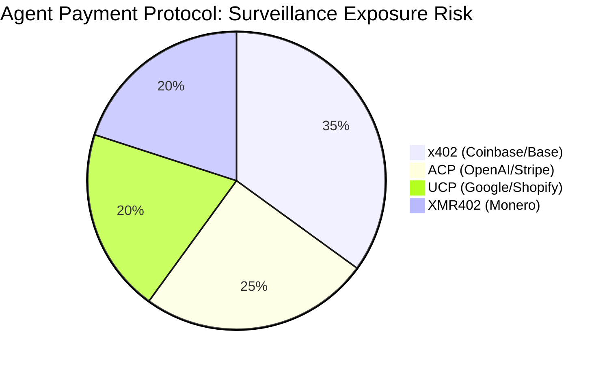
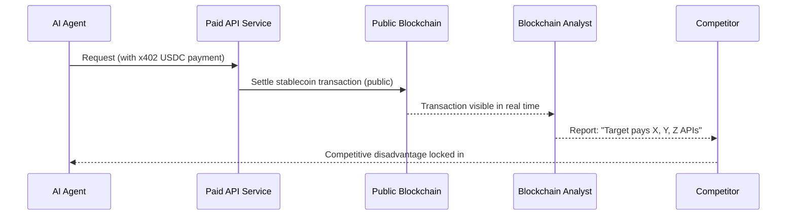

# The Surveillance Tax: Why AI Agents Can't Afford Transparent Payment Trails

> Stablecoin-based agent payment protocols create permanent, public surveillance trails. Discover why privacy-preserving payments via XMR402 aren't optional — they're essential infrastructure for the agentic economy.

- **Author:** @xbtoshi
- **Date:** 2026-03-18
- **Tags:** privacy, surveillance, XMR402, x402, Monero, agentic-economy, KYA, machine-payments, competitive-intelligence
- **Canonical:** https://xmr402.org/blog/privacy-vs-surveillance-agent-economy

---

# The Surveillance Tax: Why AI Agents Can't Afford Transparent Payment Trails

When Coinbase and Cloudflare announced the x402 Foundation in early 2026, the headlines celebrated a new era of machine-to-machine commerce. Industry analysts projected a $3–5 trillion agentic economy by 2030. Yet buried beneath the hype lies an inconvenient truth: every stablecoin payment an AI agent makes on a public blockchain is permanently, immutably, and publicly visible to anyone on earth.

This isn't a minor technical detail. It's a structural flaw that turns every AI agent's payment history into open-source competitive intelligence — a gift to rivals, regulators, and adversaries alike. Call it the **surveillance tax**: the hidden cost every agent pays for operating on transparent rails.

## The Problem With Transparent Blockchains

When an AI agent uses x402 (Coinbase), ACP (OpenAI/Stripe), or UCP (Google/Shopify) to pay for services, those transactions settle on public blockchains — Ethereum, Base, Solana. Every payment is:

- **Permanently recorded** on an immutable ledger visible to the entire world
- **Publicly queryable** by any third party with a blockchain explorer
- **Analytically linkable** across wallets and time by on-chain analytics firms
- **Competitively exposed** — revealing which APIs, services, and data sources the agent relies on

Imagine a hedge fund deploying AI agents to gather market intelligence. Every API call they pay for — from satellite imagery providers to alternative data feeds — is visible on-chain. A competitor with a blockchain analytics tool can reverse-engineer their entire intelligence-gathering operation from payment metadata alone.

This is not hypothetical. With over $28,000 in daily volume on x402 and sophisticated on-chain analytics firms already active, the surveillance infrastructure for agent payment monitoring already exists. It's just waiting for adoption to scale.

## The Agentic Economy's Privacy Gap

Recent data paints a stark picture. Despite an estimated $7 billion ecosystem valuation, x402 currently processes only approximately $28,000 in daily volume. Analysts have identified a key barrier: real enterprises are hesitant to expose their operational intelligence through transparent payment rails.

The protocols with the highest adoption projections — x402, ACP, UCP — all share the same fatal privacy flaw: they route value through auditable, public, or semi-public systems. Meanwhile, XMR402 operates on Monero's cryptographically private foundation, where transaction amounts, senders, and recipients are shielded by default through ring signatures, stealth addresses, and RingCT.

## How the Payment Trail Becomes a Liability

Consider the lifecycle of a single autonomous agent deployed for competitive research:

Every step of this chain happens automatically, without the deploying organization's knowledge or consent. The agent's operational fingerprint — which services it uses, how frequently, at what cost — becomes permanently encoded in a public ledger.

With XMR402, this chain is severed completely. The Monero TX Proof mechanism allows a server to verify that payment was made in under 200 milliseconds, with zero protocol fees and without broadcasting any linkable metadata to the public. The payment happened. The proof is cryptographically valid. The details are nobody else's business.

## A Comparison of Agent Payment Protocols

| Feature | x402 (Coinbase) | ACP (OpenAI/Stripe) | UCP (Google/Shopify) | XMR402 |
|---|---|---|---|---|
| **Privacy by default** | ❌ Public blockchain | ⚠️ Corporate ledger | ⚠️ Semi-centralized | ✅ Cryptographic |
| **Payment verification latency** | ~2–5s (on-chain) | ~1–3s | ~1–3s | 200ms (0-conf) |
| **Protocol fees** | Gas + facilitator % | Stripe %, fiat rails | Platform cut | Zero |
| **Censorship resistance** | Medium | Low (Stripe/fiat) | Low (Google) | Maximum |
| **Surveillance exposure** | Maximum | Medium | Medium | Zero |
| **Stateless architecture** | Yes | No | No | Yes |
| **Agent identity required** | Wallet address | Account/API key | OAuth/account | None |
| **Governance** | x402 Foundation | Corporate | Corporate | Open protocol |

The contrast is stark. XMR402 is the only protocol in this landscape that treats privacy as a first-class feature rather than an afterthought. Every other protocol either exposes payment metadata publicly (on public blockchains) or routes it through corporate intermediaries who log, analyze, and retain it indefinitely.

## The KYA Problem: Surveillance Dressed as Safety

The industry response to agentic payment risks has been to push "Know Your Agent" (KYA) frameworks — identity verification requirements for AI agents. While framed as a safety measure, KYA as implemented in the x402/ACP/UCP ecosystem creates centralized choke points that:

1. **Require agents to register identities** with platform gatekeepers (Coinbase, Stripe, Google)
2. **Create permanent audit trails** linking agent activity to human operators and organizations
3. **Enable de-platforming** of agents based on payment behavior or geopolitical pressure
4. **Concentrate surveillance power** in a small number of infrastructure providers with their own interests

The x402 Foundation — jointly controlled by Coinbase and Cloudflare — exemplifies this model. Two corporations are establishing governance over what may become trillions of dollars of machine-to-machine commerce annually. Every agent payment flowing through their infrastructure is a data point in their growing intelligence apparatus.

XMR402's architecture inverts this model entirely. Because Monero's cryptography handles privacy at the protocol layer, there is no need for a centralized identity registry. Agents prove payment validity through TX Proof — a cryptographic mechanism that is unforgeable, stateless, and requires no third-party trust. The server receives proof. The payment is valid. No surveillance intermediary required.

## Why This Moment Is Critical

The agentic economy is not a distant vision. As of March 2026, x402 is already integrated into Google's Agent2Agent (A2A) protocol, Cloudflare's global edge network, and identity systems like World's AgentKit. The rails are being built right now. The standards are being established. The surveillance architecture is being embedded at the protocol level — and standards, once locked in, are extraordinarily difficult to change.

History offers a warning: the web's original HTTP protocol had no built-in privacy or security. We spent 30 years retrofitting HTTPS, adding cookies, struggling with tracking and surveillance. The payment layer for the agentic economy is being designed today. The choices being made now will echo for decades.

This is why XMR402 matters not just as a technical alternative, but as a structural statement: the machine economy should not be a surveillance machine. The invisible infrastructure powering trillions of agent interactions should not leave a permanent, publicly exploitable record of every economic decision every agent ever makes.

## Building on Privacy by Default

For developers integrating XMR402 today, the architecture is clean and composable:

- **Ripley Guard** sits on the server side, verifying Monero TX Proofs in under 200ms with zero infrastructure overhead
- **Ripley Gateway** runs on the agent side, executing payments and generating cryptographic proofs automatically
- **Ripley Terminal** provides a desktop interface for human operators who need visibility into their own agents — without exposing that visibility to the world

No accounts. No API keys. No on-chain fingerprints. No surveillance tax. Just cryptographic proof that value moved, verified in 200 milliseconds, and nothing else leaking out.

The machine economy is being built today. The choice between transparent surveillance rails and private cryptographic infrastructure is not a future decision — it's being made right now, one protocol integration at a time. XMR402 is the infrastructure that doesn't charge you for your own privacy.
