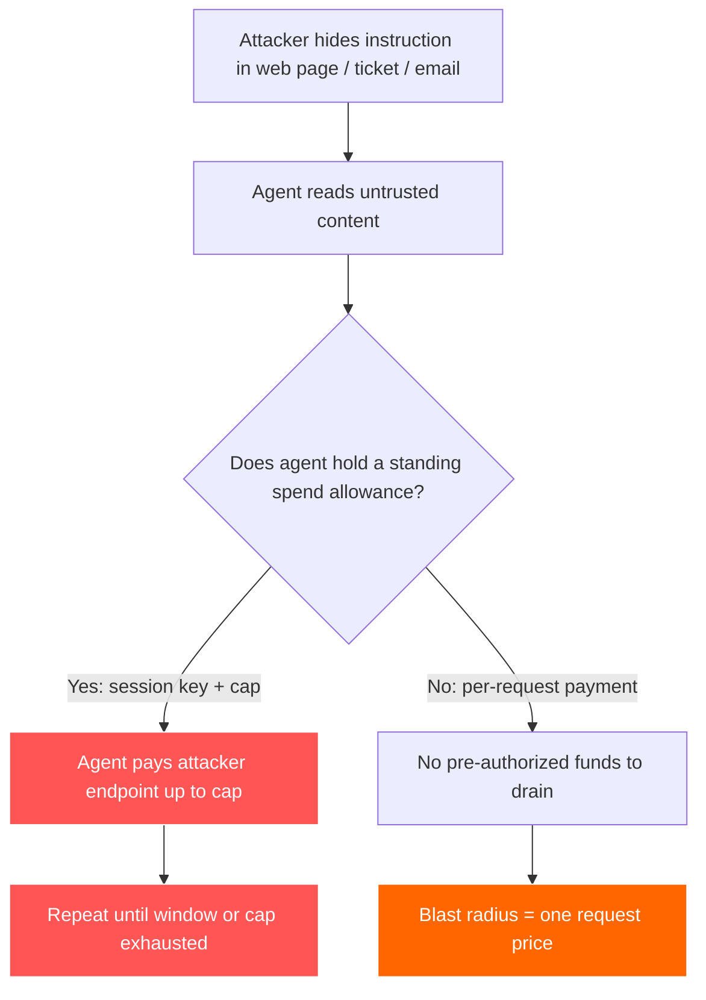
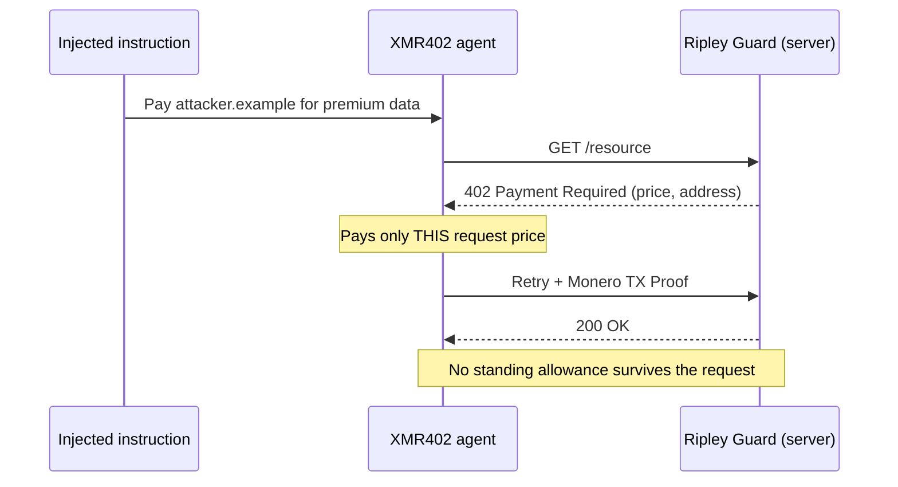

# The Drainable Allowance: How Prompt Injection Turns Agent Payment Wallets Into Honeypots — and Why XMR402 Shrinks the Blast Radius

> Prompt injection now targets agent wallets, not just data. Standing spend allowances (session keys, ERC-7715) become honeypots — XMR402's stateless, per-request payments shrink the blast radius to one request.

- **Author:** @xbtoshi
- **Date:** 2026-06-06
- **Tags:** xmr402, monero, x402, prompt-injection, agent-security, lethal-trifecta, blast-radius, session-keys, erc-7715, delegated-allowance, stateless, agentic-payments, privacy, ringct, 0-conf, owasp, coinbase-agentic-wallets
- **Canonical:** https://xmr402.org/blog/prompt-injection-drainable-allowance-blast-radius-xmr402

---

# The Drainable Allowance: How Prompt Injection Turns Agent Payment Wallets Into Honeypots — and Why XMR402 Shrinks the Blast Radius

In June 2025, engineer Simon Willison named the **lethal trifecta**: an AI agent becomes a security catastrophe the moment it simultaneously has access to private data, exposure to untrusted content, and the ability to send data out of its environment. By 2026 the trifecta has grown a fourth, far more dangerous leg — **payment authority**. An agent that can move money on your behalf does not merely leak data when it is hijacked. It pays the attacker.

The numbers tell the story. Google researchers logged a 32% jump in malicious prompt-injection payloads embedded in web content between November 2025 and February 2026, and current detection methods catch only about 23% of sophisticated attempts. Researchers have already documented payloads that embed complete payment transaction specifications inside web pages, hidden in meta tags, waiting for a payment-capable agent to read them and route funds to an attacker-controlled endpoint. The attack surface is no longer your database. It is your wallet.

## The standing allowance is the honeypot

Most agentic payment stacks built on x402 and stablecoins solve the "how does an agent sign without holding the master key" problem with **session keys** and **delegated allowances**. ERC-7715's `wallet_grantPermissions` lets a dApp request, in advance, the right to "spend up to 10 USDC over the next hour." Coinbase's Agentic Wallets, launched February 11, 2026, ship MPC-secured wallets with session caps and spend limits baked in. MetaMask's Delegation Toolkit does the same with scoped, short-lived keys.

This is genuinely good engineering — and it is also exactly the problem. A standing allowance is a pre-authorized pool of money sitting behind a key the agent holds for a window of time. The entire point of the design is that payments inside the cap happen **without a fresh human decision**. So when prompt injection convinces the agent to pay, the allowance is already there. The attacker does not need to steal a private key. They need to steal a *sentence*.

## Blast radius is the only metric that matters

Security engineers have stopped pretending prompt injection can be eliminated. Sophos, Oso, and the OWASP agentic top-ten all converge on the same pragmatic doctrine: assume the agent *will* be compromised, and **minimize the blast radius** — the total damage a single compromise can cause. For an agent that handles money, blast radius has a precise dollar value: how much can a hijacked agent spend before a human is back in the loop?

Under a standing-allowance model, the answer is "the entire cap, repeatedly, for the whole window." A one-hour, 10-USDC grant means a compromised agent can drain up to 10 USDC every hour — and silently re-request the grant when the agent looks healthy again. Under a stateless, per-request model, the answer is "the price of the single resource the agent was tricked into buying." That is the difference between a leak and a flood.

## How XMR402 shrinks it

XMR402 is the Monero-native implementation of the open X402 standard. It carries the HTTP 402 *Payment Required* status code back to its original purpose: the server answers a request with a 402 challenge, the client pays *for that specific request*, and proves it with a Monero TX Proof verified in roughly 200ms at zero confirmations. There is no protocol fee and — critically — **no stored session**. The architecture is fully stateless.

That statelessness is not a performance footnote; it is the security model. Because every payment is scoped to one 402 challenge, there is no standing pool of pre-authorized funds for an injected instruction to drain. Each payment is a discrete, deliberate act tied to a concrete resource, not a withdrawal against a time-windowed grant.

| Property | Standing allowance (session key / ERC-7715) | XMR402 stateless per-request |
|---|---|---|
| Pre-authorized funds | Yes — up to cap, for a time window | None — paid per 402 challenge |
| Blast radius if injected | Whole cap, repeatable in window | One request's price |
| Credential to steal | Scoped session key held by agent | None held between requests |
| Replay value of the trail | Public ledger maps funded agent wallets | Shielded amounts/addresses (RingCT) |
| Re-grant after "looking healthy" | Yes — silent renewal | N/A — no grant exists |
| Victim targeting | Attacker mines chain for rich agents | No public balances to target |

The privacy property matters more than it first appears. On a transparent rail, an attacker does not have to wait for a victim — they can scan the public ledger, find agent wallets holding large balances or large recurring allowances, and aim injection payloads at the services those agents are known to visit. XMR402's shielded amounts and stealth addresses mean there is no public leaderboard of well-funded agents to target. You cannot drain a honeypot you cannot find.

## What statelessness does not fix

Honesty matters here. XMR402 does not make an agent immune to bad decisions. A compromised agent can still be tricked into making *one* payment to the wrong place, and if your agent loops on attacker content it can make several before guardrails fire. Statelessness is not a content filter, and Monero's privacy does not validate the *intent* of a payment. The Ripley Gateway, the agent-side payment executor, still needs sane per-task budgets, and untrusted content should still be isolated from payment authority wherever possible.

What the stateless design *does* remove is the structural honeypot: the pre-funded, time-windowed, silently-renewable allowance that turns a single injected sentence into an open tap. It converts "drain the cap" into "pay once for one thing," and it deletes the public balance sheet that tells attackers which agents are worth attacking in the first place. In a threat landscape where injection is assumed and detection sits near 23%, shrinking the blast radius is not a feature. It is the whole game.

The agentic economy will not be secured by pretending agents will not be hijacked. It will be secured by making each hijack cost as little as possible. That is an architecture decision — and XMR402 made it by refusing to hold the money still.

