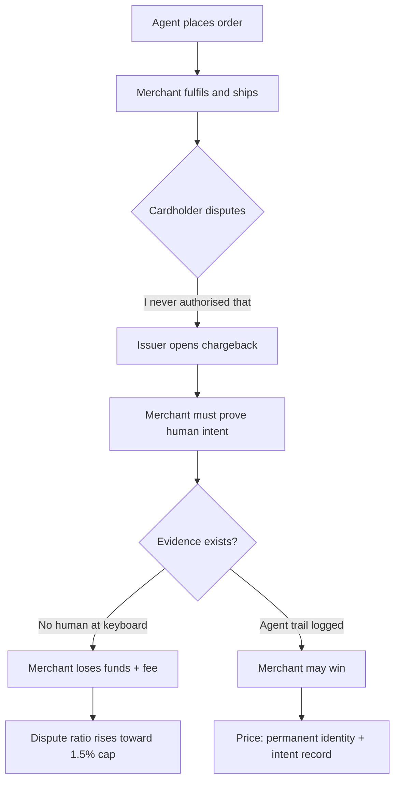
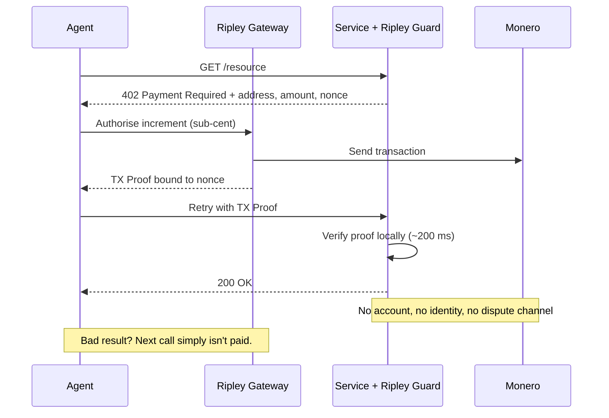
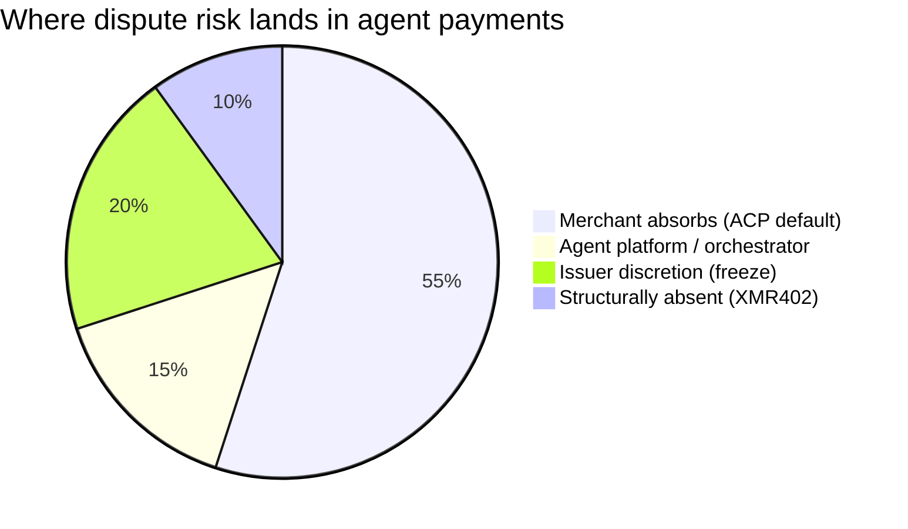

# The Reversal Paradox: Why Agentic Commerce Can't Decide If a Payment Is Final — and Why XMR402 Never Had to Ask

> ACP leaves chargeback liability with the merchant while stablecoins ship a blacklist(address) kill switch. Agentic commerce inherited both answers to reversibility and resolved neither. XMR402 sidesteps the argument by shrinking the payment until disputes stop being economic.

- **Author:** @xbtoshi
- **Date:** 2026-09-04
- **Tags:** xmr402, monero, x402, acp, agentic-commerce, chargebacks, dispute-liability, merchant-of-record, finality, irreversibility, usdc, blacklist, stablecoin-freeze, visa-tap, mastercard-agent-pay, ap2, tx-proof, stateless, micropayments, privacy, 0-conf
- **Canonical:** https://xmr402.org/blog/reversal-paradox-chargeback-freeze-finality-xmr402

---

# The Reversal Paradox: Why Agentic Commerce Can't Decide If a Payment Is Final — and Why XMR402 Never Had to Ask

Every payment system in history has had to answer one question before anything else: **can this be taken back?**

Card networks answered yes. That answer built consumer trust, and it built the chargeback — a mechanism where the payer, months later, can unwind a completed transaction and force the merchant to prove the purchase was intended. Public blockchains answered no. That answer built merchant certainty, and it built the "sorry, nothing we can do" support ticket.

Agentic commerce, in 2026, has managed to inherit both answers at once — and resolve neither. The protocols racing to own machine payments have quietly split into two camps that contradict each other on the single most consequential property a payment rail has. Worse, each camp's answer is unstable in the same direction: toward more identity, more logging, more of the agent's behavior written down somewhere permanent so that somebody can adjudicate a dispute later.

XMR402 sits outside this argument entirely, and not because it picked a side. It sits outside because it changed the size of the thing being disputed.

## Camp One: The Merchant Holds the Bag

Read the Agentic Commerce Protocol's delegated payment specification closely and one sentence does all the work. OpenAI is **not** the merchant of record. Settlement, refunds, chargebacks, and compliance remain with the merchant and their payment service provider.

This is not a loophole. It is the design. ACP defines how an agent runs checkout against a merchant the agent does not own — cart construction, capability negotiation, delegated payment, order lifecycle — and then leaves the merchant standing exactly where they always stood when the transaction sours. The agent platform orchestrates. The merchant absorbs.

The timing makes this sharper than it sounds. Chargeback volume is projected to grow roughly 24% between 2025 and 2028, heading toward 324 million disputes globally. Meanwhile Visa tightened its merchant dispute-ratio threshold from 2.2% to 1.5% on April 1, 2026. Merchants are being asked to accept a new, poorly-understood order-origination channel at the exact moment the penalty for excess disputes got 30% stricter.

And here is the trap. To defend a dispute you must produce evidence of intent. But an agent purchase has, by definition, no human at the keyboard at the moment of purchase. So the industry's answer has been to manufacture intent evidence: Visa's Trusted Agent Protocol and agent tokens, Mastercard's Agent Pay, Google's AP2 with its signed mandates, American Express's Agent Purchase Protection. Each one is a scheme for binding an agent's action to a verified human and a durable, replayable log.

That is a coherent engineering response to a liability problem. It is also, functionally, a mandate to surveil the agent economy — and the justification is airtight enough that nobody has to argue for surveillance on its own merits. It arrives as dispute infrastructure.

## Camp Two: Finality With an Off Switch

The other camp answers the reversibility question with confidence. Onchain transfers settle when the network confirms them. There is no hotline. A merchant who receives stablecoins has received final payment with no chargeback risk. This is true, and for merchants it is genuinely attractive.

It is also finality with an asterisk, and the asterisk is in the contract source. USDC's implementation includes a `Blacklistable` module: a designated blacklister role can call `blacklist(address)`, and a `notBlacklisted` modifier on the transfer functions causes any call touching that address to revert. USDT and others carry equivalent machinery. The payer cannot reverse the payment. The issuer can render the funds inert.

This capability is not hypothetical. In March 2026, a court order resulted in Circle freezing balances across sixteen business wallets simultaneously. Circle's leadership has stated that USDC is not frozen without a court order — which is a commitment about *process*, and a reasonable one. It is not a removal of the *capability*. For an autonomous agent holding a working balance, the distinction matters enormously: your payment cannot be charged back, but your treasury can be switched off between one block and the next, and you will not be consulted.

So the honest summary of the stablecoin position is not "payments are final." It is: **payments are final for the payer and discretionary for the issuer.** Merchants get certainty; agents get a counterparty with a kill switch.

## The Two Failure Modes, Side by Side

| Property | Card-rail agentic (ACP / AP2 / TAP / Agent Pay) | Stablecoin-rail agentic (x402 on Base/Ethereum) | XMR402 |
|---|---|---|---|
| Payer can reverse | Yes — up to ~120 days | No | No |
| Issuer can freeze or seize | Yes (account level) | Yes — `blacklist(address)` | No issuer exists |
| Who absorbs the loss | Merchant of record | Whoever was holding | No credit extended |
| Evidence required to keep funds | Proof of human intent | None | Cryptographic TX Proof |
| Privacy cost of that evidence | Identity + intent + order trail | Public, permanent ledger entry | None — proof reveals payment, not payer |
| Typical dispute cost | $15–$40 per chargeback | N/A | Economically irrelevant |
| Practical minimum ticket | ~$0.50 (interchange floor) | ~$0.01 (gas floor) | Sub-cent |
| Settlement latency | Days to weeks | Seconds to minutes | ~200 ms (0-conf) |

## XMR402's Answer: Shrink the Thing Being Disputed

XMR402 does not have a chargeback mechanism, and that alone would be unremarkable — neither does any other crypto rail. What makes the position defensible is that XMR402 pairs irreversibility with a payment *size* and *granularity* where irreversibility stops being frightening.

A chargeback costs a merchant $15–$40 in fees before anyone argues about the principal. That machinery exists because card transactions are large and infrequent enough to be worth adjudicating. An XMR402 payment for a single API call, a single inference, a single crawled page is a fraction of a cent. There is no economically rational dispute process for a $0.0004 payment. The correct remedy for "the service didn't deliver" is not arbitration — it is *stop paying on the very next call*, which the agent does automatically, in milliseconds, with nothing at stake beyond the last increment.

The TX Proof is the quiet elegance here. A Monero transaction proof lets the payer demonstrate to a specific verifier that a specific payment was made, without revealing the payer's identity, balance, or history to anyone — including the verifier. The merchant gets exactly the evidence they were fighting for under ACP (this request was paid for), stripped of the part they never actually needed (who paid, and what else they bought this month). Verification is local and stateless: no facilitator, no account lookup, no settlement network to consult.

## What This Does Not Solve

It would be dishonest to present irreversibility as a pure win. If an XMR402-paid service takes payment and returns garbage, there is no protocol-level recourse. That is a real cost, and it is the same cost every irreversible rail carries.

The mitigation is architectural rather than judicial. Because payments are per-call and sub-cent, the maximum loss from a misbehaving counterparty is bounded by one increment, not by a wallet balance or a credit line. Reputation, escrow, and retry logic belong at the application layer, where they can be chosen and swapped — not welded into the settlement protocol where they become mandatory surveillance for everyone. XMR402's position is that a payment protocol should move value and prove it moved, and should decline to also be a court.

## The Question Nobody Is Asking Out Loud

The reversal debate looks like a technical disagreement about settlement semantics. It isn't. It's a disagreement about how much of an agent's behavior must be permanently recorded in order for a payment to be considered legitimate.

Camp one says: enough to win a dispute. Camp two says: enough to identify an address, and we reserve the right to act on it. XMR402 says: enough to prove this specific request was paid for, and not one bit more.

When machines transact millions of times a day, the difference between those three answers is the difference between an economy that remembers everything about every agent, and one that simply works.
