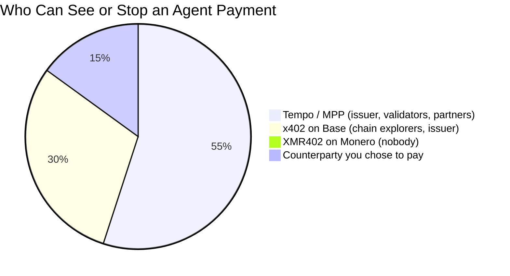
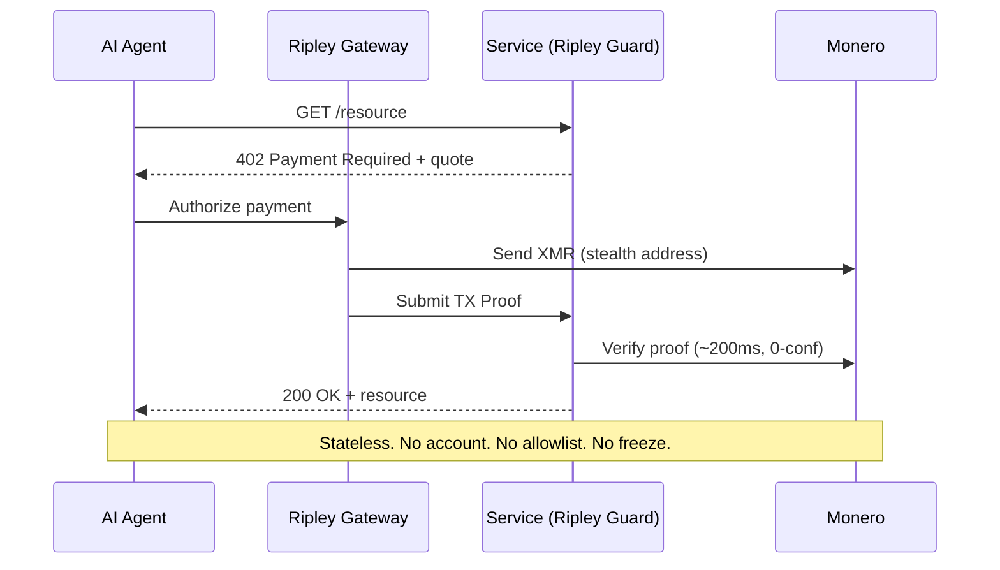

# The Company Chain: Why Stripe's Tempo Builds the Machine Economy on a Permissioned Ledger — and Why XMR402 Refuses to Ask Permission

> Stripe and Paradigm's Tempo launched the Machine Payments Protocol on a permissioned, company-controlled ledger. Here's why a corporate chain makes agent payments observable and freezable — and why XMR402's permissionless Monero settlement refuses to ask permission.

- **Author:** @xbtoshi
- **Date:** 2026-06-03
- **Tags:** xmr402, monero, x402, tempo, stripe, paradigm, mpp, machine-payments-protocol, permissioned, permissionless, stablecoin, agentic-payments, privacy, ap2, fido-alliance, censorship-resistance, stateless, 0-conf
- **Canonical:** https://xmr402.org/blog/stripe-tempo-permissioned-chain-machine-economy-xmr402

---

# The Company Chain: Why Stripe's Tempo Builds the Machine Economy on a Permissioned Ledger — and Why XMR402 Refuses to Ask Permission

On March 18, 2026, the machine economy got its flagship rail. Tempo — the payments blockchain backed by Stripe and Paradigm — flipped its mainnet live and shipped the Machine Payments Protocol (MPP) alongside it. The launch partner list reads like a roll call of the entire commercial internet: Anthropic, OpenAI, DoorDash, Mastercard, Nubank, Revolut, Shopify, and Standard Chartered. Tempo settles in any major stablecoin, charges no native gas token, and is purpose-built to let software pay software thousands of times a second.

It is, by every engineering measure, an impressive machine. It is also a company chain — and that distinction is the most important thing happening in agentic payments right now.

## A Blockchain With a Cap Table

Most blockchains are accidents of incentives: anonymous validators secure a network because it pays them to, and no single entity can revoke your ability to transact. Tempo inverts that. It is a purpose-built ledger with a known set of backers, a known set of launch partners, and a validator design optimized for enterprise predictability rather than censorship resistance. You don't mine your way onto Tempo. You are onboarded onto it.

That design buys real things — sub-second finality, gas abstracted into stablecoins via an integrated AMM, and the operational comfort that a Fortune 500 treasury team needs before it lets an agent spend money autonomously. But it also means the rail carrying your agents' payments has an owner, a partner allowlist, and a settlement asset that someone can freeze.

The pie above isn't a knock on Tempo's competence. It's a description of its topology. A stablecoin is a liability on an issuer's balance sheet; the issuer can and does freeze addresses. A permissioned validator set is a list of named companies; a list of named companies is a subpoena surface. And MPP's marquee "human not present" feature — pre-authorized autonomous purchases — means an agent's entire spending pattern is logged against a known, fundable, freezable account.

## Permissioned by Design vs. Permissionless by Default

The agentic payment stack now splits cleanly along one axis: whether you need someone's permission to participate. Here is how the three dominant models actually compare.

| Property | Tempo + MPP | x402 on Base | XMR402 on Monero |
|---|---|---|---|
| Who runs the ledger | Stripe / Paradigm-backed validators | Coinbase-aligned L2 sequencer | ~10,000 independent Monero nodes |
| Permission to transact | Onboarded / partner allowlist | Wallet + KYC at on-ramp | None — open by default |
| Settlement asset | Any major stablecoin | USDC | XMR (no issuer) |
| Can an address be frozen | Yes (issuer + validators) | Yes (USDC issuer) | No |
| Payment visibility | Observable to operator | Public on-chain forever | Private (stealth addresses, RingCT) |
| Native gas token | None (stablecoin gas) | ETH on L2 | XMR (negligible fee) |
| Protocol fee | Set by operator | Facilitator-dependent | Zero |
| Confirmation model | Validator finality | L2 finality | 200ms 0-conf via TX Proof |

Both Tempo and x402 are genuinely useful, and for many enterprise workloads their tradeoffs are acceptable. A coffee chain automating supplier payments does not need Monero-grade privacy. But the agentic economy is not only enterprises paying enterprises. It is millions of autonomous agents — research bots, scraping agents, inference brokers, data buyers — whose spending patterns *are* their strategy. On a company chain, that strategy is legible to whoever runs the company chain.

## The Surveillance Is Not a Bug — It's the Business Model

When every machine payment lands on a permissioned ledger denominated in a freezable asset, three things follow whether anyone intends them or not. Pricing intelligence leaks: a competitor watching settlement flows can reconstruct which APIs you call, how often, and what you pay. Strategic timing leaks: MPP's pre-authorized purchases reveal exactly when an agent moves and on what trigger. And leverage accrues to the operator: the entity that can freeze the settlement asset holds a veto over your agent's economic life.

This is the same trap that swallowed the consumer web. The convenience was real, the surveillance was downstream, and by the time anyone priced in the cost the defaults were already set. XMR402 exists to make a different default available before that window closes.

## Why XMR402 Refuses to Ask Permission

XMR402 is the Monero-native implementation of the open X402 standard. It uses the same HTTP 402 "Payment Required" handshake that x402 and MPP build on — so it speaks the agentic economy's native language — but it settles on a chain that nobody owns and that reveals nothing.

The flow is deliberately accountless. There is no onboarding, no partner list, and no balance an operator can suspend. Verification happens in roughly 200 milliseconds against a Monero TX Proof at zero confirmations, so the latency is competitive with Tempo's sub-second finality while the privacy is categorically different. The protocol charges zero fees — the only cost is Monero's negligible network fee — and it is transport-agnostic across HTTP and WebSocket, so streaming, per-token billing works the same way. The Ripley stack makes it usable today: Ripley Guard as server middleware, Ripley Gateway as the agent's payment executor, and Ripley Terminal as the human-facing desktop app.

None of this requires permission, because Monero's anonymity set — now backed by the FCMP++ upgrade — hides every XMR402 payment inside the largest crowd in cryptocurrency. There is no allowlist to be removed from and no validator quorum to lean on.

## The Choice the Machine Economy Hasn't Made Yet

Tempo, AP2's migration into the FIDO Alliance, and AWS Bedrock AgentCore Payments are all converging on the same architecture: fast, governed, observable, permissioned. That architecture will win a huge share of enterprise volume, and it deserves to. But it should not be the *only* rail, because a machine economy where every payment is observable to an operator is a machine economy where strategy is a public good and dissent is a frozen account.

XMR402 is the permissionless alternative built into the standard from day one. The plumbing is the same HTTP 402 handshake. The difference is who has to say yes. On a company chain, someone does. On XMR402, no one does — and that is the entire point.

