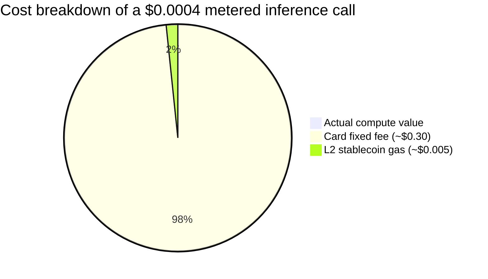
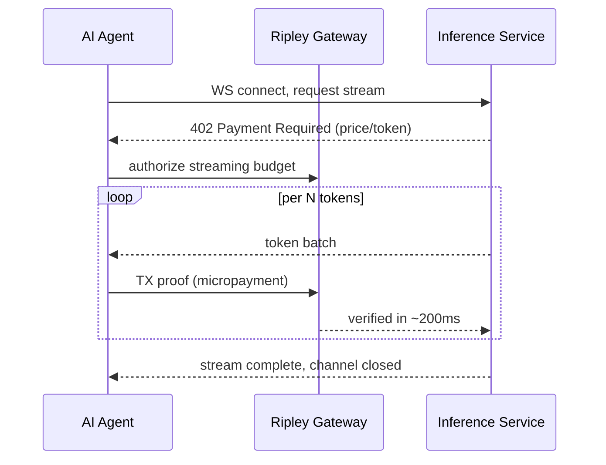

# The Sub-Cent Settlement Problem: Why Per-Token AI Billing Breaks Every Payment Rail Except XMR402

> Per-token AI billing pushes settlement below a cent — where card fees and even L2 gas dwarf the payment itself. Why XMR402's zero protocol fees, 200ms 0-conf and native WebSocket streaming are the only rail that closes the math.

- **Author:** @xbtoshi
- **Date:** 2026-05-31
- **Tags:** xmr402, monero, x402, per-token-billing, micropayments, llm-inference, metering, sub-cent, websocket, streaming-payments, agentic-payments, gas-fees, stablecoins, privacy, 0-conf
- **Canonical:** https://xmr402.org/blog/sub-cent-settlement-per-token-ai-billing-xmr402

---

# The Sub-Cent Settlement Problem: Why Per-Token AI Billing Breaks Every Payment Rail Except XMR402

In May 2026, the agentic economy quietly crossed a threshold nobody planned for. AWS shipped Bedrock AgentCore Payments, Fireblocks launched its Agentic Payments Suite and joined the x402 Foundation, and Cryptorefills wired x402 checkout into gift cards and eSIMs. The plumbing is arriving. But underneath all the announcements sits a unit-economics problem that no amount of enterprise tooling has solved: **AI billing is moving to the level of the individual token, and the individual token costs a fraction of a cent.**

A modern agent doesn't make one purchase. It makes hundreds of micro-decisions per conversation — a search here, a retrieval there, a model call, a tool invocation, a re-rank. Stanford's AI Index puts the collapse in inference cost at somewhere between 9x and 900x per year depending on workload. As the marginal cost of a token approaches zero, the *settlement* cost of paying for that token becomes the dominant expense. And that is where every existing rail quietly falls apart.

## The 30-Cent Floor and the Gas-Fee Tax

Card networks were never designed for this. A typical card transaction carries a fixed component near $0.30 plus a percentage. Trying to bill $0.0004 for a single inference through a card processor means the fee is **750x the value of the thing being sold**. You simply cannot meter a token on a card.

Crypto rails were supposed to fix this, and on paper they look close. A USDC transfer on Base in 2026 often settles for under a cent. But "under a cent" is not "free," and per-token billing is unforgiving about the difference. When the payload is worth $0.0004 and the network fee is $0.005, the fee is still **more than ten times the payment**. During congestion that ratio gets worse, not better. Layer-2 fees that look trivial against a $50 swap are catastrophic against a sub-cent meter reading.

The chart above is deliberately log-scaled in spirit: against a sub-cent payload, both the card fee and the L2 gas fee dwarf the thing you are actually buying. The protocol fee *is* the product. This is the structural reason x402's dollar volume fell roughly 77% from its November 2025 peak even as transaction counts climbed — the rails work technically, but the economics break the moment payments shrink to true machine scale.

## Why XMR402 Was Built for the Sub-Cent Regime

XMR402 is the Monero-native implementation of the open X402 standard. It uses the HTTP 402 Payment Required status code to negotiate payment inline, and it differs from stablecoin x402 in three ways that matter precisely at sub-cent scale:

First, **zero protocol fees**. XMR402 does not insert a percentage cut or a fixed per-call charge on top of the payment. The only cost is the underlying Monero network fee, which for the typical micropayment is a few thousandths of a cent — and Monero's dynamic block size and tail emission keep that floor structurally low rather than auction-spiking under load.

Second, **200ms 0-conf verification via Monero TX Proof**. A per-token meter cannot wait for block confirmation; it needs to release the next token now. XMR402 verifies a cryptographic transaction proof in roughly 200 milliseconds without trusting a third party, so settlement keeps pace with token generation.

Third, **transport-agnostic streaming**. The same protocol runs over HTTP and WebSocket. For a streaming LLM response, that means the meter and the payment channel live on the same socket — payment events interleave with token events instead of bolting a separate billing API onto the side.

## A Side-by-Side on Per-Token Metering

| Dimension | Card rails | x402 + USDC (L2) | XMR402 (Monero) |
|---|---|---|---|
| Fixed fee per call | ~$0.30 | ~$0.005 gas | ~$0.00001 net |
| Viable at $0.0004/token | No | Marginal | Yes |
| Settlement latency | seconds–days | block time | ~200ms 0-conf |
| Streaming over WebSocket | No | Add-on | Native |
| Per-token payment trail exposed | Issuer | Public chain | Private |
| Protocol take rate | % + fixed | 0% protocol, gas floor | 0% protocol |

The privacy row deserves emphasis. Per-token billing doesn't just create a payment; it creates a **behavioral telemetry stream**. Every metered call on a public chain leaks which model an agent queried, how often, in what bursts, and at what cost — a near-perfect reconstruction of the agent's reasoning workload, readable by any competitor with a block explorer. Monero's stealth addresses and confidential amounts mean the meter can run without publishing the agent's cognitive fingerprint to the world.

## The Quiet Inversion

The lesson of May 2026 is that the hard problem in agentic payments was never authorization or wallet UX — those are solvable with better tooling. The hard problem is **arithmetic**. When the price of intelligence falls faster than the price of moving money, the payment rail becomes the bottleneck, and any rail with a non-trivial floor prices itself out of the very market it was built to serve.

Per-token AI billing is the first mass-market use case where settlement cost, not compute cost, is the binding constraint. A rail with zero protocol fees, sub-millisecond-relative settlement, native streaming, and structural privacy isn't a nice-to-have in that world. It is the only thing that closes the math. That is the regime XMR402 was designed for — not the $50 swap, but the $0.0004 thought.
