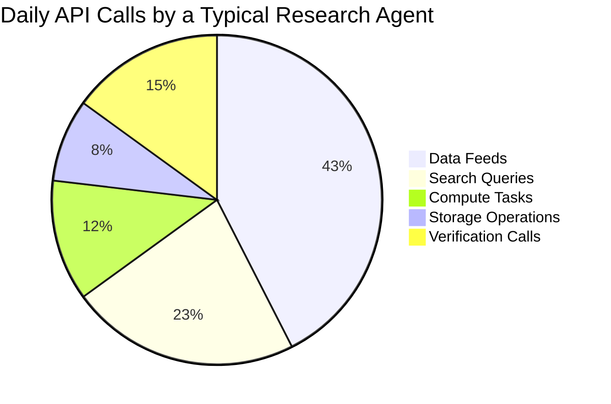
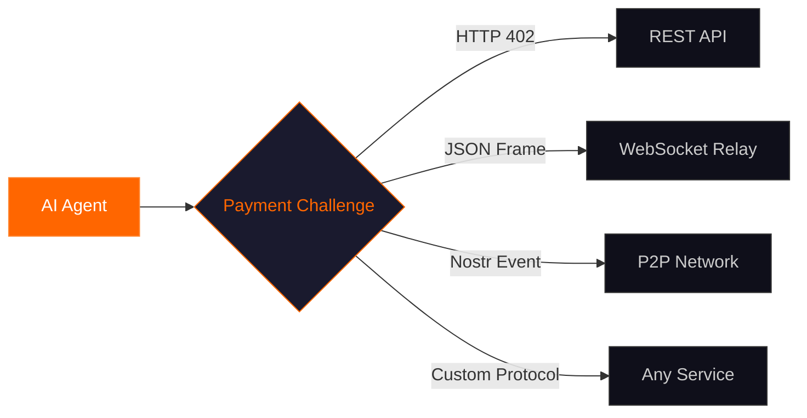

# Why XMR402 Matters Every Day: The Invisible Engine Behind the Machine Economy

> From morning news feeds to midnight batch jobs, XMR402 silently powers thousands of agent-to-service transactions every day. Here's why this stateless Monero payment primitive is becoming the backbone of the autonomous internet.

- **Author:** @xbtoshi
- **Date:** 2026-03-17
- **Tags:** XMR402, agentic-economy, daily-use, micropayments, Monero, machine-payments, privacy
- **Canonical:** https://xmr402.org/blog/why-xmr402-matters-every-day

---

## The Day in the Life of a Machine Payment

It's 6:00 AM. While you sleep, your research agent wakes up. It has a list of 47 data sources to query — market feeds, academic databases, weather APIs, satellite imagery endpoints. Each one charges between $0.0001 and $0.05 per request.

The agent doesn't have a credit card. It doesn't have an API key dashboard. It has a Monero wallet and the XMR402 protocol. By 6:14 AM, it has completed all 47 queries, paid for each one in under 200 milliseconds, and compiled a briefing document waiting in your inbox.

This isn't science fiction. This is what XMR402 enables today.

## The Scale Nobody Talks About

The conversation around AI payments usually focuses on large transactions — buying compute clusters, licensing datasets, or procuring specialized services. But the real revolution is happening at the micro-scale.

Consider how many API calls a single autonomous agent makes in a day:

That's roughly 800 API calls per agent per day. Now multiply that by the estimated 4.2 million active AI agents operating globally in March 2026. We're looking at over **3 billion machine-to-service interactions daily** — and most of them need a payment layer.

Traditional payment rails simply cannot handle this volume at this granularity. Credit card processors charge minimum fees that make sub-cent transactions impossible. Subscription models force agents into rigid pricing tiers that don't match their usage patterns. API key systems require human administrators to manage billing dashboards.

XMR402 handles all of this with a single HTTP header exchange.

## Five Reasons XMR402 Matters Every Day

### 1. Zero Friction Onboarding

Every payment system in existence today requires some form of enrollment: creating an account, verifying an identity, linking a payment method, or generating API credentials.

XMR402 requires exactly zero onboarding. An agent with a Monero wallet can pay for any XMR402-gated service the instant it's deployed. There is no signup form. There is no approval process. There is no waiting period.

For services that spin up thousands of ephemeral agents (task-specific workers that exist for minutes or hours), this is transformative. Each agent can independently acquire resources without inheriting credentials from a parent system.

### 2. Privacy as Operational Security

When an agent pays for an API call, it reveals information. On transparent blockchains like Ethereum, that information includes the agent's wallet address, its full transaction history, and its current balance. Competitors, adversaries, or surveillance systems can monitor every payment.

Monero's ring signatures, stealth addresses, and confidential transactions ensure that XMR402 payments reveal nothing beyond the fact that a valid payment was made. The server verifies the TX Proof and grants access — without learning anything about the payer.

This isn't paranoia. It's the same reason businesses don't publish their vendor invoices. Financial privacy is operational security.

### 3. The Speed of Thought

An agent making 800 API calls per day cannot afford to wait 10 minutes for block confirmations on each one. Even 10 seconds would create unacceptable latency in agentic workflows.

XMR402's 0-conf verification completes in approximately 200 milliseconds:

```mermaid
gantt
    title XMR402 Payment Verification Timeline
    dateFormat X
    axisFormat %L ms
    section Payment Flow
    Agent sends TX           :a1, 0, 50
    Mempool propagation      :a2, 50, 100
    Server check_tx_proof    :a3, 100, 180
    Access granted           :a4, 180, 200
```

For micro-payments (the dominant use case in the agentic economy), the economics of double-spending make 0-conf attacks impractical. The cost of attempting a double-spend exceeds the value of a single API call by orders of magnitude.

### 4. Stateless Architecture Scales Infinitely

Most payment systems require servers to maintain state: order IDs, session tokens, invoice databases, pending payment records. This state creates bottlenecks, points of failure, and scaling limits.

XMR402's Guard middleware is completely stateless. It computes an HMAC-SHA256 nonce from the request payload and a server secret, issues it as a challenge, and verifies the returning proof by recalculating the same hash. No database writes. No session storage. No cleanup jobs.

This means an XMR402-gated API can scale horizontally without any coordination between nodes. Add a load balancer, spin up 100 instances, and each one independently verifies payments using nothing but math and a Monero node RPC.

### 5. Transport Agnostic Everywhere

Modern agents don't just make HTTP requests. They communicate over WebSockets, connect to P2P relays, and interact through message queues. A payment protocol locked to HTTP headers would miss half the agent economy.

XMR402 v2.0's transport-agnostic design means the same payment challenge-response works over any bidirectional channel:

## The Competitive Landscape

XMR402 isn't the only protocol targeting machine payments. Coinbase's x402 uses stablecoins on Base and Ethereum. OpenAI and Stripe have the Agent Commerce Protocol (ACP). Google and Shopify are building the Unified Commerce Protocol (UCP).

But XMR402 occupies a unique position in this landscape:

| Feature | XMR402 | x402 (Coinbase) | ACP (OpenAI/Stripe) |
|---------|--------|-----------------|---------------------|
| Privacy | Full (ring signatures) | None (transparent chain) | None (traditional rails) |
| Identity Required | No | Wallet only | Full KYC |
| Verification Speed | ~200ms (0-conf) | ~200ms (EIP-712) | Seconds (Stripe API) |
| Protocol Fees | Zero | Zero | Stripe fees |
| Censorship Resistance | High | Low (USDC freeze) | None |
| Transport | HTTP + WS + Any | HTTP only | HTTP only |
| State Requirements | Stateless | Facilitator state | Full state |

The key differentiator is simple: XMR402 is the only protocol where neither the payer's identity nor their transaction history is exposed. For agents operating in competitive environments, this isn't a nice-to-have — it's a hard requirement.

## Real-World Daily Patterns

Let's trace how XMR402 powers a typical 24-hour cycle:

**Dawn (05:00–08:00)** — Batch processing agents wake up across time zones. Research bots query overnight data accumulations. Market analysis agents pull pre-market feeds. Each interaction is a micro-payment, settled instantly.

**Morning (08:00–12:00)** — Interactive agents activate alongside their human operators. Code review bots purchase static analysis API calls. Customer service agents buy sentiment analysis and translation services. Meeting prep agents access calendar APIs and document repositories.

**Afternoon (12:00–18:00)** — Peak agent activity. Content generation agents pay for image generation APIs, fact-checking services, and plagiarism detection. Trading agents execute high-frequency data purchases across dozens of market feeds simultaneously.

**Evening (18:00–00:00)** — Monitoring agents take over. Infrastructure bots purchase health-check endpoints. Security agents pay for threat intelligence feeds. Backup agents acquire cloud storage access.

**Night (00:00–05:00)** — Maintenance and optimization. Agents purchase compute for model fine-tuning. Data pipeline agents pay for ETL services. The cycle prepares to repeat.

Every single one of these transactions can be an XMR402 payment: instant, private, and requiring zero human intervention.

## Getting Started Today

XMR402 is open source and free to implement. To gate your API behind XMR402 payments:

1. Install the Ripley Guard middleware into your HTTP server or WebSocket handler
2. Configure your Monero node RPC endpoint and receiving subaddress
3. Set a price per endpoint or per resource
4. Deploy — your API now accepts autonomous agent payments

To enable your agent to pay through XMR402:

1. Deploy Ripley Gateway alongside your agent
2. Fund the Gateway's Monero wallet
3. Configure the agent to pipe 402 responses through the Gateway
4. The agent now pays for services automatically

No dashboards. No billing cycles. No invoicing. Just math, cryptography, and the Monero network.

## The Bigger Picture

XMR402 matters every day because the machine economy operates every day. It doesn't sleep, doesn't take weekends, and doesn't observe holidays. Autonomous agents are running 24/7, and they need a payment primitive that matches their operational tempo.

The internet was designed with a payment code — HTTP 402 — built into its foundation. For 25 years, that code sat unused. XMR402 activates it with the one currency built for machines: private, fast, and permissionless.

Every day, more agents come online. Every day, more services gate their APIs. Every day, the invisible economy grows. And every day, XMR402 is there — settling transactions in 200 milliseconds, asking nothing of anyone, and keeping the machine economy running.
