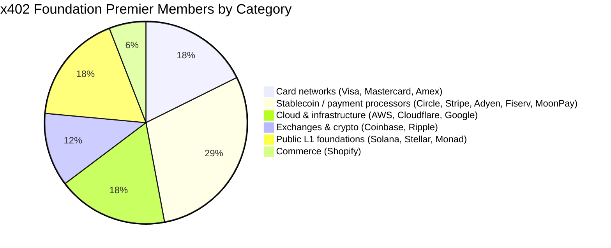
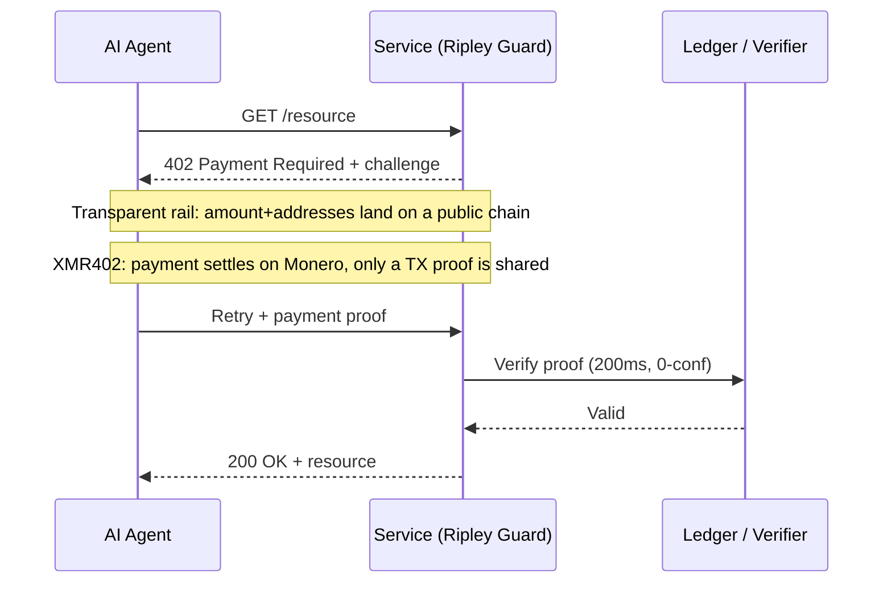

# Forty Members, One Ledger: Why the x402 Foundation's Neutral Governance Can't Deliver Neutral Privacy

> The x402 Foundation launched July 14 with 40 members under the Linux Foundation. But neutral governance is not neutral privacy — and only XMR402 settles agent payments where no one is watching.

- **Author:** @xbtoshi
- **Date:** 2026-07-20
- **Tags:** xmr402, monero, x402, x402-foundation, linux-foundation, agentic-payments, governance, privacy, stablecoin, visa, mastercard, stripe, coinbase, transparent-ledger, fcmp, anonymity-set, tx-proof, stateless, machine-payments, ripley-guard
- **Canonical:** https://xmr402.org/blog/x402-foundation-neutral-governance-transparent-ledger-xmr402

---

# Forty Members, One Ledger: Why the x402 Foundation's Neutral Governance Can't Deliver Neutral Privacy

On July 14, 2026, the x402 protocol grew up. The Linux Foundation announced the operational launch of the **x402 Foundation** — a vendor-neutral, open-governance body with 40 member organizations chartered to steward the standard that lets AI agents pay over HTTP. The premier roster is staggering: Adyen, Amazon Web Services, American Express, Circle, Cloudflare, Coinbase, Fiserv, Google, Mastercard, Monad Foundation, MoonPay, Ripple, Shopify, Solana Foundation, Stellar Development Foundation, Stripe, and Visa.

For a protocol that began as a Coinbase side project in May 2025, this is legitimacy at scale. Neutral governance under the Linux Foundation is genuinely good news for interoperability. But a quiet substitution is happening in the coverage, and it matters: **governance neutrality is being presented as if it were payment neutrality.** They are not the same thing. A standards body can be perfectly even-handed about *who* gets to shape a protocol while the protocol itself remains structurally incapable of keeping an agent's payments private.

That gap is the whole story.

## What "Neutral" Actually Governs

Open governance means no single company owns the specification. Coinbase contributed x402, but going forward its evolution is decided in the open, and every premier member gets a seat. That is a real and worthwhile property. It solves a political problem: the fear that one vendor could capture the rails the machine economy runs on.

What it does not solve is a data problem. The x402 core is a transport convention — an HTTP 402 challenge, a payment payload, a verification step. The privacy characteristics of any given payment come almost entirely from the *settlement layer* underneath, not from the governance charter above. And the settlement layers the premier members bring to the table are, without exception, transparent-by-default or identity-bound: card networks tied to your legal name, stablecoins on public ledgers where every transfer is a permanent line item, cloud providers whose business model is knowing what moved where.

You can govern a transparent ledger through the most balanced committee in the world. It is still a transparent ledger.

Look at the composition. Fourteen of the seventeen premier members are, at their core, entities whose value depends on *seeing* transactions — pricing risk on them, clearing them, indexing them, or settling them on a chain anyone can read. This is not a criticism of any single member; it is an observation about incentives. A governance body assembled from institutions that monetize transaction visibility is not going to steer the default toward transaction invisibility. It has no reason to.

## Transparent by Default Is a Design Choice, Not a Law of Nature

Consider what actually happens when an agent pays for a service across a mainstream x402 rail settled in a public stablecoin. The amount, the timing, the paying address, and the receiving address are all written to a ledger that never forgets. Chain-analytics firms already reconstruct behavior from exactly this data. When the payer is an autonomous agent making thousands of small purchases a day, the trail is not just a record of one transaction — it is a high-resolution map of a strategy: which APIs an agent depends on, how often it calls them, what a workload costs, when demand spikes.

The mechanics of x402 are elegant regardless of rail. The difference is what leaks. On a transparent settlement layer, the verifier learns — and the world learns — far more than "this agent paid." On a privacy-preserving layer, the verifier learns exactly one thing: the payment is valid.

## Where XMR402 Sits

XMR402 is the Monero-native implementation of the same open x402 idea. It speaks the identical HTTP 402 grammar, so it is compatible with the standard the Foundation now stewards. What changes is the substrate. Settlement happens on Monero, and the server is convinced not by watching a public ledger but by a **Monero transaction proof** — a cryptographic receipt that proves a specific payment was made to a specific address, verifiable in roughly 200 milliseconds at zero confirmations, without exposing amounts or a spendable history to any third party.

This is not a bolt-on privacy feature. It is the default, and it inherits Monero's July-2026 posture: after the FCMP++ upgrade, every spend is proven against an anonymity set exceeding 150 million outputs, up from a ring of 16. The privacy is not a policy that a committee could vote to weaken next quarter; it is a property of the cryptography.

| Dimension | x402 Foundation stack (typical rails) | XMR402 |
|---|---|---|
| Governance | 40-member Linux Foundation body | Open protocol, Monero-native |
| Default settlement | Public chains / card networks | Monero (private by default) |
| What the verifier sees | Amounts, addresses, timing | Only "payment valid" (TX proof) |
| Anonymity set | Address-level transparency | 150M+ outputs (FCMP++) |
| Protocol fees | Varies by rail / processor | Zero |
| Confirmation model | Chain-dependent | 200ms 0-conf via TX proof |
| Data exhaust | Permanent public trail | None beyond the proof |

## Neutrality Is Necessary, Not Sufficient

None of this diminishes what the x402 Foundation accomplished. A neutral standard is a precondition for a healthy machine economy, and forty of the most important companies in payments agreeing to build in the open is a genuine milestone. The point is narrower and sharper: neutrality of governance and neutrality of *observation* are different guarantees, and only one of them was launched on July 14.

An agent that pays a thousand times a day does not need a committee to promise it will be treated fairly. It needs a rail on which its payments are not a dataset. The Foundation gives the ecosystem the first. XMR402 exists to give it the second — the same 402 handshake, settled somewhere no one is watching.

The internet already learned this lesson once. We did not make the web trustworthy by forming a committee to govern who could read the traffic. We made it trustworthy by encrypting the traffic so the question no longer mattered. Payment privacy for agents is the same move, one layer down. Governance decides who steers. Cryptography decides who sees. For a machine economy running millions of payments a day, the second question is the one that keeps you free.
