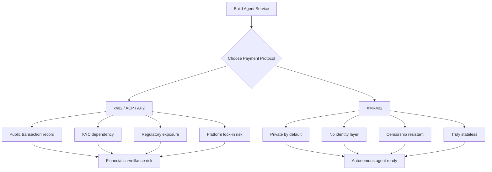
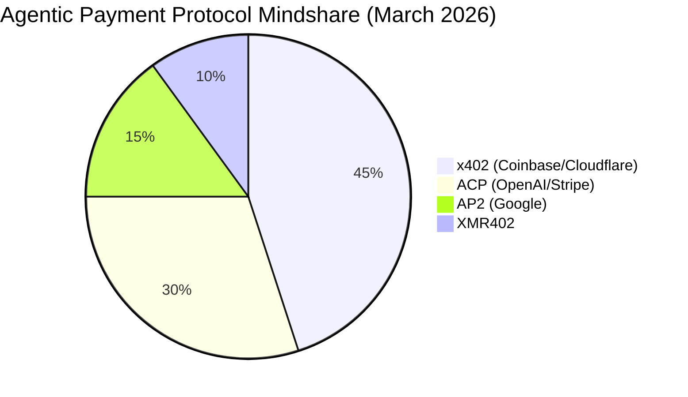

# XMR402 vs. The Agentic Payment Stack: A Protocol-by-Protocol Breakdown

> The race for agentic payment dominance is on. x402 (Coinbase), ACP (OpenAI/Stripe), and AP2 (Google) are all competing to own AI-native payments. Here's how XMR402 compares — and why privacy and statelessness change everything.

- **Author:** @xbtoshi
- **Date:** 2026-03-18
- **Tags:** protocol-comparison, x402, ACP, agentic-payments, Monero, XMR402, privacy, stablecoins
- **Canonical:** https://xmr402.org/blog/xmr402-vs-agentic-payment-protocols

---

## The Protocol Wars Have Begun

In early 2026, something remarkable happened: three of the most powerful companies in tech simultaneously announced competing standards for agentic payments. Coinbase doubled down on x402 with the launch of the x402 Foundation alongside Cloudflare. OpenAI and Stripe co-released the Agentic Commerce Protocol (ACP), powering ChatGPT's instant checkout. Google introduced its own Agentic Payments Protocol (AP2), which now integrates with x402 as a stablecoin layer.

The message is clear: AI agent payments are the next frontier of internet infrastructure. Every major platform wants to own that layer.

But these protocols were not all built the same way, for the same agents, or with the same values. This post is a clear-eyed comparison of the four main contenders — and an honest assessment of where XMR402 fits in a world suddenly crowded with standards.

## The Four Protocols at a Glance

### x402 (Coinbase + Cloudflare)

x402 uses HTTP 402 Payment Required as its transport mechanism — the same idea as XMR402, but with a critical difference: settlement happens on Ethereum-compatible chains using USDC and other stablecoins. The Coinbase/Cloudflare x402 Foundation is pushing to make this the universal standard for agentic commerce, and they have significant distribution advantages: Coinbase's developer platform, Cloudflare's global CDN, and Anthropic MCP integration are all onboard.

**What it solves:** Micropayments between agents and services using programmable stablecoins. Relatively low fees vs. traditional card rails. Developer-friendly libraries.

**What it doesn't solve:** KYC is embedded in USDC and Base chain — every wallet that holds USDC is subject to Coinbase/Circle's blacklisting authority. Public ledger means all agent transactions are permanently visible and traceable. Gas fees on Ethereum mainnet remain a ceiling on true micropayments. Not truly stateless — relies on blockchain state.

### ACP — Agentic Commerce Protocol (OpenAI + Stripe)

ACP is architecturally different from x402 and XMR402. It was designed for *human-initiated* commerce through AI agents — think ChatGPT helping you buy sneakers, not a bot autonomously purchasing API tokens. ACP introduces the Shared Payment Token (SPT): after a human authorizes payment via Stripe/Link, a token is issued that can be passed to merchants without exposing raw card credentials.

**What it solves:** Consumer checkout inside AI interfaces. Works with existing Stripe merchants. Reduces friction for human buyers using AI shopping assistants.

**What it doesn't solve:** Completely dependent on Stripe as the payment processor and identity intermediary. KYC is mandatory — you need a human credit card or bank account. Useless for autonomous agent-to-agent payments where no human is present to authorize. Cannot support true machine-to-machine transactions.

### AP2 — Agentic Payments Protocol (Google)

Google's AP2 is designed as an orchestration layer for complex agentic workflows where payments may need approval chains, budgets, and policy enforcement. It integrates with x402 as its stablecoin payment layer, so it inherits x402's architecture along with its limitations.

**What it solves:** Enterprise-grade payment authorization flows for agents operating within organizational policies. Budget controls and approval chains for autonomous spending.

**What it doesn't solve:** Privacy — all transactions are visible on-chain. Still requires human-controlled wallets with KYC. Not designed for fully autonomous, permission-free operation. Complexity overhead for simple pay-per-request use cases.

### XMR402 (Monero-native)

XMR402 implements the same HTTP 402 mechanism but settles on Monero — the only major cryptocurrency with mandatory, protocol-level privacy. This is not an optional privacy feature or a compliance checkbox. Every XMR402 transaction uses ring signatures, stealth addresses, and RingCT by default. There is no public ledger of agent transactions. There is no blacklist authority. There is no KYC layer in the protocol.

**What it solves:** Fully autonomous, privacy-preserving agent payments with 200ms 0-conf verification via TX Proof. No accounts, no identities, no state. An agent deployed anywhere can pay for anything without operator exposure.

**What it doesn't solve:** Monero's smaller ecosystem vs. USDC's liquidity. No native fiat on-ramp (agents need XMR to start). Integration complexity is higher than Stripe-native solutions for consumer use cases.

## Protocol Comparison Table

| Feature | XMR402 | x402 (Coinbase) | ACP (OpenAI/Stripe) | AP2 (Google) |
|---|---|---|---|---|
| **Privacy** | Full (RingCT, ring sigs) | None (public chain) | None (Stripe KYC) | None (public chain) |
| **KYC Required** | No | USDC wallet KYC | Credit card required | Wallet KYC |
| **Human needed** | No | No | Yes | Partial |
| **Verification speed** | ~200ms (0-conf) | Block confirmation | API round-trip | API round-trip |
| **Protocol fees** | 0 | Gas fees | Stripe % fees | Gas fees |
| **Blacklist risk** | None | USDC blacklistable | Chargeback risk | USDC blacklistable |
| **Stateless** | Yes | No (chain state) | No (session state) | No (chain + session) |
| **Agent-to-agent** | Native | Possible | Not designed for | Possible via x402 |
| **Transport** | HTTP + WebSocket | HTTP | HTTP | HTTP |
| **Censorship resistant** | Yes | No | No | No |
| **Open standard** | Yes | Yes (Apache 2.0) | Yes (Apache 2.0) | Yes |

## The Fundamental Design Question

Look at the table above and you'll notice something: XMR402 is the only protocol in which an agent can operate **completely without a human-controlled identity in the loop**. Every other protocol has at least one dependency on a KYC'd entity — a USDC wallet, a Stripe account, a credit card.

This matters because of how autonomous agents actually work in production. An agent doesn't have a boss who pre-authorizes each payment. It doesn't have a human co-signer reviewing its Stripe dashboard. An agent decides to purchase an API call, makes the payment, and retrieves the resource — all in a sub-second window.

ACP and AP2 were explicitly designed for *delegated* human spending. They're excellent for the "AI shopping assistant" use case. But they're architecturally inappropriate for fully autonomous, unattended agent operation.

x402 comes closer to the autonomous ideal — an agent can hold a USDC wallet and spend without per-transaction human approval. But every USDC transaction is permanently recorded on a public chain, and every USDC wallet is subject to Circle's blacklisting authority. In March 2026, Circle and Coinbase have already demonstrated their willingness to freeze assets at regulatory request. An agent operating on XMR402 has no such exposure.

## Why the Protocol Race Matters for Developers

The proliferation of competing standards isn't just an academic concern. Developers building agent-powered services today face a genuine choice: which payment primitive do you build on?

The choice has long-tail consequences:

Building on a KYC'd payment stack today means your autonomous agent service inherits those requirements. Your agents can only transact with agents that also have KYC'd wallets. Your transaction history is permanently public. Your service can be cut off by a stablecoin issuer without notice.

Building on XMR402 means your service is accessible to any agent with XMR — which requires no identity, no account, and no prior relationship.

## Market Share and Adoption Reality

In terms of corporate mindshare and press coverage, XMR402 is a newcomer against giants. x402 has Coinbase's distribution machine, Cloudflare's infrastructure, and Anthropic MCP integration. ACP has ChatGPT's hundreds of millions of users as a built-in distribution channel.

But mindshare and actual autonomous agent volume are different metrics. Coinbase's own data shows x402 processes approximately $28,000 in daily volume as of March 2026 — much of it test transactions. The agentic payment economy is still nascent. The protocol that wins long-term won't necessarily be the one with the biggest press launch.

It will be the one that autonomous agents can actually use — without asking permission.

## The Privacy Argument That Won't Go Away

Every major internet platform that has accumulated financial transaction data has eventually used it for competitive advantage, regulatory leverage, or both. Visa and Mastercard sell merchant behavior data. Google monetizes payment intent signals. Stripe's fraud scoring creates financial profiles of every merchant and consumer in its network.

Public blockchain payment records are even more exposed: they're permanent, immutable, and queryable by anyone.

As the agentic economy scales — and it will scale — agent transaction data will become extraordinarily valuable intelligence. Which APIs does a company's agents use? How much do they spend? What services do they purchase at 2am? This is operational intelligence that reveals competitive strategy, capability development, and business health.

XMR402 is the only protocol that makes this data invisible by default. Not by policy, not by terms of service, but by mathematics.

## Interoperability and the Future

It's likely that no single protocol wins outright. The agentic payment landscape will look more like the messaging landscape: multiple protocols coexisting, with bridges and adapters between them. x402 and XMR402 share the same HTTP 402 mechanism, which means bridging between them is architecturally natural — an agent could fall back to XMR402 when it needs privacy, and use x402 when interoperating with Coinbase-native services.

The XMR402 Ripley stack — Guard, Gateway, and Terminal — is already transport-agnostic and can operate alongside other protocols without conflict.

The real question isn't which protocol wins the press cycle. It's which protocol autonomous agents can use when no human is watching, when no identity is available, and when privacy is not optional.

For that use case, the answer is already clear.
