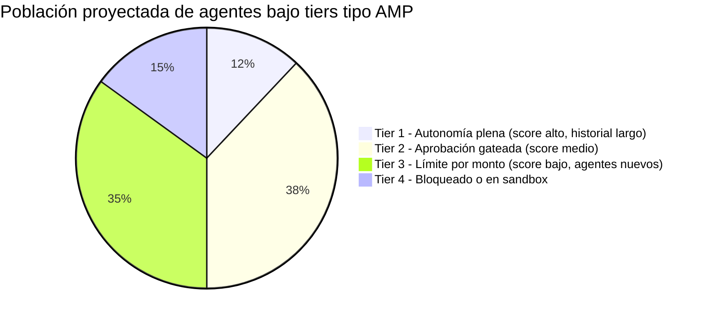
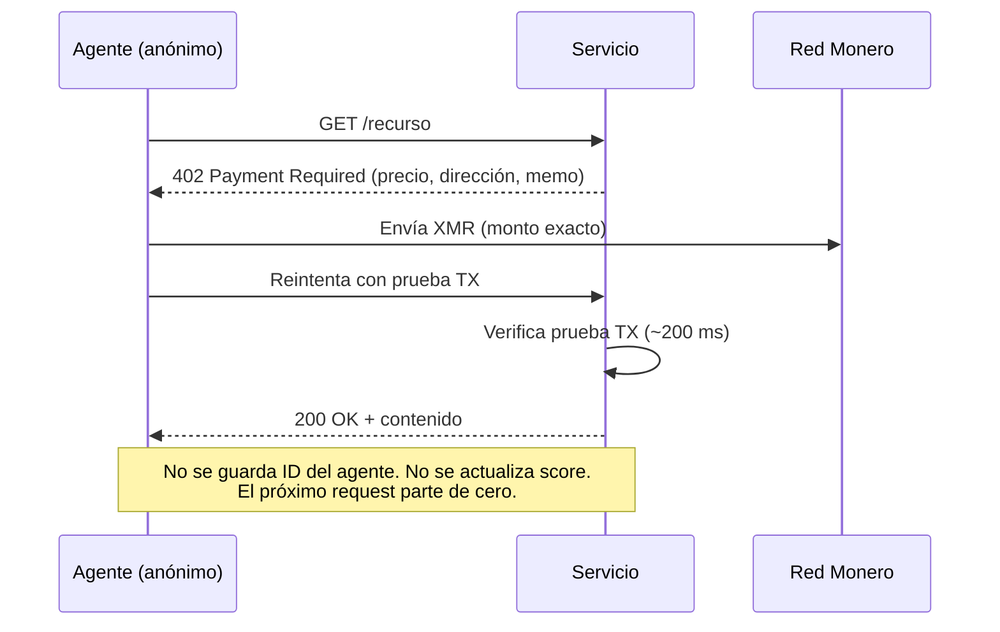
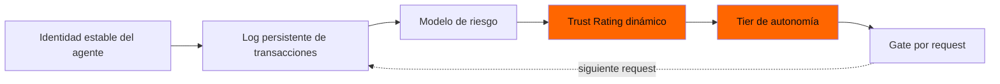

# El score crediticio para agentes: cómo el AMP de Ant clasifica a cada agente de IA — y por qué XMR402 se niega a rankear

> El nuevo Agentic Mobile Protocol (AMP) de Ant International incluye un Agent Trust Rating: un score dinámico que decide cuánta autonomía recibe cada agente de IA. Analizamos por qué es un score crediticio para máquinas, y por qué el diseño stateless de XMR402 es estructuralmente incapaz de producir uno.

- **Author:** @xbtoshi
- **Date:** 2026-05-29
- **Tags:** xmr402, monero, amp, ant-international, agent-trust-rating, kya, credit-score, stateless, agentic-payments, reputation, x402, alipay
- **Canonical:** https://xmr402.org/blog/agent-trust-rating-credit-score-xmr402

---

## El score crediticio para agentes: cómo el AMP de Ant clasifica a cada agente de IA — y por qué XMR402 se niega a rankear

El 27 de abril de 2026, Ant International anunció el Agentic Mobile Protocol (AMP) en su foro MoMents 2026 en Kuala Lumpur, presentado como el primer framework de pagos para agentes pensado para wallets móviles, super-apps y wearables. El número clave es contundente: AMP se integra en la red Alipay+, que ya alcanza **1.800 millones de cuentas de usuario y 150 millones de comercios** vía más de 40 wallets asociados. La narrativa es open-source, mobile-first y globalmente conectada.

La misma narrativa es, sin levantar la voz, el mayor sistema de vinculación de reputación jamás propuesto para software autónomo.

AMP llega con dos componentes entrelazados. El primero es **Know Your Agent (KYA)**: una capa de identidad digital que certifica las capacidades autorizadas de cada agente. El segundo — y el que merece análisis propio — es el propietario **Agent Trust Rating**: un score dinámico de gestión de riesgo que decide si un agente es "confiable" y, lo crucial, *cuánta autonomía recibe*. La cobertura mediática lo describió como una función de seguridad. Sostenemos que es un score crediticio para máquinas, que hereda todas las patologías que el scoring crediticio trajo a las personas: opacidad, monopolio, deriva y gatekeeping disfrazado de gestión de riesgo.

XMR402 — la implementación nativa en Monero del estándar abierto X402 — fue diseñado antes de que existieran estos sistemas, y su arquitectura stateless es estructuralmente incapaz de producir un trust rating. Esa es la característica, no una limitación.

### Qué hace en la práctica un Trust Rating dinámico

Un trust rating no es un chequeo único. Es un puntaje móvil recalculado en cada transacción, cada vinculación de dispositivo, cada interacción con una contraparte, cada disputa. Para producir un score estable, el sistema debe:

1. **Identificar al agente de forma persistente** entre sesiones, dispositivos y comercios.
2. **Loguear cada transacción** con entradas atribuibles (ID del agente, principal, comercio, monto, hora, resultado).
3. **Reevaluar el score** contra un modelo que ni el agente ni su principal pueden ver.
4. **Gatear la siguiente transacción** según el tier — agentes con score alto actúan autónomamente, los de score bajo requieren aprobación humana o quedan bloqueados.

Cada punto, por separado, es razonable. Apilados producen una autoridad permanente, opaca y administrada centralmente que decide cada mañana qué agentes pueden actuar en la economía. Los materiales de prensa de AMP destacan una reducción del 50% en los pasos de vinculación y una garantía de devolución frente a tomas de cuenta — ambas funciones requieren exactamente este libro mayor persistente de identidad de agente para existir.

### La analogía con el score crediticio no es retórica

La estructura es idéntica. La tabla siguiente mapea las patologías del crédito al consumidor sobre el Agent Trust Rating.

| Score crediticio al consumidor | Agent Trust Rating | Efecto en la economía de agentes |
|---|---|---|
| FICO o equivalente es un modelo privado único | El modelo de rating de AMP es propietario | Los agentes no pueden auditar por qué los limitan |
| El score persiste entre instituciones | KYA fija la identidad del agente entre wallets, comercios, dispositivos | Una mala interacción con un comercio sigue al agente a todas partes |
| El score mejora con conductas que la oficina prefiere | El score mejora con conductas que el modelo prefiere | Los agentes convergen a lo que el modelo premia |
| Nuevos entrantes tienen archivo escaso y pagan más | Los agentes nuevos arrancan sin confianza y requieren aprobación humana | Alto costo de capital para arrancar un agente autónomo |
| Las oficinas monetizan el dataset | El emisor del rating monetiza el dataset | Los datos conductuales de los agentes se vuelven un commodity |
| Las disputas son lentas y opacas | Las disputas del rating serán lentas y opacas | El daño reputacional se acumula antes de poder apelarse |

Nada de esto es especulación. Son las externalidades documentadas de todo sistema de reputación que los humanos hemos construido — ahora aplicadas a software que opera sobre millones de micro-decisiones al día.

### El problema de la distribución

En el momento en que existe un gate de autonomía, la autonomía misma se vuelve un recurso estratificado. Los umbrales exactos no se publican, pero la forma es predecible: una pequeña porción de agentes establecidos podrá actuar con plena autonomía, una franja media amplia enfrentará prompts de aprobación para acciones no triviales, y una cola de agentes nuevos o marginales quedará funcionalmente bloqueada de cualquier cosa significativa.

Las cuotas son ilustrativas, el principio no. Cualquier sistema de riesgo dinámico que ajuste autonomía por score produce esta estratificación por construcción. Las plataformas que emiten el score se sientan arriba del stack; sus agentes preferidos — construidos con sus SDKs, pagando sus fees, observados por su telemetría — escalan tiers más rápido. Los agentes independientes y frameworks open-source arrancan abajo y pagan renta para subir.

### Qué significa realmente "stateless" en este contexto

XMR402 no tiene, y estructuralmente no puede tener, un Agent Trust Rating. Cada request sigue el mismo flujo: el servidor devuelve HTTP 402, el agente paga el monto exacto en Monero, el servidor verifica la prueba de transacción en ~200 ms, y el request se cumple. No hay identidad de agente persistente, no hay enlace entre sesiones, no hay log de conducta reportado por comercios, y no hay modelo de scoring que actualizar.

No hay tier que perder, no hay reputación que reparar, y no hay emisor de rating juntando un dataset conductual. La privacidad no es un agregado: es la ausencia de la capa de almacenamiento en la que otros protocolos se apoyan.

Hay una consecuencia de segundo orden que rara vez se enuncia: **la liquidación stateless es el único diseño que le da a un agente nuevo el mismo estatus económico que a uno establecido**. Bajo AMP, un agente open-source recién creado debe acumular historial antes de transar autónomamente con caps significativos. Bajo XMR402 paga el mismo monto que un agente con un año, en la misma ventana de tiempo, con la misma probabilidad de éxito. El protocolo no sabe qué edad tiene y no lo necesita saber.

### Qué hace bien AMP y dónde se vuelve trampa

Vale ser precisos. AMP resuelve problemas reales en los que x402 tropezó a la vista de todos. La reducción del 50% en pasos de vinculación es significativa. Una garantía de devolución frente a tomas de cuenta es una función legítima para wallets con principal humano. Los form factors mobile-first — smartwatches, gafas AR, sistemas vehiculares — son donde mucha actividad de agentes realmente se originará.

La trampa es que las tres se lograron agregando estado, el estado debió atarse a una identidad de agente estable, y existida esa identidad alguien la puntúa. Agent Trust Rating no es una decisión separada que Ant tomó por casualidad; es lo que el resto del diseño obliga a que exista.

Una vez dentro de ese loop, cada transacción también es input del score que gatea la siguiente transacción. No hay salida del loop salvo no entrar.

### La conclusión práctica

Si construyes agentes autónomos en 2026, el protocolo que elijas también es el modelo de gobernanza que aceptas. AMP te da alcance móvil y recurso, a cambio de un score reputacional que no controlas. x402 te da rieles stablecoin y soporte de ecosistema, a cambio de identidad pública on-chain. XMR402 te da micropagos stateless y privados, a cambio de mecanismos de recurso que no caben dentro del protocolo — viven en la capa de aplicación, donde tú los diseñas.

La versión honesta del debate no es "qué protocolo es mejor". Es "qué tipo de economía de agentes quieres estar habitando dentro de cinco años". Una en la que un puñado de emisores de rating decide qué agentes pueden actuar, o una en la que cualquier agente que pueda pagar la tarifa transa en condiciones iguales, sin dejar un registro permanente. XMR402 está construido para la segunda.

