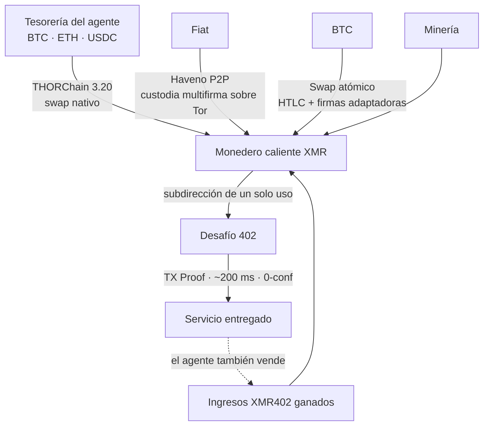
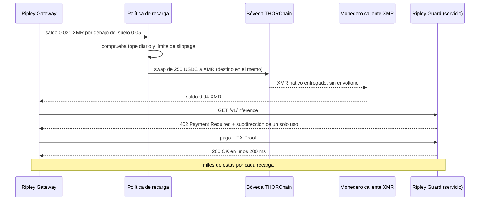

# El problema de la recarga: cómo se financian los agentes XMR402 cuando ningún exchange quiere listar su dinero

> La objeción más fuerte a XMR402 nunca fue criptográfica: era «de dónde saca el agente el XMR». Los deslistados golpean al exchange, pero el exchange no está en el bucle de pago. Los swaps nativos de XMR de THORChain 3.20, del 25 de agosto de 2026, convirtieron el último paso con forma humana en una llamada programable.

- **Author:** @xbtoshi
- **Date:** 2026-09-08
- **Tags:** xmr402, monero, x402, thorchain, thorchain-3-20, native-swaps, delisting, mica, amlr, fatf-travel-rule, kraken, agent-treasury, wallet-funding, refill-policy, atomic-swaps, haveno, no-kyc, non-custodial, ripley-gateway, ripley-guard, tx-proof, fcmp, stateless, agentic-payments, 0-conf, circular-economy
- **Canonical:** https://xmr402.org/blog/agent-wallet-refill-thorchain-delistings-xmr402

---

# El problema de la recarga: cómo se financian los agentes XMR402 cuando ningún exchange quiere listar su dinero

Toda objeción técnica a XMR402 acaba colapsando en la misma. No es la criptografía: RingCT y las direcciones ocultas de Monero llevan una década aguantando. No es la latencia: la verificación por TX Proof cierra un pago con 0 confirmaciones en unos 200 milisegundos, más rápido que el bloque de Base que un agente con stablecoins tiene que esperar. Tampoco son las comisiones, que en la capa de protocolo son cero.

La objeción es logística: **¿de dónde saca el agente el XMR?**

Es una pregunta legítima, y en 2026 se volvió más afilada. Kraken retiró Monero del Espacio Económico Europeo bajo presión de MiCA y AMLR, y en abril de 2026 lo eliminó en Canadá e India. OKX, Binance y Exodus ya se habían ido. A mediados de 2026 la lista de plazas relevantes que aún cotizaban XMR se había adelgazado hasta KuCoin, MEXC, Gate.io, Kraken fuera del EEE y un puñado de exchanges sin KYC. El Reglamento antiblanqueo de la UE (AMLR) hace que los activos con anonimato reforzado sean estructuralmente incompatibles con las obligaciones de un CASP licenciado, y la Travel Rule del GAFI remata el argumento.

Así que la crítica se escribe sola: has construido un raíl de pago sobre un activo del que los exchanges regulados se están deshaciendo activamente. Protocolo elegante, sin rampa de entrada.

Esa crítica contiene un error de categoría, y el **25 de agosto de 2026** su parte restante dejó de ser cierta.

## El error de categoría: un exchange no es un raíl de pago

Fíjate en lo que un exchange centralizado hace realmente dentro de un flujo de pago agéntico.

Nada.

No está en el bucle. Cuando un agente autónomo paga 0,004 dólares a un servicio por una llamada de inferencia, no se consulta ningún exchange, no se toca ningún libro de órdenes, no hace falta ningún listado. El único papel del exchange —para XMR402 o para cualquier otro raíl— es la **adquisición**: convertir otro activo en aquel con el que el raíl liquida. Está aguas arriba del protocolo, ocurre una vez, en el momento de financiar la tesorería. No forma parte de la transacción.

Es fácil pasarlo por alto porque importamos el supuesto del cripto minorista humano, donde el exchange es la interfaz y un deslistado equivale a que el activo desaparezca de la vista. Para una máquina que ya mantiene un saldo denominado en cripto, «¿está listado en Kraken?» es aproximadamente tan relevante como «¿lo tienen en la casa de cambio del aeropuerto?».

La versión honesta de la objeción es, por tanto, más estrecha y mejor: *¿puede un agente, de forma autónoma y sin que un humano abra una cuenta con KYC, convertir lo que tiene en lo que necesita gastar?*

Hasta hace poco la respuesta era «sí, pero con torpeza». Ahora es simplemente sí.

## Qué cambió THORChain 3.20

THORChain 3.20 se lanzó el 25 de agosto de 2026 con soporte nativo para Monero y Zcash. La palabra que hace el trabajo es **nativo**. No hay XMR envuelto, ni token puente, ni custodio que guarde la moneda real contra un pagaré. El agente envía BTC, ETH o una stablecoin a una bóveda de THORChain y recibe Monero real en una dirección que controla. Sin cuenta. Sin registro. Sin transferencia de custodia. El swap es una transacción, no una relación.

XMR subió alrededor de un 9% con la noticia y firmó su mejor mes en más de cinco años, que es la manera que tiene el mercado de señalar que la tesis del deslistado tenía un agujero. Lo interesante no es el precio. Es que el último paso con forma humana en el ciclo de vida de un agente XMR402 —ir a un exchange, demostrar quién eres, comprar el activo— se convirtió en una llamada programable.

## Las rutas de recarga, comparadas

Un operador de agentes elige ruta de financiación igual que elige región de hosting: por propiedades operativas, no por ideología.

| Ruta | Custodia | Cuenta / KYC | Automatizable por el agente | Latencia típica | Superficie de censura |
|---|---|---|---|---|---|
| Exchange centralizado | Custodial hasta el retiro | Sí, ligada a un humano | Parcialmente (claves API) | Minutos a días | Alta: listado, jurisdicción, congelación |
| Swap nativo THORChain 3.20 | No custodial | Ninguna | Sí | Minutos | Baja: bóvedas sin permiso |
| Swap atómico BTC↔XMR | No custodial | Ninguna | Sí, con un creador de mercado | Minutos a una hora | Muy baja: no hay plaza común |
| Haveno P2P (fiat) | Depósito multifirma | Ninguna | No: contraparte humana | Horas | Baja, pero lenta |
| Minería | Autocustodia por construcción | Ninguna | Sí | Continua | Prácticamente nula |
| Ingresos XMR402 ganados | Autocustodia | Ninguna | Sí | Instantánea | Ninguna: no hay evento de adquisición |

Vuelve a leer la última fila, porque es la que zanja de verdad la discusión.

## La mejor recarga no es una recarga

En una economía de máquinas real, el mismo agente está a ambos lados del 402. Un agente de investigación paga a un proveedor de datos por un corpus; ese proveedor es a su vez un agente que paga a un endpoint de inferencia; ese endpoint paga por tiempo de GPU y por el presupuesto de rastreo que mantiene su índice fresco. El valor circula **dentro** de la denominación. Un agente que venda cualquier cosa se recarga de forma continua, en el activo de liquidación, sin ningún evento de adquisición que censurar, deslistar o vigilar.

La presión de adquisición es, por tanto, un coste de **arranque**, no un coste corriente. Es máxima para un agente nuevo puramente consumidor y tiende a cero para cualquier agente con ingresos. La política de deslistado ataca un paso único. No ataca el bucle.

## Las objeciones honestas

**El swap es visible.** THORChain liquida en cadenas transparentes. Una recarga deja un registro público: esta dirección convirtió 250 USDC en XMR a esta hora. Es cierto, y conviene decirlo claramente en vez de esquivarlo.

Pero mira qué revela y qué no. Revela la **adquisición**. No revela absolutamente nada de lo que el agente compró después: ni a quién, ni a qué precio, ni con qué frecuencia, ni con qué patrón — que es justamente el expediente que un raíl transparente de stablecoins publica gratis en cada pago. Un evento visible se amortiza entre miles de invisibles. En un raíl USDC la proporción es de un evento visible por pago, para siempre. La asimetría no está ni cerca.

**Correlación temporal.** Una recarga de 250 USDC seguida de un gasto por un equivalente cercano a 250 en XMR es un vínculo heurístico. Las mitigaciones son higiene operativa corriente: sobrefinanciar y dejar que el saldo envejezca, recargar por calendario en vez de bajo demanda, repartir entre subdirecciones y dejar que el conjunto de anonimato mucho mayor de FCMP++ absorba el resto cuando llegue.

**Profundidad de liquidez.** Los pools de XMR en THORChain tienen semanas. Una tesorería que mueva seis cifras notará un slippage que una de cuatro cifras no notará. Hoy es una restricción real y decreciente, pero quien dimensione recargas debería acotar el slippage por política en lugar de dar por supuesta la profundidad.

**El fiat sigue siendo el borde duro.** Convertir dinero bancario en XMR sin un humano sigue siendo genuinamente difícil; Haveno es excelente e irreductiblemente lento por humano. Nótese, eso sí, que es un problema del fiat, no de XMR402: un agente que paga en USDC también necesita que algún humano aguas arriba haya acuñado o comprado ese USDC. A nadie se le ocurre apuntárselo en contra al x402 de Coinbase.

## Qué significa para el stack

Ripley Gateway trata la recarga como política, no como emergencia. Un suelo de saldo, un tope diario de conversión, un límite de slippage y un orden preferente de rutas son configuración, igual que un presupuesto de reintentos. Los monederos calientes de gasto se mantienen pequeños y desechables; la tesorería, fría y casi intacta. La contabilidad con clave de visualización permite al operador auditar su propio gasto sin exponerlo a nadie más.

Y el punto estratégico para quien compare raíles: la economía agéntica es el primer caso de uso serio de una criptomoneda que no necesita un exchange dentro del bucle. El minorista humano necesita descubrimiento de precio, custodia y raíles fiat. Una máquina que compra 40.000 llamadas de inferencia al día necesita un saldo y una dirección de destino. El deslistado saca a XMR del escaparate. No lo saca del cable — y desde el 25 de agosto de 2026, tampoco saca la tienda.

La pregunta nunca fue si los exchanges seguirían listando Monero. Fue si un agente autónomo podía conseguirlo sin pedir permiso. Esa pregunta tiene ahora una respuesta aburrida y mecánica, que es la mejor clase de respuesta.
