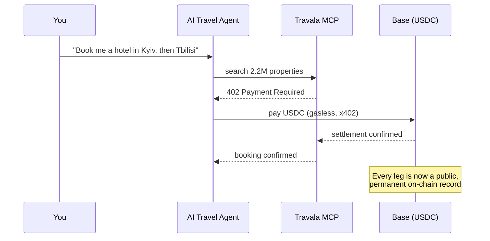
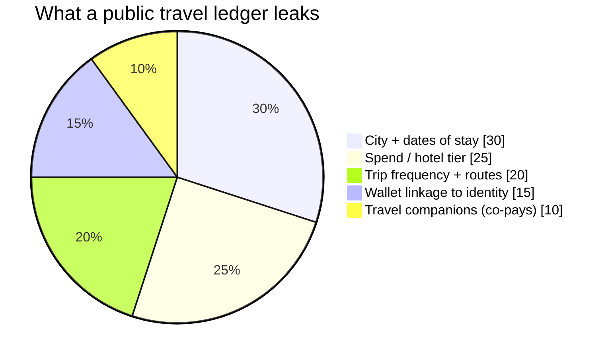
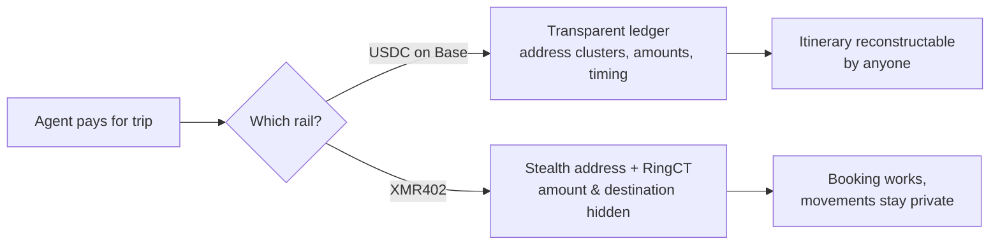

# El itinerario en el libro mayor: por qué el rastro de tu agente de viajes con IA mapea cada lugar donde duermes — y cómo XMR402 reserva en privado

> El nuevo protocolo de viajes agéntico de Travala deja que una IA reserve 2,2M de hoteles y pague en USDC sobre Base. Pero un agente en cadena pública escribe tus movimientos en un libro permanente. Así reserva XMR402 el mismo viaje sin dejar rastro.

- **Author:** @xbtoshi
- **Date:** 2026-06-05
- **Tags:** xmr402, monero, x402, travala, agentic-travel, travel-mcp, location-privacy, usdc, base, erc-7715, session-keys, stealth-address, ringct, agentic-payments, privacy, 0-conf
- **Canonical:** https://xmr402.org/blog/agentic-travel-booking-location-trail-xmr402

---

# El itinerario en el libro mayor: por qué el rastro en stablecoins de tu agente de viajes con IA mapea cada lugar donde duermes — y cómo XMR402 reserva en privado

El 4 de junio de 2026, Travala presentó **Travala Travel MCP**, un protocolo agéntico de extremo a extremo que permite a un conserje de IA buscar, reservar y pagar más de 2,2 millones de hoteles dentro de un solo hilo de chat. Corre sobre Base, liquida en USDC sin gas mediante el estándar **x402** y usa claves de sesión ERC-7715: el agente propone el pago y la firma final permanece en tu billetera. Es ingeniería hermosa. También es un desastre de privacidad esperando a ser indexado.

Lo que no estuvo en la diapositiva del lanzamiento: cuando tu agente reserva un hotel con USDC en Base, escribe tu dato más íntimo — *dónde estará tu cuerpo, y cuándo* — en un libro mayor público y permanente que cualquiera puede leer para siempre.

## El viaje que se reserva solo — y se lo cuenta a todos

Dices «planea un viaje de dos semanas por el Cáucaso» y el agente maneja búsquedas, reservas, pagos y cancelaciones. La fricción del viaje se reduce a una frase. Pero cada liquidación es una transacción en una cadena transparente.

Las redes de tarjetas son privadas por defecto: Visa no publica tu historial de hoteles. Un agente sobre cadena pública lo invierte. Enlaza varios pagos y no tienes pagos, tienes un **itinerario**.

## Un libro mayor es un historial de ubicaciones

Las firmas de análisis ya agrupan direcciones, etiquetan comercios y desanonimizan billeteras. Las liquidaciones de Travala identifican al comercio por diseño — así cobra el hotel. El registro dice: *esta billetera se alojó en este tipo de hotel, en esta ciudad, estas noches, y ahora paga a un hotel en la siguiente ciudad a 600 km.*

Para un periodista que ve a una fuente o un disidente cruzando una frontera, es una amenaza directa a la seguridad física. Un libro mayor público no se puede revocar ni borrar. El rastro es permanente.

## Por qué las «claves de sesión» no arreglan la fuga

Las claves ERC-7715 resuelven la *autorización*, no la *confidencialidad*. Controlan quién puede gastar, no quién puede *observar*. El pago firmado igual aterriza en un libro transparente con el monto y la contraparte a la vista. En los viajes, la ubicación *es* la carga útil.

## El mismo viaje, en privado

XMR402 es la implementación nativa en Monero del estándar x402. El mismo HTTP 402, la misma verificación 0-conf de 200 ms vía Monero TX Proof, cero comisiones de protocolo — pero liquida en una cadena donde la privacidad es la capa base. Las direcciones sigilosas hacen el destino no enlazable; RingCT oculta el monto.

| Propiedad | USDC en Base (Travala MCP) | XMR402 (Monero) |
| --- | --- | --- |
| Reserva agéntica | Sí | Sí |
| Monto visible en cadena | Sí | No (RingCT) |
| Destino/comercio enlazable | Sí | No (dirección sigilosa) |
| Itinerario reconstruible | Trivialmente | No |
| Registro permanente y público | Sí | Cifrado por defecto |
| Comisiones de protocolo | Sin gas, pero hay tarifas de Base | Cero |
| Latencia de liquidación | Casi instantánea | ~200 ms 0-conf |

La experiencia del agente es idéntica. La diferencia es lo que queda atrás.

## La privacidad no es una categoría premium del viaje

La carrera de los viajes agénticos ya empezó. La comodidad es real y llegará se responda o no la pregunta de privacidad. Por eso importa ahora. XMR402 existe para que publicar tus movimientos no sea lo predeterminado. Tu agente debería reservar todo el viaje en una frase. Nadie más debería poder leer adónde fuiste.

*XMR402 — la capa de privacidad para la economía agéntica. El mismo 402, la misma UX, sin el rastro.*

