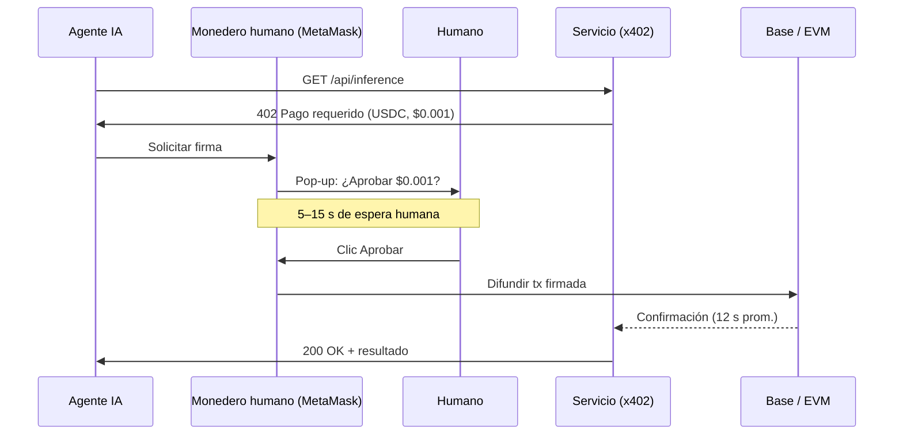
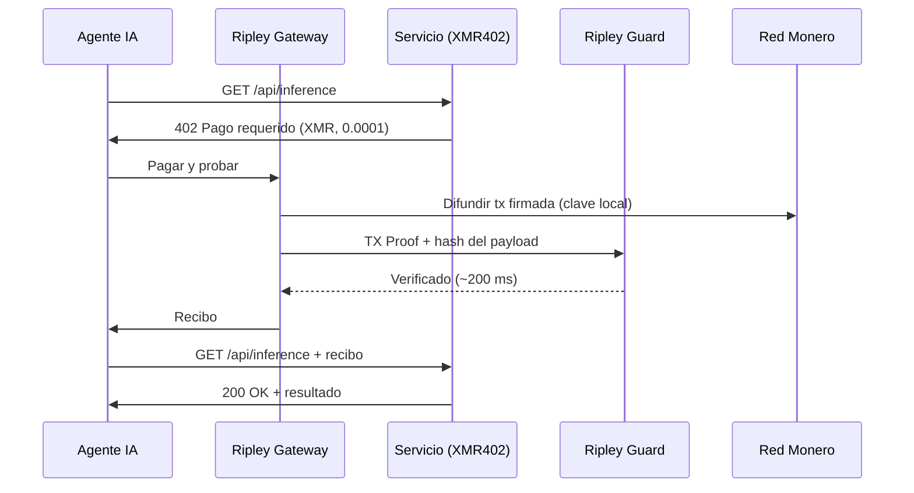
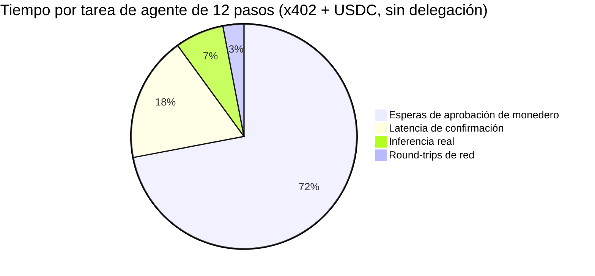
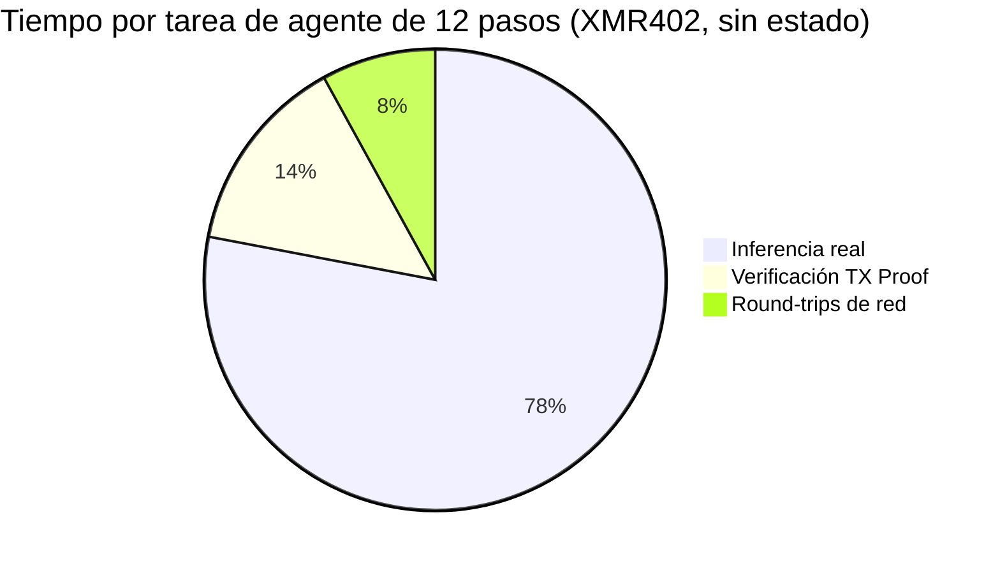

# El muro de la fricción de aprobación: por qué el volumen de x402 cayó un 77% — y por qué el diseño sin estado de XMR402 lo evita

> Datos de Artemis muestran que el volumen ajustado de x402 colapsó un 77% desde su pico de noviembre de 2025. El culpable no es la demanda, sino los pop-ups del monedero. Cada micropago de agente por debajo del céntimo ahora carga con $0,03–$0,10 en coste de tiempo humano de aprobación. Desglosamos el problema de la fricción de aprobación y explicamos por qué la verificación stateless de XMR402 mediante TX-Proof hace que el cuello de botella desaparezca por completo.

- **Author:** @xbtoshi
- **Date:** 2026-05-28
- **Tags:** xmr402, x402, monero, approval-friction, wallet-confirmation, micropayments, stateless, agentic-payments, delegation, ap2, agentcore, fireblocks
- **Canonical:** https://xmr402.org/blog/approval-friction-wall-stateless-xmr402

---

# El muro de la fricción de aprobación: por qué el volumen de x402 cayó un 77% — y por qué el diseño sin estado de XMR402 fue construido para evitarlo

Mayo de 2026 trajo a la industria de pagos de agentes su primer dato genuinamente sobrio. Según la analítica on-chain de Artemis, el volumen ajustado de x402 ha caído aproximadamente **un 77% desde su pico de noviembre de 2025 de 5,15 M$ hasta apenas 1,19 M$**, incluso cuando el número mensual de transacciones rebotó a 2,89 M con un tamaño medio de 0,52 $. El volumen en dólares no se está reduciendo porque los agentes hayan dejado de pagar. Se reduce porque cada pago ahora requiere que un humano haga clic en *aprobar*.

La industria ya tiene un nombre para esto: **fricción de aprobación**. Y está exponiendo un defecto que ninguna cantidad de pulido de UX en el monedero puede arreglar.

## Los números que nadie quiere imprimir

Una cadencia conservadora de confirmación de 5 a 15 segundos por pop-up del monedero — sobre los millones de llamadas x402 mensuales — genera entre **4.000 y 12.000 horas-usuario de trabajo de aprobación al mes**. A un valor mixto de tiempo humano de 25 $/hora, cada pop-up cuesta efectivamente 0,03 a 0,10 $ en impuesto de atención. Para una llamada de inferencia sub-céntima o una petición API medida de 0,001 $, el impuesto de tiempo humano es **10 a 100 veces el valor del pago real**.

Esto no es un bug. Es la *consecuencia directa* de atornillar un protocolo de stablecoin a un modelo de monedero diseñado para operaciones iniciadas por humanos, no para micropagos iniciados por máquinas.

## Por qué x402-USDC no puede escapar al pop-up

Cada flujo x402 con stablecoin hoy hereda el mismo supuesto de autorización: un monedero (MetaMask, Trust Wallet, Coinbase Wallet, Phantom) custodia una clave y esa clave firma una transacción EVM. Ya viva el monedero en una extensión del navegador, un dispositivo de hardware o un servicio custodial como Fireblocks, el evento de firma es **una acción explícita atribuible al usuario**. Los reguladores lo quieren así. Los equipos de cumplimiento lo quieren así. Los proveedores de monederos construyeron toda su UX en torno a ese supuesto.

Esto es aceptable para trading. Es *catastrófico* para un agente autónomo que necesita hacer 40 llamadas API sub-céntimas durante un único flujo de investigación.

La solución propuesta por la industria son los **marcos de delegación**: los mandates AP2 de Google donados a la FIDO Alliance, los controles de gasto basados en política de AWS Bedrock AgentCore Payments (lanzado el 7 de mayo de 2026), la nueva Agentic Payments Suite de Fireblocks (20 de mayo de 2026) y los vales de sesión prefondeados de Solana Pay.sh (5 de mayo de 2026). Cada uno intenta *preaprobar* un presupuesto para que el monedero deje de preguntar. Ninguno elimina el monedero — solo lo esconden detrás de un mandate firmado, un motor de política o un custodio.

## Lo que los marcos de delegación no resuelven

El pop-up desaparece. La vigilancia no. El custodio no. La vinculación de identidad no. Y críticamente, **los modos de fallo tampoco desaparecen**: un mandate puede ser revocado, una política puede mal configurarse, un custodio puede congelar fondos, y cada pago sigue apareciendo como un evento on-chain rastreable atado a un monedero con permisos.

Esta es la ironía arquitectónica de la carrera de pagos de agentes de 2026. Los protocolos respaldados por big tech ahora construyen andamiajes elaborados para *simular* lo que los protocolos sin estado entregan nativamente.

## Por qué XMR402 no tiene fricción de aprobación que resolver

XMR402 fue diseñado antes de que la fricción de aprobación tuviera nombre. La implementación nativa Monero de X402 trata al subsistema de pagos del agente — el **Ripley Gateway** — como un actor autónomo de primera clase. El Gateway custodia su propio monedero Monero, firma localmente y emite una **TX Proof** (una declaración criptográfica que prueba que un pago específico se hizo a una subdirección específica sin revelar el saldo ni el historial del monedero).

El servicio receptor ejecuta **Ripley Guard**, que verifica la TX Proof en aproximadamente **200 ms** — sin necesidad de un bloque confirmado, sin consultar a un custodio y sin consultar un motor de política externo. La verificación es sin estado: sin sesión, sin cuenta, sin inscripción, sin callback al UI del monedero.

No hay pop-up porque no hay humano en el bucle. No hay mandate porque la autoridad del agente está acotada por el saldo del monedero, no por un documento de autorización externo. No hay rastro de vigilancia porque las firmas en anillo de Monero, las stealth addresses y RingCT oscurecen tanto el conjunto de remitentes como el monto.

## Comparación directa: la auditoría de fricción de aprobación

| Protocolo | Modelo de aprobación | Tiempo humano por pago | Verificación 0-conf | Privacidad del pagador | Dependencia custodial |
|---|---|---|---|---|---|
| x402 (USDC en Base) | Firma del monedero por tx | 5–15 s ($0,03–$0,10) | No (~12 s) | Pública en Base | Opc. (Fireblocks, Coinbase) |
| AWS AgentCore Payments | Mandates de política prefirmados | ~0 dentro del presupuesto | Depende de la red | Pública + log de AWS | Sí (AWS) |
| Solana Pay.sh | Sesión prefondeada | ~0 dentro de sesión | Sí (Solana 400 ms) | Pública en Solana | Opc. |
| Google AP2 mandates | Mandate vinculado a FIDO | ~0 dentro del mandate | Depende de la red | Pública + atestación Google | Sí (identidad Google) |
| **XMR402** | **Ninguno — nativo de agente** | **0** | **Sí (~200 ms TX Proof)** | **Privada (RingCT)** | **Ninguna** |

La tabla parece una hoja de especificaciones, pero la implicación es estructural. Cada marco de delegación arriba acepta el pop-up como coste fijo y trata de amortizarlo. XMR402 lo elimina.

## Dónde aterriza realmente el impuesto de tiempo humano

Para un flujo de agente de 12 pasos que hace 12 llamadas API de pago, el desglose de tiempo es brutal en raíles de stablecoin y trivial en XMR402.

Por eso el volumen en dólares de x402 colapsa mientras crece el conteo de transacciones: los agentes están agrupando, reintentando y rindiéndose en llamadas sub-céntimas porque las matemáticas de tiempo humano ya no cuadran. El protocolo que *debería* usarse para un millón de llamadas diminutas al día está siendo estrangulado por el protocolo que *requiere* un humano para cada una.

## La elección arquitectónica que la industria sigue evitando

El muro de fricción de aprobación no es un problema de UX. Es una **elección de diseño de protocolo** horneada en el momento en que un estándar de pago asumió que el firmante es un humano. Cada marco de delegación que se construye en 2026 — mandates AP2, políticas AgentCore, orquestación Fireblocks, vales Pay.sh — es una capa diseñada para fingir autonomía sobre una primitiva fundamentalmente no autónoma.

XMR402 tomó la otra rama. Asumió que el firmante es el agente, el verificador es el servicio y la red es privada por defecto. Esa decisión es lo que hace posible la verificación en 200 ms, lo que hace posibles las comisiones de protocolo cero y lo que hace que el muro alrededor de los pagos sub-céntimos simplemente no exista.

Los datos de mayo de 2026 son una predicción. Los protocolos que sobrevivan a la década de los agentes serán los que nunca pidieron a un humano que hiciera clic en *aprobar*.
