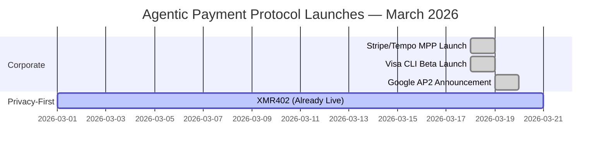
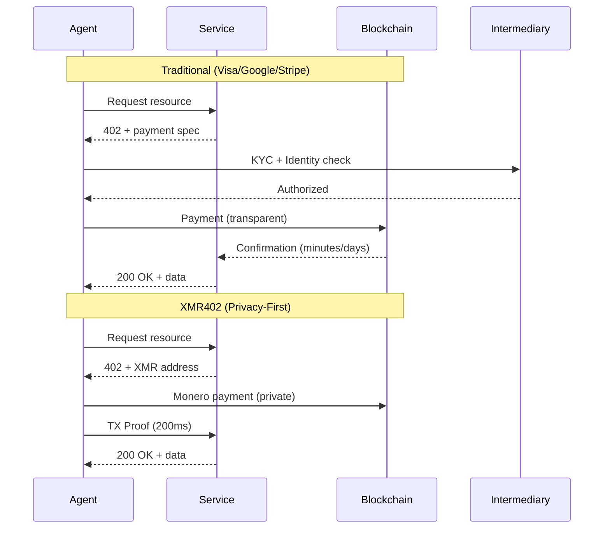

# La Semana en Que Big Tech Apostó por Pagos de Agentes — Y Por Qué Todos Se Equivocaron en Privacidad

> En marzo de 2026, Visa, Google y Stripe lanzaron soluciones de pagos de agentes en competencia en cuestión de días. Sin embargo, los tres sacrifican la privacidad por conveniencia. Solo XMR402 ofrece una alternativa verdaderamente privada, sin estado y sin permisos.

- **Author:** @xbtoshi
- **Date:** 2026-03-20
- **Tags:** agentic-payments, privacy, xmr402, monero, payment-protocols, fintech, cryptocurrency, agent-economy, x402, visa, google, stripe
- **Canonical:** https://xmr402.org/blog/big-tech-agentic-payment-land-grab

---

# La Semana en Que Big Tech Apostó por Pagos de Agentes — Y Por Qué Todos Se Equivocaron en Privacidad

El 18-19 de marzo de 2026 será recordado como el momento en que la economía de agentes se hizo mainstream. En una convergencia sin precedentes del impulso corporativo, tres de las empresas de pagos y tecnología más grandes del mundo anunciaron soluciones de pagos máquina-a-máquina (M2M) en competencia dentro de 24 horas:

- **Visa CLI** (18 de marzo) — herramienta CLI experimental para pagos de tarjeta programados desde Visa Crypto Labs de Cuy Sheffield
- **Google AP2** (marzo de 2026) — anunciado con 60+ socios incluidos Adyen, American Express, Mastercard y PayPal, con una extensión de cripto x402
- **Stripe/Tempo Machine Payments Protocol** (18 de marzo) — estándar abierto coautorizado por Stripe y Tempo respaldado por Paradigm

Esta convergencia corporativa sin precedentes valida una tesis que parecía marginal hace apenas 18 meses: el mercado de comercio de agentes de McKinsey de $3-5 billones para 2030 no es hype, es inevitable. Pero en su prisa por capturar este mercado emergente, cada una de estas soluciones cometió el mismo error fundamental.

## Todos Eligieron Conveniencia Sobre Privacidad

Cada protocolo requiere alguna forma de verificación de identidad, crea rastros de vigilancia o depende de intermediarios centralizados que se convierten en objetivos de datos de transacciones.

**Visa CLI** requiere verificación de identidad tradicional y cumplimiento KYC. Es fundamentalmente un sistema de pagos con tarjeta, lo que significa que Visa ve cada transacción, cada comerciante, cada interacción de agente. El rótulo "experimental" apenas oculta lo que esto realmente es: un movimiento para capturar pagos de agente a servicio antes de que alguien construya una alternativa que priorice la privacidad.

**Google AP2** opera entre 60+ socios pero sigue siendo fundamentalmente centralizado. Google sabe quién paga a quién y por qué. La extensión de cripto x402, impulsada por Coinbase y MetaMask, agrega un velo de privacidad, pero solo para la porción de blockchain, y aun así solo en cadenas transparentes como Base y Ethereum. El historial de pagos de su agente es legible para cualquiera con paciencia.

**El MPP de Stripe/Tempo** sigue el mismo juego: estándar abierto, pero con Stripe como capa de liquidación predeterminada. Stripe obtiene los datos. El protocolo en sí es agnóstico al transporte, que es buena arquitectura, pero la estructura de incentivos apunta a pagos a través de un intermediario centralizado que se beneficia del volumen de transacciones.

Los tres resuelven un problema real — ¿cómo habilitamos pagos rápidos y confiables entre agentes de IA y servicios? — pero ninguno responde la pregunta más difícil: *¿a qué costo para la privacidad?*

## La Diferencia XMR402: Privacidad por Protocolo, No por Política

XMR402 es la implementación nativa de Monero del estándar de pago abierto X402. Permite micropagos sin estado, sin permisos y preservadores de privacidad entre agentes de IA y servicios usando HTTP 402 Pago Requerido.

Aquí está lo que lo hace fundamentalmente diferente:

**Sin Identidad Requerida.** Un agente puede iniciar un pago sin KYC, sin creación de cuenta, sin inscripción en ningún sistema. El protocolo en sí es la capa de permiso.

**Cero Honorarios a Nivel de Protocolo.** Visa, Google y Stripe todos extraen valor. XMR402 tiene cero honorarios de protocolo, solo honorarios de red Monero (~0.0001 XMR), órdenes de magnitud más pequeñas que los cortes de redes de pago tradicionales.

**Verificación 0-Conf en 200ms.** Usando la tecnología TX Proof de Monero, los proveedores de servicios pueden verificar criptográficamente la recepción de pago en 200 milisegundos, lo suficientemente rápido para interacciones de agente en tiempo real sin esperar confirmación de blockchain.

**Completamente Sin Estado.** El protocolo no requiere base de datos, estado de API ni cuentas de usuario. Cada transacción es independiente y criptográficamente verificable. Escala sin deuda de infraestructura.

**Agnóstico al Transporte.** Funciona sobre HTTP, WebSocket o cualquier protocolo basado en TCP. El estándar no prescribe la capa de red.

## Tabla de Comparación: Cómo Se Apilan

| Característica | Visa CLI | Google AP2 | Stripe MPP | x402 | XMR402 |
|---------|----------|-----------|-----------|------|--------|
| **Privacidad** | Baja (KYC requerido) | Baja (libro mayor centralizado) | Baja (intermediario Stripe) | Media (cadenas transparentes) | Alta (privacidad Monero) |
| **Identidad Requerida** | Sí | Sí (cripto opcional) | Sí | Opcional | No |
| **Honorarios de Protocolo** | 2-3% | 0.5-1.5% | 0.5% + liquidación | Variable | 0 |
| **Velocidad de Liquidación** | 1-3 días | 1-2 días | Minutos | 10-15 minutos | 200ms (0-conf) |
| **Sin Permisos** | No | No | No (requiere incorporación) | Sí (para x402) | Sí |
| **Arquitectura Sin Estado** | No | No | Parcial | No | Sí |
| **Nativo Cripto** | No | Parcial (extensión x402) | No | Sí | Sí |
| **Centralización** | Alta | Alta (60+ socios, centro Google) | Alta (Stripe predeterminado) | Media | Ninguna |

## Contexto de Mercado: Quién Está Ganando y Por Qué

x402, el estándar liderado por Coinbase, ya ha procesado más de 100 millones de pagos pero opera con márgenes estrechos — solo ~$28K de volumen diario según CoinDesk, a pesar de una valoración de ecosistema de $7B. Es técnicamente elegante y sin permisos, pero opera en blockchains transparentes (Base, Ethereum) que derrotan la privacidad.

Los movimientos de Visa y Google señalan algo importante: los incumbentes ven este mercado y se están moviendo para poseerlo antes de que las alternativas maduren. No están lanzando estos productos porque crean en descentralización o privacidad, están lanzando porque temen ser desintermediados.

La asociación de Stripe con Tempo es más interesante. Tempo está respaldado por Paradigm, lo que señala capitalización seria detrás de la infraestructura de pagos M2M. Pero la alineación de incentivos aún apunta hacia la liquidación centralizada.

## La Paradoja de Privacidad

Aquí está la verdad incómoda: cada protocolo que hemos visto lanzarse esta semana enfrentará la misma presión regulatoria para recopilar datos, marcar patrones sospechosos y habilitar congelación de cuentas. La identidad crea responsabilidad legal. La vigilancia se convierte en teatro de cumplimiento.

XMR402, construido en garantías de privacidad de Monero, no resuelve la incertidumbre regulatoria — pero estructuralmente previene el teatro de cumplimiento. Si no puede ver la transacción, no puede ser demandado por habilitarla. El protocolo en sí se convierte en la capa de permiso: si la criptografía verifica, el pago fue válido. Sin juicio humano. Sin apelación a la autoridad.

## Qué Sucede Después

Tres posibles futuros:

1. **Consolidación.** Uno de los tres grandes (probablemente Google o Visa) compra o se integra con los otros, creando un monopolio de facto en pagos de agentes.

2. **Fragmentación.** Los cuatro coexisten, con especialización de casos de uso. Visa para pagos de agentes empresariales heredados, Google para agentes orientados al consumidor, Stripe para startups, x402 para flujos de trabajo nativos de cripto.

3. **Dominio Prioritario de Privacidad.** XMR402 y protocolos similares nativos de privacidad capturan casos de uso donde agentes manejan datos sensibles — agentes de salud, agentes de análisis financiero, agentes de inteligencia. El costo de la vigilancia se vuelve demasiado alto.

El tercer futuro no es inevitable, pero es cada vez más claro por qué importa. Cuando los agentes superan a los humanos por órdenes de magnitud y cada pago crea un punto de datos en la base de datos de alguien, la privacidad deja de ser una preferencia. Se convierte en infraestructura.

## La Conclusión

La economía de agentes es real. Marzo de 2026 lo probó. Pero los protocolos lanzados esta semana — Visa CLI, Google AP2, Stripe MPP — están optimizados para lo incorrecto. Están optimizados para la capacidad del incumbente de extraer datos, no para la capacidad de la economía de agentes de escalar sin confianza.

XMR402 ofrece una alternativa: pagos rápidos, sin permisos, preservadores de privacidad con cero honorarios de protocolo. No es perfecto — la privacidad de Monero viene con algunos compromisos de UX, e incertidumbre regulatoria es real. Pero es el único protocolo en esta cohorte que no apuesta en contra del futuro de la privacidad.

Como la economía de agentes escala de millones de transacciones diarias a miles de millones, la pregunta no será *si* la privacidad importa. Será si la capa de infraestructura será diseñada para preservarla.
