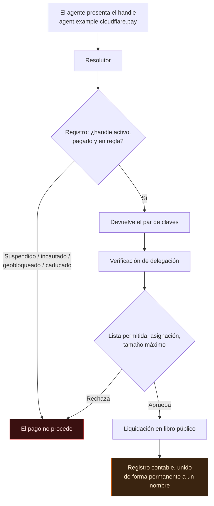
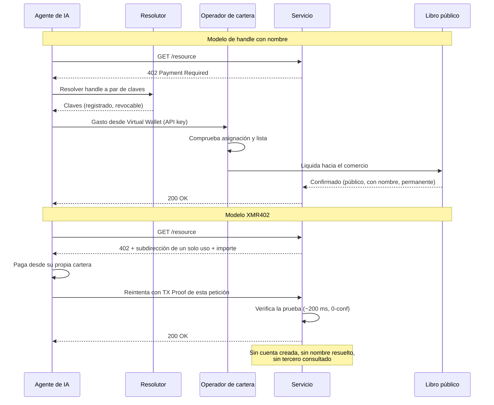

# El nombre es el cuello de botella: por qué cloudflare.pay le da a cada agente una dirección de pago permanente — y por qué los agentes de XMR402 siguen sin nombre

> Wallets y cloudflare.pay dieron a los agentes de IA límites de gasto — y algo más consecuente: nombres. Un handle de pago resoluble es la clave de unión que convierte un libro transparente en un registro conductual con nombre. XMR402 acuña una dirección de un solo uso: nada que resolver, nada que revocar.

- **Author:** @xbtoshi
- **Date:** 2026-09-05
- **Tags:** xmr402, monero, x402, cloudflare, cloudflare-wallets, cloudflare-pay, agent-identity, naming-layer, dns, handles, virtual-wallets, delegated-spend, stateless, tx-proof, fcmp, anonymity-set, agentic-payments, privacy, 0-conf, ripley-guard, censorship-resistance
- **Canonical:** https://xmr402.org/blog/cloudflare-pay-handles-agent-naming-layer-xmr402

---

# El nombre es el cuello de botella: por qué cloudflare.pay le da a cada agente una dirección de pago permanente — y por qué los agentes de XMR402 siguen sin nombre

El 4 de agosto de 2026, durante su Agents Week, Cloudflare anunció Wallets y `cloudflare.pay`. La mayoría de la cobertura destacó la mitad obvia: los agentes de IA ya pueden tener dinero y gastarlo con límites. Esa es la mitad menos interesante.

La mitad más consecuente es que los agentes recibieron **nombres**.

Una cartera es un contenedor. Un nombre es un índice. Y en todo sistema en red que los humanos han construido, el control se acumula no en la capa de almacenamiento ni en la de transporte, sino en la **capa de nombres**. Cloudflare lo sabe mejor que casi nadie: por eso su propia analogía para `cloudflare.pay` es el DNS — identificadores legibles por humanos que se resuelven en pares de claves criptográficas, igual que los dominios se resuelven en direcciones IP.

La analogía es exacta. Y ahí está el problema.

## Qué se lanzó realmente

Quitada la retórica, tres cosas son reales, una es una propuesta y varias quedan llamativamente sin nombrar.

Real: una **Account Wallet** que pertenece a un humano y custodia los fondos. Delega gasto acotado a **Virtual Wallets** que los agentes operan mediante claves de API. La delegación lleva una asignación, una lista de comercios permitidos y un tamaño máximo de transacción.

Propuesto: los handles `cloudflare.pay` — una capa de identidad legible para agentes, presentada como solución puente mientras los estándares de identidad no se asienten.

Sin nombrar: el custodio de los saldos, las stablecoins admitidas y las redes de liquidación. La reserva de handles abrió el mismo día del anuncio; la financiación, el gasto y el soporte a comercios aparecen en futuro en los propios textos de Cloudflare.

Hay que reconocerlo: la delegación acotada es una mejora real frente a lo que sustituye — una única cartera caliente con saldo ilimitado y una clave de API pegada a las variables de entorno del agente. Los límites reducen de verdad el daño que puede causar un agente confundido o secuestrado. Nada de lo que sigue lo niega.

El reparo es más estrecho y, creo, más duradero: los controles de gasto son la parte que sale en la nota de prensa; la capa de nombres es la parte que cambia internet.

## El DNS nunca fue una capa neutral

Tómese en serio la analogía de Cloudflare y llévese hasta el final.

El DNS le dio usabilidad a internet. También le dio un registro, un registrador, un resolutor, un ciclo de renovación, un TTL, una política de abuso, un procedimiento de suspensión y, con el tiempo, incautaciones judiciales y listas de bloqueo por jurisdicción. Nada de eso estaba en el documento de diseño. Todo se derivó inevitablemente de una sola propiedad: en algún lugar hay una parte que responde «¿a qué apunta este nombre?» — y que por tanto puede responder «a nada».

Una capa de nombres para pagos hereda toda la estructura. Si `agent.example.cloudflare.pay` se resuelve en un par de claves, algo lo resuelve. Ese algo tiene una política. Esa política tiene excepciones. Esas excepciones traen un proceso legal, y el proceso legal trae una jurisdicción.

Cada caja del diagrama es un punto donde alguien que no es ni el pagador ni el cobrador puede detener el pago. No es un reproche a las intenciones de Cloudflare: es una descripción de lo que un espacio de nombres resoluble **es**.

## Qué añade un nombre a un libro contable transparente

El seudonimato en una cadena pública ya era frágil. La agrupación de direcciones, la correlación temporal, los importes redondos y las contrapartes repetidas permiten a los analistas colapsar direcciones «anónimas» en entidades con una fiabilidad incómoda. Lo que suele faltar es la **clave de unión**: el identificador duradero que ata un grupo de direcciones a un registrante real.

Un handle de pago es exactamente esa clave, entregada de forma voluntaria y por diseño.

Funciona en ambas direcciones. Hacia adelante, todo pago futuro bajo el handle es atribuible a quien lo registró. Hacia atrás, una vez conocida la correspondencia, se resuelve también el historial antes ambiguo. Rotar claves detrás de un handle estable no lo evita: el resolutor guarda la correspondencia por construcción. Ese es todo su trabajo.

| Capa | Qué sabe | ¿Persiste tras el pago? |
|---|---|---|
| Libro público | Importes, momentos, contrapartes, grafo de direcciones | Para siempre y en público |
| Registro de handles | Handle → claves, registrante, renovaciones | Sí, en el operador |
| Account Wallet | Qué humano financia a qué agente y cuánto | Sí, en el operador |
| Lista de permitidos | Todos los comercios que el agente pudo pagar | Sí, en el operador |
| Proxy inverso del comercio | La petición, cabeceras, momento, origen | Según política de retención |

Léase la tabla como un solo sistema y no como cinco: lo que aparece es el registro conductual completo de un agente autónomo — quién lo financió, qué podía comprar, qué compró, cuándo, por cuánto y a quién — con un nombre humano en la raíz.

## La pila de cuellos de botella

Lo incómodo es la concentración, no la intención.

Buena parte de la web ya está detrás de un mismo proxy inverso. Añádase la tarificación por petición para rastreadores de IA. Añádase una capa de identidad de agentes. Añádase una cartera y una vía de liquidación. Ahora un único operador puede, en principio, observar la petición, resolver la identidad y liquidar el pago: tres capas históricamente en manos de tres partes sin relación, plegadas en una.

El segundo flujo tiene menos participantes porque tiene menos preguntas que hacer. No hay handle que consultar, luego no hay registro al que preguntar, luego no hay nadie en posición de decir que no.

## XMR402: nada que resolver, nada que revocar

XMR402 implementa HTTP 402 sobre Monero, y sus decisiones de diseño encajan casi punto por punto contra el problema del nombre.

**El identificador es desechable.** El destino del pago es una dirección de un solo uso acuñada para un único desafío. No se reserva, no se renueva, no se registra ni se reutiliza. No hay espacio de nombres porque no hay nombre.

**La autorización es por petición, no por cuenta.** El agente presenta una TX Proof de Monero que demuestra que ese pago concreto corresponde a esa petición concreta. No hay clave de API al portador que un entorno comprometido filtre y un atacante reproduzca.

**El servidor no guarda estado.** No se crea cuenta, luego no hay cuenta que nombrar, suspender o requerir judicialmente. Ripley Guard verifica una prueba en unos 200 ms con cero confirmaciones y olvida al pagador de inmediato.

**El libro no contiene clave de unión.** La actualización FCMP++ de Monero permite probar la propiedad frente a un conjunto de anonimato de más de 150 millones de salidas, y se aplica retroactivamente. Las técnicas de agrupación de direcciones que hacen tan valiosos los handles no tienen dónde agarrarse.

| Propiedad | cloudflare.pay + rieles de stablecoin | XMR402 |
|---|---|---|
| Identificador de pago | Handle legible, persistente | Dirección de un solo uso |
| Quién puede revocarlo | Registro / operador de cartera | Nadie: no se concede nada |
| Identidad del registrante | Titular humano de la cuenta | No se requiere |
| Custodia de fondos | Account Wallet del operador | Cartera propia del agente |
| Comisiones de protocolo | Según operador y red | Cero |
| Vinculabilidad en el libro | Importes y grafo públicos | Blindado; +150 M de anonimato |
| Control de gasto | Asignación y lista, como política | Importe por petición, como estructura |
| Estado en el servidor | Cuentas, saldos, auditoría | Ninguno |
| Funciona autoalojado, sin terceros | No | Sí |
| Latencia de liquidación | Según red y operador | ~200 ms, 0-conf |

## El intercambio, dicho con justicia

Los pagos con nombre no son una estafa ni una trampa. Son un intercambio, y para algunos compradores es el correcto.

Si una empresa paga a sus proveedores, quiere facturas, conciliación, gestión de disputas y una traza de auditoría con un nombre humano al final. Un handle entrega todo eso. Las compras corporativas **deben** ser atribuibles.

La objeción es a la atribución como **valor por defecto**, la que recibe todo agente necesítelo o no su caso de uso. Un agente que lee un artículo de pago, consulta un precio, compra 200 tokens de inferencia o rastrea un conjunto de datos público no tiene por qué generar un registro permanente y con nombre. Esos pagos son el equivalente máquina de meter una moneda en una ranura. Nadie pidió pasaporte en el quiosco.

El final sano son dos rieles, elegidos por transacción: con nombre y auditable donde la rendición de cuentas es el producto; sin nombre y desechable donde no lo es. Lo insano es que el segundo riel no exista.

## Los nombres son la forma en que los sistemas aprenden a decir que no

La pila de pagos agénticos de 2026 ha convergido en una creencia compartida: un agente debe ser **alguien** antes de poder pagar por **algo**. Identidad primero, liquidación después. Cada protocolo importante de este año —pasaportes de identidad, calificaciones de confianza, libros con permiso y ahora handles de pago— es una variación del mismo tema.

XMR402 invierte el orden: demuestra el pago, no al pagador. El servicio obtiene exactamente lo que necesita y no aprende nada más, porque no hay nada más que aprender.

Los nombres hicieron la web navegable. También la hicieron incautable. Cuando los agentes empiecen a pagar internet a velocidad de máquina, conviene preguntar si cada una de esos miles de millones de transacciones diminutas necesita de verdad un registrante — o si algunas deberían simplemente pagarse, verificarse y olvidarse.
