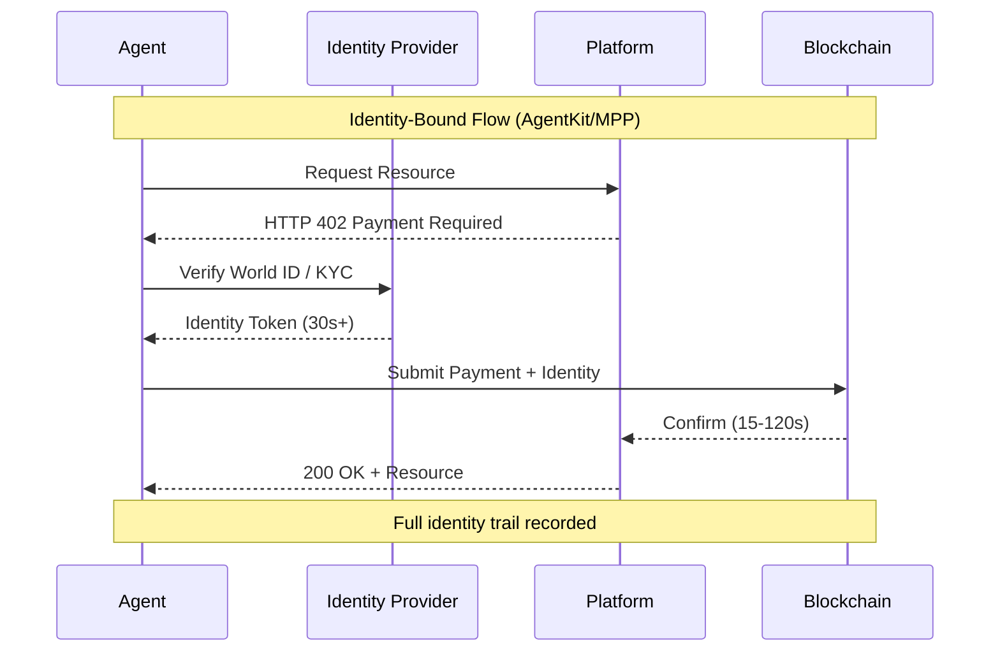
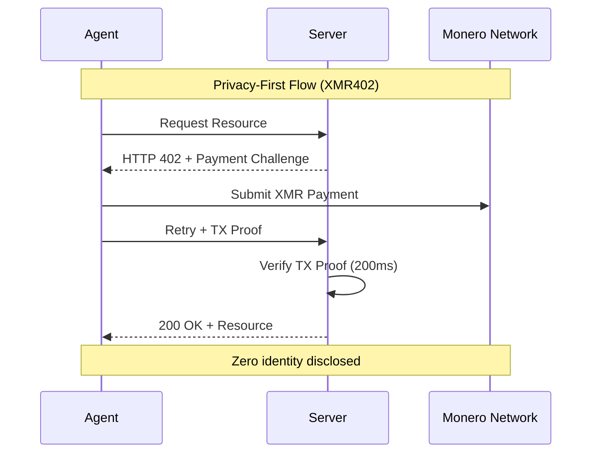
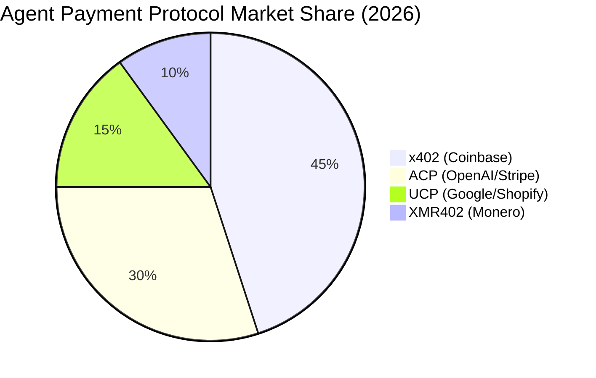

# La trampa de la identidad: Por qué los agentes autónomos no necesitan pasaportes de identidad humana

> AgentKit de World (17 de marzo) y Machine Payments Protocol de Stripe (18 de marzo) ambos requieren infraestructura vinculada a la identidad. Examinamos por qué vincular la identidad biométrica a cada transacción de agentes crea la última frontera del capitalismo de vigilancia, y por qué el enfoque sin identidad de XMR402 representa una divisoria filosófica para los sistemas autónomos.

- **Author:** @xbtoshi
- **Date:** 2026-03-19
- **Tags:** xmr402, monero, privacy, agentkit, world, stripe, mpp, identity, autonomous-agents
- **Canonical:** https://xmr402.org/blog/identity-trap-agentkit-mpp-privacy

---

## La trampa de la identidad: Por qué los agentes autónomos no necesitan pasaportes de identidad humana

El 17 de marzo de 2026, World lanzó AgentKit, un marco para que agentes AI autónomos realicen transacciones en el mundo real. El 18 de marzo, Stripe anunció el Machine Payments Protocol (MPP) construido en blockchain Tempo con Paradigm. Ambos comparten un supuesto fundamental: cada transacción de agente debe estar vinculada a una identidad humana verificada.

Esta es la trampa de la identidad.

Por primera vez en la historia económica, tenemos la tecnología para crear transacciones que no requieren saber quién las inició. Los agentes autónomos —software que actúa en nombre de usuarios, sistemas o a sí mismos— deberían encarnar esta libertad. En cambio, AgentKit vincula agentes a la prueba biométrica de humanidad de World ID. El MPP de Stripe, aunque basado en blockchain, aún requiere infraestructura vinculada a identidad. Mientras tanto, XMR402, la implementación nativa de Monero del estándar de pago abierto X402, demuestra un camino radicalmente diferente: micropagos sin estado que preservan la privacidad entre agentes sin requerir infraestructura de identidad alguna.

El mercado está enviando señales contradictorias. x402 (la implementación de Coinbase en Base/Ethereum) ha capturado la atención del ecosistema —valoración de $7 mil millones— pero procesa solo ~$28,000 diarios. En el mismo período, 140+ millones de transacciones de agentes AI en cadena ocurrieron con un valor promedio de $0.31. La brecha entre entusiasmo y adopción revela el problema central: los protocolos vinculados a identidad introducen fricción exactamente donde los agentes necesitan operación sin fricción.

### El Problema Filosófico: La Identidad como Impuesto

La identidad sirve un propósito en la economía humana. Los bancos necesitan conocer a sus clientes para cumplimiento regulatorio y prevención de fraude. Las plataformas requieren identidad para vincular reputación y comportamiento. Pero los agentes no son humanos. No tienen reputación que proteger, intención criminal que disuadir, o activos que congelar. Tienen instrucciones.

Cuando vinculas transacciones de agentes a identidad humana, no estás sirviendo al agente, estás sirviendo al aparato de vigilancia. Estás creando un registro de auditoría perfecto de qué hace cada agente, en nombre de quién, y al servicio de qué objetivo. No es un error; es la característica. Los pagos de agentes vinculados a identidad habilitan inteligencia comercial a escala previamente imposible.

Considera un escenario simple: un creador de contenido despliega 50 agentes autónomos para negociar acuerdos publicitarios en múltiples plataformas. Con AgentKit + World ID, cada transacción es rastreable a la identidad del creador. Un anunciante puede mapear toda la red de agentes del creador, entender sus patrones de pujas, y extraer inteligencia competitiva. Con XMR402, cada agente opera como un actor económico independiente. El anunciante ve que ocurrió una transacción; no ven quién la autorizó, qué otros agentes operan en el mismo espacio, o la estrategia más amplia del creador.

Esto no es paranoia. Es realidad comercial. El requisito de identidad crea información asimétrica que fluye hacia operadores de plataformas y competidores.

### La Realidad Técnica: Por Qué la Identidad Rompe el Diseño de Agentes

Los agentes autónomos requieren autonomía para funcionar. El momento en que introduces verificación de identidad en cada transacción, introduces:

**1. Latencia y Dependencia de Estado**: La verificación de World ID, controles de cumplimiento de KYC y confirmación de identidad añaden 30+ segundos a la liquidación de transacciones. La verificación 0-conf de 200ms de XMR402 a través de Monero Transaction Proof elimina este cuello de botella. Los agentes pueden operar a velocidad de red, no a velocidad burocrática.

**2. Punto Único de Fallo**: Si la identidad de un creador se ve comprometida, cada agente bajo su identidad se ve comprometido. Si un sistema de agentes se basa en verificación de identidad central (como lo hace AgentKit), cualquier fallo del proveedor de identidad se propaga en cascada a todos los agentes dependientes. La arquitectura sin estado de XMR402 significa que cada transacción es independiente. Un compromiso en una transacción no se propaga.

**3. Fuga de Privacidad Mediante Correlación**: Múltiples agentes operando bajo la misma identidad humana crean un problema de correlación. Un adversario puede reconstruir el comportamiento del creador, estrategia y relaciones analizando el patrón de transacciones de agentes. El modelo de privacidad de XMR402 elimina esto: los agentes son económicamente indistinguibles.

**4. Bloqueo de Modelo de Negocio**: La infraestructura de identidad crea costos de cambio. Si has pasado meses construyendo agentes dentro del ecosistema AgentKit, migrar a un competidor requiere reestablecimiento de verificación de identidad, reconstrucción de señales de reputación, y reintegración con el sistema de identidad del nuevo proveedor. El diseño agnóstico de transporte de XMR402 (HTTP + WebSocket) y el estándar abierto significan que los agentes son portátiles.

### La Oportunidad del Mercado: Por Qué Esto Importa Ahora

El tiempo de los anuncios de AgentKit y MPP revela algo importante: la infraestructura de pagos incumbente (x402 de Coinbase, UCP de Google/Shopify, ACP de OpenAI/Stripe) está consolidándose alrededor de modelos vinculados a identidad precisamente porque aumentan el control de plataforma y la extracción de datos.

Pero 140+ millones de transacciones de agentes en 9 meses, con un valor promedio de $0.31, sugieren un mercado diferente emergente. Este es el mercado de pagos máquina-a-máquina a escala. Estas transacciones son demasiado pequeñas, demasiado frecuentes, y demasiado numerosas para soportar verificación de identidad. Un creador desplegando 1,000 agentes haciendo 100 transacciones cada una por día generaría 100,000 transacciones diarias. Con valor promedio de $0.31, los costos de verificación de identidad excederían el valor de transacción.

XMR402 está propositivamente construida para este mercado. Cero comisiones de protocolo. Arquitectura sin estado. Privacidad por defecto. Cuando removes el requisito de identidad, removes la fuente principal de fricción.

### Comparación de Características: Tres Modelos de Pagos de Agentes

| Característica | AgentKit (x402) | Stripe MPP | XMR402 |
|---|---|---|---|
| **Identidad Requerida** | Sí (World ID) | Sí (KYC) | No |
| **Velocidad de Liquidación** | 30-120 segundos | 15-60 segundos | 200ms (0-conf) |
| **Costo de Transacción** | Comisiones stablecoin | Comisiones protocolo | Cero comisiones protocolo |
| **Modelo de Privacidad** | Vinculado a identidad | Vinculado a identidad | Indistinguible, anónimo |
| **Punto Único de Fallo** | Proveedor identidad | Stripe/Tempo | Red Monero |
| **Portabilidad de Agentes** | Bloqueo ecosistema | Bloqueo ecosistema | Agnóstico transporte |
| **Adecuado para Micro-transacciones** | No (comisiones exceden valor) | No (carga KYC) | Sí (escalable) |
| **Inteligencia Comercial** | Gráfico transacción completo | Gráfico transacción completo | Cero visibilidad |
| **Cumplimiento Regulatorio** | Incorporado | Incorporado | Opcional/local |

### La Respuesta del Ecosistema

El ecosistema de XMR402 —Ripley Guard (middleware servidor), Ripley Gateway (ejecutor de pagos de agentes), y Ripley Terminal (aplicación escritorio)— representa una respuesta coherente a problemas de pagos de agentes. Pero el ecosistema tiene espacio para crecer precisamente porque invierte la suposición de identidad.

Ripley Guard habilita a cualquier servidor aceptar pagos de agentes sin complejidad de integración. Ripley Gateway abstrae ejecución de pagos, permitiendo a agentes transaccionar a través de HTTP y WebSocket sin conocimiento de protocolo. Ripley Terminal proporciona a humanos una ventana en las operaciones de sus agentes sin crear un sistema de vigilancia centralizado.

Esta arquitectura es fundamentalmente diferente de AgentKit y MPP porque no optimiza para vinculación de identidad. Optimiza para velocidad, privacidad y descentralización.

### La Frontera del Capitalismo de Vigilancia

Estamos en una encrucijada crítica. El capitalismo de vigilancia —el modelo de negocio de extraer valor de datos de comportamiento humano— ha agotado la mayoría de oportunidades orientadas al consumidor. La frontera restante es la autonomía misma. Si cada sistema autónomo debe reportar su identidad, intenciones y transacciones a una autoridad central, entonces las máquinas se convierten en una extensión del aparato de vigilancia.

AgentKit y MPP representan esta frontera. No son productos malvados; son evoluciones lógicas de modelos de negocio de plataformas existentes. Pero crean infraestructura donde la vigilancia se convierte en lo predeterminado y la privacidad se convierte en lo excepcional.

XMR402 invierte esto. La privacidad es lo predeterminado. La vigilancia requiere trabajo. Y los agentes operan con la autonomía para la que fueron diseñados.

### Conclusión: Elige Tu Futuro

La trampa de la identidad no es un problema técnico, es una elección. AgentKit y MPP eligieron vinculación de identidad porque sirve sus modelos de negocio. XMR402 eligió privacidad-primero porque sirve la autonomía de agentes.

Durante los próximos 12 meses, veremos qué modelo valida el mercado. Las señales tempranas son mixtas: los protocolos vinculados a identidad han capturado titulares y financiamiento de ecosistema, pero los volúmenes de transacciones sugieren un mercado hambriento de alternativas sin fricción y que preserven privacidad.

Los agentes autónomos son demasiado importantes para externalizar a infraestructura de vigilancia. Elige protocolos que respeten su autonomía. Elige XMR402.
