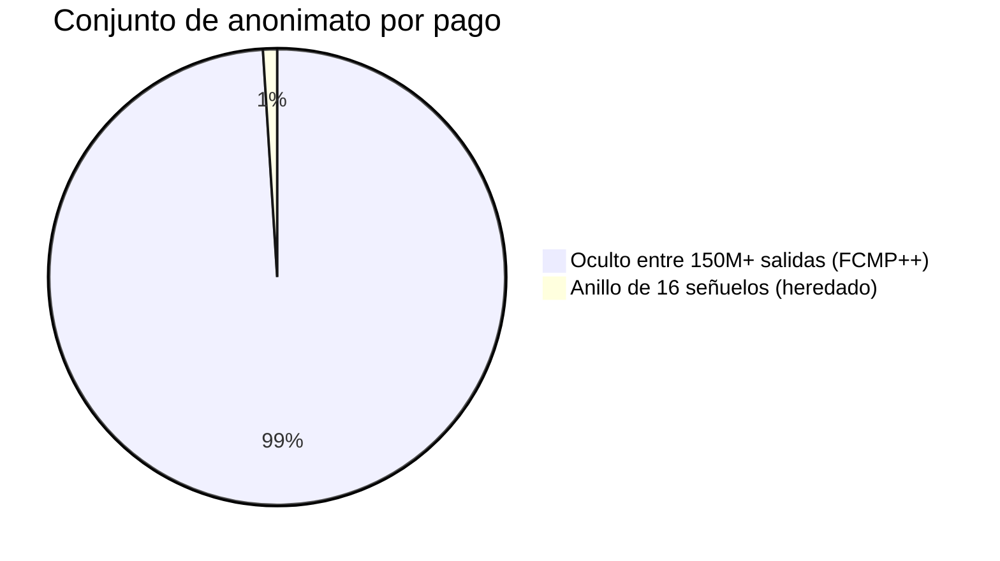
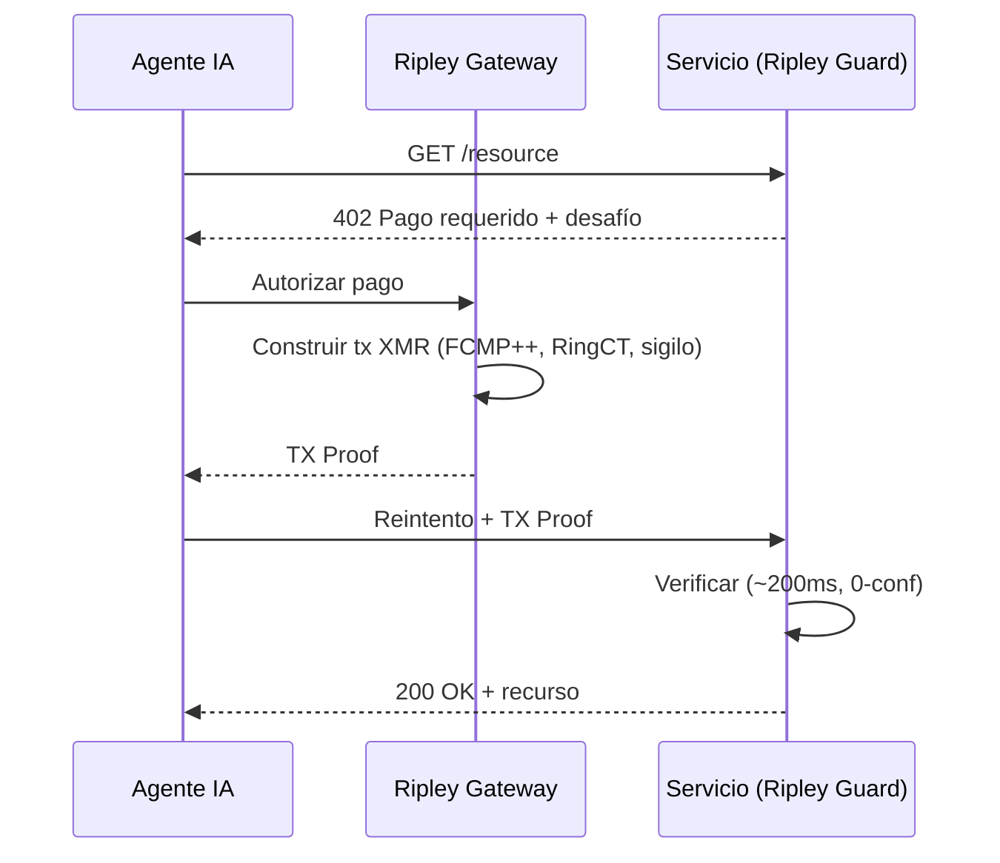
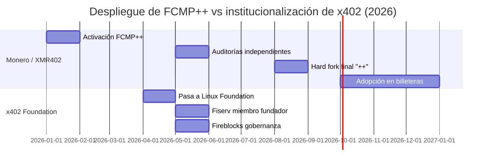

# 150 millones de fuerte: cómo la actualización FCMP++ de Monero da a cada pago XMR402 el mayor conjunto de anonimato de la historia

> La actualización FCMP++ de Monero amplía el conjunto de anonimato de 16 a más de 150 millones. Por qué esto convierte a XMR402 en el riel más privado de la economía agéntica, mientras 22 corporaciones gobiernan el x402 transparente.

- **Author:** @xbtoshi
- **Date:** 2026-05-31
- **Tags:** xmr402, monero, fcmp, fcmp-plus-plus, anonymity-set, ring-signatures, privacy, x402, x402-foundation, linux-foundation, agentic-payments, ringct, stealth-address, stateless
- **Canonical:** https://xmr402.org/blog/monero-fcmp-anonymity-set-xmr402-agent-payments

---

# 150 millones de fuerte: cómo la actualización FCMP++ de Monero da a cada pago XMR402 el mayor conjunto de anonimato de la historia

Mientras veintidós corporaciones se reunían esta primavera para gobernar un estándar de pago transparente, Monero hizo en silencio algo que la economía agéntica nunca había visto: ocultar cada pago entre una multitud de más de 150 millones.

El contraste define el año. En abril de 2026, el protocolo x402 pasó a la Linux Foundation y, para mayo, su lista de miembros fundadores parecía un quién es quién de las finanzas globales: Visa, Mastercard, American Express, Stripe, AWS, Google, Microsoft, Shopify, Circle, Coinbase, Fiserv y más. Ese mismo mes, Fireblocks se unió y lanzó una extensión de «gobernanza del gasto». El mensaje era inequívoco: los pagos de agentes en x402 serán rápidos, bien financiados y vigilados.

Mientras tanto, Monero completó el despliegue de **FCMP++** (Pruebas de Pertenencia de Cadena Completa), la actualización de privacidad más profunda de su historia. Para XMR402 —la implementación nativa de Monero del estándar de pago 402— esto no es una nota al pie: es el cimiento fortaleciéndose bajo cada transacción de agente.

## Qué cambió realmente FCMP++

Durante años, Monero ocultaba un gasto real entre un anillo de 16 señuelos. Un observador sabía que tu salida real era una de dieciséis, pero no cuál. Bueno, pero finito.

FCMP++ descarta por completo las firmas de anillo. Ahora un gasto demuestra —con una prueba de conocimiento cero compacta de 2–3 KB— que la entrada real pertenece a **todo el conjunto de salidas históricas** de la cadena, sin revelar cuál. Con el conjunto UTXO de Monero cerca de 150–158 millones, el conjunto de anonimato saltó de 16 a más de 150 millones: un aumento de unos diez millones de veces.

FCMP++ se activó en toda la red en enero de 2026, pasó auditorías independientes hasta mayo de 2026, y la forma final optimizada «++» llegará en el hard fork de agosto de 2026, con las principales billeteras adoptándola por defecto a finales de año. Cada servicio que liquida en XMR —incluidos los endpoints XMR402— hereda esta garantía sin cambiar su propio protocolo.

## Por qué es decisivo para los agentes de IA

Los agentes autónomos filtran patrones. Un agente que llama a la misma API cada 90 segundos crea un ritmo. En un libro mayor transparente, ese ritmo es una huella dactilar, y las corporaciones que gobiernan x402 liquidan precisamente en esos libros, con stablecoins en cadenas públicas como Base.

XMR402 invierte el modelo. Cada pago se verifica en unos 200 ms mediante una TX Proof de Monero contra un desafío HTTP 402 sin estado: sin cuenta, sin saldo, sin pasaporte de identidad. Con FCMP++, el emisor se oculta en toda la cadena, el monto lo oculta RingCT y al receptor lo protege una dirección sigilosa.

## XMR402 + FCMP++ frente a la pila transparente

| Dimensión | XMR402 (Monero + FCMP++) | Pila x402 (stablecoins) |
|---|---|---|
| Conjunto de anonimato | 150M+ salidas | 1 (dirección transparente) |
| Privacidad del emisor | Oculto por prueba | Público en cadena |
| Privacidad del monto | RingCT (oculto) | Público en cadena |
| Privacidad del receptor | Dirección sigilosa | Público en cadena |
| Gobernanza | Abierta, sin membresía | 22 miembros corporativos |
| Tarifas de protocolo | Cero | Variables |
| Requisito de identidad | Ninguno (sin estado) | Cada vez más KYA |

Las corporaciones pasaron la primavera decidiendo quién gobierna el libro mayor. Monero la pasó asegurándose de que no haya nada que gobernar en él.

*XMR402 es la implementación nativa de Monero del estándar abierto de pago 402: sin estado, sin comisiones, verificación de ~200 ms y ahora respaldada por el mayor conjunto de anonimato en la historia de los pagos.*

