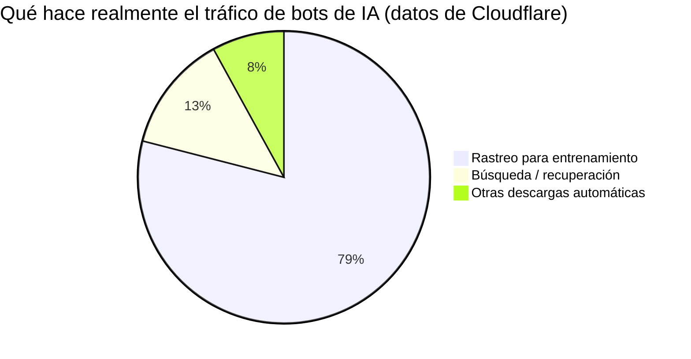
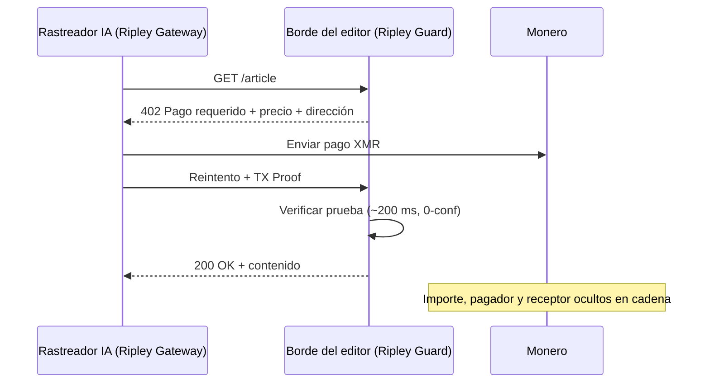

# El rastro de rastreo: cómo el pago por crawl convierte la estrategia de entrenamiento de cada laboratorio de IA en un mapa público — y por qué XMR402 cierra el libro mayor

> El pago por crawl permite a los editores cobrar a los rastreadores de IA, pero en un libro mayor transparente cada pago filtra el corpus de entrenamiento de un laboratorio. La liquidación privada y sin estado de XMR402 en Monero paga al editor sin difundir la estrategia.

- **Author:** @xbtoshi
- **Date:** 2026-06-01
- **Tags:** xmr402, monero, x402, pay-per-crawl, cloudflare, ai-crawlers, training-data, gptbot, claudebot, common-crawl, privacy, publishers, content-monetization, agentic-payments, stateless, 0-conf
- **Canonical:** https://xmr402.org/blog/pay-per-crawl-training-data-trail-xmr402

---

# El rastro de rastreo: cómo el pago por crawl convierte la estrategia de entrenamiento de cada laboratorio de IA en un mapa público — y por qué XMR402 cierra el libro mayor

En 2025, Cloudflare invirtió un valor por defecto que reescribió silenciosamente la economía de la web: los rastreadores de IA ahora se bloquean salvo que paguen. Su mercado de **pago por crawl** permite a los editores cobrar cada vez que un bot como GPTBot, ClaudeBot o CCBot descarga una página, y en enero de 2026 lanzó una plantilla de proxy x402 de código abierto actualizada. Sam Altman ha descrito públicamente el futuro de la publicación como micropagos: «para ser claros, pagos hechos por agentes de IA, no por los lectores directamente».

Durante dos años la conversación giró en torno a agentes que *compran* servicios. El pago por crawl trata de agentes que compran la materia prima de la inteligencia misma: texto, imágenes, datos, el corpus. Y llega con un problema que nadie está valorando. Cuando un laboratorio de IA paga por cada página que rastrea, **el rastro de pagos se convierte en un mapa en tiempo real de aquello con lo que entrena.** En un libro mayor transparente, el secreto mejor guardado de la industria —qué hay en el conjunto de entrenamiento— se filtra un micropago a la vez.

## El corpus es el foso, y el riel es la fuga

Rastrear no es navegar. Los datos de Cloudflare muestran que el tráfico relacionado con entrenamiento representa ya el **79%** de la actividad de bots de IA, y algunos rastreadores descargan decenas de miles de páginas por visita referida. Un laboratorio que adquiere datos a esa intensidad y paga por cada crawl en una cadena pública como USDC-on-Base publica de hecho un feed estructurado de sus prioridades de I+D.

Cada liquidación lleva una dirección de pagador, un receptor (el editor), un importe y una marca de tiempo. Agrupe los dominios receptores y habrá reconstruido la estrategia de adquisición de datos de un rival; la cadena la publicó. Un repunte de pagos a revistas médicas señala un modelo sanitario en entrenamiento; un contrato repentino con un editor de bases de datos jurídicas señala el lanzamiento de una vertical semanas antes del anuncio.

## XMR402: pague al editor, no al libro mayor de vigilancia

XMR402 es la implementación nativa de Monero del estándar abierto X402. Usa HTTP 402 Payment Required, liquida en Monero y confirma en unos 200 ms vía Monero TX Proof con cero confirmaciones. La privacidad a nivel de protocolo de Monero oculta importes, remitente y destinatario por defecto. El editor cobra y puede verificarlo criptográficamente; el mundo no puede leer el libro mayor.

El diseño sin estado importa tanto como la privacidad. No hay cuentas, ni paneles de límites, ni confirmaciones de monedero por llamada —el modo de fallo que hundió el volumen de x402 en rieles transparentes cerca de un 77% desde su pico de finales de 2025.

## Pago por crawl transparente frente a XMR402

| Dimensión | Riel transparente (USDC/Base) | XMR402 (Monero) |
|---|---|---|
| El editor cobra | Sí | Sí |
| Importes de crawl públicos | Sí | No |
| Pagador/receptor vinculables | Sí | No |
| Fuga del corpus de entrenamiento | Alta | Ninguna |
| Confirmación por llamada | A menudo | Sin estado |
| Velocidad de liquidación | Tiempo de bloque | ~200 ms, 0-conf |
| Comisiones de protocolo | Variables | Cero |

## Por qué este es el próximo campo de batalla

El pago por crawl se está construyendo ahora mismo, y por defecto sobre rieles transparentes. Para los laboratorios que lo adoptan es un error estratégico. Una empresa pagará con gusto a los editores por entrenar con su contenido; pero no transmitirá con gusto toda su hoja de ruta de entrenamiento a los competidores. El primer laboratorio que lo entienda enrutará su presupuesto de crawl por un riel privado, y entonces el resto no podrá permitirse entrenar a la luz mientras un rival entrena en la oscuridad. XMR402 cierra el libro mayor: el editor cobra y el corpus sigue siendo un secreto.

