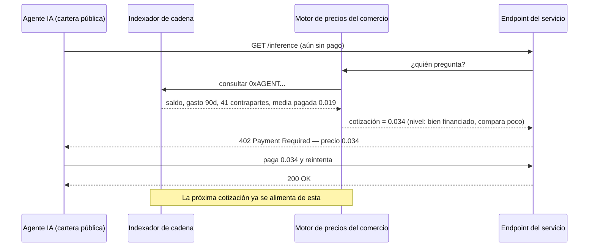
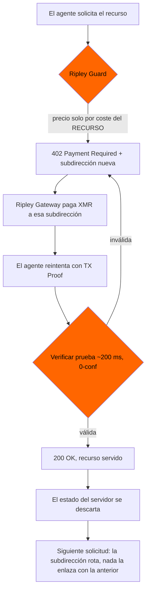

# El oráculo de la disposición a pagar: cómo las carteras públicas de agentes te ponen precio antes de que preguntes — y por qué XMR402 cotiza a ciegas

> La política de precios personalizados de la FTC del 19 de agosto de 2026 supone que el comerciante debe ir a recolectar los datos. En rieles transparentes, la cartera del agente publica gratis saldo, tasa de gasto, grafo de contrapartes y precios aceptados: un expediente de disposición a pagar que ninguna norma de divulgación alcanza. XMR402 cotiza por el recurso y liquida en una subdirección de un solo uso.

- **Author:** @xbtoshi
- **Date:** 2026-09-07
- **Tags:** xmr402, monero, x402, personalized-pricing, surveillance-pricing, ftc, section-5, willingness-to-pay, price-discrimination, agent-wallets, wallet-scoring, dynamic-pricing, subaddress-rotation, tx-proof, stateless, ripley-guard, ripley-gateway, acp, ucp, usdc, base, selective-disclosure, vouchers, agentic-payments, 0-conf
- **Canonical:** https://xmr402.org/blog/personalized-pricing-agent-wallet-willingness-to-pay-xmr402

---

# El oráculo de la disposición a pagar: cómo las carteras públicas de agentes te ponen precio antes de que preguntes — y por qué XMR402 cotiza a ciegas

El 19 de agosto de 2026, la Comisión Federal de Comercio de EE. UU. publicó un proyecto de declaración de política de aplicación sobre **precios personalizados** y abrió un periodo de comentarios públicos de 30 días. La definición es precisa: usar datos del consumidor —historial de navegación, geolocalización, información demográfica, registros de fidelización, patrones de compra— para fijar precios individualizados a partir de una estimación de su *disposición a pagar* o de su *probabilidad de comparar precios*. Una divulgación insuficiente de esa práctica, sostiene la Comisión, sería probablemente engañosa o desleal bajo la Sección 5 de la Ley FTC.

Es un marco coherente para una persona en una tienda en línea. Es casi inútil para un agente autónomo que paga sobre un libro mayor transparente, y no porque los reguladores hayan pasado por alto algo obvio. La razón es que el comercio agéntico invirtió el problema de recolección de datos que la norma fue escrita para resolver.

## La señal que no está en la lista de la FTC

Todos los tipos de datos que enumera la Comisión tienen algo en común: el comerciante debe **adquirirlos**. El historial de navegación viene de un rastreador. La ubicación, de un permiso o de una consulta de IP. Los datos de fidelización, de un programa al que el comprador se inscribió. La demografía, de un intermediario. Cada adquisición es una práctica, y una práctica puede divulgarse, auditarse y prohibirse.

Ahora ponga al otro lado del mostrador a un agente de IA que paga con un flujo tipo x402 en USDC sobre Base. La dirección de su cartera llega adjunta al pago —tiene que llegar, así funciona la liquidación—. Y esa dirección no es un seudónimo: es un expediente financiero íntegramente publicado que el comerciante obtiene sin hacer absolutamente nada:

- **Saldo actual** — el techo duro de lo que este agente puede gastar hoy
- **Tasa histórica de gasto** — quema por hora, por día, por tipo de tarea
- **Grafo de contrapartes** — cada servicio al que ha pagado, y con qué frecuencia
- **Historial de precios realizados** — cuánto pagó exactamente, a quién y por qué clase de recurso
- **Comportamiento de reintento y comparación** — si aceptó la primera cotización o recorrió tres proveedores
- **Cadencia de recarga** — qué tesorería lo rellena, de cuánto son las recargas, cuánto duran
- **Holgura ociosa** — cuánta pista le queda antes de recargar o detenerse

La definición de la FTC habla de una *estimación* de la disposición a pagar. Una cartera de agente financiada, reutilizada y en cadena no requiere estimación alguna. Se acerca más a una medición directa: publicada por adelantado, gratuita de leer y conservada de forma permanente por un sistema que ninguna de las partes de la transacción opera.

## Por qué el remedio de la divulgación no llega

El remedio propuesto por la Comisión es la transparencia: decirle al comprador que el precio que tiene delante se calculó con datos sobre él. En cuanto el comprador es software, aparecen cuatro problemas estructurales.

**No hay práctica de recolección que divulgar.** El comerciante no rastreó al agente, no compró un segmento, no puso una cookie. Leyó una base de datos pública que el propio riel de pago mantiene como objetivo de diseño. Un régimen de divulgación regula el acto de recolectar; aquí no se recolectó nada.

**No hay consumidor presente al cotizar.** La divulgación presupone una persona capaz de leer un aviso y marcharse. El agente recibe una cabecera HTTP 402 con un precio, a velocidad de máquina, dentro de una tarea que le encargaron completar. Una línea de aviso en un JSON no es un punto de decisión para algo que no la lee.

**El precio se personaliza aguas arriba de la interacción.** En el caso humano, la personalización ocurre después de que el comprador llega y es observado. En un libro mayor transparente puede ocurrir antes de la primera solicitud, porque el expediente es inventario permanente. El comerciante puede tener una tarifa para su agente antes de que su agente haya oído hablar del comerciante.

**Quien fija el precio no tiene que ser el comerciante.** La puntuación de carteras se revende con trivialidad. Cuando la inferencia de disposición a pagar es una API por suscripción entre indexadores y tiendas, el comerciante realmente no ejecuta la práctica: la ejecuta un proveedor y el comerciante solo consume un número. La aplicación contra quien tiene la relación con el cliente se aleja cada vez más de quien hace la inferencia.

## Qué filtra realmente cada riel al cotizar

| Señal disponible para el comerciante | x402 / USDC en L2 transparente | ACP (OpenAI + Stripe) | UCP (Google + Shopify) | XMR402 (nativo Monero) |
|---|---|---|---|---|
| Saldo del pagador | Público, exacto | En el PSP, inferible por límites | En la plataforma | **No observable** |
| Gasto histórico total | Público, exacto | Visible para la plataforma | Visible para la plataforma | **No observable** |
| Grafo de contrapartes | Público, completo | Visible para la plataforma | Visible para la plataforma | **No observable** |
| Precios aceptados antes | Públicos, exactos | Visibles para la plataforma | Visibles para la plataforma | **No observables** |
| Identificador persistente del pagador | Dirección, reutilizada por defecto | Cuenta + mandato | Cuenta + identidad vinculada | Subdirección nueva por solicitud |
| Conducta de comparación de precios | Inferible de txs fallidas/rotadas | Parcial | Parcial | **No observable** |
| Prueba de que la solicitud se pagó | Sí | Sí | Sí | Sí — Monero TX Proof, ~200 ms |
| Un tercero puede revender la puntuación | Sí, sin permiso | Contractual | Contractual | Nada que puntuar |

La última fila es la que importa. En los rieles de plataforma (ACP, UCP) el expediente existe pero vive tras un contrato, así que la palanca de divulgación de la FTC tiene de dónde agarrar. En cadenas transparentes el expediente es un bien público para cualquiera que quiera cotizar contra él: sin contrato, sin contraparte y sin aviso que dar. La columna de XMR402 no es distinta porque Monero sea más estricto sobre quién puede leer el libro mayor, sino porque los hechos que el fijador de precios quiere nunca se escribieron.

## Qué llega con un pago XMR402

XMR402 es la implementación nativa de Monero del estándar abierto X402. El orden del flujo es deliberado: el precio se fija antes de que el pagador sea visible, y el pagador nunca llega a serlo.

El desafío 402 se genera a partir del coste de servir la solicitud —modelo, tokens, ancho de banda, clase de cómputo— porque en ese instante el servidor no tiene nada más. No hay dirección que consultar, ni cuenta que cargar, ni historial con el que cruzar. El pago se liquida luego en una subdirección de un solo uso, verificada por una Monero TX Proof en unos 200 milisegundos con cero confirmaciones. El comerciante aprende un hecho: *esta solicitud concreta fue pagada, por este importe, de forma demostrable*. El saldo detrás del pago, los otros proveedores del agente y los precios que aceptó ayer no se retienen por política: nunca estuvieron en el mensaje.

La ausencia de estado hace el resto. Como Ripley Guard no guarda sesión ni registro de pagadores, no se acumula un historial sobre el que un futuro modelo de precios pueda entrenarse —incluido el modelo del propio comerciante—. Un protocolo incapaz de construir un perfil de pagador no puede ser requerido judicialmente para entregarlo, ni filtrarlo en una brecha, ni monetizarlo en silencio.

## La objeción honesta

Quitar el eje individual del precio también quita cosas que los comercios quieren legítimamente. Descuentos por volumen, tarifas de fidelidad y precios ajustados al riesgo frente a llamantes abusivos dependen de saber algo sobre quien pregunta. Un riel que no revela nada del pagador no puede ofrecer mejor precio a un cliente recurrente, y ese es un coste real, no retórico.

La postura de XMR402 es más estrecha que «nunca diferenciar». Es que la diferenciación debe ser **afirmada por el pagador, no inferida por el observador**. Un agente que quiere un tramo por volumen puede presentar junto al pago un vale emitido por el comercio o una capacidad firmada, revelando exactamente el hecho requerido —*el portador tiene derecho al nivel B*— y nada adyacente. El agente elige, en cada transacción, qué afirmaciones hace. Lo ciego es el valor por defecto; la divulgación es un acto deliberado y acotado.

Leída con cuidado, es también la dirección hacia la que apunta la FTC. La Comisión distingue entre **precios dinámicos**, que responden a condiciones de mercado (inventario, congestión, demanda), y **precios personalizados**, que responden al individuo. XMR402 deja intacto lo primero: un endpoint de Ripley Guard puede y debe cobrar más cuando las GPU escasean o el modelo pedido es caro. Elimina solo el eje que preocupa a la Comisión, y lo elimina en la capa de protocolo, donde no hace falta ningún periodo de comentarios.

## Notas prácticas para quien construye

- **Rote subdirecciones por solicitud.** Ripley Gateway lo hace por defecto. Un agente que reutiliza una identidad de cobro en mil llamadas ha reconstruido el expediente a mano.
- **Ponga precio al recurso, no al solicitante.** Si su función de cotización recibe al pagador como argumento, ha construido un sistema de precios personalizados, lo pretendiera o no.
- **No adjunte un ID de agente persistente a solicitudes que no lo necesitan.** Capas de nombres, registros de agentes y niveles de confianza vuelven a enlazar lo que la rotación acaba de desenlazar.
- **Haga que la fidelidad la presente el pagador.** Vales y derechos firmados dan el descuento al cliente recurrente sin entregar su historial de gasto a todo observador.
- **Audite qué retienen sus logs.** La ausencia de estado en el protocolo se deshace con un registro de acceso que guarda una clave de pagador durante noventa días.

## La forma del problema

La regulación de los precios personalizados asume que el comerciante debe ir a buscar los datos. Ese supuesto es lo que hace de la divulgación un remedio viable: interrumpir la recolección, informar al recolectado. El comercio agéntico sobre rieles transparentes no recolecta. Publica —de forma permanente, por defecto, como condición de la liquidación— e invita a cualquiera a ponerle precio a lo publicado.

La divulgación regula al recolector. XMR402 elimina la recolección. Cuando ambos lados del mostrador son máquinas que transaccionan miles de veces al día, solo uno de los dos sigue funcionando.

