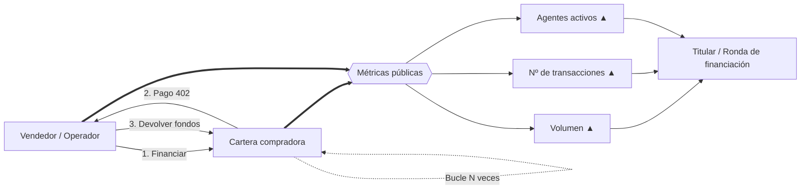
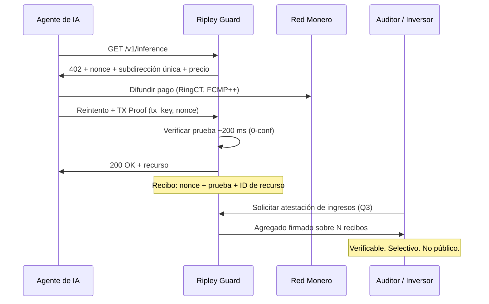

# La métrica espejismo: por qué la mitad del «volumen» de pagos agénticos es wash trading — y qué cuenta XMR402 en su lugar

> Los contadores brutos de x402 marcaban 165 millones de transacciones, pero el filtro de wash trading de Artemis redujo el volumen a 30 días a 1,6 millones frente a unos 28.000 dólares diarios de demanda real. Un registro prueba que el dinero se movió, no que se prestó un servicio. XMR402 sustituye el contador público por recibos Monero TX Proof en manos del comerciante.

- **Author:** @xbtoshi
- **Date:** 2026-09-06
- **Tags:** xmr402, monero, x402, wash-trading, artemis, on-chain-metrics, phantom-volume, agentcore-payments, aws, bedrock, mastercard-agent-pay, xrpl, t54, chainalysis, tx-proof, proof-of-delivery, revenue-privacy, selective-disclosure, fcmp, thorchain, stateless, 0-conf, agentic-payments, ripley-guard
- **Canonical:** https://xmr402.org/blog/phantom-volume-wash-trading-agent-metrics-xmr402

---

# La métrica espejismo: por qué la mitad del «volumen» de pagos agénticos es wash trading — y qué cuenta XMR402 en su lugar

Septiembre de 2026 ha sido un mes espectacular en titulares sobre pagos agénticos. El 5 de septiembre, el XRP Ledger superó los **3.992.146 pagos iniciados por agentes**, con un alza de unos 890.000 en cuatro días. El **18 de agosto AWS llevó Amazon Bedrock AgentCore Payments a disponibilidad general**, permitiendo que los agentes descubran y paguen APIs y servidores MCP con unas pocas líneas de código. Mastercard lanzó *Agent Pay for Machines* en junio. Chainalysis contabilizó **100 millones de pagos agénticos en Base**.

Y luego está la cifra que nadie pone en una diapositiva: **unos 28.000 dólares de volumen diario medio**, de los cuales aproximadamente la mitad circula entre carteras que se pagan a sí mismas.

Un analista de Artemis Analytics construyó un filtro de wash trading para x402 —marcando carteras que operaban repetidamente consigo mismas o que reciclaban fondos entre un círculo reducido de direcciones— y la cifra ajustada a 30 días quedó en **1,6 millones de dólares**, frente a un dato bruto muchas veces mayor. Su veredicto fue tajante: el auge de los pagos agénticos sigue siendo, en su mayor parte, un espejismo.

Este artículo no es una vuelta de honor. Es un argumento de que toda la industria, XMR402 incluido, está midiendo lo que no debe — y de que la métrica a la que recurrimos es un artefacto directo de construir sobre libros contables transparentes.

## Cómo se fabrica una economía de agentes

La mecánica es trivial y casi gratuita. En una cadena de comisiones bajas, un vendedor financia una cartera compradora, la compradora «paga» por un recurso, y los fondos vuelven en círculo. Repítase unos cientos de miles de veces. Cada vuelta acuña un recuento de transacciones, un dólar de volumen y un «agente activo» — y ninguno corresponde a un servicio que alguien quisiera.

El pico de febrero de 2026 —3,8 millones de transacciones y unos 2 millones de dólares de volumen en un solo día— se atribuyó después en gran medida a pruebas de infraestructura. En abril, los contadores brutos marcaban 165 millones de transacciones repartidas entre 69.000 agentes activos, de las cuales los analistas estimaban que cerca de la mitad eran pruebas y no comercio.

Nada de esto exige mala fe. Pruebas de carga, demos, filtraciones de testnet y suites de integración producen artefactos on-chain idénticos a los del comercio real. Ese es exactamente el problema.

## La transparencia detecta la falsificación. No la impide.

La réplica obvia es que *sabemos* del wash trading precisamente porque el libro contable es público. Cierto, y conviene reconocerlo. Una cadena transparente le dio a Artemis la superficie forense para construir el filtro.

Pero fíjese en lo que la transparencia compró realmente:

- Dio a los analistas **detección a posteriori**, no prevención. Las operaciones falsas se liquidaron igual, contaron igual y ocuparon titulares durante meses.
- Dio a cada competidor una vista permanente de los ingresos de los comerciantes **genuinos**. La misma consulta que desenmascara una economía falsa revela también los ingresos por endpoint de una API real, su concentración de clientes y su curva de crecimiento.
- No hizo nada por cerrar la brecha que hace posible la falsificación: **una entrada en el libro prueba que el dinero se movió. No prueba que se prestara un servicio.**

Esa última frase es todo el argumento. El volumen on-chain es un indicador indirecto de demanda que se ha desacoplado por completo de la demanda. Cualquier métrica que pueda acuñarse moviendo el propio dinero en círculo acabará siendo acuñada por alguien con incentivos para hacerlo — y en un sector donde unos 7.000 millones de dólares de capital persiguen un mercado de 28.000 dólares al día, el incentivo es enorme.

## Lo que cuenta XMR402: entrega, no movimiento

XMR402 no publica un contador de volumen, y estructuralmente no puede hacerlo. La capa base de Monero oculta importes (RingCT), destinatarios (direcciones sigilosas) y —desde el **hard fork FCMP++ de agosto de 2026**— el origen, dentro de un conjunto de anonimato de más de 100 millones de salidas, con pruebas de menos de 2,8 KB verificables en unos 18 ms.

¿Qué sustituye entonces al número? El **recibo**.

Cada petición XMR402 es un desafío-respuesta. Ripley Guard emite un 402 con un nonce, un importe y una subdirección de un solo uso vinculada a esa petición concreta. El agente paga y luego presenta una **Monero TX Proof**: una firma que demuestra el conocimiento de la clave de transacción de un pago a *esa* subdirección. La verificación tarda ~200 ms con cero confirmaciones, y el comerciante acaba con un objeto criptográfico que ata cuatro cosas a la vez:

1. Un pago real en Monero, con comisión pagada
2. A una subdirección de un solo uso que nadie más controla
3. Contra un nonce emitido por el servidor e irrepetible
4. Por un recurso concreto que sí fue servido

Para falsificar esto, un operador tendría que gastar XMR reales contra sus propios nonces — pagando comisiones de red genuinas para inflar una cifra que **ningún tercero puede ver de todos modos**. La economía se invierte: en una cadena transparente, falsear volumen es barato y el premio es un número público. En XMR402, falsearlo es caro y el premio es nada, porque el número nunca fue público.

Los ingresos pasan a ser **divulgables por elección**: un comerciante demuestra sus cifras a un auditor, un inversor o una autoridad fiscal firmando un agregado sobre los recibos que posee. La contraparte verifica contra la cadena de Monero. El competidor de al lado no se entera de nada.

## Qué prueba realmente una «transacción»

| | x402 / USDC en Base | ACP (OpenAI + Stripe) | MPP / Tempo | AgentCore Payments | **XMR402** |
|---|---|---|---|---|---|
| Qué prueba un registro | Los fondos se movieron entre direcciones | Pedido cursado vía procesador | Fondos movidos en cadena permisionada | Pago orquestado entre raíles | **Desafío respondido + recurso servido** |
| Coste de fabricar volumen falso | Casi cero | Comisiones de tarjeta + escrutinio | Casi cero dentro del círculo | Hereda el raíl subyacente | **Importe íntegro en XMR + comisiones reales, con ganancia visible nula** |
| Quién puede auditar los datos brutos | Cualquiera, para siempre | Procesador + comerciante | Validadores (permisionados) | AWS + proveedores de cartera | **El comerciante y quien él elija** |
| Los ingresos reales del comerciante son | Públicos | Visibles al procesador | Visibles al validador | Visibles al proveedor | **Privados por defecto** |
| ¿Entrega vinculada al pago? | No | Parcialmente (objeto de pedido) | No | Capa de políticas, off-chain | **Sí — el nonce ata ambos** |
| Latencia de verificación | ~2–12 s de confirmación | Segundos a días | Sub-segundo, permisionado | Depende del raíl | **~200 ms, 0-conf** |
| Comisión de protocolo | Según el facilitator | Comisión del procesador | Comisión de cadena | AWS + raíl | **Cero** |

## Por qué esto debería preocupar a todos, no solo a los defensores de la privacidad

El sector de los pagos agénticos está asignando capital contra una métrica cuya fabricación cuesta menos que un error de redondeo. No es un fallo moral de ningún protocolo concreto: es una consecuencia de diseño. Si lo único que su raíl sabe medir es dinero moviéndose, entonces dinero moviéndose en círculo es indistinguible de un mercado.

La solución no es mejor analítica. Es una unidad de cuenta más sólida: **un recibo de que se prestó un servicio**, firmado por ambas partes, verificable a demanda y sin valor alguno si se falsifica.

La actualización de Monero de agosto de 2026 —y la integración nativa de XMR en THORChain el 24 de agosto, que restauró un raíl de liquidez descentralizado tras los deslistados en exchanges— significan que la capa base está por fin lista para sostener ese modelo a escala de máquinas. La tarea de XMR402 es hacer que lo digno de reportar sea el recibo, no el contador.

Cuando los agentes superen en número a los humanos en la red, la pregunta que importará no será *cuántos pagos ocurrieron*, sino *cuántos de ellos compraron algo real*. Solo una de esas preguntas tiene respuesta criptográfica.

---

*XMR402 es la implementación nativa en Monero del estándar abierto de pagos X402. Cero comisiones de protocolo, verificación 0-conf en ~200 ms mediante Monero TX Proof, sin estado y agnóstico al transporte. Más información en [xmr402.org](https://xmr402.org).*
