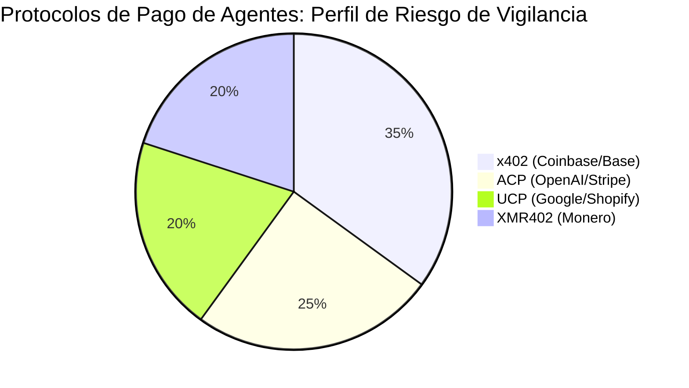
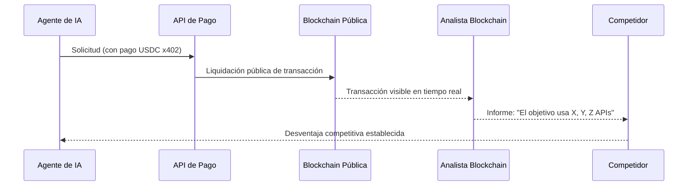

# El Impuesto de la Vigilancia: Por Qué los Agentes de IA No Pueden Permitirse Rastros de Pago Transparentes

> Los protocolos de pago de agentes basados en stablecoins crean rastros de vigilancia públicos y permanentes. Descubra por qué los pagos que preservan la privacidad a través de XMR402 no son opcionales — son infraestructura esencial para la economía agéntica.

- **Author:** @xbtoshi
- **Date:** 2026-03-18
- **Tags:** privacy, surveillance, XMR402, x402, Monero, agentic-economy, KYA, machine-payments, competitive-intelligence
- **Canonical:** https://xmr402.org/blog/privacy-vs-surveillance-agent-economy

---

# El Impuesto de la Vigilancia: Por Qué los Agentes de IA No Pueden Permitirse Rastros de Pago Transparentes

Cuando Coinbase y Cloudflare anunciaron la Fundación x402 a principios de 2026, los titulares celebraron una nueva era del comercio máquina a máquina. Los analistas proyectaron una economía agéntica de $3–5 billones para 2030. Sin embargo, bajo el entusiasmo se oculta una verdad incómoda: cada pago en stablecoin que realiza un agente de IA en una blockchain pública queda registrado permanente, inmutable y públicamente, visible para cualquier persona en el mundo.

Esto no es un detalle técnico menor. Es un defecto estructural que convierte el historial de pagos de cada agente de IA en inteligencia competitiva de código abierto. Lo llamamos el **impuesto de vigilancia**: el costo oculto que paga cada agente por operar en rieles transparentes.

## El Problema de las Blockchains Transparentes

Cuando un agente de IA usa x402 (Coinbase), ACP (OpenAI/Stripe) o UCP (Google/Shopify) para pagar servicios, esas transacciones se liquidan en blockchains públicas. Cada pago está:

- **Permanentemente registrado** en un libro mayor inmutable visible para todo el mundo
- **Consultable públicamente** por cualquier tercero
- **Analíticamente vinculable** entre wallets y a lo largo del tiempo
- **Competitivamente expuesto** — revelando qué APIs y servicios usa el agente

## Comparación de Protocolos de Pago de Agentes

| Característica | x402 (Coinbase) | ACP (OpenAI/Stripe) | UCP (Google/Shopify) | XMR402 |
|---|---|---|---|---|
| **Privacidad por defecto** | ❌ Blockchain pública | ⚠️ Libro corporativo | ⚠️ Semicentralizado | ✅ Criptográfica |
| **Latencia de verificación** | ~2–5s | ~1–3s | ~1–3s | 200ms (0-conf) |
| **Comisiones de protocolo** | Gas + intermediario | Stripe % | Comisión plataforma | Cero |
| **Resistencia a censura** | Media | Baja | Baja | Máxima |
| **Exposición a vigilancia** | Máxima | Media | Media | Cero |
| **Arquitectura sin estado** | Sí | No | No | Sí |

## Cómo el Rastro de Pagos se Convierte en Vulnerabilidad

Con XMR402, esta cadena se rompe completamente. El mecanismo Monero TX Proof permite al servidor verificar un pago en menos de 200 milisegundos, sin comisiones de protocolo y sin transmitir metadatos vinculables al público. El pago ocurrió. La prueba es criptográficamente válida. Los detalles no son asunto de nadie más.

## El Problema KYA: Vigilancia Disfrazada de Seguridad

La respuesta de la industria ha sido promover marcos «Conoce a Tu Agente» (KYA). En la práctica, esto crea puntos de control centralizados que concentran el poder de vigilancia en Coinbase, Stripe y Google. La Fundación x402, controlada por Coinbase y Cloudflare, encarna exactamente este modelo.

La arquitectura de XMR402 invierte completamente este modelo. La criptografía de Monero maneja la privacidad a nivel de protocolo, sin registro de identidad centralizado ni intermediarios de vigilancia. Solo prueba criptográfica de que el valor se transfirió.

**Ripley Guard** verifica Monero TX Proof en 200ms del lado del servidor. **Ripley Gateway** ejecuta pagos automáticamente del lado del agente. **Ripley Terminal** brinda una interfaz de escritorio para operadores humanos sin exponer datos al mundo.

Sin cuentas. Sin claves API. Sin huellas en blockchain. Sin impuesto de vigilancia. Solo prueba criptográfica de que el valor se movió, verificada en 200 milisegundos, y nada más filtrándose.
