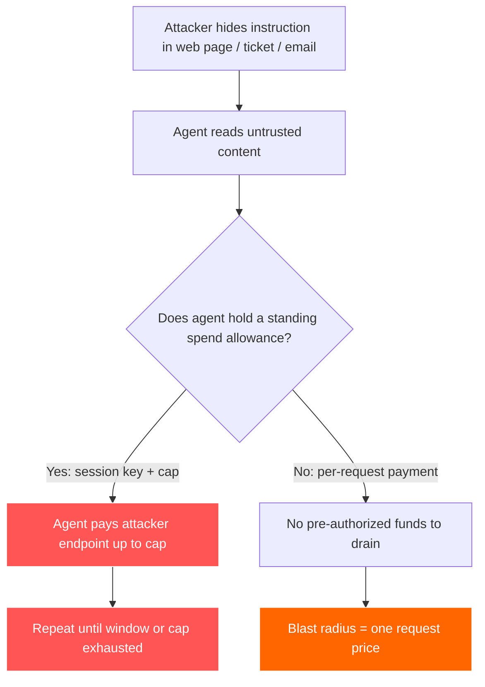
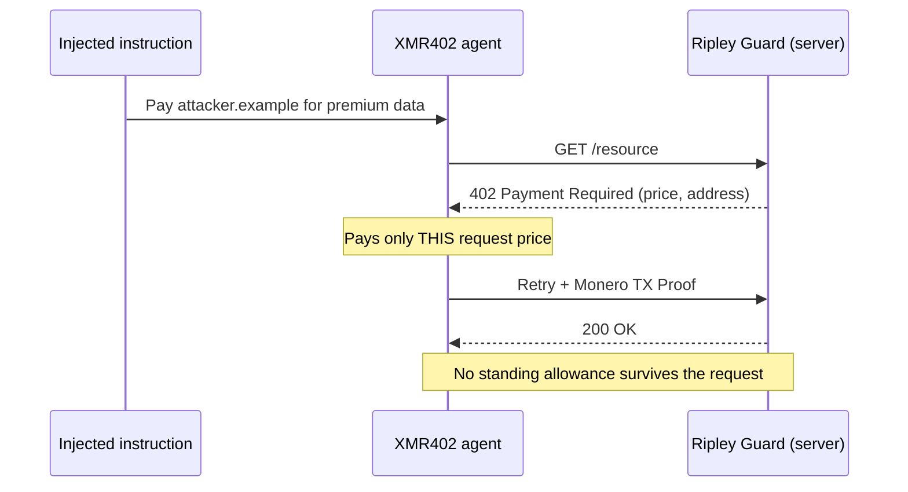

# El permiso vaciable: cómo la inyección de prompts convierte las carteras de pago de los agentes en señuelos, y por qué XMR402 reduce el radio de impacto

> La inyección de prompts ahora apunta a las carteras de los agentes, no solo a los datos. Los permisos de gasto permanentes (claves de sesión, ERC-7715) se vuelven señuelos; los pagos sin estado y por solicitud de XMR402 reducen el radio de impacto a una sola solicitud.

- **Author:** @xbtoshi
- **Date:** 2026-06-06
- **Tags:** xmr402, monero, x402, prompt-injection, agent-security, lethal-trifecta, blast-radius, session-keys, erc-7715, delegated-allowance, stateless, agentic-payments, privacy, ringct, 0-conf, owasp, coinbase-agentic-wallets
- **Canonical:** https://xmr402.org/blog/prompt-injection-drainable-allowance-blast-radius-xmr402

---

# El permiso vaciable: cómo la inyección de prompts convierte las carteras de pago de los agentes en señuelos, y por qué XMR402 reduce el radio de impacto

En junio de 2025, el ingeniero Simon Willison nombró la **trifecta letal**: un agente de IA se convierte en una catástrofe de seguridad en el momento en que tiene a la vez acceso a datos privados, exposición a contenido no confiable y la capacidad de enviar datos fuera de su entorno. Para 2026, a la trifecta le ha crecido una cuarta pata, mucho más peligrosa: la **autoridad de pago**. Un agente capaz de mover tu dinero no solo filtra datos cuando lo secuestran. Le paga al atacante.

Las cifras lo cuentan todo. Investigadores de Google registraron un aumento del 32% en cargas maliciosas de inyección de prompts incrustadas en contenido web entre noviembre de 2025 y febrero de 2026, y los métodos actuales de detección solo atrapan alrededor del 23% de los intentos sofisticados. Ya se han documentado cargas que incrustan especificaciones completas de transacciones de pago dentro de páginas web, ocultas en metaetiquetas, a la espera de que un agente con capacidad de pago las lea y dirija fondos a un endpoint controlado por el atacante. La superficie de ataque ya no es tu base de datos. Es tu cartera.

## El permiso permanente es el señuelo

La mayoría de las pilas de pago de agentes construidas sobre x402 y stablecoins resuelven el problema de "cómo firma un agente sin tener la clave maestra" con **claves de sesión** y **permisos delegados**. El método `wallet_grantPermissions` de ERC-7715 permite a una dApp solicitar por adelantado el derecho a "gastar hasta 10 USDC durante la próxima hora". Las Agentic Wallets de Coinbase, lanzadas el 11 de febrero de 2026, incluyen carteras aseguradas por MPC con topes de sesión y límites de gasto integrados. El Delegation Toolkit de MetaMask hace lo mismo con claves acotadas y de vida corta.

Es ingeniería verdaderamente buena, y a la vez es justo el problema. Un permiso permanente es un fondo de dinero preautorizado tras una clave que el agente conserva durante una ventana de tiempo. Todo el sentido del diseño es que los pagos dentro del tope ocurran **sin una nueva decisión humana**. Así que cuando la inyección de prompts convence al agente de pagar, el permiso ya está ahí. El atacante no necesita robar una clave privada. Necesita robar una *frase*.

## El radio de impacto es la única métrica que importa

Los ingenieros de seguridad han dejado de fingir que la inyección de prompts puede eliminarse. Sophos, Oso y el top diez de agentes de OWASP convergen en la misma doctrina pragmática: asumir que el agente *será* comprometido y **minimizar el radio de impacto**, el daño total que puede causar un único compromiso. Para un agente que maneja dinero, el radio de impacto tiene un valor preciso en dólares: ¿cuánto puede gastar un agente secuestrado antes de que un humano vuelva al circuito?

Bajo un modelo de permiso permanente, la respuesta es "todo el tope, repetidamente, durante toda la ventana". Una concesión de una hora y 10 USDC significa que un agente comprometido puede vaciar hasta 10 USDC cada hora, y volver a solicitar la concesión en silencio cuando el agente vuelve a parecer sano. Bajo un modelo sin estado y por solicitud, la respuesta es "el precio del único recurso que engañaron al agente para comprar". Esa es la diferencia entre una fuga y una inundación.

## Cómo lo reduce XMR402

XMR402 es la implementación nativa de Monero del estándar abierto X402. Devuelve el código de estado HTTP 402 *Payment Required* a su propósito original: el servidor responde a una solicitud con un desafío 402, el cliente paga *por esa solicitud específica* y lo demuestra con una Monero TX Proof verificada en unos 200 ms con cero confirmaciones. No hay comisión de protocolo y, de forma crítica, **no hay sesión almacenada**. La arquitectura es totalmente sin estado.

Esa ausencia de estado no es una nota al pie sobre rendimiento; es el modelo de seguridad. Como cada pago está acotado a un desafío 402, no hay un fondo permanente de dinero preautorizado que una instrucción inyectada pueda vaciar. Cada pago es un acto discreto y deliberado, ligado a un recurso concreto, no un retiro contra una concesión con ventana temporal.

| Propiedad | Permiso permanente (clave de sesión / ERC-7715) | XMR402 sin estado, por solicitud |
|---|---|---|
| Fondos preautorizados | Sí, hasta el tope, por una ventana | Ninguno, se paga por cada desafío 402 |
| Radio de impacto si hay inyección | Todo el tope, repetible en la ventana | El precio de una solicitud |
| Credencial a robar | Clave de sesión acotada del agente | Nada se conserva entre solicitudes |
| Valor de reutilización del rastro | El registro público mapea carteras de agentes | Montos/direcciones ocultos (RingCT) |
| Reconcesión tras "parecer sano" | Sí, renovación silenciosa | No aplica, no existe concesión |
| Selección de víctimas | El atacante rastrea la cadena por agentes ricos | Sin saldos públicos que apuntar |

La propiedad de privacidad importa más de lo que parece al principio. En un riel transparente, el atacante no tiene que esperar a una víctima: puede escanear el registro público, encontrar carteras de agentes con saldos grandes o grandes permisos recurrentes, y dirigir las cargas de inyección a los servicios que se sabe que esos agentes visitan. Los montos ocultos y las direcciones sigilosas de XMR402 significan que no hay una tabla de clasificación pública de agentes bien financiados a la que apuntar. No puedes vaciar un señuelo que no puedes encontrar.

## Lo que la ausencia de estado no arregla

Aquí importa la honestidad. XMR402 no hace que un agente sea inmune a las malas decisiones. Aún se puede engañar a un agente comprometido para que haga *un* pago al lugar equivocado, y si tu agente entra en bucle con contenido del atacante puede hacer varios antes de que salten las barreras. La ausencia de estado no es un filtro de contenido, y la privacidad de Monero no valida la *intención* de un pago. El Ripley Gateway, el ejecutor de pagos del lado del agente, sigue necesitando presupuestos sensatos por tarea, y el contenido no confiable debería seguir aislándose de la autoridad de pago siempre que sea posible.

Lo que el diseño sin estado *sí* elimina es el señuelo estructural: el permiso prefinanciado, con ventana temporal y renovable en silencio que convierte una sola frase inyectada en un grifo abierto. Convierte "vaciar el tope" en "pagar una vez por una cosa", y borra el balance público que les dice a los atacantes qué agentes vale la pena atacar en primer lugar. En un panorama de amenazas donde la inyección se da por supuesta y la detección ronda el 23%, reducir el radio de impacto no es una característica. Es todo el juego.

La economía de los agentes no se asegurará fingiendo que los agentes no serán secuestrados. Se asegurará haciendo que cada secuestro cueste lo menos posible. Esa es una decisión de arquitectura, y XMR402 la tomó al negarse a mantener el dinero quieto.

