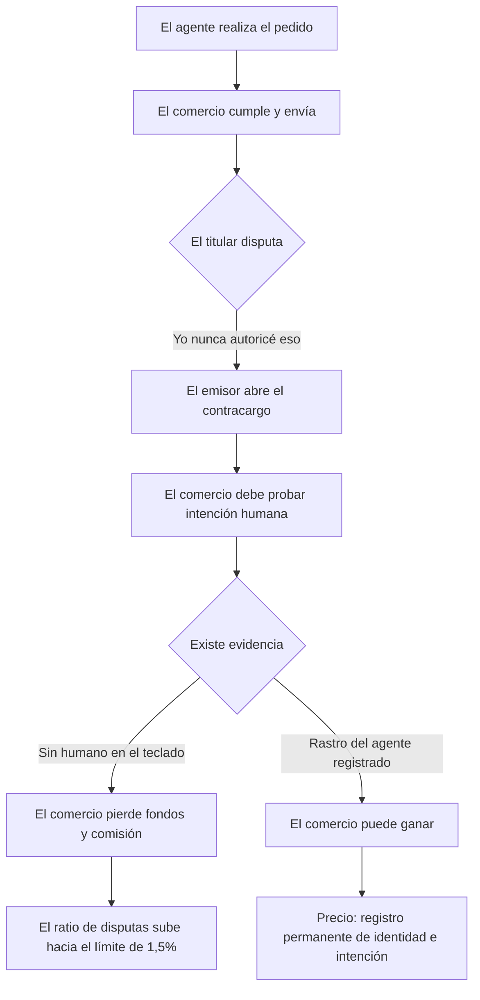
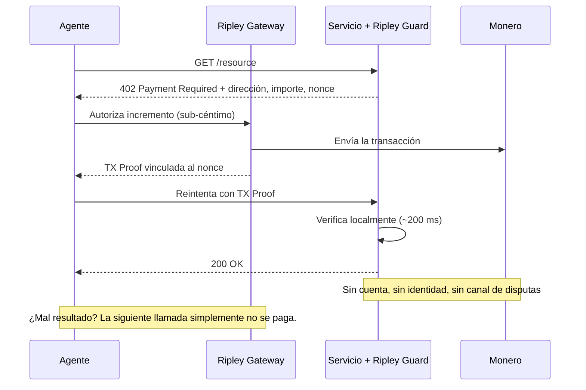

# La paradoja de la reversión: por qué el comercio agéntico no puede decidir si un pago es definitivo — y por qué XMR402 nunca tuvo que preguntarlo

> ACP deja la responsabilidad del contracargo al comercio mientras las stablecoins incorporan un interruptor blacklist(address). El comercio agéntico heredó ambas respuestas sobre reversibilidad y no resolvió ninguna. XMR402 esquiva el debate encogiendo el pago hasta que disputar deja de ser económico.

- **Author:** @xbtoshi
- **Date:** 2026-09-04
- **Tags:** xmr402, monero, x402, acp, agentic-commerce, chargebacks, dispute-liability, merchant-of-record, finality, irreversibility, usdc, blacklist, stablecoin-freeze, visa-tap, mastercard-agent-pay, ap2, tx-proof, stateless, micropayments, privacy, 0-conf
- **Canonical:** https://xmr402.org/blog/reversal-paradox-chargeback-freeze-finality-xmr402

---

# La paradoja de la reversión: por qué el comercio agéntico no puede decidir si un pago es definitivo — y por qué XMR402 nunca tuvo que preguntarlo

Todo sistema de pagos de la historia ha tenido que responder una pregunta antes que cualquier otra: **¿esto se puede deshacer?**

Las redes de tarjetas respondieron que sí. Esa respuesta construyó la confianza del consumidor y construyó el contracargo: un mecanismo por el cual el pagador, meses después, puede revertir una transacción completada y obligar al comercio a demostrar que la compra fue intencionada. Las blockchains públicas respondieron que no. Esa respuesta dio certeza al comercio y produjo el ticket de soporte que dice «lo sentimos, no podemos hacer nada».

El comercio agéntico, en 2026, ha logrado heredar ambas respuestas a la vez — y no resolver ninguna.

## Bando uno: el comercio carga con todo

Lea con atención la especificación de pago delegado del Agentic Commerce Protocol (ACP) y una sola frase hace todo el trabajo. OpenAI **no** es el merchant of record. La liquidación, los reembolsos, los contracargos y el cumplimiento normativo siguen siendo del comercio y de su proveedor de pagos.

No es un resquicio. Es el diseño. ACP define cómo un agente ejecuta un checkout contra un comercio que el agente no posee, y luego deja al comercio exactamente donde siempre estuvo cuando la transacción se tuerce. La plataforma del agente orquesta. El comercio absorbe.

El momento lo vuelve más agudo de lo que suena. Se proyecta que el volumen de contracargos crezca alrededor de un 24% entre 2025 y 2028, hacia 324 millones de disputas globales. Mientras tanto, Visa endureció su umbral de ratio de disputas de 2,2% a 1,5% el 1 de abril de 2026.

Aquí está la trampa. Para defender una disputa hay que aportar evidencia de intención. Pero una compra hecha por un agente, por definición, no tiene un humano ante el teclado en el momento de comprar. Así que la respuesta de la industria ha sido **fabricar** evidencia de intención: el Trusted Agent Protocol y los tokens de agente de Visa, Agent Pay de Mastercard, los mandatos firmados de AP2 de Google, Agent Purchase Protection de American Express. Cada uno es un esquema para vincular la acción de un agente a un humano verificado y a un registro duradero y reproducible.

Es una respuesta de ingeniería coherente ante un problema de responsabilidad. También es, funcionalmente, un mandato para vigilar la economía agéntica — y no necesita defender la vigilancia por sus propios méritos, porque llega disfrazada de infraestructura de disputas.

## Bando dos: firmeza con interruptor

El otro bando responde con confianza a la pregunta de la reversibilidad. Las transferencias on-chain liquidan cuando la red las confirma. No hay línea de atención. Un comercio que recibe stablecoins ha recibido un pago final sin riesgo de contracargo.

Es cierto, pero es firmeza con asterisco, y el asterisco está en el código del contrato. La implementación de USDC incluye un módulo `Blacklistable`: un rol designado puede llamar a `blacklist(address)`, y un modificador `notBlacklisted` en las funciones de transferencia revierte cualquier llamada que toque esa dirección. USDT y otros llevan maquinaria equivalente. El pagador no puede revertir el pago. El emisor puede dejar los fondos inertes.

No es hipotético. En marzo de 2026, una orden judicial llevó a Circle a congelar simultáneamente los saldos de dieciséis carteras corporativas. Circle sostiene que USDC no se congela sin orden judicial — un compromiso sobre el **proceso**, no la eliminación de la **capacidad**.

El resumen honesto de la posición stablecoin no es «los pagos son finales». Es: **los pagos son finales para el pagador y discrecionales para el emisor.**

## Los dos modos de fallo, lado a lado

| Propiedad | Agéntico sobre tarjeta (ACP / AP2 / TAP) | Agéntico sobre stablecoin (x402 en Base/Ethereum) | XMR402 |
|---|---|---|---|
| El pagador puede revertir | Sí, hasta ~120 días | No | No |
| El emisor puede congelar | Sí (a nivel de cuenta) | Sí — `blacklist(address)` | No existe emisor |
| Quién absorbe la pérdida | Merchant of record | Quien lo tuviera | No se extendió crédito |
| Evidencia para conservar fondos | Prueba de intención humana | Ninguna | TX Proof criptográfica |
| Coste de privacidad de esa evidencia | Identidad + intención + historial | Entrada pública y permanente | Ninguno — prueba el pago, no al pagador |
| Coste típico de disputa | 15–40 USD por contracargo | No aplica | Económicamente irrelevante |
| Ticket mínimo práctico | ~0,50 USD | ~0,01 USD | Menos de un céntimo |
| Latencia de liquidación | Días a semanas | Segundos a minutos | ~200 ms (0-conf) |

## La respuesta de XMR402: encoger aquello que se disputa

XMR402 no tiene mecanismo de contracargo. Eso por sí solo no sería notable — ningún raíl cripto lo tiene. Lo que hace defendible la posición es que XMR402 combina la irreversibilidad con un **tamaño** y una **granularidad** de pago donde la irreversibilidad deja de dar miedo.

Un contracargo le cuesta al comercio entre 15 y 40 dólares en comisiones antes de que nadie discuta el principal. Esa maquinaria existe porque las transacciones con tarjeta son lo bastante grandes e infrecuentes como para valer un arbitraje. Un pago XMR402 por una llamada a una API, una inferencia o una página rastreada es una fracción de céntimo. No existe un proceso de disputa económicamente racional para un pago de 0,0004 dólares. El remedio correcto ante «el servicio no entregó» no es el arbitraje: es **dejar de pagar en la siguiente llamada**, algo que el agente hace automáticamente, en milisegundos, sin más en juego que el último incremento.

La TX Proof es la elegancia silenciosa de todo esto. Una prueba de transacción de Monero permite al pagador demostrar a un verificador concreto que un pago concreto se realizó, sin revelar a nadie —ni siquiera al verificador— su identidad, su saldo o su historial. El comercio obtiene exactamente la evidencia por la que peleaba bajo ACP (esta petición fue pagada), despojada de la parte que en realidad nunca necesitó (quién pagó y qué más compró este mes).

## Lo que esto no resuelve

Sería deshonesto presentar la irreversibilidad como una victoria pura. Si un servicio pagado con XMR402 cobra y devuelve basura, no hay recurso a nivel de protocolo. Es un coste real y es el mismo coste que carga todo raíl irreversible.

La mitigación es arquitectónica, no judicial. Como los pagos son por llamada y de sub-céntimo, la pérdida máxima ante una contraparte que se porta mal está acotada a un incremento, no al saldo de una cartera ni a una línea de crédito. La reputación, el depósito en garantía y la lógica de reintentos pertenecen a la capa de aplicación, donde se pueden elegir y sustituir, en lugar de estar soldados al protocolo de liquidación, donde se convierten en vigilancia obligatoria para todos.

## La pregunta que nadie hace en voz alta

El debate sobre la reversión parece un desacuerdo técnico sobre semántica de liquidación. No lo es. Es un desacuerdo sobre cuánto del comportamiento de un agente debe quedar registrado para siempre para que un pago se considere legítimo.

El bando uno dice: lo suficiente para ganar una disputa. El bando dos dice: lo suficiente para identificar una dirección, y nos reservamos el derecho de actuar. XMR402 dice: lo suficiente para probar que esta petición concreta fue pagada, y ni un bit más.

Cuando las máquinas transaccionan millones de veces al día, la diferencia entre esas tres respuestas es la diferencia entre una economía que lo recuerda todo sobre cada agente y una que simplemente funciona.
