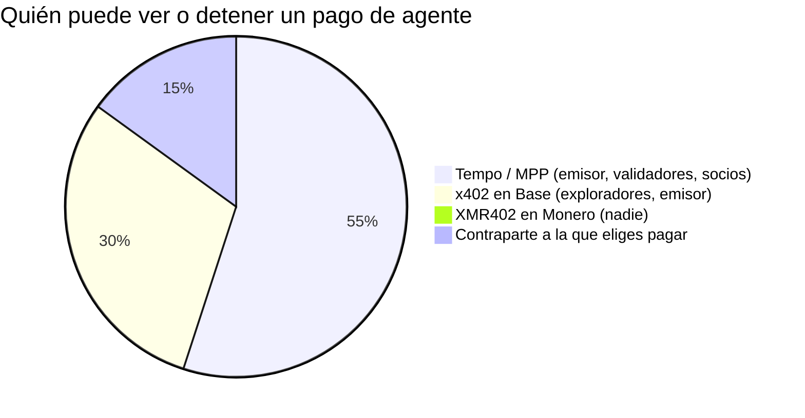
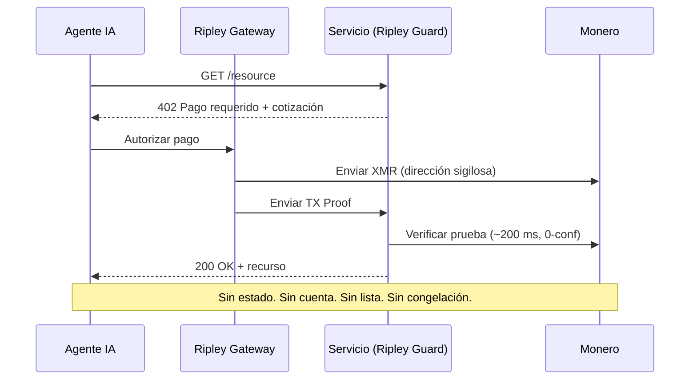

# La cadena corporativa: por qué Tempo de Stripe construye la economía de las máquinas sobre un libro mayor con permisos — y por qué XMR402 se niega a pedir permiso

> Tempo de Stripe y Paradigm lanzó el Machine Payments Protocol sobre un libro mayor con permisos y control corporativo. Por qué una cadena corporativa hace los pagos de agentes observables y congelables, y por qué la liquidación sin permisos de XMR402 en Monero no pide permiso.

- **Author:** @xbtoshi
- **Date:** 2026-06-03
- **Tags:** xmr402, monero, x402, tempo, stripe, paradigm, mpp, machine-payments-protocol, permissioned, permissionless, stablecoin, agentic-payments, privacy, ap2, fido-alliance, censorship-resistance, stateless, 0-conf
- **Canonical:** https://xmr402.org/blog/stripe-tempo-permissioned-chain-machine-economy-xmr402

---

# La cadena corporativa: por qué Tempo de Stripe construye la economía de las máquinas sobre un libro mayor con permisos — y por qué XMR402 se niega a pedir permiso

El 18 de marzo de 2026, la economía de las máquinas obtuvo su raíl insignia. Tempo —la blockchain de pagos respaldada por Stripe y Paradigm— activó su mainnet y lanzó junto a ella el Machine Payments Protocol (MPP). La lista de socios de lanzamiento se lee como un pase de lista de todo el internet comercial: Anthropic, OpenAI, DoorDash, Mastercard, Nubank, Revolut, Shopify y Standard Chartered. Tempo liquida en cualquier stablecoin importante, no cobra un token de gas nativo y está diseñada para que el software pague al software miles de veces por segundo.

Por cualquier métrica de ingeniería es una máquina impresionante. Pero también es una cadena corporativa, y esa distinción es lo más importante que ocurre hoy en los pagos agénticos.

## Una blockchain con tabla de capitalización

La mayoría de las blockchains son producto de incentivos: validadores anónimos protegen la red porque les conviene, y ninguna entidad puede revocar tu capacidad de transaccionar. Tempo invierte eso. Es un libro mayor construido a propósito, con un grupo conocido de inversores, un conjunto conocido de socios y un diseño de validadores optimizado para la previsibilidad empresarial, no para la resistencia a la censura. No entras a Tempo minando: te incorporan a ella.

Una stablecoin es un pasivo en el balance de un emisor; el emisor puede congelar direcciones y lo hace. Un conjunto de validadores con permisos es una lista de empresas con nombre; una lista de empresas con nombre es una superficie para una citación judicial. Y la función estrella de MPP —compras autónomas preautorizadas «sin humano presente»— significa que todo el patrón de gasto de un agente queda registrado contra una cuenta conocida, financiable y congelable.

## Con permisos por diseño vs. sin permisos por defecto

| Propiedad | Tempo + MPP | x402 en Base | XMR402 en Monero |
|---|---|---|---|
| Quién opera el libro mayor | Validadores de Stripe / Paradigm | Secuenciador L2 afín a Coinbase | ~10.000 nodos Monero independientes |
| Permiso para transaccionar | Incorporación / lista blanca | Billetera + KYC en la rampa | Ninguno — abierto por defecto |
| Activo de liquidación | Cualquier stablecoin importante | USDC | XMR (sin emisor) |
| ¿Se puede congelar una dirección? | Sí | Sí | No |
| Visibilidad del pago | Observable por el operador | Público en cadena para siempre | Privado (direcciones sigilosas, RingCT) |
| Comisión de protocolo | La fija el operador | Depende del facilitador | Cero |
| Modelo de confirmación | Finalidad de validadores | Finalidad L2 | 200 ms, 0-conf vía TX Proof |

La economía agéntica no es solo empresas pagando a empresas. Son millones de agentes autónomos cuyos patrones de gasto *son* su estrategia. En una cadena corporativa, esa estrategia es legible para quien opera la cadena corporativa.

## La vigilancia no es un fallo: es el modelo de negocio

Cuando cada pago de máquina cae en un libro mayor con permisos denominado en un activo congelable, se siguen tres cosas. Se filtra la inteligencia de precios: un competidor que observa los flujos reconstruye qué APIs llamas y cuánto pagas. Se filtra el momento estratégico: las compras preautorizadas de MPP revelan exactamente cuándo actúa un agente. Y el apalancamiento se acumula en el operador: quien puede congelar el activo tiene un veto sobre la vida económica de tu agente.

## Por qué XMR402 se niega a pedir permiso

XMR402 es la implementación nativa de Monero del estándar abierto X402. Usa el mismo apretón de manos HTTP 402 «Pago requerido» sobre el que se construyen x402 y MPP —así que habla el idioma nativo de la economía agéntica— pero liquida en una cadena que nadie posee y que no revela nada.

El flujo es deliberadamente sin cuenta. No hay incorporación, ni lista de socios, ni saldo que un operador pueda suspender. La verificación ocurre en unos 200 ms contra un TX Proof de Monero con cero confirmaciones, así que la latencia compite con la finalidad subsegundo de Tempo mientras la privacidad es categóricamente distinta. El protocolo cobra cero comisiones, es agnóstico al transporte (HTTP y WebSocket), y el stack Ripley lo hace usable hoy: Ripley Guard como middleware de servidor, Ripley Gateway como ejecutor de pagos del agente y Ripley Terminal como app de escritorio para humanos.

Nada de esto requiere permiso, porque el conjunto de anonimato de Monero —ahora respaldado por la actualización FCMP++— oculta cada pago XMR402 dentro de la mayor multitud de las criptomonedas.

## La elección que la economía de las máquinas aún no ha tomado

Tempo, la migración de AP2 a la FIDO Alliance y AWS Bedrock AgentCore Payments convergen en la misma arquitectura: rápida, gobernada, observable, con permisos. Ganará una enorme cuota del volumen empresarial, y lo merece. Pero no debería ser el *único* raíl. XMR402 es la alternativa sin permisos integrada en el estándar desde el primer día. La diferencia está en quién tiene que decir que sí. En una cadena corporativa, alguien tiene que hacerlo. En XMR402, nadie — y ese es justo el punto.

