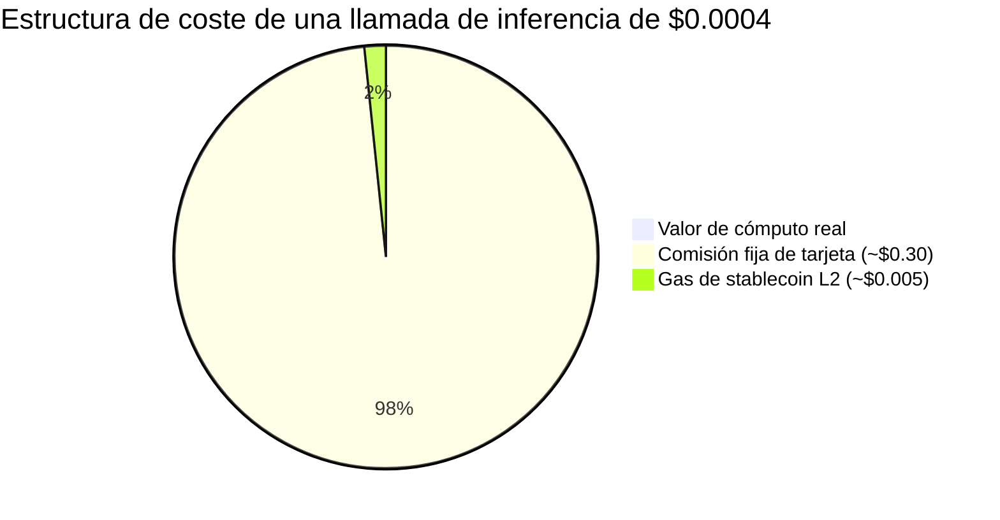
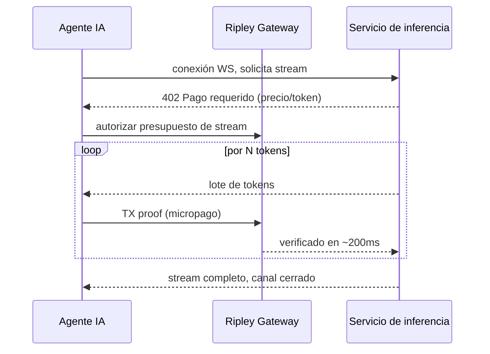

# El problema de la liquidación sub-céntimo: por qué la facturación de IA por token rompe todo rail de pago excepto XMR402

> La facturación de IA por token baja la liquidación por debajo de un céntimo, donde las comisiones de tarjeta e incluso el gas L2 superan al propio pago. Por qué las cero comisiones de XMR402, el 0-conf de 200ms y el streaming WebSocket nativo son el único rail que cuadra las cuentas.

- **Author:** @xbtoshi
- **Date:** 2026-05-31
- **Tags:** xmr402, monero, x402, per-token-billing, micropayments, llm-inference, metering, sub-cent, websocket, streaming-payments, agentic-payments, gas-fees, stablecoins, privacy, 0-conf
- **Canonical:** https://xmr402.org/blog/sub-cent-settlement-per-token-ai-billing-xmr402

---

# El problema del liquidación sub-céntimo: por qué la facturación de IA por token rompe todo rail de pago excepto XMR402

En mayo de 2026, la economía de agentes cruzó en silencio un umbral que nadie planeó. AWS lanzó Bedrock AgentCore Payments, Fireblocks presentó su Agentic Payments Suite y se unió a la x402 Foundation, y Cryptorefills conectó el cobro x402. La fontanería está llegando. Pero bajo todos los anuncios yace un problema de economía unitaria: **la facturación de IA está bajando al nivel del token individual, y un token cuesta una fracción de céntimo.**

Un agente moderno no hace una sola compra. Toma cientos de microdecisiones por conversación: una búsqueda, una recuperación, una llamada al modelo, una invocación de herramienta, un reordenamiento. A medida que el coste marginal de un token se acerca a cero, el **coste de liquidación** de pagar ese token se vuelve el gasto dominante. Y ahí cada rail existente se desmorona.

## El piso de 30 céntimos y el impuesto del gas

Las redes de tarjetas nunca se diseñaron para esto. Una transacción típica con tarjeta lleva un componente fijo cercano a $0.30 más un porcentaje. Intentar cobrar $0.0004 por una sola inferencia significa que la comisión es **750 veces** el valor de lo vendido. No se puede tarificar un token con tarjeta.

Los rails cripto debían arreglarlo. Una transferencia de USDC en Base en 2026 suele liquidarse por menos de un céntimo. Pero «menos de un céntimo» no es «gratis». Cuando la carga vale $0.0004 y la comisión de red es $0.005, la comisión sigue siendo **más de diez veces** el pago; con congestión, peor.

La comisión del protocolo es el producto. Esa es la razón estructural por la que el volumen en dólares de x402 cayó cerca del 77% desde su pico de noviembre de 2025: los rails funcionan técnicamente, pero la economía se rompe cuando los pagos se reducen a verdadera escala de máquina.

## Por qué XMR402 se construyó para el régimen sub-céntimo

XMR402 es la implementación nativa de Monero del estándar abierto X402. Usa el código HTTP 402 para negociar el pago en línea y difiere del x402 con stablecoin en tres puntos clave:

Primero, **cero comisiones de protocolo**. XMR402 no añade un porcentaje ni un cargo fijo sobre el pago; el único coste es la comisión de la red Monero, milésimas de céntimo para un micropago típico.

Segundo, **verificación 0-conf en 200ms vía Monero TX Proof**. Un medidor por token no puede esperar la confirmación del bloque; necesita liberar el siguiente token ya.

Tercero, **independencia de transporte**. El mismo protocolo corre sobre HTTP y WebSocket; los eventos de pago se intercalan con los de tokens en el mismo socket.

## Comparación de la facturación por token

| Dimensión | Tarjetas | x402 + USDC (L2) | XMR402 (Monero) |
|---|---|---|---|
| Comisión fija por llamada | ~$0.30 | ~$0.005 gas | ~$0.00001 neto |
| Viable a $0.0004/token | No | Marginal | Sí |
| Latencia de liquidación | segundos–días | tiempo de bloque | ~200ms 0-conf |
| Streaming por WebSocket | No | Complemento | Nativo |
| Rastro de pago por token expuesto | Emisor | Cadena pública | Privado |
| Tasa del protocolo | % + fijo | 0% protocolo, piso de gas | 0% protocolo |

La fila de privacidad merece énfasis. La facturación por token no solo crea un pago; crea un **flujo de telemetría conductual**. Cada llamada tarificada en una cadena pública revela qué modelo consultó un agente, con qué frecuencia y a qué coste: una reconstrucción casi perfecta de su carga de trabajo para cualquier competidor con un explorador de bloques. Las direcciones ocultas y los montos confidenciales de Monero permiten que el medidor funcione sin publicar la huella cognitiva del agente.

## La inversión silenciosa

La lección de mayo de 2026 es que el problema difícil de los pagos de agentes nunca fue la autorización ni la UX de la billetera, sino la **aritmética**. Cuando el precio de la inteligencia cae más rápido que el de mover dinero, el rail de pago se vuelve el cuello de botella. Cero comisiones de protocolo, liquidación relativamente sub-milisegundo, streaming nativo y privacidad estructural: ese es el régimen para el que se diseñó XMR402, no el swap de $50, sino el pensamiento de $0.0004.
