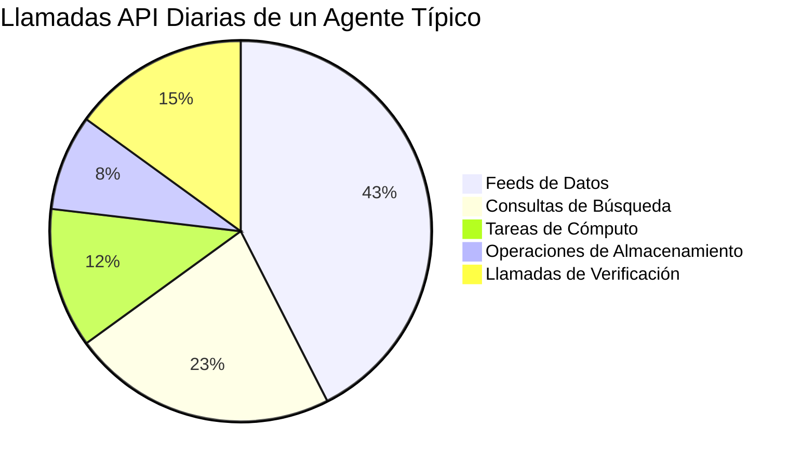
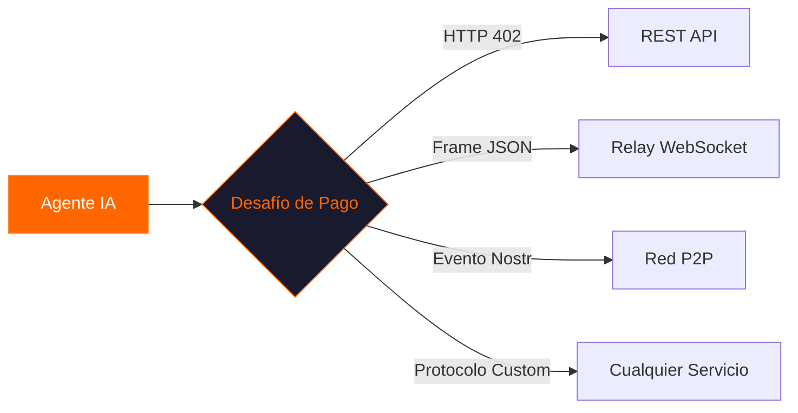

# Por Qué XMR402 Importa Cada Día: El Motor Invisible de la Economía de Máquinas

> Desde feeds de noticias matutinos hasta trabajos por lotes de medianoche, XMR402 impulsa silenciosamente miles de transacciones agente-a-servicio cada día. Así es como esta primitiva de pago Monero sin estado se convierte en la columna vertebral del internet autónomo.

- **Author:** @xbtoshi
- **Date:** 2026-03-17
- **Tags:** XMR402, agentic-economy, daily-use, micropayments, Monero, machine-payments, privacy
- **Canonical:** https://xmr402.org/blog/why-xmr402-matters-every-day

---

## Un Día en la Vida de un Pago de Máquina

Son las 6:00 AM. Mientras duermes, tu agente de investigación se despierta. Tiene una lista de 47 fuentes de datos para consultar — feeds de mercado, bases de datos académicas, APIs meteorológicas, endpoints de imágenes satelitales. Cada uno cobra entre $0.0001 y $0.05 por solicitud.

El agente no tiene tarjeta de crédito ni panel de claves API. Tiene una billetera Monero y el protocolo XMR402. A las 6:14 AM, ha completado las 47 consultas, pagando cada una en menos de 200 milisegundos.

Esto no es ciencia ficción. Esto es lo que XMR402 permite hoy.

## La Escala de la que Nadie Habla

La conversación sobre pagos de IA se centra en transacciones grandes. Pero la revolución real ocurre a microescala.

Aproximadamente 800 llamadas API por agente por día. Multiplicado por 4.2 millones de agentes activos globalmente — más de **3 mil millones de interacciones máquina-a-servicio diariamente**.

Los rieles de pago tradicionales no pueden manejar este volumen. XMR402 resuelve todo con un solo intercambio de cabeceras HTTP.

## Cinco Razones por las que XMR402 Importa Cada Día

### 1. Cero Fricción de Incorporación

XMR402 no requiere registro. Un agente con billetera Monero puede pagar cualquier servicio XMR402 al instante de ser desplegado. Sin formularios, sin aprobaciones, sin esperas.

### 2. Privacidad como Seguridad Operacional

En blockchains transparentes, los pagos exponen la dirección de la billetera, historial de transacciones y saldo. Monero asegura que los pagos XMR402 no revelan nada más allá del hecho de que se realizó un pago válido.

### 3. La Velocidad del Pensamiento

La verificación 0-conf de XMR402 se completa en ~200 milisegundos:

```mermaid
gantt
    title Línea de Tiempo de Verificación XMR402
    dateFormat X
    axisFormat %L ms
    section Flujo de Pago
    Agente envía TX          :a1, 0, 50
    Propagación mempool      :a2, 50, 100
    Servidor check_tx_proof  :a3, 100, 180
    Acceso concedido         :a4, 180, 200
```

### 4. Arquitectura Sin Estado Escala Infinitamente

El middleware Guard de XMR402 es completamente sin estado. Sin escrituras en bases de datos, sin almacenamiento de sesiones. Una API puede escalar horizontalmente sin coordinación entre nodos.

### 5. Agnóstico de Transporte en Todas Partes

XMR402 v2.0 funciona sobre cualquier canal bidireccional:

## Panorama Competitivo

| Característica | XMR402 | x402 (Coinbase) | ACP (OpenAI/Stripe) |
|---------------|--------|-----------------|---------------------|
| Privacidad | Completa | Ninguna | Ninguna |
| Identidad | No requerida | Solo billetera | KYC completo |
| Velocidad | ~200ms | ~200ms | Segundos |
| Comisión | Cero | Cero | Comisiones Stripe |
| Resistencia a censura | Alta | Baja | Ninguna |
| Transporte | HTTP + WS + Cualquiera | Solo HTTP | Solo HTTP |

## Patrones Diarios Reales

**Amanecer (05:00–08:00)** — Agentes batch despiertan. Bots de investigación consultan acumulaciones nocturnas.

**Mañana (08:00–12:00)** — Agentes interactivos se activan. Bots de revisión de código compran análisis estático.

**Tarde (12:00–18:00)** — Actividad pico. Agentes de contenido pagan por generación de imágenes y verificación de hechos.

**Noche (18:00–00:00)** — Agentes de monitoreo. Bots de infraestructura compran endpoints de salud.

**Madrugada (00:00–05:00)** — Mantenimiento. Agentes compran cómputo para ajuste fino de modelos.

Cada transacción es un pago XMR402: instantáneo, privado, sin intervención humana.

## El Panorama General

XMR402 importa cada día porque la economía de máquinas opera cada día. No duerme ni toma fines de semana. Los agentes autónomos funcionan 24/7 y necesitan una primitiva de pago que iguale su ritmo operacional.

Internet fue diseñada con un código de pago — HTTP 402 — en su base. Durante 25 años, ese código no se usó. XMR402 lo activa con la única moneda construida para máquinas: privada, rápida y sin permisos.

Cada día, más agentes entran en línea. Cada día, la economía invisible crece. Y cada día, XMR402 está ahí — liquidando transacciones en 200 milisegundos.
