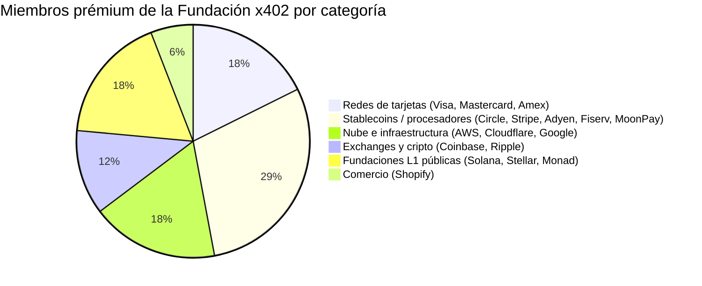
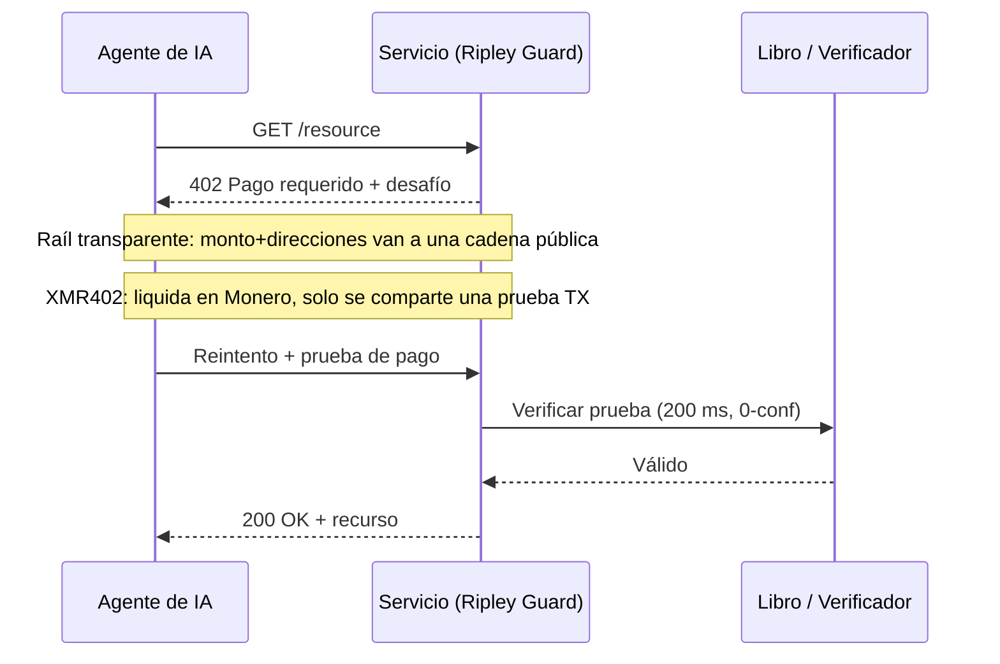

# Cuarenta miembros, un libro contable: por qué la gobernanza neutral de la Fundación x402 no puede ofrecer privacidad neutral

> La Fundación x402 se lanzó el 14 de julio con 40 miembros bajo la Linux Foundation. Pero gobernanza neutral no es privacidad neutral, y solo XMR402 liquida los pagos de agentes donde nadie mira.

- **Author:** @xbtoshi
- **Date:** 2026-07-20
- **Tags:** xmr402, monero, x402, x402-foundation, linux-foundation, agentic-payments, governance, privacy, stablecoin, visa, mastercard, stripe, coinbase, transparent-ledger, fcmp, anonymity-set, tx-proof, stateless, machine-payments, ripley-guard
- **Canonical:** https://xmr402.org/blog/x402-foundation-neutral-governance-transparent-ledger-xmr402

---

# Cuarenta miembros, un libro contable: por qué la gobernanza neutral de la Fundación x402 no puede ofrecer privacidad neutral

El 14 de julio de 2026, el protocolo x402 maduró. La Linux Foundation anunció el lanzamiento operativo de la **Fundación x402**, un organismo de gobernanza abierta y neutral respecto a proveedores, con 40 organizaciones miembros encargadas de administrar el estándar que permite a los agentes de IA pagar por HTTP. La lista de miembros prémium es abrumadora: Adyen, AWS, American Express, Circle, Cloudflare, Coinbase, Fiserv, Google, Mastercard, Monad Foundation, MoonPay, Ripple, Shopify, Solana Foundation, Stellar Development Foundation, Stripe y Visa.

Para un protocolo que empezó como un proyecto paralelo de Coinbase en mayo de 2025, esto es legitimidad a escala. La gobernanza neutral bajo la Linux Foundation es una buena noticia para la interoperabilidad. Pero en la cobertura se está produciendo una sustitución silenciosa, y es importante: **la neutralidad de gobernanza se presenta como si fuera neutralidad de pagos.** No son lo mismo. Un organismo de estándares puede ser perfectamente imparcial sobre *quién* moldea un protocolo mientras el protocolo en sí sigue siendo estructuralmente incapaz de mantener privados los pagos de un agente.

Esa brecha es toda la historia.

## Qué gobierna realmente lo "neutral"

La gobernanza abierta significa que ninguna empresa es dueña de la especificación. Coinbase aportó x402, pero de aquí en adelante su evolución se decide en abierto y cada miembro prémium tiene un asiento. Es una propiedad real y valiosa. Resuelve un problema político: el temor de que un proveedor capture los raíles sobre los que funciona la economía de las máquinas.

Lo que no resuelve es un problema de datos. El núcleo de x402 es una convención de transporte: un desafío HTTP 402, una carga de pago, un paso de verificación. La privacidad de cualquier pago proviene casi por completo de la *capa de liquidación* subyacente, no del estatuto de gobernanza superior. Y las capas de liquidación que aportan los miembros prémium son, sin excepción, transparentes por defecto o ligadas a la identidad: redes de tarjetas atadas a tu nombre legal, stablecoins en libros públicos donde cada transferencia es una entrada permanente, proveedores de nube cuyo modelo de negocio es saber qué se movió y hacia dónde.

Puedes gobernar un libro transparente con el comité más equilibrado del mundo. Sigue siendo un libro transparente.

Mira la composición. Catorce de los diecisiete miembros prémium son, en esencia, entidades cuyo valor depende de *ver* las transacciones: fijarles precio de riesgo, compensarlas, indexarlas o liquidarlas en una cadena que cualquiera puede leer. No es una crítica a ningún miembro; es una observación sobre incentivos. Un órgano de gobernanza formado por instituciones que monetizan la visibilidad de las transacciones no orientará el valor por defecto hacia la invisibilidad. No tiene motivo.

## Transparente por defecto es una decisión de diseño, no una ley de la naturaleza

Piensa en lo que ocurre cuando un agente paga por un servicio a través de un raíl x402 convencional liquidado en una stablecoin pública. El monto, el momento, la dirección pagadora y la receptora se escriben en un libro que nunca olvida. Las firmas de análisis de cadena ya reconstruyen comportamientos justo a partir de estos datos. Cuando el pagador es un agente autónomo que hace miles de compras pequeñas al día, el rastro no es solo el registro de una transacción: es un mapa de alta resolución de una estrategia: de qué API depende el agente, con qué frecuencia las llama, cuánto cuesta una carga de trabajo, cuándo sube la demanda.

La mecánica de x402 es elegante independientemente del raíl. La diferencia es qué se filtra. En una capa de liquidación transparente, el verificador —y el mundo— aprende mucho más que "este agente pagó". En una capa que preserva la privacidad, el verificador aprende exactamente una cosa: el pago es válido.

## Dónde encaja XMR402

XMR402 es la implementación nativa en Monero de la misma idea abierta de x402. Habla la gramática HTTP 402 idéntica, así que es compatible con el estándar que ahora administra la Fundación. Lo que cambia es el sustrato. La liquidación ocurre en Monero, y el servidor se convence no observando un libro público, sino mediante una **prueba de transacción de Monero**: un recibo criptográfico que demuestra que se hizo un pago específico a una dirección específica, verificable en unos 200 milisegundos con cero confirmaciones, sin exponer montos ni historial a terceros.

No es una función de privacidad añadida. Es el valor por defecto, y hereda la postura de Monero en julio de 2026: tras la actualización FCMP++, cada gasto se demuestra contra un conjunto de anonimato de más de 150 millones de salidas, frente a un anillo de 16. Esta privacidad no es una política que un comité pueda votar debilitar el próximo trimestre; es una propiedad de la criptografía.

| Dimensión | Stack de la Fundación x402 (raíles típicos) | XMR402 |
|---|---|---|
| Gobernanza | Órgano Linux Foundation de 40 miembros | Protocolo abierto, nativo en Monero |
| Liquidación por defecto | Cadenas públicas / tarjetas | Monero (privado por defecto) |
| Qué ve el verificador | Montos, direcciones, tiempos | Solo "pago válido" (prueba TX) |
| Conjunto de anonimato | Transparencia a nivel de dirección | 150M+ salidas (FCMP++) |
| Comisiones de protocolo | Varían por raíl | Cero |
| Modelo de confirmación | Depende de la cadena | 200 ms, 0-conf vía prueba TX |
| Rastro de datos | Huella pública permanente | Nada más allá de la prueba |

## La neutralidad es necesaria, no suficiente

Nada de esto disminuye lo que logró la Fundación x402. Un estándar neutral es una condición previa para una economía de máquinas sana, y que cuarenta de las empresas de pagos más importantes acuerden construir en abierto es un hito real. El punto es más estrecho y más afilado: la neutralidad de gobernanza y la neutralidad de *observación* son garantías distintas, y el 14 de julio solo se lanzó una.

Un agente que paga mil veces al día no necesita un comité que prometa trato justo. Necesita un raíl en el que sus pagos no sean un conjunto de datos. La Fundación le da a el ecosistema lo primero. XMR402 existe para darle lo segundo: el mismo apretón de manos 402, liquidado donde nadie mira. Internet ya aprendió esta lección una vez: no hicimos la web confiable formando un comité para gobernar quién podía leer el tráfico, sino cifrando el tráfico para que la pregunta dejara de importar. La privacidad de pagos para agentes es el mismo movimiento, una capa más abajo. La gobernanza decide quién dirige. La criptografía decide quién ve. Para una economía de máquinas que procesa millones de pagos al día, la segunda pregunta es la que te mantiene libre.
