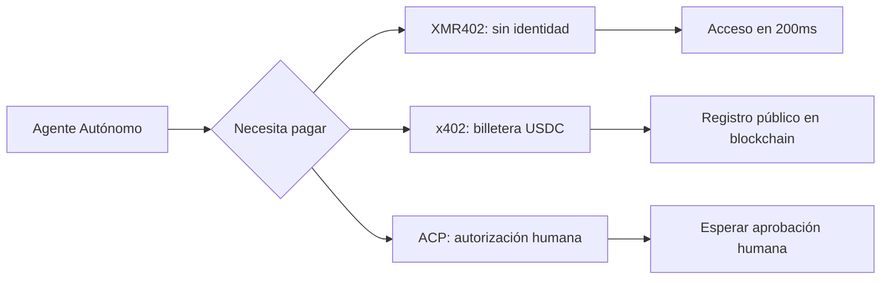
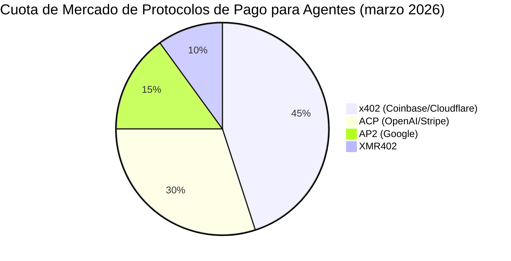

# XMR402 frente al Stack de Pagos para Agentes: Análisis Protocolo por Protocolo

> La carrera por dominar los pagos para agentes ha comenzado. x402 (Coinbase), ACP (OpenAI/Stripe) y AP2 (Google) compiten por los pagos nativos de IA. Así es cómo XMR402 se compara — y por qué la privacidad y la arquitectura sin estado cambian todo.

- **Author:** @xbtoshi
- **Date:** 2026-03-18
- **Tags:** protocol-comparison, x402, ACP, agentic-payments, Monero, XMR402, privacy, stablecoins
- **Canonical:** https://xmr402.org/blog/xmr402-vs-agentic-payment-protocols

---

## La Guerra de Protocolos Ha Comenzado

A principios de 2026, tres de las compañías tecnológicas más poderosas anunciaron casi simultáneamente estándares competidores para pagos de agentes. Coinbase y Cloudflare lanzaron la Fundación x402; OpenAI y Stripe co-lanzaron el Agentic Commerce Protocol (ACP) para el checkout instantáneo de ChatGPT; y Google introdujo AP2, su propio protocolo de pagos para agentes.

El mensaje es claro: los pagos de agentes IA son la próxima frontera de la infraestructura de internet.

## Los Cuatro Protocolos de un Vistazo

### x402 (Coinbase + Cloudflare)

Usa HTTP 402 con liquidación en USDC en cadenas compatibles con Ethereum. Enormes ventajas de distribución a través del ecosistema de Coinbase y el CDN global de Cloudflare.

**Qué resuelve:** Micropagos entre agentes y servicios usando stablecoins.

**Qué no resuelve:** USDC incorpora KYC; el registro público hace que todas las transacciones sean permanentemente visibles; no es verdaderamente stateless.

### ACP — Agentic Commerce Protocol (OpenAI + Stripe)

Diseñado para comercio *iniciado por humanos* a través de agentes IA. Usa el Shared Payment Token (SPT) después de que un humano autoriza el pago.

**Qué resuelve:** Checkout de consumidor dentro de interfaces IA.

**Qué no resuelve:** Depende completamente del ser humano como autorizador; inútil para transacciones máquina-a-máquina.

### AP2 (Google)

Capa de orquestación que integra x402 como su capa de pagos en stablecoins. Hereda las limitaciones de x402.

### XMR402 (Nativo de Monero)

El mismo mecanismo HTTP 402, pero con liquidación en Monero — la única criptomoneda principal con privacidad obligatoria a nivel de protocolo. Verificación 0-conf de ~200ms vía TX Proof, completamente stateless, sin identidad requerida.

## Tabla de Comparación de Protocolos

| Característica | XMR402 | x402 (Coinbase) | ACP (OpenAI/Stripe) | AP2 (Google) |
|---|---|---|---|---|
| **Privacidad** | Completa (RingCT) | Ninguna (cadena pública) | Ninguna (KYC Stripe) | Ninguna (cadena pública) |
| **Requiere KYC** | No | KYC de billetera USDC | Tarjeta de crédito | KYC de billetera |
| **Requiere humano** | No | No | Sí | Parcialmente |
| **Velocidad de verificación** | ~200ms | Confirmación de bloque | Latencia API | Latencia API |
| **Tarifas de protocolo** | 0 | Gas fees | % de Stripe | Gas fees |
| **Resistente a censura** | Sí | No | No | No |

## La Pregunta Fundamental de Diseño

XMR402 es el único protocolo en el que un agente puede operar **completamente sin una identidad KYC en el ciclo**. Cada otro protocolo tiene al menos una dependencia de una entidad KYC: una billetera USDC, una cuenta de Stripe, o una tarjeta de crédito.

## Por Qué el Argumento de la Privacidad No Desaparecerá

Cada plataforma de internet importante que ha acumulado datos de transacciones financieras los ha usado para ventaja competitiva o presión regulatoria. Los registros de blockchain público son aún más expuestos: son permanentes, inmutables y consultables por cualquiera.

XMR402 es el único protocolo que hace que estos datos sean invisibles por defecto. No por política, no por términos de servicio, sino por matemáticas.

## El Futuro: Interoperabilidad, No un Ganador Único

El panorama de pagos para agentes probablemente se parecerá al panorama de mensajería: múltiples protocolos coexistiendo con puentes entre ellos. x402 y XMR402 comparten el mismo mecanismo HTTP 402, lo que hace que tender puentes entre ellos sea arquitectónicamente natural.
