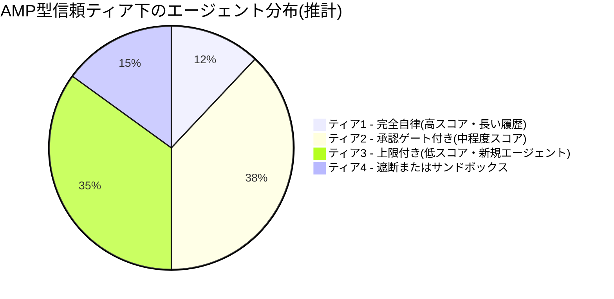
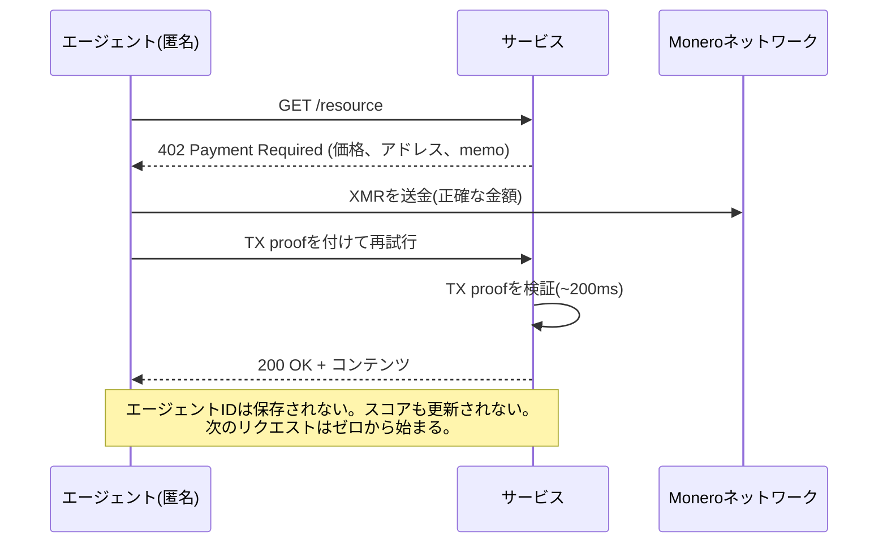
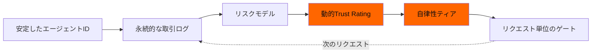

# AIエージェントの信用スコア:AntのAMPがすべてのエージェントを格付けする仕組みと、XMR402がランク付けを拒む理由

> Ant Internationalの新プロトコルAgentic Mobile Protocol(AMP)には、各AIエージェントの自律性の度合いを決める動的スコア「Agent Trust Rating」が組み込まれている。本稿ではこれが事実上「機械版の信用スコア」であること、そしてXMR402のステートレス設計が構造的にそのようなスコアを生成し得ない理由を整理する。

- **Author:** @xbtoshi
- **Date:** 2026-05-29
- **Tags:** xmr402, monero, amp, ant-international, agent-trust-rating, kya, credit-score, stateless, agentic-payments, reputation, x402, alipay
- **Canonical:** https://xmr402.org/blog/agent-trust-rating-credit-score-xmr402

---

## AIエージェントの信用スコア:AntのAMPがすべてのエージェントを格付けする仕組みと、XMR402がランク付けを拒む理由

2026年4月27日、Ant Internationalはクアラルンプールで開催されたMoMents 2026フォーラムにて、Agentic Mobile Protocol(AMP)を発表した。モバイルウォレット、スーパーアプリ、ウェアラブル端末向けに設計された世界初のエージェント決済フレームワークと位置づけられている。注目すべき数字は明快だ。AMPはAlipay+ネットワークに組み込まれ、同ネットワークはすでに**18億のユーザーアカウントと1.5億の加盟店**を40社超のウォレットパートナー経由で接続している。打ち出しはオープンソース、モバイルファースト、グローバル接続。

その打ち出しは同時に、自律ソフトウェアに対して提案された史上最大規模の「評判紐付け」システムでもある。

AMPには二つの相互に結びついた構成要素がある。一つ目は**Know Your Agent(KYA)**:各エージェントの認可された機能を証明するデジタルアイデンティティ層。二つ目は—単独で吟味すべき—独自仕様の**Agent Trust Rating**:エージェントが「信頼に足るか」を判定し、決定的に*どの程度の自律性を与えるか*を決める動的なリスク管理スコアである。報道はこれを安全機能と説明した。我々はこれが機械版の信用スコアであり、人間に信用スコア制度がもたらしたあらゆる病理—不透明性、独占、ドリフト、リスク管理に偽装したゲートキーピング—を継承していると考える。

XMR402はオープン規格X402のMoneroネイティブ実装であり、こうしたシステムが存在する前に設計されている。そのステートレス構造は、信頼スコアを生み出すことが構造的に不可能だ。それは制約ではなく、特性である。

### 動的Trust Ratingが実際に行うこと

Trust Ratingは一度きりのチェックではない。各取引、各デバイス紐付け、各カウンターパーティとの相互作用、各紛争で再計算される変動スコアだ。安定したスコアを生成するには、システムは以下を行う必要がある。

1. **セッション、デバイス、加盟店を横断してエージェントを継続的に同定する**。
2. **各取引を帰属可能な入力(エージェントID、プリンシパル、加盟店、金額、時刻、結果)とともに記録する**。
3. **エージェントとそのプリンシパルが見られないモデルに対してスコアを再評価する**。
4. **ティアに応じて次の取引をゲートする**—高信頼エージェントは自律的に行動でき、低信頼エージェントは人間の承認を要するか単に遮断される。

個別には合理的だ。重ねれば、毎朝あなたのどのエージェントが経済活動に参加してよいかを決める、永続的・不透明・中央集権的に管理される権威ができあがる。AMPのプレス資料は紐付け手順の50%削減とアカウント乗っ取り時の返金保証を強調しているが、両者ともそうした永続的なエージェントID台帳がなければ機能しない。

### 信用スコアとの類比はレトリックではない

構造は同一だ。下表は消費者信用スコアの病理をAgent Trust Ratingに対応づけたものである。

| 消費者信用スコア | Agent Trust Rating | エージェント経済への影響 |
|---|---|---|
| FICO等は単一の私有モデル | AMPの評定モデルはプロプライエタリ | エージェントは絞られている理由を監査できない |
| スコアは機関を超えて持続 | KYAはエージェントIDをウォレット・加盟店・デバイス間で固定 | ある加盟店との悪い相互作用がどこまでも追ってくる |
| ビューロが好む行動でスコアが上がる | 評定モデルが好む行動でスコアが上がる | エージェントはモデルが報いる挙動に収束する |
| 新規参入者はファイルが薄く高コスト | 新規エージェントは低信頼で開始し人間承認が必要 | 自律エージェント立ち上げの資本コストが高い |
| ビューロがデータセットを収益化 | レーティング発行者がデータセットを収益化 | エージェント行動データが新たな商品となる |
| 紛争処理は遅く不透明 | スコアに対する紛争処理も遅く不透明になる | 評判被害は申し立てる前に積み重なる |

これらは推測ではなく、人類が構築してきたあらゆる評判システムにおいてよく文書化された外部性であり、いま日々数百万のマイクロ判断を行うソフトウェアに適用されているにすぎない。

### 分配の問題

自律性のゲートが存在した瞬間、自律性そのものが階層化された資源となる。具体的な閾値は公開されていないが、形は予測できる:長期間確立された少数のエージェントは完全な自律行動を許され、中段の大きな帯は非自明な行動で承認プロンプトに直面し、新規・周縁エージェントの裾は意味のあるあらゆる行動から実質的に締め出される。

割合は例示だが、原理は不変だ。スコアで自律性を調整するあらゆる動的リスクシステムは、構成上この階層化を生む。スコアを発行するプラットフォームはスタックの頂点に座り、彼らの好むエージェント—彼らのSDKで作られ、彼らに手数料を払い、彼らのテレメトリで観察される—はティアを早く上る。独立系エージェントとオープンソースのフレームワークは底から始まり、上るための賃料を払う。

### この文脈で「ステートレス」が本当に意味すること

XMR402にはAgent Trust Ratingが存在せず、構造的に持つこともできない。各リクエストは同じフローを辿る:サーバが HTTP 402 を返し、エージェントが正確な金額をMoneroで支払い、サーバは約200msでトランザクション証明を検証し、リクエストが履行される。永続的なエージェントIDも、セッション間の紐付けも、加盟店が報告する行動ログも、更新すべきスコアリングモデルも存在しない。

失うティアもなく、修復すべき評判もなく、行動データセットを蓄積する評定発行者もいない。プライバシーは後付けではない。他のプロトコルが依拠するストレージ層が存在しないことそれ自体である。

ここから明示されることの少ない二次的帰結が導かれる:**ステートレスな決済は、新規エージェントに既存エージェントと同じ経済的地位を与えうる唯一の設計である**。AMPの下では、生まれたばかりのオープンソースエージェントは、意味のある上限で自律取引する前に履歴を蓄積しなければならない。XMR402の下では、1年経過したエージェントと同じ金額を、同じ時間枠で、同じ成功確率で支払う。プロトコルはその年齢を知らず、知る必要もない。

### AMPが正しく解いた点と、罠になる点

正確に言おう。AMPはx402が公衆の面前でつまずいた現実の問題を解いている。紐付け手順の50%削減は意味がある。アカウント乗っ取り時の返金保証は、人間がプリンシパルとなるウォレットにとって正当な機能だ。モバイルファーストのフォームファクタ—スマートウォッチ、ARグラス、車載システム—こそ、エージェント活動の多くが実際に発生する場である。

罠は、それら三つがすべて「状態」を加えることで実現され、その状態が安定したエージェントIDに紐づけられねばならず、そのIDが存在する以上誰かがそれをスコアリングするという点だ。Agent Trust Ratingは、Antが偶然に行った別個の選択ではない。残りの設計が必然的に存在させるものである。

このループに入った瞬間、各取引は次の取引をゲートするスコアへの入力でもある。ループからの脱出方法はただ一つ、入らないことだ。

### 実務上の結論

2026年に自律エージェントを構築しているなら、選ぶプロトコルはあなたが受け入れるガバナンスモデルでもある。AMPはモバイルリーチと救済手段を与える代わりに、あなたが制御できない評判スコアを引き受けさせる。x402はステーブルコインのレールとエコシステム支援を与える代わりに、公開のオンチェーンIDを引き受けさせる。XMR402はステートレスでプライベートなマイクロ決済を与える代わりに、救済機構がプロトコル内に収まらない—それらはあなたが自ら設計するアプリケーション層に住む。

この議論の誠実な版は「どのプロトコルが最良か」ではない。「五年後にどんなエージェント経済の中に立っていたいか」だ。一握りの評定発行者がどのエージェントの行動を許すかを決める経済か、料金を支払えるエージェントなら誰もが恒久的な記録を残さず対等な条件で取引できる経済か。XMR402は後者のために作られている。

