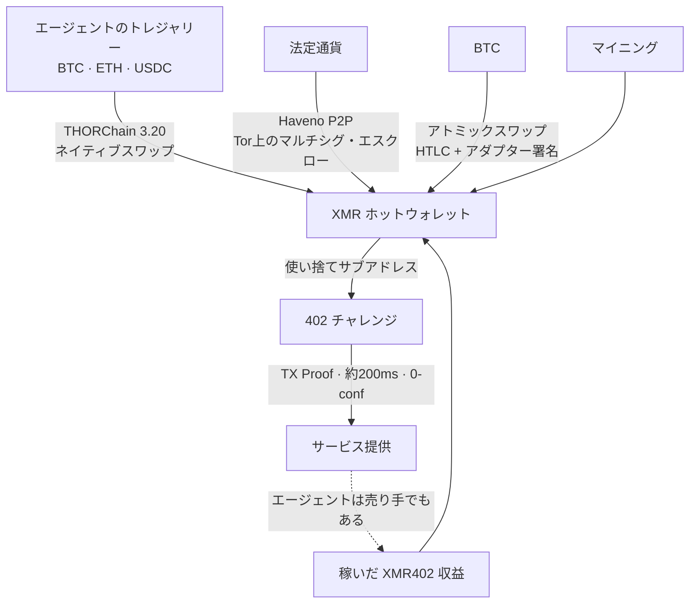
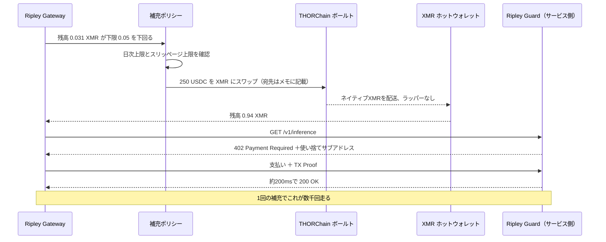

# 補充の問題：どの取引所も上場してくれない通貨で、XMR402エージェントはどう資金を調達するのか

> XMR402への最強の反論は暗号技術ではなく、「エージェントはどこでXMRを手に入れるのか」だった。上場廃止が打撃を与えるのは取引所だが、取引所は決済ループの中にいない。2026年8月25日のTHORChain 3.20のネイティブXMRスワップは、最後の「人間の形をした」手順をプログラム可能な呼び出しに変えた。

- **Author:** @xbtoshi
- **Date:** 2026-09-08
- **Tags:** xmr402, monero, x402, thorchain, thorchain-3-20, native-swaps, delisting, mica, amlr, fatf-travel-rule, kraken, agent-treasury, wallet-funding, refill-policy, atomic-swaps, haveno, no-kyc, non-custodial, ripley-gateway, ripley-guard, tx-proof, fcmp, stateless, agentic-payments, 0-conf, circular-economy
- **Canonical:** https://xmr402.org/blog/agent-wallet-refill-thorchain-delistings-xmr402

---

# 補充の問題：どの取引所も上場してくれない通貨で、XMR402エージェントはどう資金を調達するのか

XMR402への技術的な反論は、最後にはたいてい同じ一点へ収束する。暗号技術ではない——MoneroのRingCTとステルスアドレスは十年持ちこたえている。レイテンシでもない——TX Proof検証は0-conf決済を約200ミリ秒で確定させ、ステーブルコイン型エージェントが待たされるBaseのブロックより速い。手数料でもない。プロトコル層ではゼロだ。

反論は物流の問題である。**そのエージェントは、どこでXMRを手に入れるのか。**

もっともな問いだし、2026年を通じて鋭さを増した。KrakenはMiCAとAMLRの圧力の下で欧州経済領域からMoneroを外し、2026年4月にはカナダとインドでも取り扱いを終了した。OKX、Binance、Exodusはそれ以前に去っていた。2026年半ばには、XMRを気配表示している主要な場はKuCoin、MEXC、Gate.io、EEA域外のKraken、そして少数のノンKYC取引所にまで痩せ細った。EUのマネーロンダリング防止規則（AMLR）は、匿名性強化資産をライセンス取得済みCASPの義務と構造的に両立不能にし、FATFトラベルルールが議論の止めを刺す。

だから批判は自動的に書き上がる。規制対象の取引所が積極的に手放している資産の上に、決済レールを建ててしまったのだ、と。優雅なプロトコル、しかし入り口がない。

この批判にはカテゴリー錯誤が含まれている。そして**2026年8月25日**、残っていた部分も事実ではなくなった。

## カテゴリー錯誤：取引所は決済レールではない

エージェント決済のフローの中で、中央集権取引所が実際に何をしているかを見てほしい。

何もしていない。

ループの中にいないのだ。自律エージェントが推論呼び出しの対価として0.004ドルを支払うとき、取引所は照会されず、板は触られず、上場は一切不要である。取引所の唯一の役割は——XMR402であれ他のどのレールであれ——**取得**だ。別の資産を、そのレールが決済に使う資産へ変換すること。それはプロトコルの上流に、一度だけ、トレジャリーへの資金投入時に位置する。取引の一部ではない。

これを見落としやすいのは、人間向けの小売暗号資産の前提をそのまま持ち込んでいるからだ。そこでは取引所こそがインターフェースであり、上場廃止は資産が視界から消えることを意味する。しかしすでに暗号建ての残高を保有している機械にとって、「Krakenに上場しているか」は「空港の両替所に置いてあるか」と同程度の関連性しかない。

したがって、この反論の誠実な版はもっと狭く、そして優れている。*エージェントは、人間がKYC口座を開設することなく、自律的に、手持ちの資産を支払いに必要な資産へ変換できるのか？*

少し前まで答えは「できる、ただし不格好に」だった。今はただ「できる」である。

## THORChain 3.20が変えたこと

THORChain 3.20は2026年8月25日にリリースされ、MoneroとZcashのネイティブ対応をもたらした。効いている語は**ネイティブ**だ。ラップされたXMRもなければ、ブリッジトークンもなく、本物のコインを預かって借用証を発行するカストディアンもいない。エージェントはBTC、ETH、あるいはステーブルコインをTHORChainのボールトへ送り、自分が管理するアドレスで本物のMoneroを受け取る。アカウント不要。登録不要。カストディの移転なし。このスワップは関係ではなく、一回のトランザクションである。

このニュースでXMRは約9%上昇し、5年以上ぶりに最も強い月を記録した。上場廃止テーゼに穴が空いていたことに市場が気づいた、という合図だ。ただし興味深いのは価格ではない。XMR402エージェントのライフサイクルに残っていた最後の「人間の形をした」手順——取引所へ行き、身元を証明し、資産を買う——が、プログラム可能な呼び出しになったことだ。

## 補充ルートの比較

エージェント運用者が資金ルートを選ぶ基準は、ホスティングのリージョンを選ぶのと同じだ。思想ではなく運用特性で選ぶ。

| ルート | カストディ | 口座／KYC | エージェントによる自動化 | 典型的な所要時間 | 検閲面 |
|---|---|---|---|---|---|
| 中央集権取引所 | 出金までカストディアル | 必要、人間に紐づく | 部分的（APIキー） | 数分〜数日 | 高い：上場、法域、口座凍結 |
| THORChain 3.20 ネイティブスワップ | ノンカストディアル | 不要 | 可能 | 数分 | 低い：許可不要のボールト |
| BTC↔XMR アトミックスワップ | ノンカストディアル | 不要 | 可能（メイカーが必要） | 数分〜1時間 | 極めて低い：共通の場が存在しない |
| Haveno P2P（法定通貨） | マルチシグ・エスクロー | 不要 | 不可：相手方が人間 | 数時間 | 低いが遅い |
| マイニング | 構造上セルフカストディ | 不要 | 可能 | 継続的 | 事実上ゼロ |
| 稼いだ XMR402 収益 | セルフカストディ | 不要 | 可能 | 即時 | なし：取得イベントが存在しない |

最終行をもう一度読んでほしい。議論に実際に決着をつけるのはこの行だ。

## 最良の補充とは、補充しないこと

本物の機械経済では、同一のエージェントが402の両側に立つ。リサーチ・エージェントはコーパスの対価をデータ提供者に払う。そのデータ提供者自身もエージェントであり、推論エンドポイントに支払う。そのエンドポイントはGPU時間と、インデックスを新鮮に保つクロール予算に支払う。価値は同じ建値の**内側**で循環する。何かを売っているエージェントは、決済資産のまま連続的に補充されており、検閲・上場廃止・監視の対象となる取得イベントを一つも持たない。

つまり取得の圧力は**ブートストラップ**コストであって、ランニングコストではない。純粋な消費者型の新規エージェントで最大となり、収益のあるエージェントではゼロへ向かって落ちていく。上場廃止政策が攻撃しているのは一回限りの手順であり、ループではない。

## 誠実な反論

**スワップは可視である。** THORChainは透明なチェーン上で決済する。補充は公開記録を残す。このアドレスがこの時刻に250 USDCをXMRへ変換した、という記録だ。これは事実であり、手を振って流すより率直に述べる価値がある。

だが、それが何を明かし、何を明かさないかを見てほしい。明かすのは**取得**である。エージェントがその後に何を、誰から、いくらで、どの頻度で、どんなパターンで買ったかは一切明かさない——そしてそれこそ、透明なステーブルコイン・レールが支払いのたびに無償で公開している調書だ。1件の可視イベントが数千件の不可視イベントに償却される。USDCレールでは比率は永遠に「支払い1件につき可視イベント1件」である。この非対称性は僅差ですらない。

**タイミング相関。** 250 USDCの補充の直後に、およそ250相当のXMRを使い切る支出が続けば、それはヒューリスティックな結び付きになる。緩和策は平凡な運用衛生だ。多めに補充して残高を寝かせる、オンデマンドではなくスケジュールで補充する、サブアドレスに分散する、そして残りはFCMP++が到来した際の桁違いに大きな匿名集合に吸収させる。

**流動性の深さ。** THORChainのXMRプールはまだ数週間ものだ。6桁を動かすトレジャリーは、4桁のトレジャリーが感じないスリッページを感じる。これは今日の実在する制約であり、縮小中でもあるが、補充サイズを決める運用者は深さを前提にせず、ポリシーでスリッページを上限管理すべきである。

**法定通貨は依然として硬い縁である。** 人間なしで銀行預金をXMRへ変換するのは、いまも本当に難しい。Havenoは優秀だが、どうしても人間の速度に縛られる。ただし注意してほしい。これは法定通貨の問題であって、XMR402の問題ではない。USDCで支払うエージェントもまた、上流のどこかで人間がそのUSDCを発行または購入している必要がある。誰もそれをCoinbaseのx402の減点にはしていない。

## スタックにとっての意味

Ripley Gatewayは補充を緊急事態ではなくポリシーとして扱う。残高の下限、日次の変換上限、スリッページ上限、優先ルート順序は、リトライ予算と同じく設定項目である。支払い用ホットウォレットは小さく使い捨てに保ち、トレジャリーはコールドでほとんど触れない。ビューキー会計により、運用者は自らの支出を他の誰にも晒すことなく監査できる。

そしてレールを比較する人への戦略的な要点。エージェント経済は、取引所がループの中にいる必要のない、暗号通貨にとって初めての本格的なユースケースである。人間の小売には価格発見、カストディ、法定通貨のレールが要る。1日に4万回の推論呼び出しを買う機械に要るのは、残高と宛先アドレスだけだ。上場廃止はXMRをショーウィンドウから外す。回線からは外さない——そして2026年8月25日以降は、店そのものも外せない。

問題は、取引所がMoneroを上場し続けるかどうかでは決してなかった。自律エージェントが許可を求めずにそれを入手できるかどうかだった。その問いには今、退屈で機械的な答えがある。それが最良の種類の答えだ。
