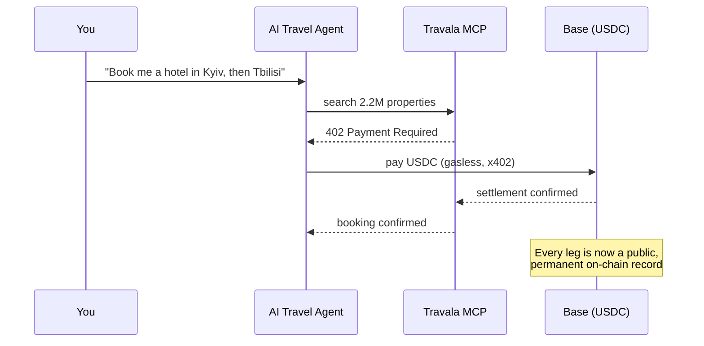
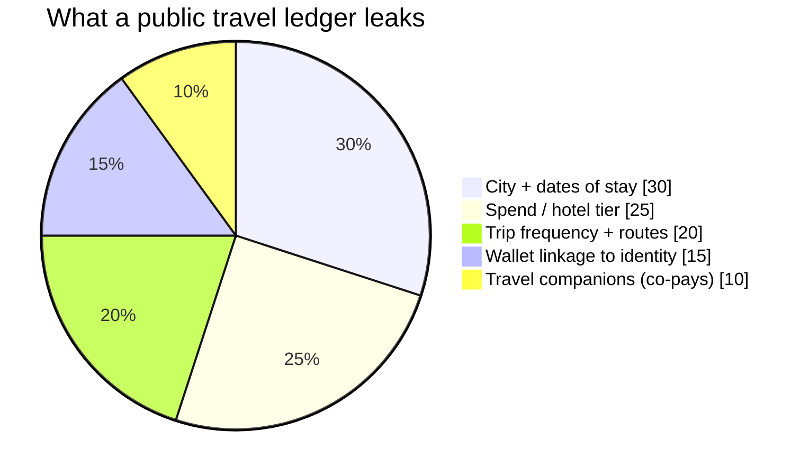
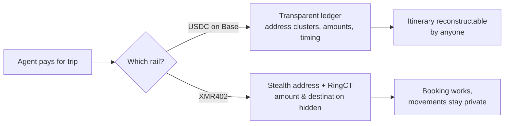

# 台帳の上の旅程表：AI旅行エージェントの足跡があなたの眠る場所を地図化する理由——そしてXMR402の非公開予約

> Travalaの新しいエージェント型旅行プロトコルは、AIが220万件のホテルを予約しBase上のUSDCで決済できる。だが公開チェーンの旅行エージェントはあなたの移動を永久台帳に書き込む。XMR402が足跡を残さず同じ旅を予約する方法。

- **Author:** @xbtoshi
- **Date:** 2026-06-05
- **Tags:** xmr402, monero, x402, travala, agentic-travel, travel-mcp, location-privacy, usdc, base, erc-7715, session-keys, stealth-address, ringct, agentic-payments, privacy, 0-conf
- **Canonical:** https://xmr402.org/blog/agentic-travel-booking-location-trail-xmr402

---

# 台帳の上の旅程表：なぜあなたのAI旅行エージェントのステーブルコインの足跡が、あなたが眠るすべての場所を地図化するのか——そしてXMR402はどう非公開で予約するか

2026年6月4日、Travalaは**Travala Travel MCP**を発表しました。AIコンシェルジュが単一のチャットスレッド内で220万件超のホテルを検索・予約・支払いできる、エンドツーエンドのエージェント型プロトコルです。Base上で動作し、**x402**標準を通じてガスレスのUSDCで決済し、ERC-7715セッションキーを使います——エージェントが支払いを提案し、最終署名はあなたのウォレットに残ります。美しい工学であり、同時に、インデックス化を待つだけのプライバシー災害です。

発表スライドに載らなかった事実：エージェントがBase上のUSDCでホテルを予約すると、あなたの最も親密なデータ——*あなたの身体がいつどこに物理的に存在するか*——を、誰もが永久に読める公開台帳に書き込みます。

## 自ら予約する旅——そして全員に知らせる旅

「コーカサスを巡る2週間の旅を計画して」と言えば、エージェントが検索・予約・支払い・キャンセルを処理します。旅の摩擦が一文に縮みます。しかし各決済は、透明なチェーン上の取引です。

カード網は既定で非公開です——Visaはあなたのホテル履歴を公開しません。公開チェーンの旅行エージェントはこれを反転させます。数件をつなげれば、それは支払いではなく**旅程表**になります。

## 台帳とは位置情報の履歴である

分析企業はすでにアドレスをクラスタ化し、加盟店をラベル付けし、ウォレットを大規模に匿名解除します。Travalaの決済は設計上、加盟店を識別できます——そうでなければホテルは受け取れません。記録はこう語ります：*このウォレットはこの都市で、この夜に、この等級のホテルに泊まり、いま600km先の次の都市のホテルに支払っている。*

情報源と会う記者、国境を越える反体制派にとって、これは直接的な身体的安全への脅威です。公開台帳は撤回も削除もできません。足跡は永久です。

## なぜ「セッションキー」は漏えいを直せないのか

ERC-7715キーは*認可*を解決しますが、*機密性*は解決しません。誰が使えるかを制御しますが、誰が*見られるか*は制御しません。署名済みの支払いは、金額と相手方が平文のまま透明な台帳に着地します。旅行では、位置情報こそがペイロードです。

## 同じ旅を、非公開で

XMR402はx402標準のMoneroネイティブ実装です。同じHTTP 402、Monero TX Proofによる同じ200ミリ秒の0-conf検証、プロトコル手数料ゼロ——しかしプライバシーが基盤層であるチェーンで決済します。ステルスアドレスにより宛先は連結不能になり、RingCTが金額を隠します。

| 特性 | Base上のUSDC（Travala MCP） | XMR402（Monero） |
| --- | --- | --- |
| エージェント予約 | 可 | 可 |
| 金額がチェーン上で可視 | 可視 | 不可視（RingCT） |
| 宛先/加盟店の連結 | 可能 | 不可（ステルスアドレス） |
| 旅程の再構築 | 容易 | 不可 |
| 記録は永久かつ公開 | 公開 | 既定で暗号化 |
| プロトコル手数料 | ガスレスだがBase手数料あり | ゼロ |
| 決済遅延 | ほぼ即時 | 約200ミリ秒 0-conf |

エージェント体験は同一です。違いは、何が残るかです。

## プライバシーは旅行の上位プランではない

エージェント型旅行の競争はすでに始まっています。利便性は本物で、プライバシーの問いに答えが出ようと出まいとやって来ます。だからこそ、いまその問いが重要なのです。XMR402は、あなたの移動の公開が既定にならないために存在します。エージェントは一文で旅全体を予約できるべきです。あなたがどこへ行ったかは、他の誰にも読めてはなりません。

*XMR402——エージェント経済のためのプライバシー層。同じ402、同じUX、足跡なし。*

