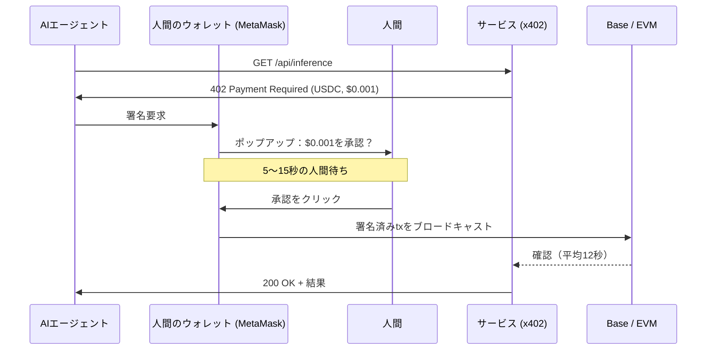
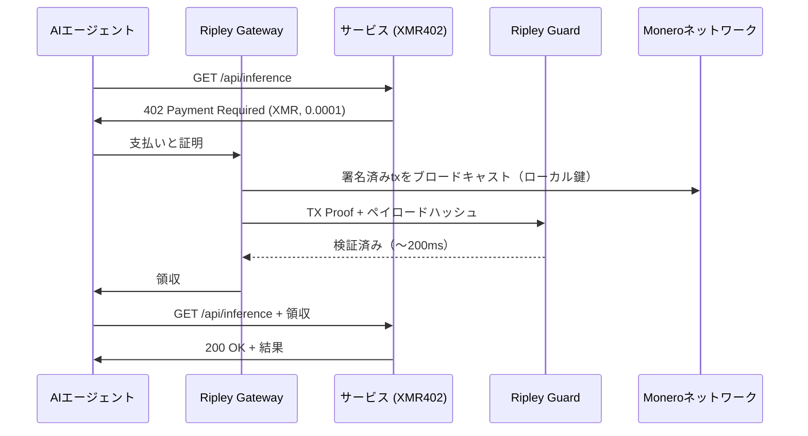
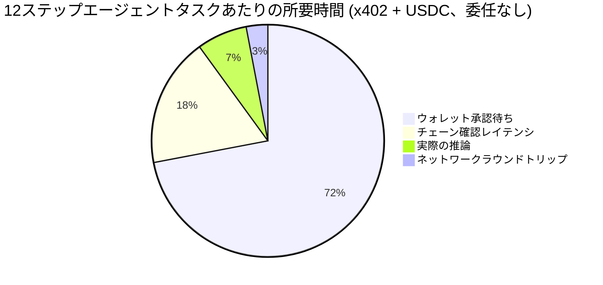
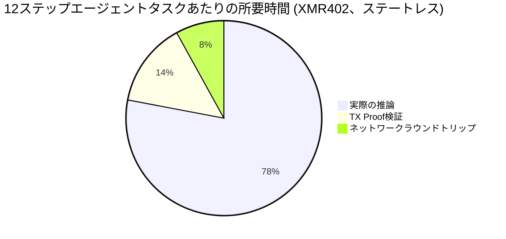

# 承認フリクションの壁：x402の取引量が77%崩落した理由と、XMR402のステートレス設計がそれを回避するように作られた理由

> Artemisのデータによれば、x402の調整後取引量は2025年11月のピークから77%崩落した。原因は需要ではなく、ウォレットのポップアップだ。サブセント単位のエージェント決済1件あたり$0.03〜$0.10の人的時間承認コストが発生している。本稿では承認フリクション問題を分解し、XMR402のステートレスなTX-Proof検証がなぜこのボトルネックを完全に消し去るのかを解説する。

- **Author:** @xbtoshi
- **Date:** 2026-05-28
- **Tags:** xmr402, x402, monero, approval-friction, wallet-confirmation, micropayments, stateless, agentic-payments, delegation, ap2, agentcore, fireblocks
- **Canonical:** https://xmr402.org/blog/approval-friction-wall-stateless-xmr402

---

# 承認フリクションの壁：x402の取引量が77%崩落した理由と、XMR402のステートレス設計がそれを回避するように作られた理由

2026年5月、エージェント決済業界は初めて真に冷静になるべきデータポイントを得た。Artemisのオンチェーン分析によると、x402の調整後取引量は**2025年11月のピーク$5.15Mから$1.19Mまで約77%下落**した。月間取引件数は289万件まで回復し、平均取引サイズは$0.52である。ドル建て取引量が縮小しているのは、エージェントが支払いをやめたからではない。すべての支払いに人間が*承認*をクリックする必要があるからだ。

業界はこれを**承認フリクション**と呼び始めた。そしてこれは、ウォレットのUX磨きでは決して直せない欠陥を露呈している。

## 誰も印字したくない数字

保守的な確認ペースであるウォレットポップアップ1回あたり5〜15秒——月間数百万件のx402コール全体で——は、**月あたり4,000〜12,000ユーザー時間の承認作業**を生み出す。$25/hの混合人時価値で計算すると、各ポップアップは事実上$0.03〜$0.10の注意税を発生させる。サブセント単位の推論コールや$0.001の従量課金APIリクエストにとって、人時税は**実際の支払額の10〜100倍**である。

これはバグではない。人間が起こすトレードのために設計されたウォレットモデルに、機械が起こすマイクロペイメントのためのステーブルコインプロトコルをねじ込んだ*直接的な帰結*である。

## x402-USDCがポップアップから逃れられない理由

今日のすべてのx402ステーブルコインフローは同じ承認前提を継承している：ウォレット（MetaMask、Trust Wallet、Coinbase Wallet、Phantom）が鍵を保有し、その鍵がEVMトランザクションに署名する。ウォレットがブラウザ拡張、ハードウェアデバイス、Fireblocksのような託管サービスのいずれに存在しても、署名イベントは**ユーザーに帰属する明示的なアクション**である。規制当局はそれを望む。コンプライアンスチームもそれを望む。ウォレットベンダーはこの前提を中心にUX全体を構築した。

これはトレーディングには良い。だが、単一のリサーチワークフローで40回のサブセントAPIコールを必要とする自律エージェントにとっては*壊滅的*である。

業界が提案する解決策は**委任フレームワーク**である：FIDO AllianceにドネートされたGoogleのAP2 mandates、AWS Bedrock AgentCore Paymentsのポリシーベース支出管理（2026年5月7日ローンチ）、Fireblocksの新Agentic Payments Suite（2026年5月20日）、Solana Pay.shのプリチャージセッションバウチャー（2026年5月5日）。それぞれが予算を*事前承認*してウォレットの問いかけを止めようとする。しかしどれもウォレットを排除していない——署名済みmandate、ポリシーエンジン、または託管者の背後に隠しているだけだ。

## 委任フレームワークが解決しないこと

ポップアップは消える。監視は消えない。託管者は消えない。アイデンティティ紐付けも消えない。そして決定的に、**フェイルモードも消えない**：mandateは取り消され得るし、ポリシーは誤設定され得るし、託管者は資金を凍結し得るし、各支払いは依然として権限付きウォレットに紐付いた追跡可能なオンチェーンイベントとして現れる。

これが2026年エージェント決済競争の建築的皮肉である。ビッグテック支援のプロトコルは今、ステートレスプロトコルがネイティブに提供するものを*シミュレート*するために手の込んだ足場を組んでいる。

## XMR402が解決すべき承認フリクションを持たない理由

XMR402は、承認フリクションに名前が付く前に設計された。X402のMoneroネイティブ実装は、エージェントの決済サブシステム——**Ripley Gateway**——をファーストクラスの自律アクターとして扱う。GatewayはMoneroウォレットを自前で保有し、ローカルで署名し、**TX Proof**（特定のサブアドレスに特定の支払いが行われたことを証明する暗号学的ステートメントで、ウォレットの残高や履歴を明かさない）を発行する。

受信側サービスは**Ripley Guard**を実行し、TX Proofを約**200ms**で検証する——確認済みブロック不要、託管者照会不要、外部ポリシーエンジン照会不要。検証はステートレスである：セッションなし、アカウントなし、登録なし、ウォレットUIへのコールバックなし。

ループに人間がいないからポップアップがない。エージェントの権限はウォレット残高で制限され、外部承認文書によらないからmandateがない。Moneroのリング署名、ステルスアドレス、RingCTが送信者集合と金額の両方を覆い隠すから監視痕跡がない。

## 同条件比較：承認フリクション監査

| プロトコル | 承認モデル | 支払いあたり人時 | 0-conf検証 | 支払者プライバシー | 託管依存 |
|---|---|---|---|---|---|
| x402 (Base上のUSDC) | tx毎のウォレット署名 | 5〜15秒 ($0.03〜$0.10) | なし（〜12秒） | Base上で公開 | 任意 (Fireblocks, Coinbase) |
| AWS AgentCore Payments | 事前署名済みポリシーmandates | 予算内 〜0 | チェーン依存 | 公開 + AWS監査ログ | あり (AWS) |
| Solana Pay.sh | プリチャージセッション | セッション内 〜0 | あり (Solana 400ms) | Solana上で公開 | 任意 |
| Google AP2 mandates | FIDO紐付けmandate | mandate範囲内 〜0 | チェーン依存 | 公開 + Google証明 | あり (Google identity) |
| **XMR402** | **なし——エージェントネイティブ** | **0** | **あり（〜200ms TX Proof）** | **プライベート (RingCT)** | **なし** |

テーブルはスペックシートのように見えるが、含意は構造的である。上記の委任フレームワークはすべて、ウォレットポップアップを固定コストとして受け入れ、それを償却しようとしている。XMR402はそのコストを削除する。

## 人時税が実際にどこに着地するか

12回の有料APIコールを行う12ステップエージェントワークフローでは、時間配分はステーブルコインレールでは残酷、XMR402では些細である。

これがx402のドル建て取引量が崩落する一方で取引件数が増加する理由である：人時の算術が成り立たなくなったため、エージェントはバッチ化、リトライ、サブセントコールの諦めを行っている。1日100万回の微小コールに*使われるべき*プロトコルが、毎回人間を*必要とする*プロトコルによって絞られている。

## 業界が避け続ける建築的選択

承認フリクションの壁はUX問題ではない。決済標準が署名者を人間と仮定したその瞬間に焼き込まれた**プロトコル設計の選択**である。2026年に構築されているすべての委任フレームワーク——AP2 mandates、AgentCoreポリシー、Fireblocksオーケストレーション、Pay.shバウチャー——は、根本的に非自律的なプリミティブの上に自律性を装うために設計されたレイヤーである。

XMR402は別の分岐を取った。署名者はエージェントであり、検証者はサービスであり、ネットワークはデフォルトでプライベートであると仮定した。その決定こそが200ms検証を可能にし、プロトコル手数料ゼロを可能にし、サブセント支払いの周囲の壁を単純に存在させなくする。

2026年5月のデータは予測である。エージェント時代を生き残るプロトコルは、人間に*承認*をクリックさせることを一度も求めなかったものになるだろう。
