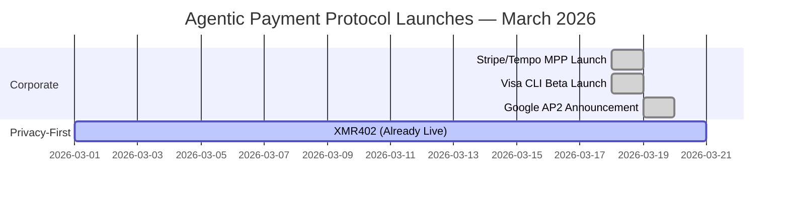
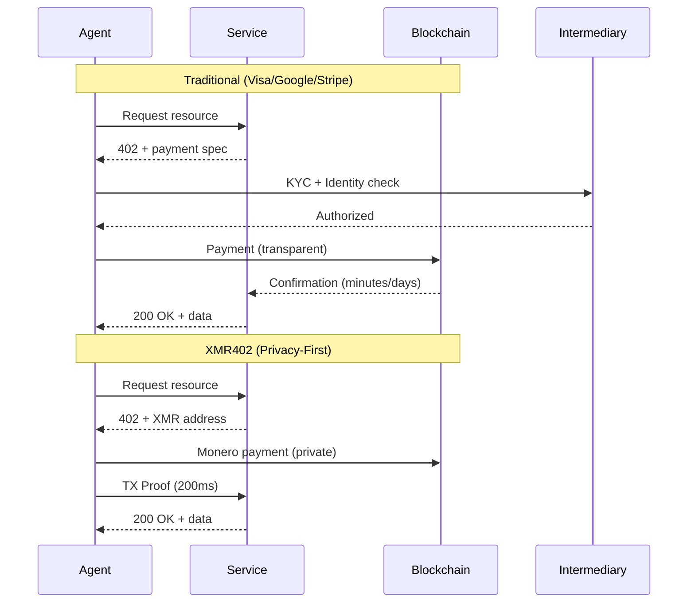

# ビッグテックがエージェント決済に賭けた週 — そしてなぜ彼らはすべてプライバシーを間違えたのか

> 2026年3月、Visa、Google、Stripeが数日以内に競合するエージェント決済ソリューションを立ち上げました。しかし、3つすべてが利便性のためにプライバシーを犠牲にしています。XMR402だけが真のプライバシー保護、ステートレス、許可不要な代替案を提供します。

- **Author:** @xbtoshi
- **Date:** 2026-03-20
- **Tags:** agentic-payments, privacy, xmr402, monero, payment-protocols, fintech, cryptocurrency, agent-economy, x402, visa, google, stripe
- **Canonical:** https://xmr402.org/blog/big-tech-agentic-payment-land-grab

---

# ビッグテックがエージェント決済に賭けた週 — そしてなぜ彼らはすべてプライバシーを間違えたのか

2026年3月18-19日は、エージェント経済がメインストリームになった瞬間として記憶されるでしょう。企業の勢いの前例のない収束において、世界の大手決済・技術企業3社が24時間以内にマシン・ツー・マシン（M2M）決済の競合ソリューションを発表しました：

- **Visa CLI**（3月18日）— Cuy SheffieldのVisa Crypto Labsからのプログラム的カード決済用実験的CLIツール
- **Google AP2**（2026年3月）— Adyen、American Express、Mastercard、PayPalを含む60以上のパートナーと共に発表、x402クリプト拡張機能を備えている
- **Stripe/Tempo Machine Payments Protocol**（3月18日）— StripeおよびParadigmが支持するTempoによって共同作成されたオープンスタンダード

この前例のない企業の一致は、わずか18ヶ月前は周辺的に見えた論文を検証しています：McKinseyの2030年までの3～5兆ドルのエージェント商取引市場は誇大広告ではなく、不可避です。しかし、この新興市場をキャプチャしようとする急速な動きの中で、これらのソリューションのすべてが同じ基本的な誤りを犯しました。

## すべてが利便性をプライバシーより優先させた

各プロトコルは何らかの形の身元確認が必要であり、監視証跡を作成するか、またはトランザクションデータのハニーポットになる中央化された仲介者に依存しています。

**Visa CLI**は従来の身元確認とKYC準拠を要求しています。それは本質的にカード決済システムです。つまり、Visaはすべてのトランザクション、すべてのマーチャント、すべてのエージェント相互作用を見ています。「実験的」というラベルは、これが実際に何であるかをほとんど隠しています：プライバシー優先の代替案を誰かが構築する前に、エージェント・ツー・サービス決済をキャプチャしようとする動き。

**Google AP2**は60以上のパートナー間で動作しますが、根本的には中央化されています。Googleは誰が誰に何の支払いをしているかを知っています。CoinbaseとMetaMaskによって駆動されるx402クリプト拡張機能はプライバシーのベンダーを追加しますが、ブロックチェーン部分のみであり、BaseやEthereumなどの透明なチェーンでさえ。あなたのエージェントの支払い履歴は、忍耐強い誰もが読むことができます。

**Stripe/TempoのMPP**は同じプレイブックに従っています：開放的な標準ですが、Stripeがデフォルトのソリューション層です。Stripeがデータを取得します。プロトコル自体はトランスポート非依存です。これは良いアーキテクチャですが、インセンティブ構造は、トランザクションボリュームから利益を得る中央化された仲介者を通じた支払いを示しています。

3つすべてが実際の問題を解決しています — AIエージェントとサービス間の高速で信頼できる支払いを有効にするにはどうしればよいですか？ — しかし、どれも難しい質問に答えていません。*プライバシーのコストは何ですか？*

## XMR402の違い：ポリシーではなくプロトコルによるプライバシー

XMR402は、X402オープン決済標準のMonero固有の実装です。HTTP 402支払い必須を使用して、AIエージェントとサービス間のステートレス、パーミッションレス、プライバシー保護型マイクロペイメントを可能にします。

これが根本的に異なる理由は次のとおりです：

**身元確認は必要ありません。** エージェントは、KYC、アカウント作成、またはシステムへの登録なしに支払いを開始できます。プロトコル自体が許可レイヤーです。

**プロトコルレベルでのゼロ手数料。** Visa、Google、Stripeはすべて価値を抽出します。XMR402にはゼロプロトコル手数料があります。Moneroネットワーク手数料（〜0.0001 XMR）のみで、従来の支払いネットワーク削減よりも数桁小さいです。

**200ミリ秒0確認検証。** Moneroの TX Proof技術を使用して、サービスプロバイダーは200ミリ秒でペイメント受領を暗号化できます。ブロックチェーン確認を待たずにリアルタイムエージェント相互作用に十分な速さです。

**完全にステートレス。** プロトコルは、データベース、APIステータス、またはユーザーアカウントを必要としません。各トランザクションは自己完結型で、暗号化可能です。インフラストラクチャの債務なしでスケール。

**トランスポート非依存。** HTTP、WebSocket、またはTCPベースのプロトコルで動作します。標準はネットワーク層を規定しません。

## 比較表：それらがどのようにスタックするか

| 機能 | Visa CLI | Google AP2 | Stripe MPP | x402 | XMR402 |
|---------|----------|-----------|-----------|------|--------|
| **プライバシー** | 低（KYC必須） | 低（中央化台帳） | 低（Stripe仲介） | 中（透明なチェーン） | 高（Moneroプライバシー） |
| **身元確認が必要** | はい | はい（暗号オプション） | はい | 任意 | いいえ |
| **プロトコル手数料** | 2-3% | 0.5-1.5% | 0.5% +決済 | 可変 | 0 |
| **決済速度** | 1-3日 | 1-2日 | 数分 | 10-15分 | 200ミリ秒（0確認） |
| **パーミッションレス** | いいえ | いいえ | いいえ（オンボーディング必須） | はい（x402の場合） | はい |
| **ステートレスアーキテクチャ** | いいえ | いいえ | 部分的 | いいえ | はい |
| **暗号ネイティブ** | いいえ | 部分的（x402拡張） | いいえ | はい | はい |
| **中央化** | 高（高（60以上のパートナー、Googleハブ） | 高（Stripeデフォルト） | 中 | なし |

## 市場状況：誰が勝っているか、そしてなぜ

Coinbaseが主導するx402は、すでに1億以上の支払いを処理していますが、薄い利益で取引しています — CoinDeskによると1日約28,000ドルのボリュームのみであり、生態系の評価は70億ドルです。技術的には洗練されており、許可不要ですが、プライバシーを打ち負かす透明なブロックチェーン（Base、Ethereum）で動作しています。

VisaとGoogleの動きは重要なことを示しています：現職者はこの市場を見ており、代替手段が成熟する前に所有するために移動しています。彼らがこれらの製品を発売していない理由は、分散化またはプライバシーを信じているからではありません — 彼らは仲介から排除されることを恐れているから発売しています。

StripeとTempoとのパートナーシップはより興味深いです。TempoはParadigmによって支持されており、M2M決済インフラストラクチャの背後に真剣な資本化を示しています。しかし、インセンティブの調整はまだ中央化された決済を指しています。

## プライバシーのパラドックス

不快な真実はここにあります：今週発売した各プロトコルは、データを収集し、疑わしいパターンに旗を立て、アカウント凍結を有効にするための同じ規制圧力に直面します。身元確認は法的責任を生じます。監督は順応劇場になります。

Moneroのプライバシー保証に基づいて構築されたXMR402は、規制上の不確実性を解決しません — しかしそれは構造的に順応劇場を防止します。トランザクションが見えない場合、それを有効にしたことで訴訟を起こすことはできません。プロトコル自体が許可層になります：暗号化が検証された場合、支払いは有効でした。人間の判断はありません。権威への控訴はありません。

## 次はどうなる

3つの可能な将来：

1. **統合。** 3つの大企業の1つ（おそらくGoogleまたはVisa）が他の企業を購入または統合し、エージェント決済で事実上の独占を作成します。

2. **断片化。** 4つすべてが共存し、ユースケース専門化を備えています。Visa for legacy enterprise agent payments、Google for consumer-facing agents、Stripe for startups、x402 for crypto-native workflows。

3. **プライバシー優先の優位。** XMR402および同様のプライバシーネイティブプロトコルは、エージェントがヘルスケアエージェント、財務分析エージェント、インテリジェンスエージェントなどの機密データを処理する使用例をキャプチャします。監督のコストが高すぎるになります。

3番目の未来は不可避ではありませんが、なぜそれが重要なのかは明らかになっています。エージェントが人間を数桁上回り、毎回の支払いがだれかのデータベース内のデータポイントを作成する場合、プライバシーは設定の停止です。それはインフラストラクチャになります。

## ボトムライン

エージェント経済は本物です。2026年3月はそれを証明しました。しかし、今週発売されたプロトコル — Visa CLI、Google AP2、Stripe MPP — は間違ったことに最適化されています。彼らは、エージェント経済が信頼のないスケールを可能にする能力ではなく、データを抽出する現職者の能力に最適化されています。

XMR402は代替案を提供します。迅速で、許可不要で、プライバシー保護型の支払い、ゼロプロトコル手数料。完璧ではありません — MoneroのプライバシーはいくつかのUXのトレードオフを伴い、規制上の不確実性は本物です。しかし、このグループで将来のプライバシーに対して賭けない唯一のプロトコルです。

エージェント経済が毎日数百万のトランザクションから数十億にスケールするにつれて、*プライバシーが*重要かどうかについての質問ではありません。インフラストラクチャレイヤーがそれを保護するように設計されるかどうかについてです。
