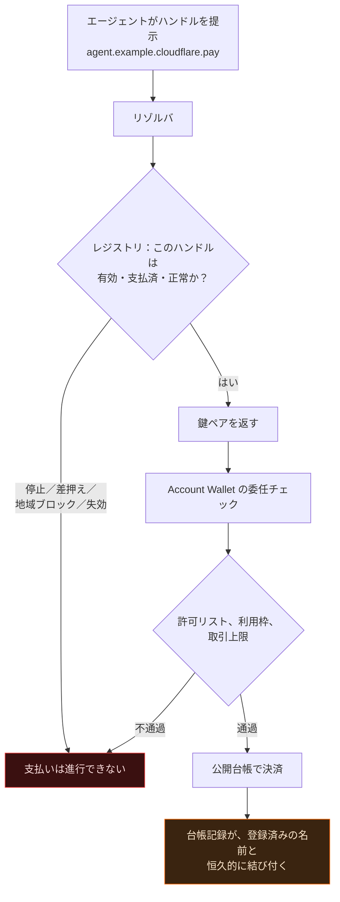
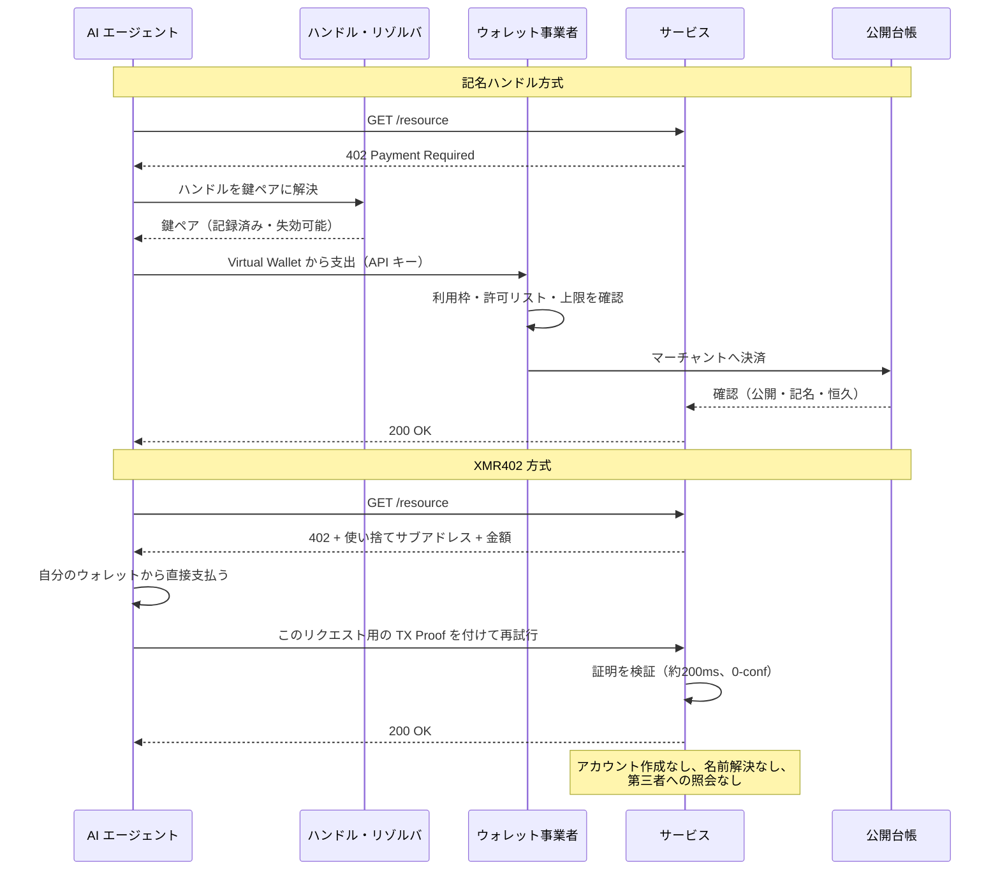

# 名前こそがチョークポイント：cloudflare.pay がすべてのエージェントに恒久的な支払いアドレスを与える理由と、XMR402 のエージェントが無名であり続ける理由

> Cloudflare の Wallets と cloudflare.pay は AI エージェントに支出上限を与え、さらに重大なもの——名前を与えた。解決可能な支払いハンドルは、透明な台帳を記名の行動記録に変える結合キーである。XMR402 は代わりに使い捨てアドレスを生成する。解決するものも、失効させるものもない。

- **Author:** @xbtoshi
- **Date:** 2026-09-05
- **Tags:** xmr402, monero, x402, cloudflare, cloudflare-wallets, cloudflare-pay, agent-identity, naming-layer, dns, handles, virtual-wallets, delegated-spend, stateless, tx-proof, fcmp, anonymity-set, agentic-payments, privacy, 0-conf, ripley-guard, censorship-resistance
- **Canonical:** https://xmr402.org/blog/cloudflare-pay-handles-agent-naming-layer-xmr402

---

# 名前こそがチョークポイント：cloudflare.pay がすべてのエージェントに恒久的な支払いアドレスを与える理由と、XMR402 のエージェントが無名であり続ける理由

2026年8月4日、Cloudflare は Agents Week において Wallets と `cloudflare.pay` を発表した。報道の多くは分かりやすい半分を見出しにした——AI エージェントが資金を保有し、上限の範囲で使えるようになった、と。それは面白くないほうの半分である。

より重大なもう半分は、エージェントが**名前**を与えられたことだ。

ウォレットは容れ物であり、名前は索引である。そして人類が築いたあらゆるネットワークシステムにおいて、制御が蓄積する場所はストレージ層でも転送層でもなく、**命名層**だった。Cloudflare はそれを誰よりもよく知っている。だからこそ同社自身が `cloudflare.pay` の説明に持ち出した比喩が DNS なのだ——ドメイン名が IP アドレスに解決されるように、人間が読める識別子が暗号鍵ペアに解決される。

この比喩は完全に正しい。そして、それこそが問題である。

## 実際に出荷されたもの

宣伝を剥ぎ取ると、3つは実在し、1つは提案であり、いくつかは目立って伏せられている。

実在するもの：資金を保有する人間所有の **Account Wallet**。これがエージェントが API キーで操作する **Virtual Wallet** に上限付きの支出権を委任する。委任には利用枠、承認済みマーチャントの許可リスト、そして1取引あたりの上限が付く。

提案されているもの：`cloudflare.pay` ハンドル——エージェント ID 標準が定まらない間の橋渡しとして提示された、人間可読の ID 層。

伏せられているもの：残高を保管するカストディアン、対応ステーブルコイン、決済ネットワーク。ハンドル予約は発表当日に開始されたが、入金・支出・マーチャント対応は Cloudflare 自身の文面でも未来形である。

公平を期そう。上限付き委任は、それが置き換える構成——残高無制限のホットウォレットと、エージェントの環境変数に貼り付けられた API キー——より確かに優れている。利用枠と取引上限は、暴走したり乗っ取られたりしたエージェントの被害範囲を実際に縮める。以下の議論はそれを否定しない。

異議はもっと狭く、そしておそらくより長持ちする——支出制御はプレスリリースになる部分であり、命名層はインターネットを変える部分である。

## DNS は中立な層ではなかった

Cloudflare の比喩を真に受けて、最後まで辿ってみよう。

DNS はインターネットに使いやすさを与えた。同時にレジストリ、レジストラ、リゾルバ、更新サイクル、TTL、濫用ポリシー、停止手続き、そしてやがて裁判所命令による差押えと管轄別ブロックリストを与えた。設計文書にそれらは一つも書かれていない。すべてはただ一つの性質から不可避に導かれた——どこかに「この名前は何を指すのか？」に答える主体が存在し、したがって「何も指さない」と答えることもできる、という性質である。

支払いの命名層はこの構造をまるごと相続する。`agent.example.cloudflare.pay` が鍵ペアに解決されるなら、解決する何かが存在する。その何かにはポリシーがあり、ポリシーには例外があり、例外には法的手続きが、手続きには管轄が付随する。

図の各ボックスは、支払人でも受取人でもない第三者が支払いを止められる地点である。これは Cloudflare の意図への批判ではなく、「解決可能な名前空間」とは何かという記述にすぎない。

## 名前が透明な台帳に付け加えるもの

公開チェーン上の仮名性はもともと脆い。アドレスのクラスタリング、時刻相関、切りのよい金額、繰り返される取引相手により、分析者は「匿名」アドレスを不気味なほどの確度で実体へ収束させられる。通常そこに欠けているのが**結合キー**——アドレス群を実在の登録者に結び付ける、唯一の永続的な識別子だ。

支払いハンドルはまさにその結合キーであり、しかも自発的に、設計上の意図として差し出される。

これは双方向に効く。前向きには、そのハンドルで行われる将来のすべての支払いが登録者に帰属する。後ろ向きには、対応関係が判明した時点で、それまで曖昧だった履歴も解ける。安定したハンドルの背後で鍵をローテーションしても防げない——リゾルバは構造上その対応を保持している。それが仕事のすべてだからだ。

| 層 | 何を知っているか | 支払い後も残るか |
|---|---|---|
| 公開台帳 | 金額、時刻、相手方、アドレスグラフ | 永久かつ公開 |
| ハンドル・レジストリ | ハンドルと鍵の対応、登録者、更新履歴 | 事業者側に残る |
| Account Wallet | どの人間がどのエージェントにいくら出資したか | 事業者側に残る |
| 許可リスト | エージェントが支払いを許されたすべての相手 | 事業者側に残る |
| マーチャント前段のリバースプロキシ | リクエスト本体、ヘッダ、時刻、発信元 | 保持ポリシー次第 |

この表を5つではなく1つのシステムとして読めば、浮かび上がるのは自律エージェントの完全な行動記録である——誰が出資し、何を買うことを許され、実際に何を、いつ、いくらで、どこから買ったか。そして根元には人間の名前がある。

## チョークポイントの積層

不安なのは意図ではなく集中である。

ウェブの相当部分はすでに単一のリバースプロキシの背後にある。そこに AI クローラーへのリクエスト単位課金が加わる。エージェント ID 層が加わる。ウォレットと決済経路が加わる。こうして単一の事業者が、原理的にはリクエストを観測し、ID を解決し、支払いを清算できる——歴史的に無関係な三者が持っていた三つの層が、一つに畳み込まれる。

2つ目のフローは参加者が少ない。問うべきことが少ないからだ。引くべきハンドルがなく、したがって照会すべきレジストリもなく、したがって「ノー」と言える立場の者もいない。

## XMR402：解決するものがなく、失効させるものもない

XMR402 は Monero 上に HTTP 402 を実装しており、その設計判断は命名の問題にほぼ一項目ずつ対応している。

**識別子は使い捨てである。** 支払い先は単一のチャレンジのために生成されるワンタイムアドレスだ。予約も更新も登録も再利用もされない。名前空間がないのは、名前がないからである。

**認可はアカウント単位ではなくリクエスト単位である。** エージェントは「この支払いがこのリクエストのために行われた」ことを示す Monero の TX Proof を提示する。漏洩して再生される持参人型の API キーは存在しない。

**サーバーはステートレスである。** アカウントを作らないので、名指しし、停止し、召喚令状を送る対象となるアカウントも存在しない。Ripley Guard はゼロ承認で約200ms で証明を検証し、直後に支払人を忘れる。

**台帳に結合キーがない。** Monero の FCMP++ アップグレードにより、支出者は1億5000万を超える出力からなる匿名集合に対して所有を証明でき、しかも過去の出力にも遡及して適用される。ハンドルを分析者にとって価値あるものにしているアドレス・クラスタリング手法は、ここでは足がかりを持たない。

| 特性 | cloudflare.pay + ステーブルコイン | XMR402 |
|---|---|---|
| 支払い識別子 | 人間可読の恒久ハンドル | 使い捨てアドレス（単回） |
| 失効させられる主体 | レジストリ／ウォレット事業者 | 誰もいない（何も付与されない） |
| 登録者の身元 | 人間のアカウント保有者 | 不要 |
| 資金の保管 | 事業者が保持する Account Wallet | エージェント自身のウォレット |
| プロトコル手数料 | 事業者とネットワーク次第 | ゼロ |
| 台帳上の連結可能性 | 金額・アドレス・グラフが公開 | 遮蔽、1.5億超の匿名集合 |
| 支出制御の仕組み | 利用枠と許可リスト（ポリシー） | リクエストごとの金額（構造） |
| サーバー側の状態 | アカウント・残高・監査ログ | なし |
| 第三者なしで自己ホスト可能 | 不可 | 可 |
| 決済レイテンシ | ネットワークと事業者次第 | 約200ms、0-conf |

## 取引条件を公平に述べる

記名のエージェント支払いは詐欺でも罠でもない。それは一つの取引であり、買い手によっては正しい選択だ。

企業が自社のベンダーに支払うなら、請求書、突合、紛争処理、そして末端に人間の名前がある監査証跡が必要になる。ハンドルはそのすべてを提供する。企業調達は**帰属可能であるべき**なのだ。

異議はあくまで、帰属が**既定値**になること——ユースケースが必要とするか否かにかかわらず、すべてのエージェントに付いてくることに対してである。有料論文を読み、価格を問い合わせ、推論トークンを200個買い、公開データセットを巡回するエージェントに、恒久的で記名された公開記録を生成する理由はない。それらの支払いは、機械にとっての「自販機に硬貨を入れる」行為だ。新聞スタンドでパスポートを求めた者はいない。

健全な着地点は、取引ごとに選べる2本のレールである。説明責任そのものが商品である場面では記名かつ監査可能に、そうでない場面では無名かつ使い捨てに。不健全なのは、2本目のレールがそもそも存在しないことだ。

## 名前とは、システムが「ノー」を学ぶ方法である

2026年のエージェント決済スタックは、一つの共通信念に収束した——エージェントは**何か**に支払う前に、まず**誰か**でなければならない。身元が先、決済が後。今年の主要プロトコルはいずれも、身元パスポート、信頼スコア、許可制台帳、そして今回の支払いハンドルと、この主題の変奏である。

XMR402 は順序を逆にする。支払人ではなく支払いを証明せよ。サービスは必要なもの——このリクエストに対する検証済みの資金——を正確に得て、それ以外は何も知らない。知るべき残りが存在しないからだ。

名前はウェブを辿れるものにした。同時に、差し押さえられるものにもした。エージェントが機械の速度と量でインターネットに支払いを始める今、問う価値がある——その数十億の極小取引の一つひとつに、本当に登録名義人が必要なのか。それとも一部は、ただ支払われ、検証され、忘れられるべきなのか。
