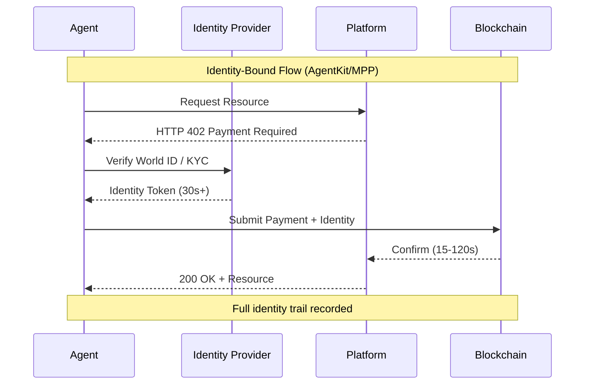
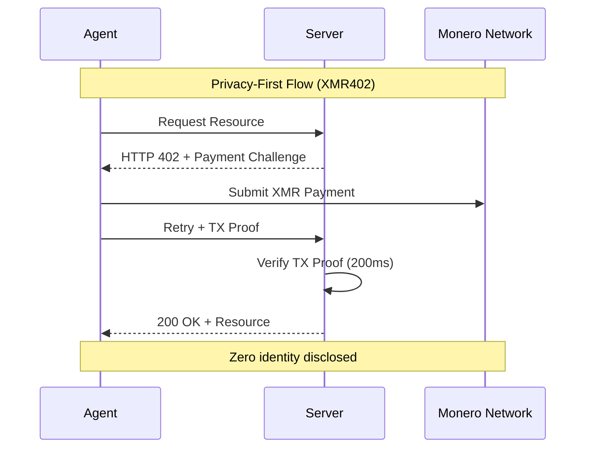
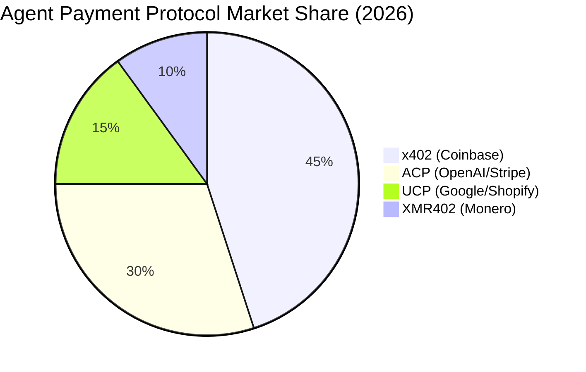

# アイデンティティの罠：自律エージェントが人間のアイデンティティパスポートを必要としない理由

> WorldのAgentKit（3月17日）とStripeのMachine Payments Protocol（3月18日）は両方ともアイデンティティバインディングインフラストラクチャを必須としています。すべてのエージェント取引に生体認証アイデンティティをバインドすることが監視資本主義の最後の境界線をどのように作成するのか、そしてXMR402のアイデンティティフリーアプローチが自律システムにとってなぜ哲学的な分岐点を表すのかを検討します。

- **Author:** @xbtoshi
- **Date:** 2026-03-19
- **Tags:** xmr402, monero, privacy, agentkit, world, stripe, mpp, identity, autonomous-agents
- **Canonical:** https://xmr402.org/blog/identity-trap-agentkit-mpp-privacy

---

## アイデンティティの罠：自律エージェントが人間のアイデンティティパスポートを必要としない理由

2026年3月17日、Worldは自律的なAIエージェントが現実世界で取引できるようにするフレームワークであるAgentKitを立ち上げました。3月18日、StripeはParadigmと協力してTempoブロックチェーン上に構築されたMachine Payments Protocol（MPP）を発表しました。両者は基本的な仮定を共有しています：すべてのエージェント取引は検証された人間のアイデンティティに結合される必要があります。

これはアイデンティティの罠です。

経済史上初めて、誰が取引を開始したかを知る必要がない取引を作成する技術があります。自律エージェント（ユーザー、システム、または自身の代わりに行動するソフトウェア）はこの自由を具現化すべきです。代わりに、AgentKitはエージェントをWorld IDの生物測定的人間性証明に拘束しています。StripeのMPPはブロックチェーンベースですが、依然としてアイデンティティ結合インフラストラクチャを必要とします。一方、XMR402はMoneroネイティブのX402オープン支払い標準実装であり、根本的に異なるパス：ステートレス、プライバシー保護マイクロペイメント（エージェント間）を実証しており、アイデンティティインフラストラクチャは不要です。

市場は矛盾したシグナルを送っています。x402（Base/EthereumでのCoinbaseの実装）はエコシステムの注目を集めました—70億ドルの名目評価—ただし1日約$28,000しか処理しません。同じ期間に、140万以上のチェーン上AIエージェント取引が平均値$0.31で発生しました。誇大広告と採用の間のギャップは、核心的な問題を明かします：アイデンティティ結合プロトコルはエージェントが摩擦のない操作を必要とするまさにその場所に摩擦を導入します。

### 哲学的問題：アイデンティティとしての税金

アイデンティティは人間経済に目的があります。銀行は規制遵守と詐欺防止のため顧客を知る必要があります。プラットフォームはレピュテーションと行動をリンクするためアイデンティティを必要とします。しかし、エージェントは人間ではありません。保護すべきレピュテーション、抑止すべき犯罪意図、または凍結すべき資産がありません。指示があります。

エージェント取引を人間アイデンティティに結合する場合、エージェントに奉仕していません—監視装置に奉仕しています。各エージェントが何をするか、誰の代わりに、どの目的で完璧な監査証跡を作成しています。これはバグではありません；機能です。アイデンティティ結合エージェント支払いは以前に不可能だったスケールでビジネスインテリジェンスを可能にします。

簡単なシナリオを考えてください：コンテンツクリエーターが複数のプラットフォーム間で広告取引を交渉するために50の自律エージェントを配置します。AgentKit + World IDを使用すると、各取引はクリエーターのアイデンティティまでトレース可能です。広告主はクリエーターの全エージェントネットワークをマップし、入札パターンを理解し、競争インテリジェンスを抽出できます。XMR402では、各エージェントは独立した経済行為者として動作します。広告主は取引が発生したことを見ます；誰がそれを認可したか、他のエージェントが同じ空間で動作しているか、またはクリエーターの広範な戦略を見ません。

これは偏執的ではありません。ビジネス現実です。アイデンティティ要件は非対称情報を作成し、プラットフォーム運営者と競合他社に向かって流れます。

### 技術的現実：アイデンティティがエージェント設計を壊す理由

自律エージェントは機能するための自律性を必要とします。各取引にアイデンティティ検証を導入する瞬間、あなたは以下を導入します：

**1. レイテンシーと状態依存性**：World ID検証、KYC準拠チェック、アイデンティティ確認は取引決済に30秒以上を追加します。MoneroトランザクションProof経由のXMR402の200msの0-conf検証はこのボトルネックを排除します。エージェントはネットワーク速度で動作できます、官僚的な速度ではなく。

**2. 単一障害点**：クリエーターのアイデンティティが侵害される場合、その下のすべてのエージェントが侵害されます。エージェントシステムが中央アイデンティティ検証に依存している場合（AgentKitの場合）、アイデンティティプロバイダーの障害はすべての従属エージェントにカスケード配置されます。XMR402のステートレスアーキテクチャは各取引が独立していることを意味します。1つの取引での侵害は伝播しません。

**3. 相関を介したプライバシー漏洩**：同じ人間アイデンティティの下で動作する複数のエージェントは相関問題を作成します。敵はエージェント取引のパターンを分析することでクリエーターの行動、戦略、関係を再構成できます。XMR402のプライバシーモデルはこれを排除します：エージェントは経済的に区別できません。

**4. ビジネスモデルロックイン**：アイデンティティインフラストラクチャは切り替えコストを作成します。AgentKitエコシステム内でエージェントの構築に数ヶ月を費やした場合、競合者への移行はアイデンティティ検証の再確立、レピュテーションシグナルの再構築、新しいプロバイダーのアイデンティティシステムとの再統合が必要です。XMR402のトランスポート無関設計（HTTP + WebSocket）とオープン標準はエージェントがポータブルであることを意味します。

### 市場機会：これが今重要な理由

AgentKitとMPPの発表のタイミングは重要なことを明かします：確立された支払いインフラストラクチャ（CoinbaseのX402、Google/ShopifyのUCP、OpenAI/StripeのACP）はプラットフォーム制御とデータ抽出を増加させるため正確にアイデンティティ結合モデルの周りに統合しています。

しかし、9ヶ月以上の140百万以上のエージェント取引は平均値$0.31で異なる出現市場を提案します。これはマシン間支払いが規模化する市場です。これらの取引は小さすぎ、頻繁すぎ、多すぎてアイデンティティ検証をサポートできません。1000のエージェントを配置し毎日各100取引を実行するクリエーターは100,000の日次取引を生成します。$0.31の平均値では、アイデンティティ検証コストは取引価値を超えます。

XMR402はこの市場のために目的で構築されています。ゼロプロトコル料金。ステートレスアーキテクチャ。デフォルトプライバシー。アイデンティティ要件を削除する場合、摩擦の主要源を削除します。

### 機能比較：3つのエージェント支払いモデル

| 機能 | AgentKit (x402) | Stripe MPP | XMR402 |
|------|-----------------|-----------|--------|
| **必要なアイデンティティ** | はい (World ID) | はい (KYC) | いいえ |
| **決済速度** | 30-120秒 | 15-60秒 | 200ms (0-conf) |
| **取引コスト** | ステーブルコイン料金 | プロトコル料金 | ゼロプロトコル料金 |
| **プライバシーモデル** | アイデンティティ結合 | アイデンティティ結合 | 区別不可、匿名 |
| **単一障害点** | アイデンティティプロバイダー | Stripe/Tempo | Moneroネットワーク |
| **エージェント移植性** | エコシステムロックイン | エコシステムロックイン | トランスポート無関 |
| **マイクロ取引に適切** | いいえ（料金が価値を超える） | いいえ（KYC開銷） | はい（スケーラブル） |
| **ビジネスインテリジェンス** | 完全な取引グラフ | 完全な取引グラフ | ゼロ可視性 |
| **規制準拠** | 組み込み | 組み込み | オプション/ローカル |

### エコシステム対応

XMR402のエコシステム—Ripley Guard（サーバーミドルウェア）、Ripley Gateway（エージェント支払い実行者）、Ripley Terminal（デスクトップアプリ）—はエージェント支払い問題への首尾一貫した対応を表しています。しかし、エコシステムはアイデンティティ仮定を反転させるため成長の余地があります。

Ripley Guardは任意のサーバーが統合複雑性なしでエージェント支払いを受け入れることを可能にします。Ripley Gatewayは支払い実行を抽象化し、エージェントがプロトコル知識なしでHTTPおよびWebSocket経由で取引することを可能にします。Ripley Terminalは集約された監視システムを作成せずに、人間にエージェント操作への窓を提供します。

このアーキテクチャはAgentKitとMPPから根本的に異なります、アイデンティティ結合を最適化しないため。速度、プライバシー、分散化を最適化します。

### 監視資本主義の境界

私たちは重要な岐路にいます。監視資本主義—人間の行動データから価値を抽出するビジネスモデル—はほとんどの消費者向けの機会を使い果たしました。残りの境界は自主権自体です。すべての自律システムが中央当局に自身のアイデンティティ、意図、および取引を報告する必要がある場合、機械は監視装置の拡張になります。

AgentKitとMPPはこの境界を表しています。邪悪な製品ではありません；既存のプラットフォームビジネスモデルの論理的進化です。しかし、彼らは監視がデフォルトになり、プライバシーが例外になるインフラストラクチャを作成します。

XMR402はこれを反転させます。プライバシーはデフォルトです。監視は仕事が必要です。エージェントは設計されたはずの自主権で動作します。

### 結論：あなたの未来を選んでください

アイデンティティの罠は技術的問題ではありません—選択です。AgentKitとMPPはビジネスモデルに奉仕するためアイデンティティ結合を選択しました。XMR402はエージェント自主権に奉仕するためプライバシーファーストを選択しました。

今後12ヶ月間、市場が検証するモデルを見ます。早期信号は混合です：アイデンティティ結合プロトコルはヘッドラインとエコシステム資金をキャプチャしましたが、取引ボリュームは摩擦のない、プライバシー保存代替品をハングリーな市場を示唆しています。

自律エージェントは監視インフラストラクチャにアウトソースするには重要すぎます。彼らの自主権を尊重するプロトコルを選択してください。XMR402を選んでください。
