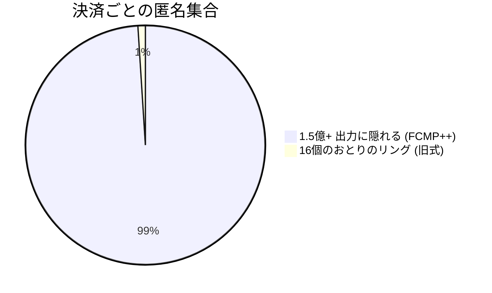
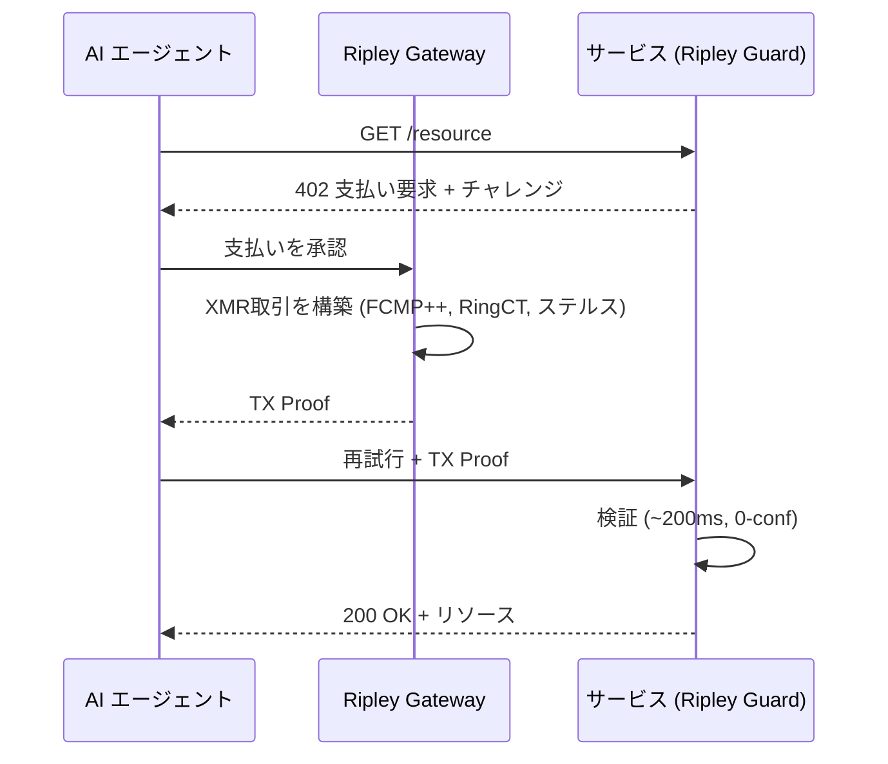
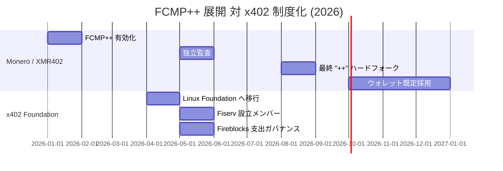

# 1億5千万の群衆：Monero の FCMP++ アップグレードが、すべての XMR402 エージェント決済に史上最大の匿名集合を与える

> Monero の FCMP++ アップグレードは匿名集合を 16 から 1 億 5 千万超へ拡大する。22 社が透明な x402 を統治する中、なぜこれが XMR402 をエージェント経済で最もプライベートなレールにするのか。

- **Author:** @xbtoshi
- **Date:** 2026-05-31
- **Tags:** xmr402, monero, fcmp, fcmp-plus-plus, anonymity-set, ring-signatures, privacy, x402, x402-foundation, linux-foundation, agentic-payments, ringct, stealth-address, stateless
- **Canonical:** https://xmr402.org/blog/monero-fcmp-anonymity-set-xmr402-agent-payments

---

# 1億5千万の群衆：Monero の FCMP++ アップグレードが、すべての XMR402 エージェント決済に史上最大の匿名集合を与える

この春、22 社の企業が透明な決済標準を統治するために集まる一方で、Monero はエージェント経済が見たことのないことを静かに成し遂げた——すべての決済を 1 億 5 千万を超える群衆の中に隠したのだ。

この対比が今年を象徴している。2026 年 4 月、x402 プロトコルは Linux Foundation の傘下に入り、5 月までにその設立メンバー名簿は世界金融の名鑑のようだった——Visa、Mastercard、American Express、Stripe、AWS、Google、Microsoft、Shopify、Circle、Coinbase、Fiserv など。同月、Fireblocks が加わり「支出ガバナンス」拡張を発表した。メッセージは明白だ——x402 上のエージェント決済は高速で、資金が潤沢で、監視される。

その間、Monero は史上最も深いプライバシー強化 **FCMP++**(フルチェーン・メンバーシップ証明)の展開を完了した。402 決済標準の Monero ネイティブ実装である XMR402 にとって、これは脚注ではない——すべてのエージェント取引の下で土台が強固になることを意味する。

## FCMP++ が実際に変えたもの

長年、Monero は実際の支出を 16 個のおとりからなるリング署名の中に隠してきた。観察者はあなたの本物の出力が 16 のうちの 1 つだと知っていても、どれかは分からなかった。良いが、有限だ。

FCMP++ はリング署名を完全に廃止する。今や支出は、わずか 2〜3 KB のコンパクトなゼロ知識証明によって、実際の入力がチェーン上の**全履歴出力の集合**に属することを、どれかを明かさずに証明する。Monero の UTXO 集合は約 1 億 5 千万〜1 億 5,800 万に上り、匿名集合は 16 から 1 億 5 千万超へと跳ね上がった——およそ 1 千万倍の増加だ。

FCMP++ は 2026 年 1 月にネットワーク全体で有効化され、5 月までに独立監査を通過、最終最適化版「++」は 2026 年 8 月のハードフォークで出荷され、主要ウォレットは年末までに既定採用する見込みだ。XMR で決済するすべてのサービス——XMR402 エンドポイントを含む——は、自らのプロトコルを変更せずにこの保証を継承する。

## なぜこれが AI エージェントにとって決定的か

自律エージェントはパターンを漏らす。90 秒ごとに同じ API を呼ぶエージェントはリズムを生む。透明な台帳上では、そのリズムは指紋であり、x402 を統治する企業はまさにそうした台帳上で、Base のような公開チェーンのステーブルコインで決済する。

XMR402 はモデルを反転させる。各決済は、ステートレスな HTTP 402 チャレンジに対して Monero TX Proof を用いて約 200 ミリ秒で検証される——口座も残高も身分証も不要だ。FCMP++ により、送信者は全チェーンに隠れ、金額は RingCT で隠され、受信者はステルスアドレスで守られる。

## XMR402 + FCMP++ 対 透明スタック

| 項目 | XMR402 (Monero + FCMP++) | x402 スタック (ステーブルコイン) |
|---|---|---|
| 決済ごとの匿名集合 | 1.5億+ 出力 | 1 (透明アドレス) |
| 送信者のプライバシー | 証明により秘匿 | チェーン上で公開 |
| 金額のプライバシー | RingCT (秘匿) | チェーン上で公開 |
| 受信者のプライバシー | ステルスアドレス | チェーン上で公開 |
| ガバナンス | 開放・会員不要 | 22 社の設立メンバー |
| プロトコル手数料 | ゼロ | 変動 |
| 身元要件 | なし (ステートレス) | KYA が増加傾向 |

企業は春を、誰が台帳を統治するか決めることに費やした。Monero はその春を、台帳上に統治すべきものが何も残らないようにすることに費やした。

*XMR402 は、開かれた 402 決済標準の Monero ネイティブ実装である——ステートレス、手数料ゼロ、約 200 ミリ秒の検証、そして今や決済史上最大の匿名集合に支えられている。*

