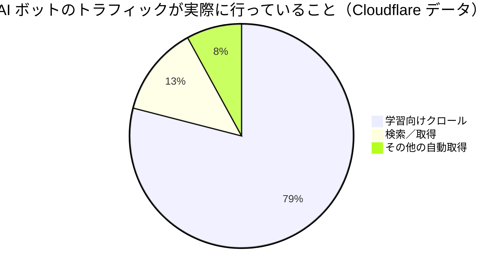
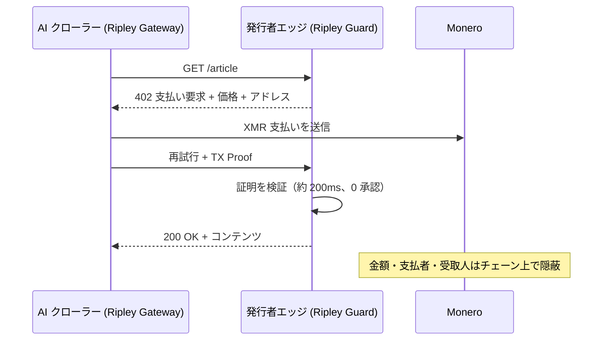

# クロール痕跡：ペイ・パー・クロールはいかにして各 AI ラボの学習戦略を公開地図に変えるのか——そして XMR402 がなぜ台帳を閉じるのか

> ペイ・パー・クロールは発行者が AI クローラーに課金できるようにするが、透明な台帳では各クロール支払いがラボの学習コーパスを漏らす。XMR402 のプライベートでステートレスな Monero 決済は、戦略を放送せずに発行者へ支払う。

- **Author:** @xbtoshi
- **Date:** 2026-06-01
- **Tags:** xmr402, monero, x402, pay-per-crawl, cloudflare, ai-crawlers, training-data, gptbot, claudebot, common-crawl, privacy, publishers, content-monetization, agentic-payments, stateless, 0-conf
- **Canonical:** https://xmr402.org/blog/pay-per-crawl-training-data-trail-xmr402

---

# クロール痕跡：ペイ・パー・クロールはいかにして各 AI ラボの学習戦略を公開地図に変えるのか——そして XMR402 がなぜ台帳を閉じるのか

2025 年、Cloudflare はウェブの経済を静かに書き換える既定値を反転させた。AI クローラーは支払わない限りブロックされるようになったのだ。同社の**ペイ・パー・クロール**マーケットプレイスは、GPTBot、ClaudeBot、CCBot のようなボットがページを取得するたびに発行者が課金できるようにし、2026 年 1 月には更新されたオープンソースの x402 プロキシ・テンプレートを公開した。Sam Altman は出版の未来をマイクロペイメントと公言している——「明確に言えば、読者が直接ではなく、AI エージェントが行う支払いだ」。

2 年間、議論はエージェントがサービスを*購入する*ことに集中してきた。ペイ・パー・クロールは、エージェントが知能そのものの原材料——テキスト、画像、データ、コーパス——を購入する話だ。そして誰も価格に織り込んでいない問題を伴う。AI ラボがクロールする各ページに支払うとき、**その支払い痕跡は、そのラボが何で学習しているかのリアルタイム地図になる。** 透明な台帳では、業界で最も守られた秘密——学習セットの中身——がマイクロペイメント 1 件ずつ漏れていく。

## コーパスは堀であり、レールは漏洩口である

クロールは閲覧ではない。Cloudflare のデータによれば、学習関連トラフィックは今や AI ボット活動の **79%** を占め、一部のクローラーは紹介訪問あたり数万ページを取得する。その強度でデータを取得し、USDC-on-Base のような公開チェーンでクロールごとに支払うラボは、事実上、自社の R&D 優先事項の構造化フィードを公開している。

各決済には支払者アドレス、受取人（発行者）、金額、タイムスタンプが含まれる。受取ドメインをクラスタリングすれば、競合ラボのデータ取得戦略を再構築できる——チェーンがそれを公開したのだ。医学雑誌への支払い急増は医療モデルの学習を示し、法律データベース発行者との突然の契約は発表の数週間前に垂直分野の立ち上げを示す。

## XMR402：監視台帳ではなく、発行者に支払う

XMR402 はオープンな X402 標準の Monero ネイティブ実装である。HTTP 402 Payment Required で支払いを交渉し、Monero で決済し、Monero TX Proof によりゼロ承認で約 200ms で確認する。Monero のプロトコルレベルのプライバシーにより、金額・送信者・受信者は既定で隠される。発行者は支払いを受け取り暗号学的に検証できるが、世界は台帳を読んで誰が何のために誰に支払ったかを再構築できない。

ステートレス設計はプライバシーと同じくらい重要だ。アカウントの発行も、上限ダッシュボードも、呼び出しごとのウォレット承認もない——後者こそ、透明レールの x402 取引量を 2025 年末のピークから約 77% 崩壊させた障害モードだ。

## 透明なペイ・パー・クロール vs. XMR402

| 観点 | 透明レール (USDC/Base) | XMR402 (Monero) |
|---|---|---|
| 発行者が支払いを受ける | はい | はい |
| クロール金額が公開 | はい | いいえ |
| 支払者／受取人の関連付け | 可能 | 不可（ステルスアドレス） |
| 学習コーパスの漏洩 | 高い | なし |
| 呼び出しごとの承認 | しばしば必要 | ステートレス |
| 決済速度 | ブロック時間＋承認 | 約 200ms、0 承認 |
| プロトコル手数料 | 変動 | ゼロ |

## なぜこれが次の主戦場なのか

ペイ・パー・クロールは今まさに構築されており、既定で透明レール上に構築されている。採用するラボにとってそれは戦略的誤りだ。企業は発行者のコンテンツで学習するために喜んで支払うが、支払いの副作用として学習ロードマップ全体を競合に放送することは望まない。最初にこれに気づいたラボはクロール予算を私的レールに回す——そして一度誰かがそうすれば、残りは競合が暗闇で学習する中で自分だけ公開の場で学習する非対称を許容できなくなる。XMR402 は台帳を閉じる——発行者は支払いを受け、コーパスは秘密のままだ。

