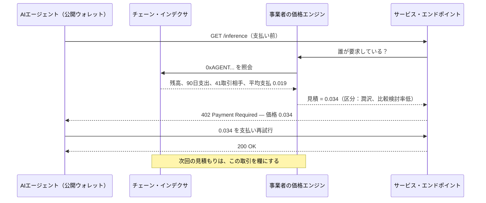
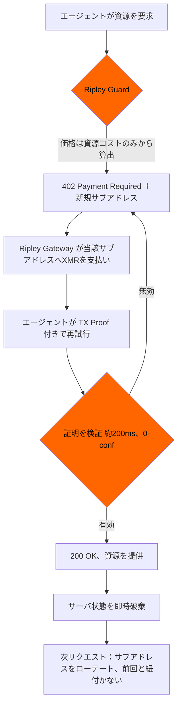

# 支払意思額オラクル：公開されたエージェント・ウォレットが「尋ねる前」に価格を決める仕組み — そしてXMR402が目隠しで見積もる理由

> 2026年8月19日のFTCパーソナライズド・プライシング方針は、事業者がデータを取りに行くことを前提とする。しかし透明レールでは、エージェントのウォレットが残高・支出速度・取引相手グラフ・受入価格を無料で公開する — 開示規制の届かない支払意思額ドシエだ。XMR402は資源から値付けし、一度きりのサブアドレスで決済する。

- **Author:** @xbtoshi
- **Date:** 2026-09-07
- **Tags:** xmr402, monero, x402, personalized-pricing, surveillance-pricing, ftc, section-5, willingness-to-pay, price-discrimination, agent-wallets, wallet-scoring, dynamic-pricing, subaddress-rotation, tx-proof, stateless, ripley-guard, ripley-gateway, acp, ucp, usdc, base, selective-disclosure, vouchers, agentic-payments, 0-conf
- **Canonical:** https://xmr402.org/blog/personalized-pricing-agent-wallet-willingness-to-pay-xmr402

---

# 支払意思額オラクル：公開されたエージェント・ウォレットが「尋ねる前」に価格を決める仕組み — そしてXMR402が目隠しで見積もる理由

2026年8月19日、米連邦取引委員会（FTC）は**パーソナライズド・プライシング**に関する執行方針声明案を公表し、30日間のパブリックコメントを開始した。定義は明快だ。閲覧履歴、位置情報、属性情報、ロイヤルティ記録、購買パターンといった消費者データを用いて、その個人の*支払意思額*や*比較検討の可能性*を推定し、個別の価格を設定すること。この慣行の開示が不十分であれば、FTC法第5条の欺瞞的・不公正な行為に該当する可能性が高い、というのが委員会の立場である。

小売サイトを訪れる人間を想定するなら、筋の通った枠組みだ。しかし透明な台帳上で決済する自律エージェントに対しては、ほぼ無力である。規制当局が明白な何かを見落としたからではない。エージェント経済が、このルールが解こうとしていた「データ収集」という問題そのものを裏返してしまったからだ。

## FTCのリストに載っていないシグナル

委員会が列挙するデータ類型には共通点がある。事業者がそれを**取得しなければならない**という点だ。閲覧履歴はトラッカーから、位置情報は許可プロンプトやIP参照から、ロイヤルティ情報は顧客が加入したプログラムから、属性情報はデータブローカーから来る。取得はいずれも「慣行」であり、慣行は開示でき、監査でき、差し止められる。

ではカウンターの向こう側に、Base上のUSDCでx402型フローを使って支払うAIエージェントを置いてみよう。エージェントのウォレットアドレスは支払いに付随して届く — 決済の仕組み上、届かざるを得ない。そしてそのアドレスは仮名ではない。事業者が**何もしなくても**手に入る、完全に公開された財務ドシエである。

- **現在残高** — このエージェントが今日使える上限そのもの
- **過去の支出速度** — 時間あたり、日あたり、タスク種別ごとの燃焼率
- **取引相手グラフ** — これまで支払ったすべてのサービスと、その頻度
- **実現価格の履歴** — いくらを、誰に、どの資源クラスに支払ったか
- **リトライと相見積もり行動** — 最初の見積もりを飲んだのか、三社を回ったのか
- **補充のリズム** — どのトレジャリーが、どれだけの規模で、どれだけの間隔で補充するか
- **遊休の余裕** — 補充または停止までの残り滑走路

FTCの定義は支払意思額の*推定*を語る。しかし資金が入り、使い回され、オンチェーンで可視のエージェント・ウォレットに推定は要らない。それは直接測定に近い。事前に公開され、無料で読め、取引当事者の誰も運営していないシステムに永久保存される測定値だ。

## 「開示」という救済が届かない理由

委員会が提案する救済は透明性である。目の前の価格はあなたに関するデータから算出された、と買い手に伝えること。買い手がソフトウェアになった瞬間、四つの構造的問題が立ち上がる。

**開示すべき収集慣行が存在しない。** 事業者はエージェントを追跡していないし、セグメントを購入してもいないし、クッキーも置いていない。決済レール自身が設計目標として維持している公開データベースを読んだだけだ。開示規制が規律するのは「集める」という行為だが、ここでは何も集められていない。

**見積もりの瞬間に消費者がいない。** 開示は、通知を読んで立ち去れる人間を前提にする。エージェントが受け取るのは価格入りのHTTP 402ヘッダーであり、それは機械速度で、遂行を命じられたタスクの内部で起きる。JSONボディ内の一行の注意書きは、それを読まない存在にとって意思決定点ではない。

**価格はやり取りの上流でパーソナライズされる。** 人間の場合、パーソナライズは買い手が到着して観察された後に起きる。透明な台帳では、最初のリクエスト以前に起こり得る。ドシエが常備在庫だからだ。あなたのエージェントがその店を知る前に、その店はあなたのエージェント用の価格表を用意できる。

**価格を決めるのは事業者とは限らない。** ウォレット・スコアリングは容易に転売できる。支払意思額の推論がインデクサと店舗の間に挟まるサブスクリプションAPIになれば、事業者は本当にその慣行を行っていない — 行っているのはベンダーであり、事業者は数値を消費するだけだ。顧客関係を持つ側への執行は、推論を行う側からどんどん遠ざかっていく。

## 見積もり時点で各レールが実際に漏らすもの

| 事業者が得られるシグナル | x402 / 透明L2上のUSDC | ACP（OpenAI + Stripe） | UCP（Google + Shopify） | XMR402（Moneroネイティブ） |
|---|---|---|---|---|
| 支払者残高 | 公開・正確 | PSP保有、限度額から推論可 | プラットフォーム保有 | **観測不能** |
| 累積支出額 | 公開・正確 | プラットフォームに可視 | プラットフォームに可視 | **観測不能** |
| 取引相手グラフ | 公開・完全 | プラットフォームに可視 | プラットフォームに可視 | **観測不能** |
| 過去に受け入れた価格 | 公開・正確 | プラットフォームに可視 | プラットフォームに可視 | **観測不能** |
| 永続的な支払者識別子 | アドレス、既定で再利用 | アカウント＋マンデート | アカウント＋紐付け身元 | リクエストごとに新規サブアドレス |
| 比較検討の挙動 | 失敗・ローテーションTxから推論可 | 部分的 | 部分的 | **観測不能** |
| 支払済みであることの証明 | あり | あり | あり | あり — Monero TX Proof、約200ms |
| 第三者がスコアを転売可能か | 可、許可不要 | 契約次第 | 契約次第 | 採点対象が存在しない |

重要なのは最終行である。プラットフォーム型レール（ACP、UCP）では、ドシエは存在するが契約の背後にある。だからFTCの開示という梃子には掴む対象がある。透明チェーンでは、そのドシエは値付けに使いたい者全員にとっての公共財であり、契約も相手方も、渡すべき通知も存在しない。XMR402の列が異なるのは、Moneroが台帳の閲覧者を厳しく制限しているからではない。値付け者が欲しがる事実が、そもそも一度も書き込まれていないからだ。

## XMR402の支払いとともに届くもの

XMR402は、オープン標準X402のMoneroネイティブ実装である。フローの順序は意図的だ。値付けは支払者が可視になる前に行われ、そして支払者は決して可視にならない。

402チャレンジは、そのリクエストを処理するコスト — モデル、トークン数、帯域、計算クラス — から生成される。生成時点でサーバは他に何も持っていないからだ。照会すべきアドレスも、読み込むアカウントも、突き合わせる履歴も存在しない。支払いは一度きりのサブアドレスへ着金し、Monero TX Proofによりゼロ承認・約200ミリ秒で検証される。事業者が知る事実はひとつ — *この特定のリクエストは、この金額で、証明可能に支払われた*。支払いの背後の残高も、エージェントの他の仕入先も、昨日受け入れた価格も、方針によって伏せられているのではない。最初からメッセージに入っていない。

残りはステートレス性が引き受ける。Ripley Guardはセッションも支払者台帳も保持しないため、将来の価格モデルが学習できる蓄積記録が生じない — 事業者自身のモデルも含めてだ。支払者プロファイルを構築できないプロトコルは、それを召喚状で要求されることも、漏洩することも、ひそかに収益化することもできない。

## 誠実な反論

価格から個人という軸を取り除くことは、事業者が正当に求めるものも取り除く。ボリュームディスカウント、ロイヤルティ料金、濫用的な呼び出しに対するリスクベース価格は、いずれも「誰が要求しているか」を知ることに依存する。支払者について何も明かさないレールは、リピート顧客により良い価格を出せない。これは修辞ではなく実コストである。

XMR402の立場は「決して差別化しない」よりも狭い。差別化は**観察者が推論するのではなく、支払者が主張すべきだ**、というものだ。ボリューム区分を望むエージェントは、事業者発行のバウチャーや署名済みケイパビリティを支払いに添えて提示できる。開示されるのは必要な事実だけ — *この所持者はBティアの資格を持つ* — であり、その周辺の情報は一切漏れない。エージェントは取引ごとに、どの主張を行うかを選ぶ。既定は目隠しであり、開示は範囲を限った意図的な行為となる。

丁寧に読めば、これはFTC声明が目指している方向でもある。委員会は、市場条件（在庫、混雑、需要）に反応する**ダイナミック・プライシング**と、個人に反応する**パーソナライズド・プライシング**の間に線を引いている。XMR402は前者を完全に温存する — Ripley GuardのエンドポイントはGPUが逼迫すれば、あるいは要求モデルが高価であれば、より高く課金してよいし、そうすべきだ。取り除かれるのは委員会が懸念する軸だけであり、しかもプロトコル層で取り除かれる。そこにパブリックコメント期間は不要である。

## 実装者への実務メモ

- **リクエストごとにサブアドレスをローテートする。** Ripley Gatewayは既定でそうする。千回の呼び出しで単一の受取先を使い回すエージェントは、あのドシエを自分の手で再構築したことになる。
- **要求者ではなく資源に値を付ける。** 見積もり関数が支払者を引数に取っているなら、意図の有無にかかわらずパーソナライズド・プライシングを実装している。
- **不要なリクエストに永続エージェントIDを付けない。** 命名レイヤー、エージェント・レジストリ、信頼ティアは、サブアドレスのローテーションが切ったばかりの結び目を復元する。
- **ロイヤルティは支払者提示型にする。** バウチャーと署名済み権利があれば、支出履歴をあらゆる観察者に渡さずにリピート割引を与えられる。
- **ログの保持内容を監査する。** プロトコル層のステートレス性は、支払者鍵を90日保存するアクセスログ一つで無効化される。

## 問題の形

パーソナライズド・プライシング規制は、事業者がデータを取りに行かねばならないことを前提としている。この前提こそが、開示を実効的な救済にしている — 収集を遮り、収集された者に知らせる。しかし透明レール上のエージェント経済は収集しない。決済の条件として、既定で、永久に**公開**し、その上で公開されたものを使って値付けすることを誰にでも許す。

開示は収集者を規律する。XMR402は収集そのものを消す。カウンターの両側が一日に何千回も取引する機械であるとき、なお機能するのはそのうち一方だけである。

