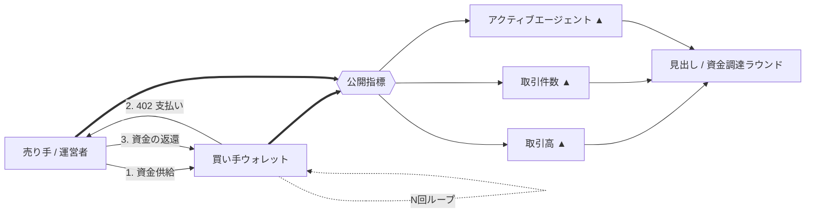
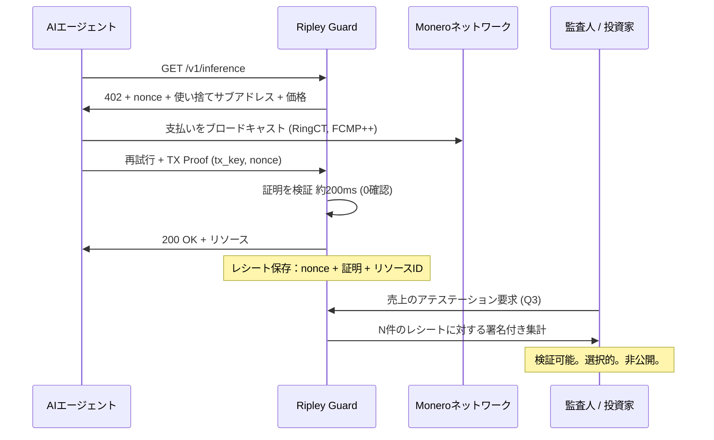

# 蜃気楼の指標：エージェント決済「取引高」の半分がウォッシュトレードである理由 — そしてXMR402が代わりに数えるもの

> x402の生カウンターは1億6,500万トランザクションを示したが、Artemisのウォッシュトレード・フィルターは30日間の取引高を160万ドルに、実需は1日約28,000ドルに切り下げた。台帳の記録は資金の移動を証明するが、サービスの提供は証明しない。XMR402は公開取引高カウンターを、事業者が保持するMonero TX Proofのレシートに置き換える。

- **Author:** @xbtoshi
- **Date:** 2026-09-06
- **Tags:** xmr402, monero, x402, wash-trading, artemis, on-chain-metrics, phantom-volume, agentcore-payments, aws, bedrock, mastercard-agent-pay, xrpl, t54, chainalysis, tx-proof, proof-of-delivery, revenue-privacy, selective-disclosure, fcmp, thorchain, stateless, 0-conf, agentic-payments, ripley-guard
- **Canonical:** https://xmr402.org/blog/phantom-volume-wash-trading-agent-metrics-xmr402

---

# 蜃気楼の指標：エージェント決済「取引高」の半分がウォッシュトレードである理由 — そしてXMR402が代わりに数えるもの

2026年9月は、エージェント決済の見出しが豊作の月だった。9月5日、XRP Ledgerのエージェント起点トランザクションは **3,992,146件** を突破し、4日間で約89万件増加した。AWSは **8月18日にAmazon Bedrock AgentCore Paymentsを一般提供（GA）** へ移行し、エージェントが数行のコードでAPIやMCPサーバーを発見して支払えるようにした。Mastercardは6月に *Agent Pay for Machines* を発表。Chainalysisは Base 上で **1億件のエージェント決済** を計上した。

そして、誰もスライドに載せない数字がある。**1日平均およそ28,000ドルの取引高**、そのうち約半分は「自分自身に支払っている」ウォレット間を循環している。

Artemis Analyticsのアナリストは x402 向けにウォッシュトレード・フィルターを構築した。自分自身と繰り返し取引したり、少数のアドレス間で資金を循環させたりするウォレットを検出するものだ。調整後の30日間の数字は **160万ドル**。生の数値の何分の一かにすぎない。彼らの結論は率直だった。エージェント決済ブームは、いまだ大部分が蜃気楼である、と。

本稿は勝利宣言ではない。業界全体が — XMR402も含めて — 測るべきでないものを測っており、その指標こそが透明な台帳の上に構築したことの直接的な副産物である、という主張である。

## エージェント経済の「製造」方法

仕組みは単純で、コストもほぼゼロだ。低手数料チェーンでは、売り手が買い手ウォレットに資金を入れ、買い手がリソースに「支払い」、資金が循環して戻る。これを数十万回繰り返す。1周ごとにトランザクション数、1ドルの取引高、そして「アクティブなエージェント」が鋳造される — そのいずれも、誰かが本当に求めたサービスには対応していない。

2026年2月のスパイク — 1日で380万トランザクション、取引高約200万ドル — は、後にその大半がインフラのテストに帰属すると判明した。4月時点で生のカウンターは69,000のアクティブエージェントによる1億6,500万トランザクションを示していたが、アナリストはそのうち約半分が商取引ではなくテストだと推定した。

これらに悪意は必要ない。負荷試験、デモ、テストネットからの漏れ出し、統合テストスイート — いずれもオンチェーン上に実際の商取引と寸分違わぬ痕跡を残す。それこそが問題なのだ。

## 透明性は偽造を検出する。だが防止はしない。

明白な反論はこうだ。ウォッシュトレードを *知り得た* のは、まさに台帳が公開されているからではないか。その通りであり、認めるに値する。透明なチェーンがArtemisにフィルターを構築するフォレンジックな面を与えた。

だが、透明性が実際に何を買ったのかを見てほしい。

- それがもたらしたのは **事後的な検出** であって、防止ではない。ウォッシュ取引は決済され、カウントされ、数か月にわたり見出しを飾り続けた。
- それはすべての競合他社に、**本物の** 事業者の売上を恒久的に見せた。偽の経済を暴くのと同じクエリが、実在するAPIのエンドポイント別収入、顧客集中度、成長曲線をも明らかにする。
- そしてそれは、偽造を可能にしている根本的なギャップを何ひとつ埋めなかった。**台帳の記録は資金が動いたことを証明する。サービスが提供されたことは証明しない。**

この最後の一行がすべての論旨だ。チェーン側の取引高は、需要から完全に切り離された需要の代理指標である。自分の資金を円環状に動かすだけで鋳造できる指標は、いずれ動機を持つ者によって鋳造される。約70億ドルの資本が1日28,000ドルの市場を追いかけている分野では、その動機は巨大だ。

## XMR402が数えるもの：移動ではなく、提供

XMR402は取引高カウンターを公開しないし、構造的にできない。Moneroのベースレイヤーは金額（RingCT）、受取人（ステルスアドレス）、そして **2026年8月のFCMP++ハードフォーク** 以降は出所までを、1億を超える出力の匿名性集合の中に隠す。証明サイズは2.8KB未満、検証は約18ミリ秒だ。

では、数字に代わるものは何か。**レシート** である。

XMR402の各リクエストはチャレンジ・レスポンスだ。Ripley Guardは、nonce、金額、そしてその特定のリソース要求に紐づく使い捨てサブアドレスを添えて402を返す。エージェントは支払い、次に **Monero TX Proof** を提示する — *その* サブアドレス宛の支払いのトランザクション鍵を知っていることを示す署名だ。検証は0確認で約200ミリ秒。事業者の手元には、4つの事実を同時に束ねる暗号学的オブジェクトが残る。

1. 手数料を伴う実際のMonero支払い
2. 他の誰も管理しない使い捨てサブアドレス宛
3. サーバー発行の、再生できないnonceに対して
4. 実際に提供された、名前のあるリソースに対して

これを偽造するには、運営者は自分のnonceに対して本物のXMRを支出しなければならない — **どのみち第三者には見えない** 数字を膨らませるために、実際のネットワーク手数料を払うわけだ。経済的な向きが逆転する。透明なチェーンでは、取引高の偽造は安価で、見返りは公開された数字だ。XMR402では、偽造は高くつき、見返りはゼロである。そもそもその数字は公開されていなかったのだから。

売上は **選択によって開示可能** になる。事業者は、自ら保持するレシートに対する集計に署名することで、監査人、投資家、税務当局に数字を証明する。相手はMoneroチェーンに照らして検証する。通りの向かいの競合は何も学ばない。

## 1件の「トランザクション」が実際に証明するもの

| | x402 / USDC on Base | ACP (OpenAI + Stripe) | MPP / Tempo | AgentCore Payments | **XMR402** |
|---|---|---|---|---|---|
| 1件の記録が証明すること | アドレス間で資金が動いた | 決済代行経由で注文が入った | 許可型チェーン上で資金が動いた | レール横断で支払いが調整された | **チャレンジへの応答 + リソースの提供** |
| 偽の取引高を作るコスト | ほぼゼロ | カード手数料＋審査 | 許可集合内ではほぼゼロ | 基盤レールに依存 | **XMR全額＋実手数料、可視的な見返りはゼロ** |
| 生データを監査できるのは | 誰でも、永久に | 決済代行＋事業者 | バリデータ（許可制） | AWS＋ウォレット提供者 | **事業者と、事業者が選んだ相手** |
| 本物の事業者売上は | 公開 | 決済代行に可視 | バリデータに可視 | 提供者に可視 | **デフォルトで非公開** |
| 提供が支払いに紐づくか | いいえ | 部分的（注文オブジェクト） | いいえ | ポリシー層、オフチェーン | **はい — nonceが両者を束ねる** |
| 検証レイテンシ | 確認まで約2〜12秒 | 数秒〜数日 | サブ秒、許可制 | レール次第 | **約200ミリ秒、0確認** |
| プロトコル手数料 | facilitator依存 | 決済代行手数料 | チェーン手数料 | AWS＋レール手数料 | **ゼロ** |

## なぜこれはプライバシー派だけでなく全員が憂慮すべきなのか

エージェント決済分野は今、端数処理の誤差より安く捏造できる指標に対して資本を配分している。これは特定のプロトコルの道徳的欠陥ではなく、設計上の帰結だ。レールが測れる唯一のものが「資金の移動」であるなら、円環状に動く資金は市場と区別がつかない。

解決策は、より優れた分析ではない。より強固な計算単位である。**サービスが提供されたというレシート** — 双方が署名し、必要に応じて検証でき、偽造しても無価値なもの。

2026年8月のMoneroアップグレード — そして取引所の上場廃止後に分散型の流動性レールを回復させた8月24日のTHORChainネイティブXMR統合 — により、ベースレイヤーはついにこのモデルを機械規模で担える状態になった。XMR402の仕事は、カウンターではなくレシートを、報告に値するものにすることだ。

ネットワーク上でエージェントが人間を数で上回るとき、重要になる問いは *何件の支払いが起きたか* ではない。*そのうち何件が本物の何かを買ったのか* である。暗号学的な答えがあるのは、この二つのうち一方だけだ。

---

*XMR402は、X402オープン決済標準のMoneroネイティブ実装です。プロトコル手数料ゼロ、Monero TX Proofによる約200ミリ秒の0確認検証、ステートレスかつトランスポート非依存。詳しくは [xmr402.org](https://xmr402.org)。*
