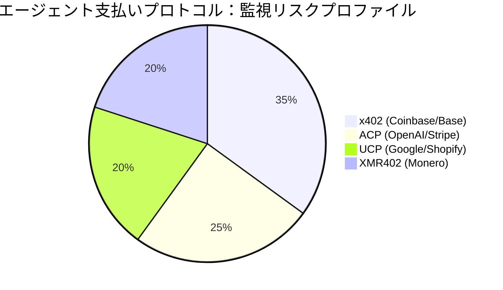
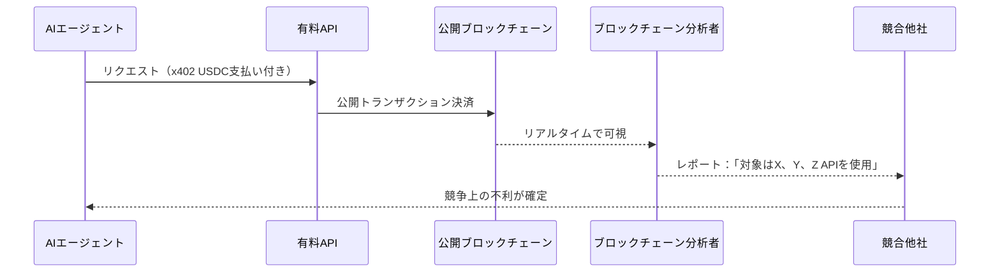

# 監視税：AIエージェントが透明な支払い記録を許容できない理由

> ステーブルコインベースのエージェント支払いプロトコルは、永続的で公開された監視記録を作成します。XMR402によるプライバシー保護型支払いが選択肢ではなく、エージェント経済の必須インフラである理由を解説します。

- **Author:** @xbtoshi
- **Date:** 2026-03-18
- **Tags:** privacy, surveillance, XMR402, x402, Monero, agentic-economy, KYA, machine-payments, competitive-intelligence
- **Canonical:** https://xmr402.org/blog/privacy-vs-surveillance-agent-economy

---

# 監視税：AIエージェントが透明な支払い記録を許容できない理由

2026年初頭、CoinbaseとCloudflareがx402財団の設立を発表した際、見出しはマシン間商取引の新時代を称賛しました。アナリストは2030年までに3〜5兆ドルのエージェント経済を予測しました。しかし、その熱狂の裏に不都合な真実が隠れています：AIエージェントが公開ブロックチェーン上で行うすべてのステーブルコイン支払いは、永続的、不変的、かつ公開的に記録され、地球上の誰でも閲覧できます。

これは細かい技術的詳細ではありません。これはすべてのAIエージェントの支払い履歴をオープンソースの競合情報に変える構造的欠陥です。これを「**監視税**」と呼びます：透明なレール上で運営する各エージェントが支払う隠れたコスト。

## 透明なブロックチェーンの問題

AIエージェントがサービスの支払いにx402（Coinbase）、ACP（OpenAI/Stripe）、またはUCP（Google/Shopify）を使用すると、それらの取引は公開ブロックチェーン上で決済されます。各支払いは：

- 全世界に見える不変台帳に**永続的に記録**
- ブロックチェーンエクスプローラーで**誰でも照会可能**
- ウォレット間および時間を超えて**分析的にリンク可能**
- 使用するAPI・サービスを露呈する**競争的に公開**

## エージェント支払いプロトコルの比較

| 機能 | x402 (Coinbase) | ACP (OpenAI/Stripe) | UCP (Google/Shopify) | XMR402 |
|---|---|---|---|---|
| **デフォルトプライバシー** | ❌ 公開ブロックチェーン | ⚠️ 企業台帳 | ⚠️ 半中央集権 | ✅ 暗号学的保護 |
| **検証レイテンシー** | ~2–5秒 | ~1–3秒 | ~1–3秒 | 200ms（0確認）|
| **プロトコル手数料** | Gas + 仲介手数料 | Stripe %, 法定通貨 | プラットフォーム手数料 | ゼロ |
| **検閲耐性** | 中程度 | 低い | 低い | 最大 |
| **監視露出** | 最大 | 中程度 | 中程度 | ゼロ |
| **ステートレスアーキテクチャ** | はい | いいえ | いいえ | はい |

## 支払い追跡がどのように脆弱性になるか

XMR402では、このチェーンが完全に断ち切られます。Monero TX Proofメカニズムにより、サーバーは200ミリ秒以内に支払いを検証でき、プロトコル手数料ゼロで、リンク可能なメタデータを公開することなく機能します。支払いが行われました。証明は暗号学的に有効です。詳細は誰の知るところでもありません。

## KYA問題：安全性を装った監視

業界の対応は「エージェントを知れ」（KYA）フレームワークの推進です。実際には、これはCoinbase、Stripe、Googleに監視権力を集中させる中央集権的なチョークポイントを作り出します。CoinbaseとCloudflareが共同管理するx402財団は、まさにこのモデルを体現しています。

XMR402のアーキテクチャはこのモデルを完全に逆転させます。Moneroの暗号技術がプロトコル層でプライバシーを処理するため、中央集権的なIDレジストリも監視仲介者も不要です。価値が移動したという暗号学的証明のみ。

**Ripley Guard**はサーバー側でMonero TX Proofを200ms以内に検証します。**Ripley Gateway**はエージェント側で支払いを自動実行します。**Ripley Terminal**は人間のオペレーターに、世界にデータを公開することなく監視インターフェースを提供します。

アカウント不要。APIキー不要。ブロックチェーン上の指紋なし。監視税なし。価値の移動の暗号学的証明のみ——200ミリ秒で検証され、それ以外は何も漏れません。
